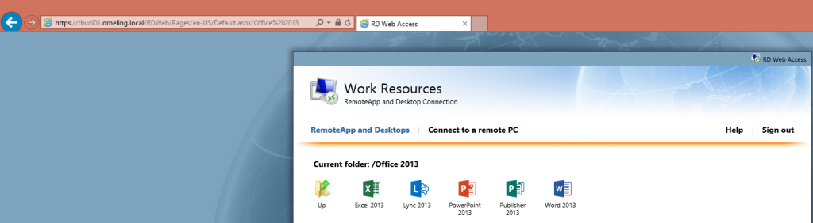
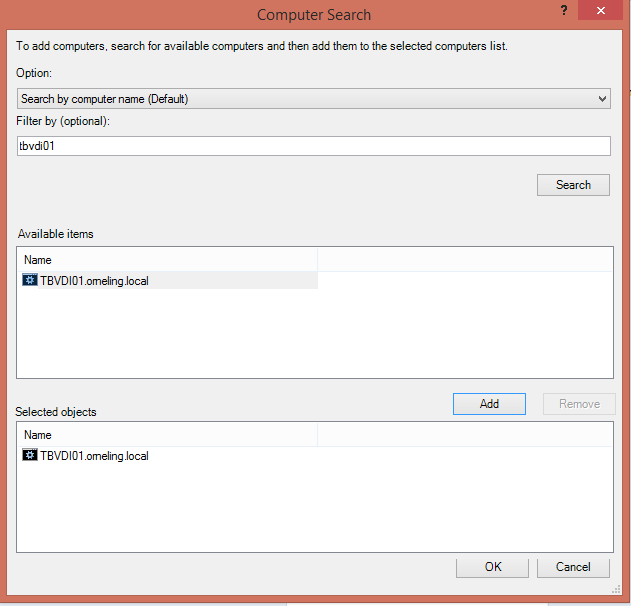
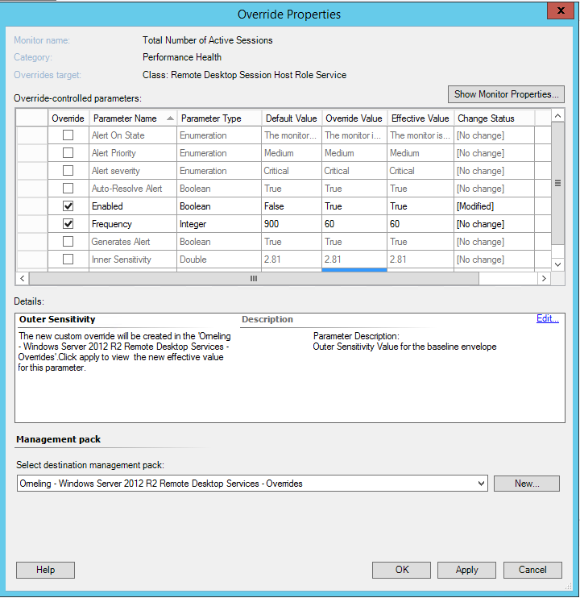
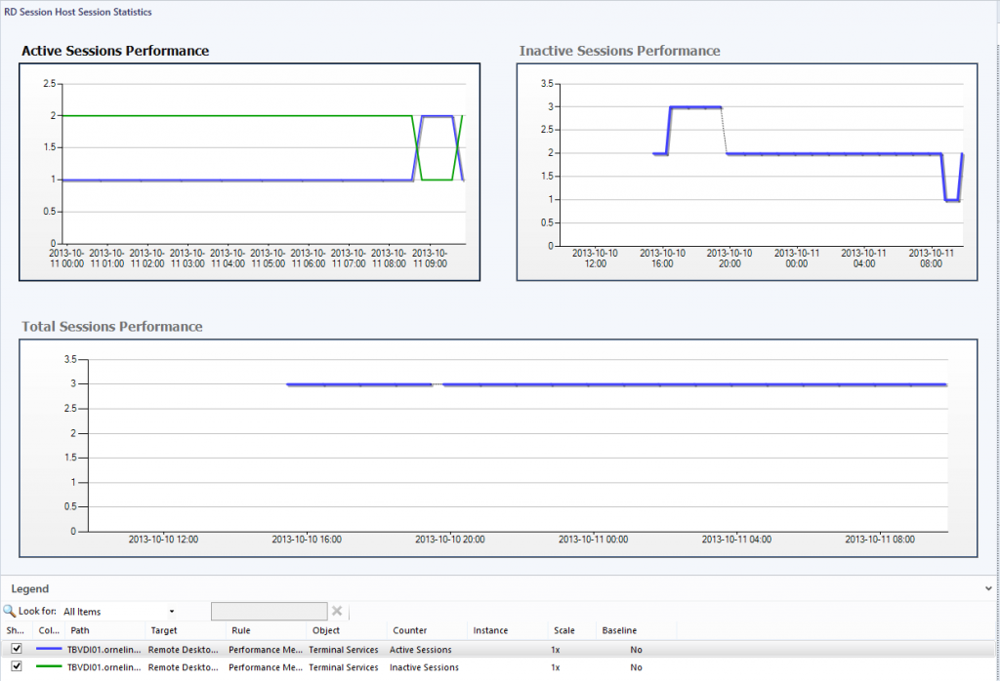

So, after about three months off the blog it´s time to get it going again. The blog is soon going through a major change which hopefully will get both the visits and the posts to rise.

As i sat down an evening earlier this week i thought it would be cool to publish some applications in my home lab. This is an area where Citrix is really big with their XenApp solution, a solution that many companies are using to deliver applications to their employees. I have written about how to monitor the Citrix suite (XenApp, XenDesktop, XenServer, Provisioning Services and Web Interface) before but this post will focus on Windows Server 2012 R2 Remote Desktop Services (RDS) instead as a competitor to Citrix XenApp.

### The basics

In my home lab, all of the servers from the DC to the SQL server are running Windows Server 2012 R2 RTM and all of the System Center products are running System Center 2012 R2 Preview (at least til next friday when Microsoft launches all of their new products). This lab is depending on these three products;

- The Domain Controller of course for running the domain
- The Operations Manager Management Server
- The Remote Desktop Services Server
- The System Center 2012 R2 Preview Management Packs which can be found [here](http://www.microsoft.com/en-us/download/details.aspx?id=39375 "here").

After I had installed RDS and the complete Office 2013 suite were published it looked like this;

###  Setting up the monitoring

The first thing to do before monitoring RDS is to install the SCOM agent at the RDS server, in my case tbvdi01 that are running all of the services needed for RDS to function.

After the agent is installed at the server, open up Active Directory Users and Computers and create a new user to be used for monitoring RDS. I created a new Domain User and gave permissions to the following local groups at the RDS server which also can be found in the Management Pack guide that comes along with the Management Pack. The following must be granted on _every_ server that are running any RDS role;

- Must be a member of the local users group.
- Must be a member of the local Performance Monitor users group.
- Must be granted the Log On Locally user right (The Local Users group already is granted by default).

After the account has been created, get back into SCOM and set up the new account. In case you´ve never done this before, follow these steps;

1. In the Operations Console, navigate to Administration-> Run As Configuration -> Accounts. Right click Accounts and choose “Create Run As Account…”
2. Set a display name for the account, in my case it´s “SCOM RDS Monitoring Account”.
3. Type the credentials for the account you just created and click Create.
4. On the “Distribution Security” page, choose the More secure option. By using this option, the account will only be distributed to the RDS servers that we will select in the next step. At last, click Create to finish the wizard.
5. Open up “Properties” for the new Run As Account (Double click or right click and choose Properties) and then navigate to the “Distribution” tab.
6. Click “Add…” and then typ in the name of the servers, in my case tbvdi01 is the only server and it should look litke this;
7. 
8. Click OK and then OK again. The Run As Account will now be distributed  to the selected server and we can move on to importing the Management Packs needed.

Before i import a new Management Pack i always create a new Management Pack for the overrides. My standard (this varies from case to case) is Orneling – (the management pack name) – Overrides, this way I can keep track of the overrides I´m making and if I delete a management pack i can just delete the Override MP as well to get rid of the overrides for that particular Management Pack.

After the Override MP has been created it´s time to import the RDS MP’s needed to be able to monitor our RDS installation. There are two MP´s you need to import which can both be found in the file i linked at the top of this post;

- Microsoft.Windows.Server.RemoteDesktopServices.Library.mp
- Microsoft.Windows.Server.RemoteDesktopServices.2012.R2.mp

Import the above MP´s and go get a cup of coffee (or two) to wait for the discovery to take place. Since this is my lab environment, I have made some overrides to speed up the discovery and performance monitors.

I´ve created an override on the “Total Number of Active Sessions” to collect data about the Performance of my Active Sessions and I´ve also changed the Frequency of how often the Performance data should be collected from 900 seconds to 60 seconds.

If you want to make the same Overrides, do the following;

- Navigate to Authoring -> Monitoring and then set the scope of Management Pack objects (CTRL+M if it´s not showing) to “Remote Desktop Session Host Role Service”
- 
- Drill down to Performance and then right click Total Number of Active Sessions and choose Overrides -> Override the Monitor -> For all objects of class: Remote Desktop Session Host Role Service.
- Change the Enabled and Frequency parameters to make the collection happen.
- Select your custom MP and click OK to save the Overrides
- 

Now, that the overrides is in place you can navigate to the Monitoring tab and see what has shown up. I fired up a couple of sessions on my computer to generate some performance data in SCOM and then checked it out in the console. If everything worked out as planned, you should be able to see something similar to the below picture;

### Wrap up

So, now that we´ve imported the RDS Management Packs we are able to collect performance data and to find out about potential issues so we can correct them before it really turns into an issue.

If you´re wondering about how to get the final versions of Windows Server 2012 R2 and System Center 2012 R2, it will be released on October 18 (in just a week). I´d say we´re looking at a real nice future, i sure know that I will look more into SCOM R2 in the nearest future  .

Any questions on this post? Just leave a comment below.
