One of the most common tasks for a SCOM administrator is perhaps managing Maintenance Mode for servers. Setting a server into Maintenance Mode is really easy when you do it manually, however it´s not that easy to do it automatically on a schedule. Since there is no builtin feature to schedule Operations Manager Maintenance Mode, i decided to write a Powershell script and to execute it via Task Scheduler. There are already a lot of scripts out there on the web but i wanted to create my own script and to make it easy. By using Task Scheduler, you can reuse the script for different types of servers and groups since you set the parameters in the scheduled task. I have pasted the important part of the script below but my recommendation is to download the script [here](http://1drv.ms/1FAS0JR "here"). Inside the script, you will also find the reasons accepted by SCOM.

###  What does the script do?

The first row catches the values from the scheduled task, such as ManagementServer and Group etc. and then put the values into the script.

The script will set your selected group and all of its members to Maintenance Mode for X minutes and with the reason you´ve selected.

```

param($ManagementServer, $Group, $Hours, $Reason, $Comment)

Import-Module OperationsManager
New-SCOMManagementGroupConnection -ComputerName $ManagementServer
$Instance = Get-SCOMGroup | where {$_.DisplayName -like "*$Group*"}
$Time = ((Get-Date)).AddHours(($Hours))
Start-SCOMMaintenanceMode -Instance $Instance -EndTime $Time -Reason "$Reason" -Comment $Comment
```

### How do i schedule the script to run?

I have chosen to create a group inside SCOM that contains all of my 2(!) servers. I have a lot of servers in my lab environment, i know :) This group will then be put into Maintenance Mode for a period of time and with the given reason. This way, i can put a group of servers, our Citrix Provisioned Servers for example into Maintenance Mode during their reboot every night.

### Creating the group and the task

The first thing to do, is to decide which servers should be included in the group. In my case, I want to put all servers in the group except for the Management Server.

[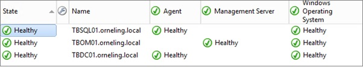](http://media.orneling.se/2014/01/1.jpg)

First, navigate to Administration -> Management Packs. Here, i will create a new Management Pack for my custom made groups. By following this standard you always know where your own groups are created and saved.

[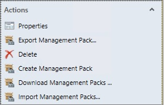](http://media.orneling.se/2014/01/2.jpg)

I choose to name my MP "Orneling - Custom Groups" but this depends on your naming standard for MP's and monitors etc.

After clicking Next and then Finish, you will see the new MP in the view.

[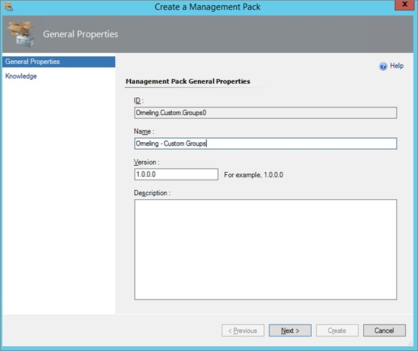](http://media.orneling.se/2014/01/3.jpg)

Navigate to Authoring and then choose Groups in the left pane. After this step, you should see come tasks to the right of the console. Click Create Group and then name your group. In my case I named it "Orneling - Scheduled Maintenance Mode", this name will later be used when running the script.

[](http://media.orneling.se/2014/01/4.jpg)

When you want several servers included in the group, i recommend using a dynamic rule instead of a "Ecplicit Members" group. This way, you don´t have to edit the group each time you add a server that should be included. Click "Create/Edit rules..."

[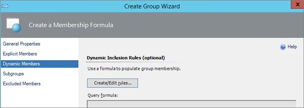](http://media.orneling.se/2014/01/5.jpg)

Clicking "Add" will give you the row that i have filled out in this picture. By choosing DNS Name Contains TB, all of my servers will be included in the group. But hey, wont the Management Server be included then as well? Correct, but I´ll take care of that in the next step. Click OK.

[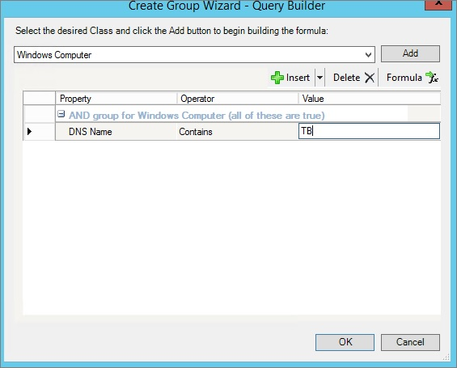](http://media.orneling.se/2014/01/6.jpg)

Since my Management Server should´nt be included in the group, i choose to set a "Excluded Members" rule. Since I only have one Management Server in my Management Group, i simply add that one. Do this for all your Management Servers to make sure they won´t go into Maintenance Mode. Click OK and Finish to create your group.

[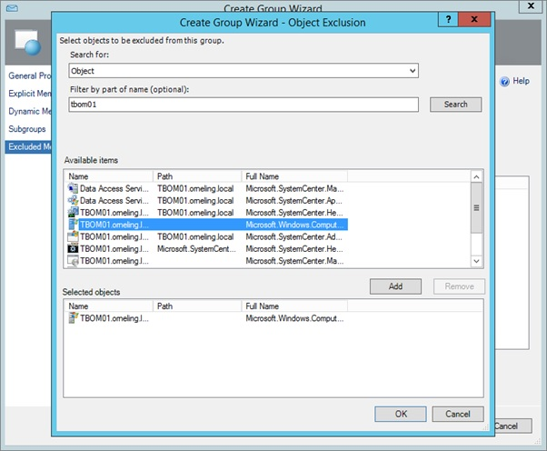](http://media.orneling.se/2014/01/7.jpg)

Now that you´ve created the group, you´ll be able to see it in the "Groups" view. Find  your group, right click and choose "View Group Members". You will see something like the picture below with your servers.

[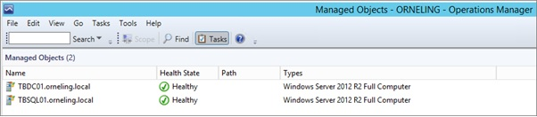](http://media.orneling.se/2014/01/8.jpg)

Now that the group has been created, fire up Windows Task Scheduler and then create  "Basic Task". Name it so that you can keep track of the groups. If there is a group for Citrix Servers, then include that in the name. Choose to run the task wether user is logged on or off. Go to Triggers.

[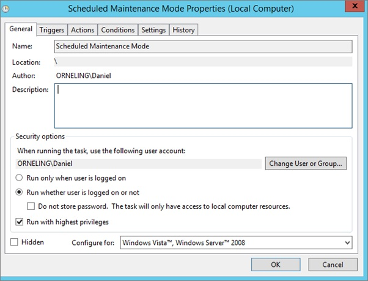](http://media.orneling.se/2014/01/9.jpg)

Set your schedule as you wish. As you can see i set mine to run at 12:15 every day.

[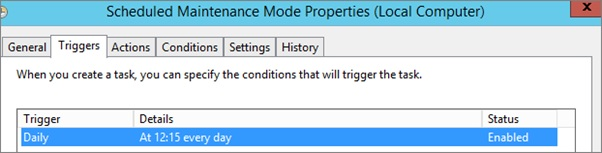](http://media.orneling.se/2014/01/10.jpg)

This is where the fun part of the task starts.

In program/Script paste: _C:WindowsSystem32WindowsPowerShellv1.0powershell.exe_ which is the default location of the Powershell exe.

In Add Arguments paste: _\-Command "& E:ScriptsScheduledMaintenanceMode.ps1 -ManagementServer 'Your MS' -Group 'Maintenance Mode' -Hours '2' -Reason 'Select your reason' -Comment 'Type something.' ; exit  $LASTEXITCODE"_

Make sure to change all the values marked with an underline. Also make sure that the path to where you´ve saved the script is correct.

Click OK to save the task. Since i don´t want to wait until 12:15, I´ll just try the task right now instead.

[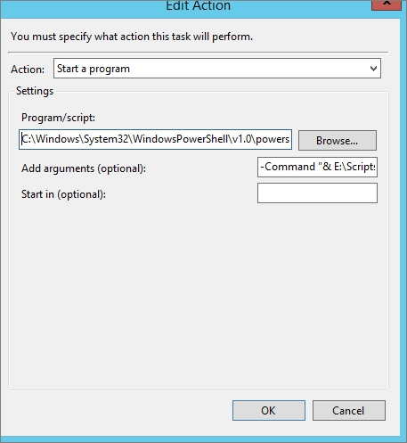](http://media.orneling.se/2014/01/11.jpg)

After i right clicked the task and selecter "Run Now", it took about ten seconds before the Maintenance Mode showed up in the Operations Manager event log.

As you can see below, event ID 1215 informed me that Maintenance had started for my group.

[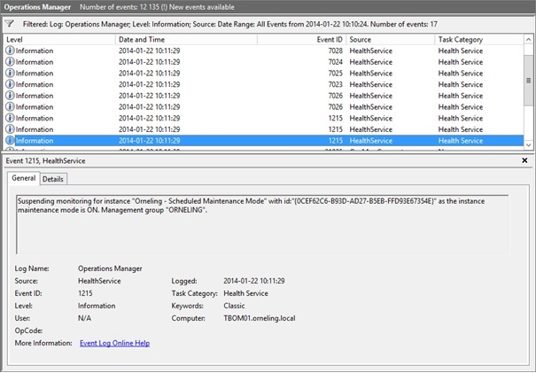](http://media.orneling.se/2014/01/12.jpg)

So, to show that the script worked and that it took all of my inputs: check below. The servers are set into Maintenance Mode for 120 minutes.

[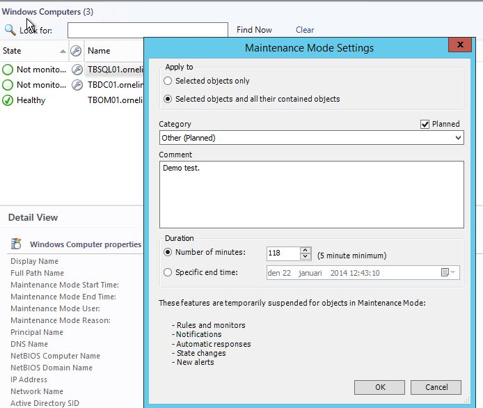](http://media.orneling.se/2014/01/13.jpg)

**Wrap up**

As you can see, It´s a pretty simple solution to set up and to start using for scheduling Maintenance Mode for your servers. Feel free to try it out but try it in a lab before using it in your production environment. Any questions or comments? Just get in touch.
