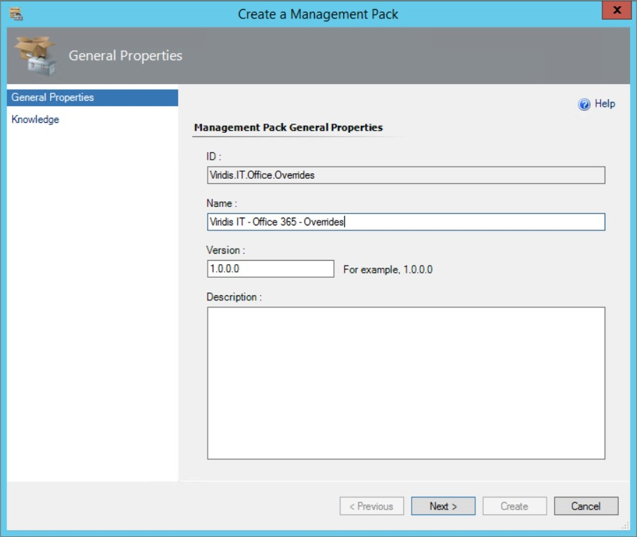
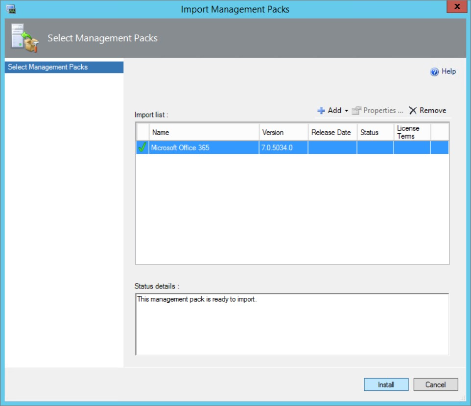
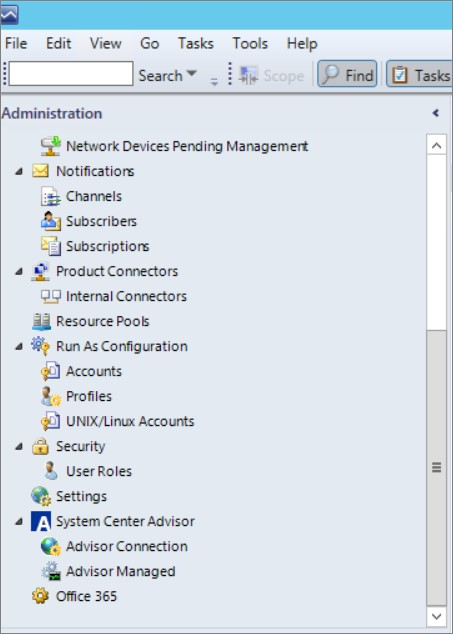
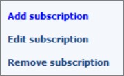
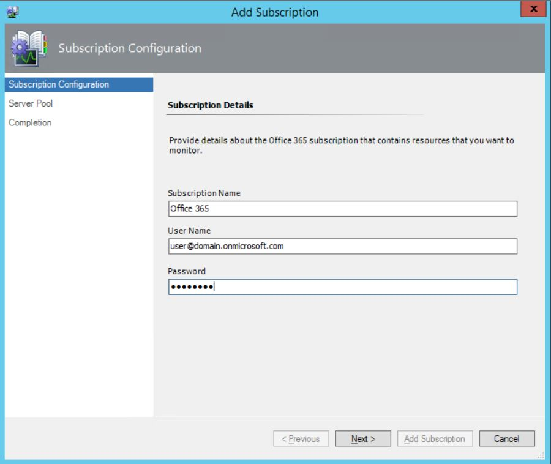
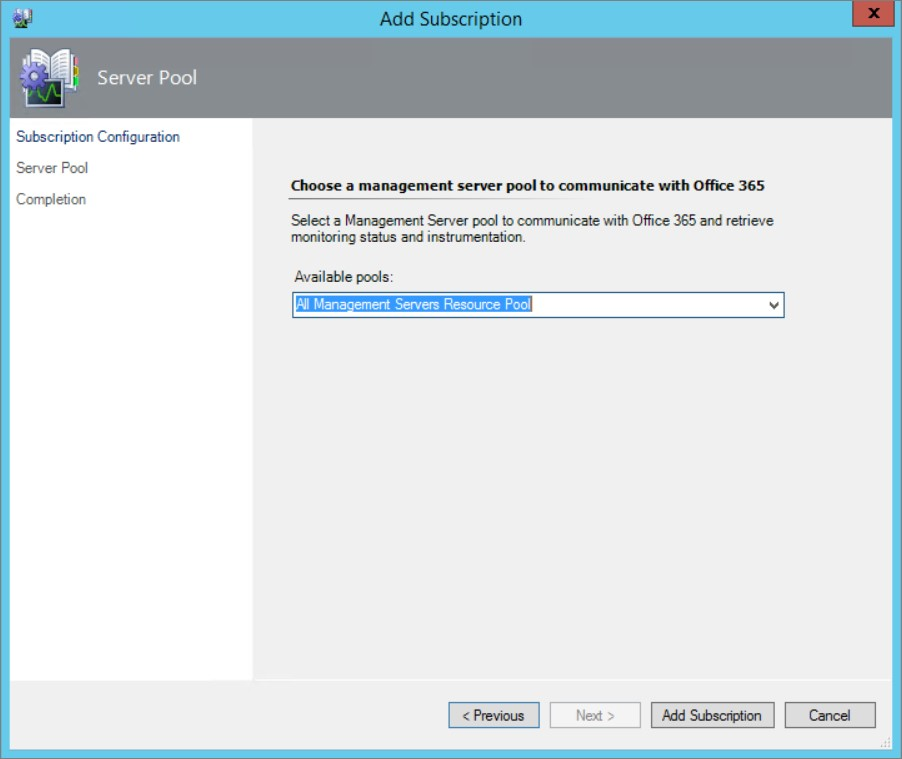
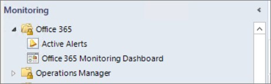
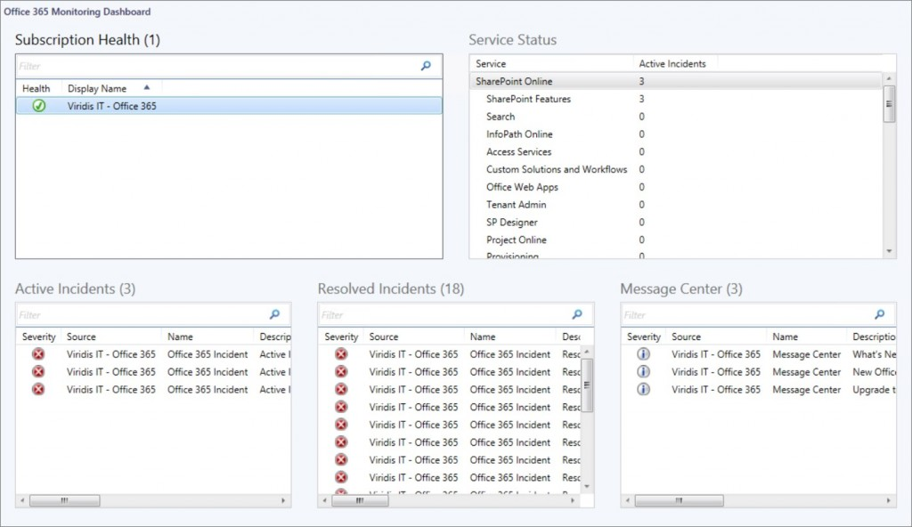
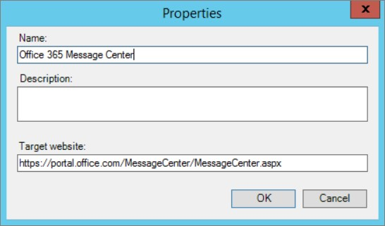
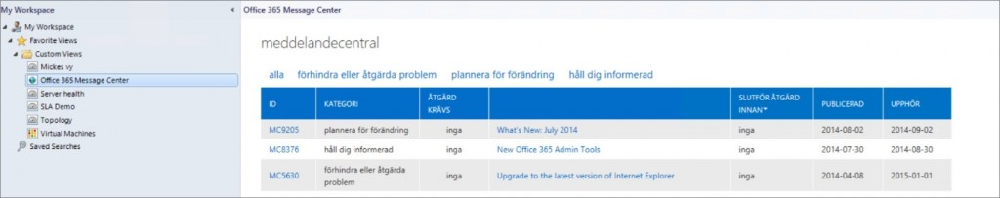

During TechEd North America which took place in Houston in May, the OpsMgr product team gave us a sneak peek of the upcoming Office 365 Management Pack. This is something that I´m getting more and more questions about so this announcement just made me even happier about attending the session. So, yesterday when i got back from a week of vacation Microsoft had provided me with a gift by releasing the Management Pack last week. So what to do you may ask? The answer is simple, Try it out of course to see what it can do :) One of the great features is that you can set up several different subscriptions to monitor, it does´nt matter if they depend on you domain or if It´s conected to another domain. All you need is a user in the subscription and a password, then it´s a go!

Before your able to install the Management Pack, you need to dowload it and the documentation from Microsoft [here](http://www.microsoft.com/en-us/download/details.aspx?id=43708).

### Installation and configuration of the Management Pack

Since I´m not the one administering the Office 365 subscription of our company, i (polite and gentle) asked my fellow colleague to set up the account needed to monitor the subscription. I wont go through the process in this post but you can read about it and you will get a great guide in the Management Pack documentation so you know how to do it.

The first thing i did before importing the MP was to create a new custom MP. As always, create a separate MP to store your overrides so you don´t save anything in the Default Management Pack.

Importing the Management Pack from disk looks like below. I just pointed out the Management Pack bundle file where i unpacked it and hit install.

After importing the MP, the Administration Pane has got a new option, Office 365 as you can see in the bottom of the picture. This is where the configuration of your subscriptions take place.

Press Add subscription.

Now you need the information that you (or a colleague) provided you earlier. What you need is the user and the password. The subscription is just a friendly name, see an example below.

The default setting is to have the Management Servers running the monitoring. I´m satisfied with that right now so i just stepped through the rest of the wizard.

The monitoring pane has now received a new folder named Office 365. Note that it contains an Active Alerts view and a dashboard. It may take some time before the subscription and incidents are discovered so be patient.

This dashboard is interesting and really beautiful! The subscription health shows the state of the subscription and depends on wether you can connect to Office 365 using the credentials provided or not. Service Status shows the different parts of Office 365 and a summary of how many incidents are active at the moment.

- Active Incidents shows the ongoing issues right now. This is showing the global issues so it doesnt need to affect you but it´s a great summary of the open incidents.
- Resolved Incidents show the same as Active Incidents except these are closed and no longer accurate.
- Message Center shows announcements from the Office 365 Product team, for example ”What´s new in July”

By default, there is a task running every fifteen minutes that checks if the incident is still active. If it´s resolved, the rule alert is automatically closed and moved to resolved incidents instead. By checking the information about the incident, you can go to the Office 365 portal to receive more information.

What if you want to present the portal and message center to the personnel working in the Operations Console who receives the alerts?

I created a new Web Page view (in My Workspace so far but the procedure is the same as in the Monitoring pane) and pointed out the below URL. The first time you load the web page view you need to sign in using the credentials created earlier (or another set of credentials with less privileges) and choose to stay signed in. The URL that i used for the portal is https://portal.office.com/MessageCenter/MessageCenter.aspx.

There it is, really easy and the personnel will love the view so they dont need to sign in time after time when opening a new browser window.

### Summary

As i mentioned, I´m receiving more and more questions about monitoring Office 365 so this is really a welcome Management Pack and I´m looking forward to explore the MP further on and to see where the OpsMgr and Office 365 product team is taking the MP. If you have any questions, just leave a comment and I´ll get back as soon as i can.
