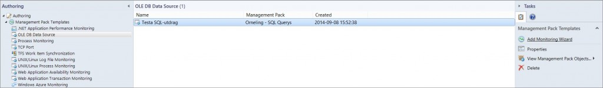
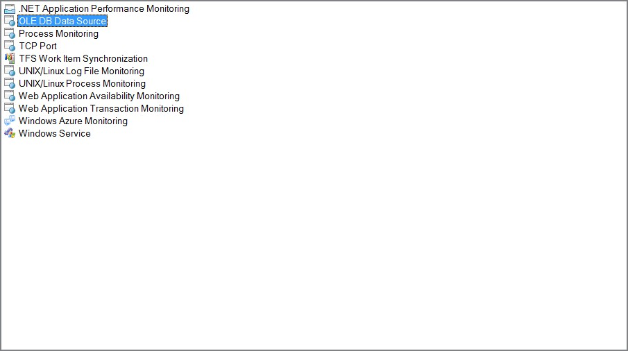
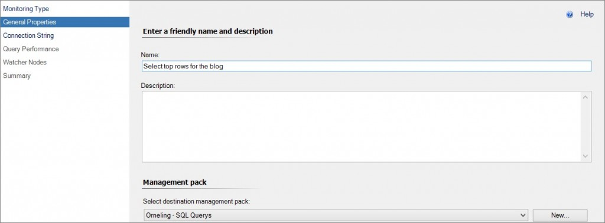
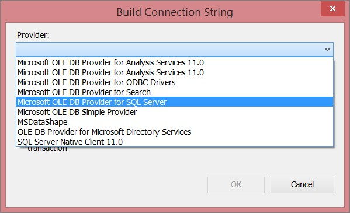
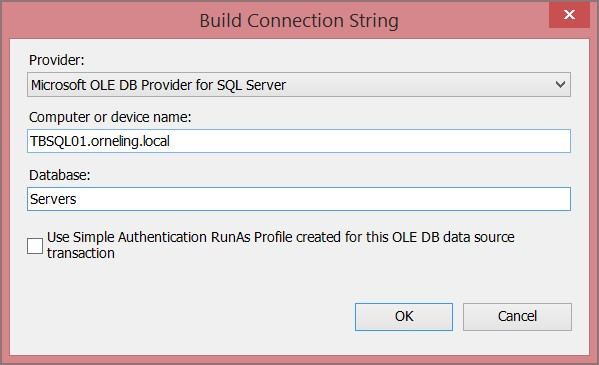
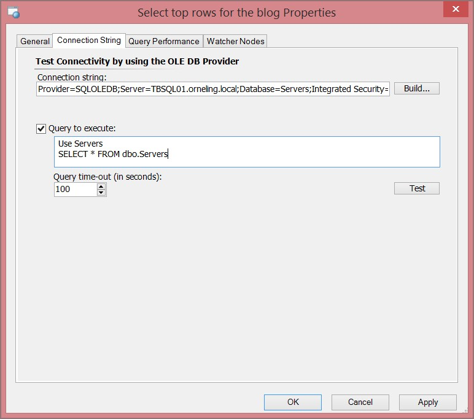
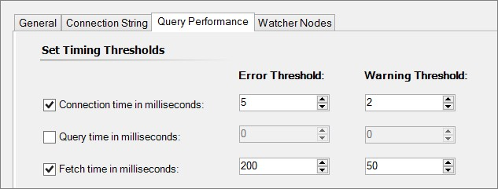
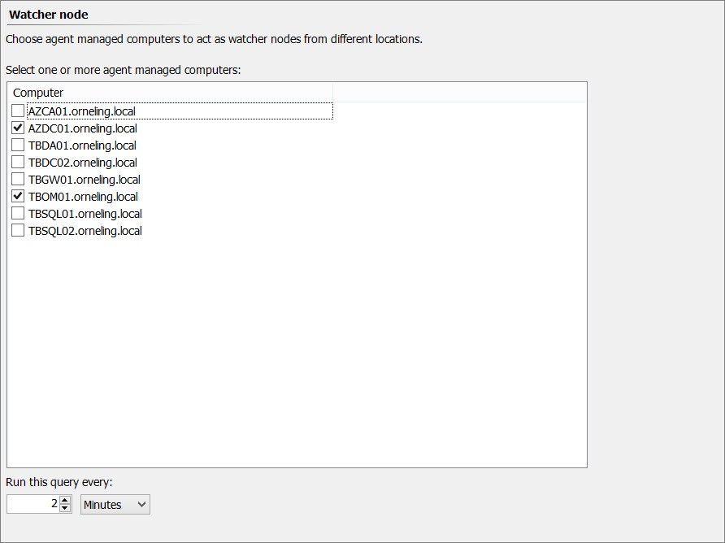
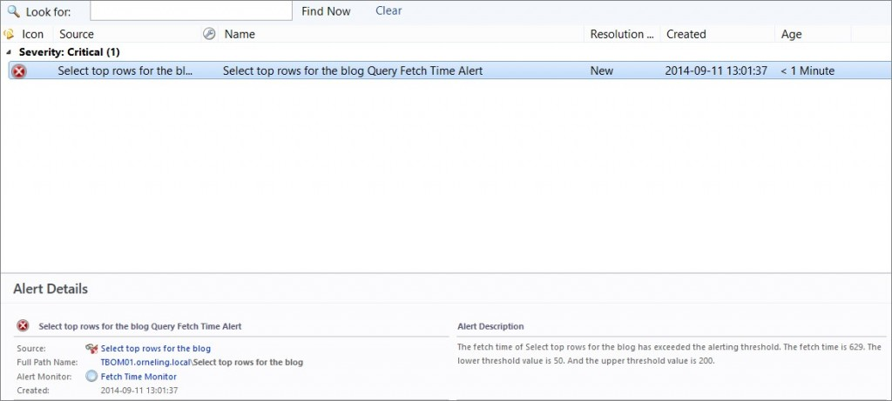

When it comes to replacing an old monitoring solution with SCOM, quite often there are some custom built monitors used in the old system. Since the monitors are always different, of course there are multiple solutions to replacing them with similar ones in SCOM. In this post I´m focusing on how to set up a regular SQL Query that’s running towards a database to check the response times of the query. This possibility doesn’t require any additional Management Packs, It´s built into SCOM and can be found under Authoring -> Management Pack Templates -> OLE DB Data Source.

### **Setting up the query**

Prior to writing this post, I´ve created a real simple database with a table, which I´ve filled with a little bit over half a million rows to make sure the query runs for a little longer than it would do for a table with 200 rows. The query I´m about to set up in SCOM is a real simple one, I just select everything from the table which you can see below. This can of course be whatever query you want, just make sure it´s fully functional before you set it up in SCOM.

```
Use Servers
SELECT * FROM dbo.Servers
```

The process of setting up the query is real simple, see below for how it´s done.

Start by clicking ”Add Monitoring Wizard”



Choose ”OLE DB Data Source”



Enter a name for the query.



The connection string is where you set it all up, what server to look at and what query to execute. Start by clicking “Build…”



Point out which provider to use, the SQL Server name and the database.



Paste your query and test it so you know it´s working properly before moving on.



As we can see above, the query took almost a second to run the first time so that gives us an idea of how long the query should take to run.

On the next pane, it´s time to set up the thresholds we want for the monitor. As you can see below, I´ve pointed out the values so I´m sure to receive some alerts for demo purpose.



And at last, we need to select where we want to run the query from and I choose two servers just for this demo.



That´s how you can set up a (in this case) real simple SQL query to run against one of your databases. Below, you will see what it looks like when the monitor has alerted in SCOM.



### Wrap up

By doing as I did above I can easily set up a query against one of my databases to make sure it´s responding the way i want. This way, i can easily determine if I have any performance issues with my important databases

If there are any questions, don´t hesitate to ask. That’s what the comments are for 
