Earlier this week Microsoft announced Windows 10 at an event in San Francisco, this has later been seen a lot in media and in blogs etc. and from what I´ve seen so far i think it´ll be great. Something that hasn´t shown up in media as much is the fact that there were also the next generation of Windows Server and System Center announced. As I work as a specialist consultant, this were of course great news and what´s there to do when something like this happens? Try it out of course :)

### Installing the new version of Windows Server

As this is an early technical preview, **don´t install this in your production** environment. Said and done, i skipped installing it in my "production" lab environment and set up a new domain on my laptop instead with two servers. If you haven´t seen the new Server Tech Preview, have a look below. The most obvious thing is the new start menu which you will also find in the client Windows 10 OS. Other than the start menu, there are of course a lot of news which you can read more about [here](http://technet.microsoft.com/en-us/library/dn765472.aspx "What´s new in the Windows Server Technical Preview"). After having installed my two servers, I created a new domain and some AD accounts which i later used in the installation of SCOM. So now that I´ve got a new DC and my SCOM server (yes, I´m running both SQL and SCOM in the same server in this lab environment) I´m ready to install the technical preview SCOM.

[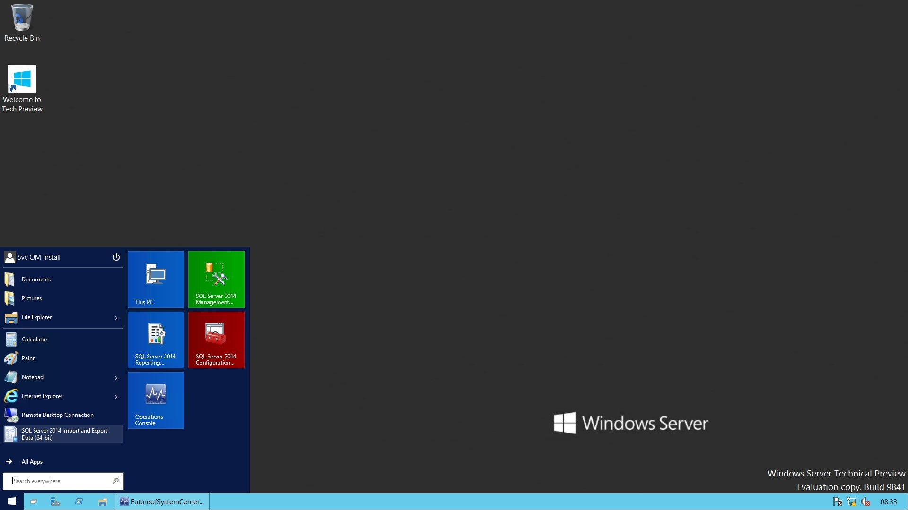](http://media.orneling.se/2014/10/15.jpg)

###  Installing SCOM

When installing SCOM Technical Preview, you need to be running Windows Server Tech Preview and SQL Server 2014. If you´ve ever installed SCOM 2012 up to 2012 R2 you won´t find much news in the installation process. The only difference I´ve found in the installation GUI is the below picture :)

[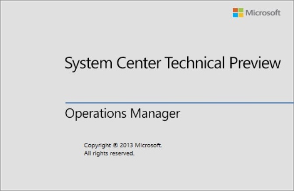](http://media.orneling.se/2014/10/1.jpg)

Where do i want to install SCOM?

[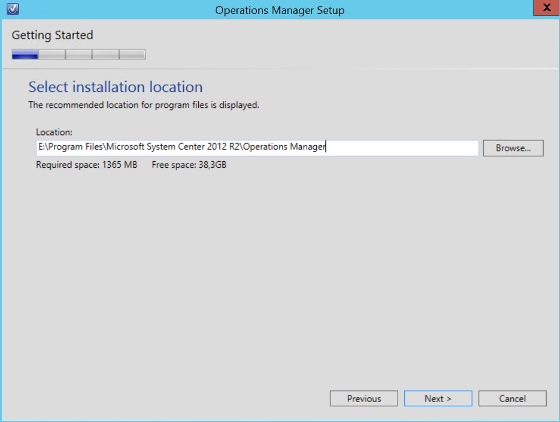](http://media.orneling.se/2014/10/2.jpg)

I installed the prereqs using my script which you can find in my blog post [here](http://www.viridisit.se/managing-system-center-opsmgr/let-powershell-install-scom-prerequisites/).

[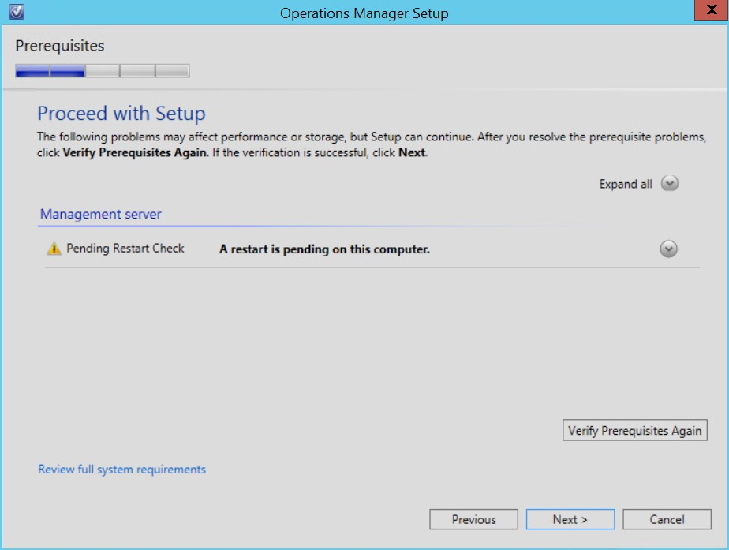](http://media.orneling.se/2014/10/3.jpg)

Creating the new Management Group

[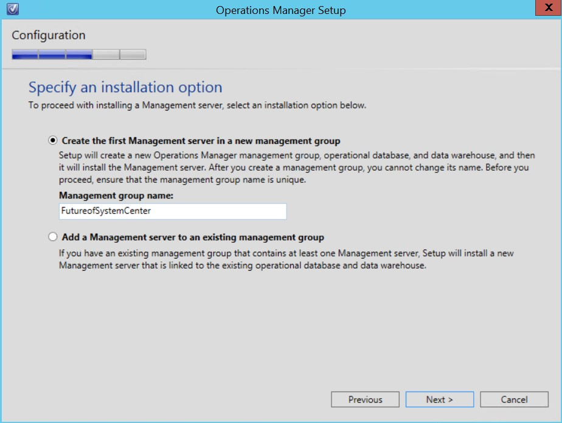](http://media.orneling.se/2014/10/4.jpg) [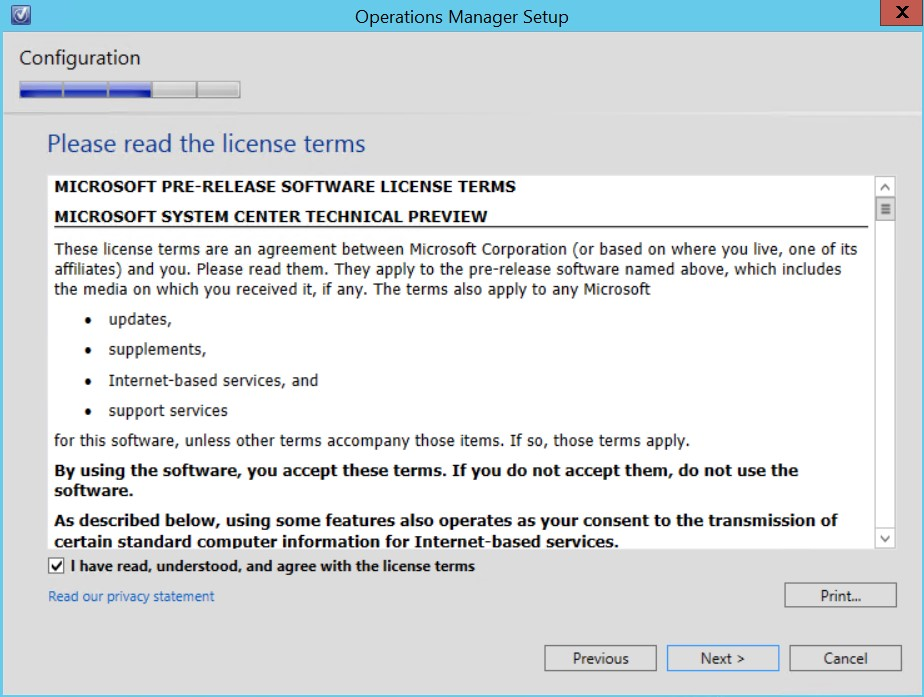](http://media.orneling.se/2014/10/5.jpg)

The databases are in this case installed on the same server but this is not recommended so use a separate server if you can.

[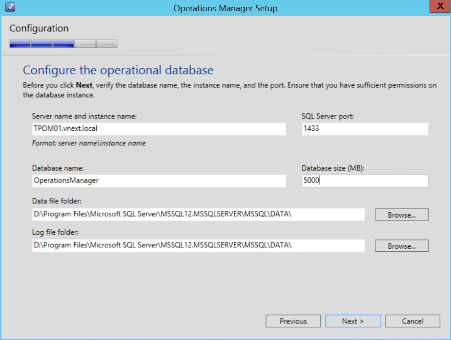](http://media.orneling.se/2014/10/6.jpg) [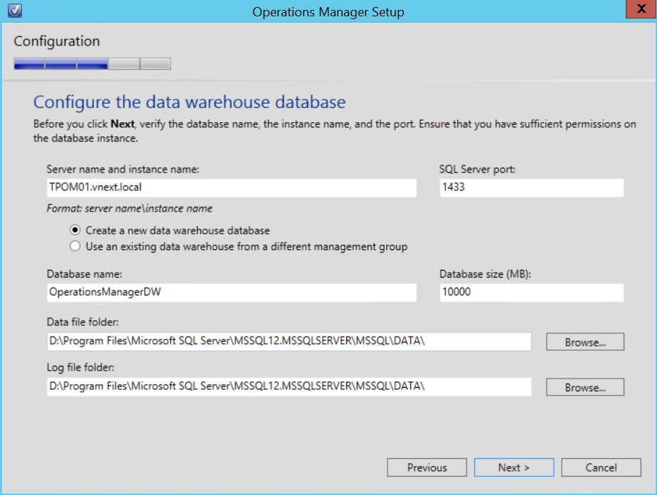](http://media.orneling.se/2014/10/7.jpg)

HTTP will do fine for the web console since i don´t have any CA in my small domain.

[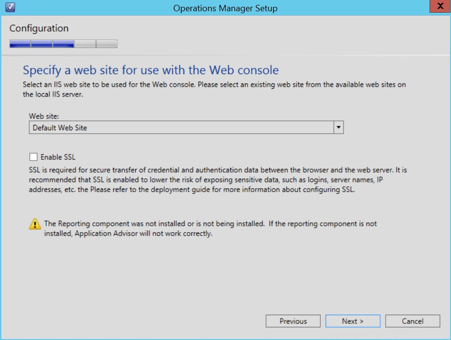](http://media.orneling.se/2014/10/8.jpg) [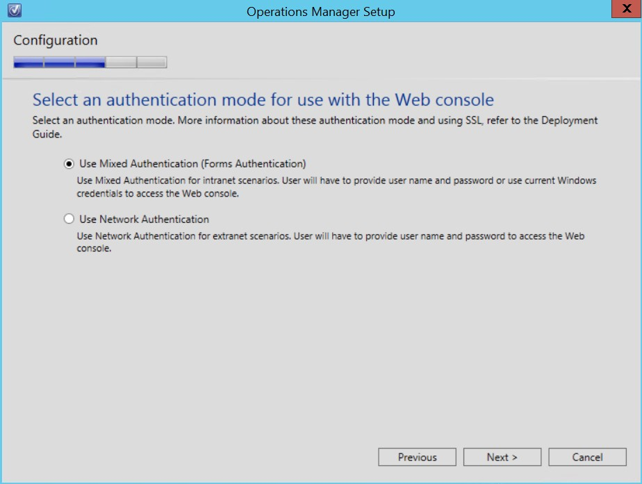](http://media.orneling.se/2014/10/9.jpg)

Pointing out the AD accounts i created earlier to run the services and data warehouse operations from SCOM.

[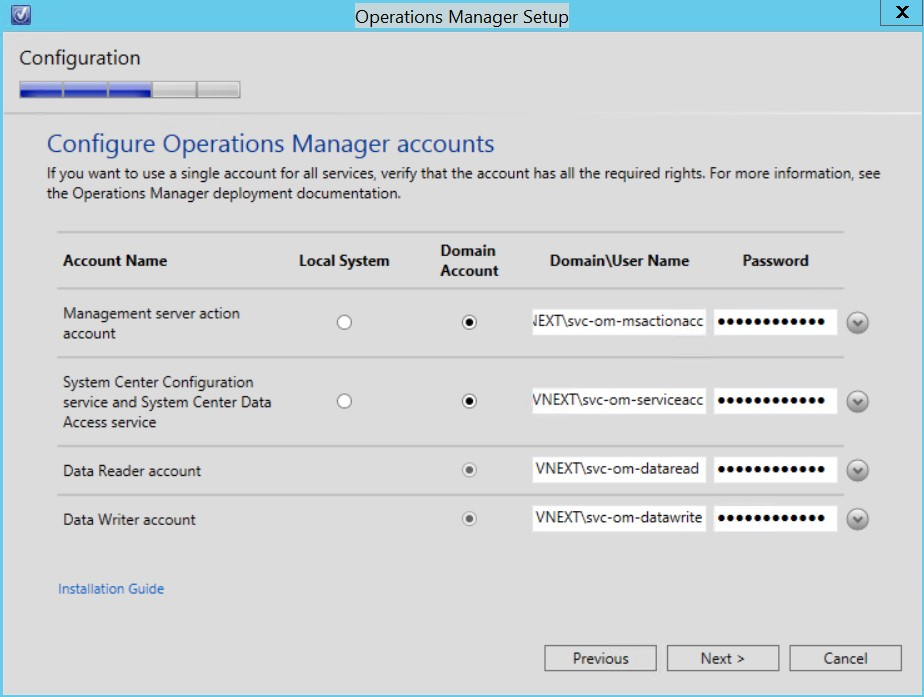](http://media.orneling.se/2014/10/10.jpg)

Of course i should have chosen Yes on both options but since i don´t have internet access from my lab domain i chose no.

[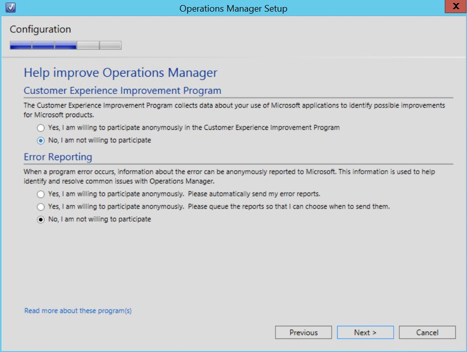](http://media.orneling.se/2014/10/11.jpg) [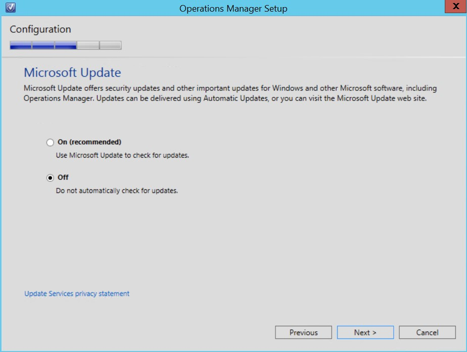](http://media.orneling.se/2014/10/12.jpg)

Just as expected, i got an error because there is no license installed and this is an evaluation version of SCOM. No worries, the license is easily installed later (even though It´s not as important in this case with a small lab domain).

[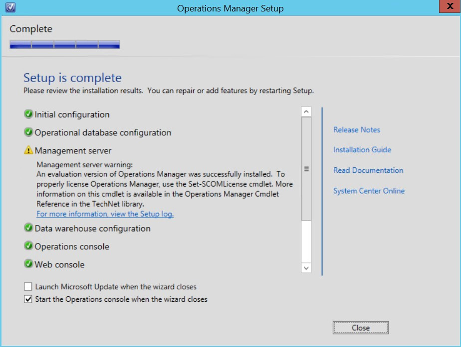](http://media.orneling.se/2014/10/13.jpg)

### A look at the console

If your familiar with SCOM since before I´m sure you will feel comfortable in the Tech preview as well. I havent dug deep into it yet but i will in the near future to find more of the news in this release.

[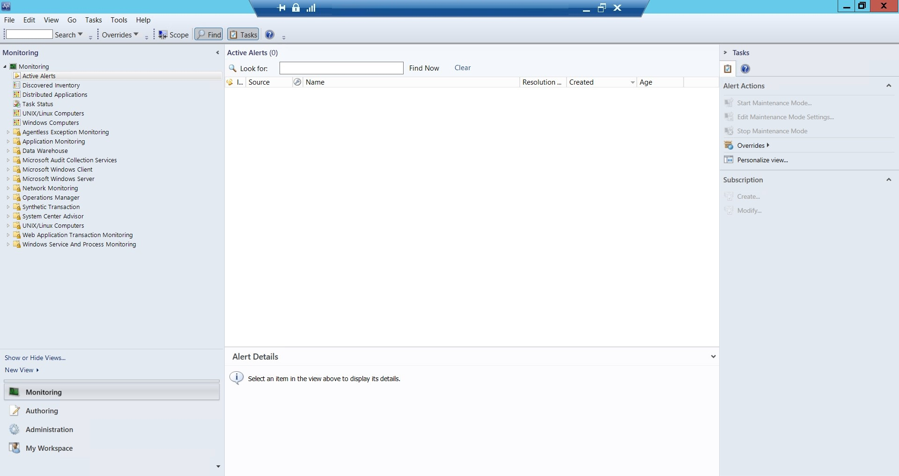](http://media.orneling.se/2014/10/16.jpg)

### Wrap up

I´m excited about the new version of System Center coming out and to see what´s new in all the components so keep your eyes open on my blog cause there will be more of the next generation in here, thats for sure :)

Before i finish this post i would like to say once a gain, **do not install this in your production environment** as it may screw up your whole SCOM environment and I take no responsibility of what might happen if you do so anyway. Everything I´ve shown above is just what I´ve done in a really small lab environment where I don´t really care if something goes wrong.

As i mentioned above, keep your eyes open for more info on the new version of SCOM and leave your questions in the comments as usual.
