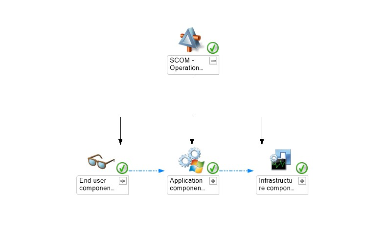
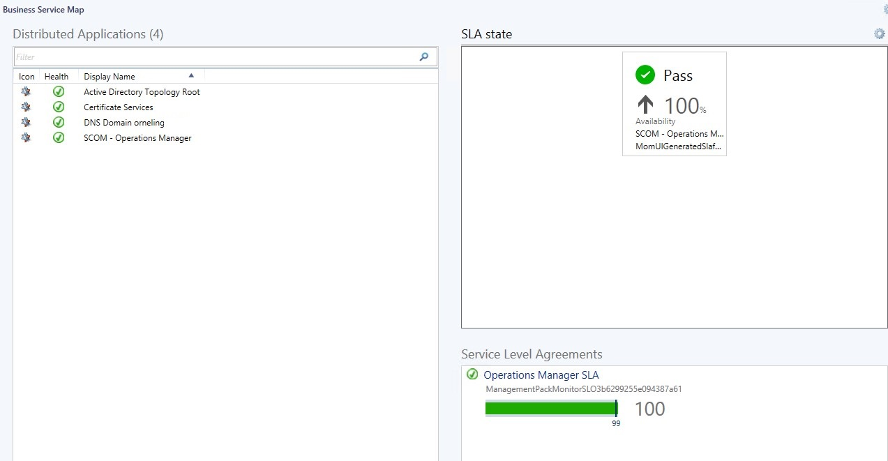
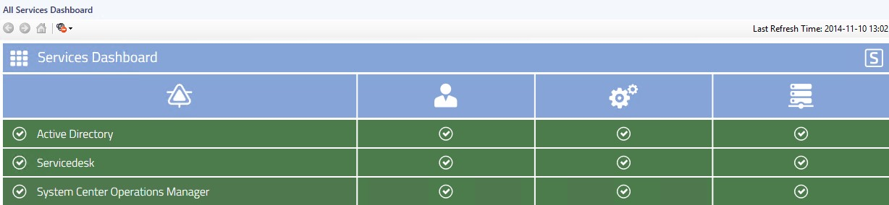
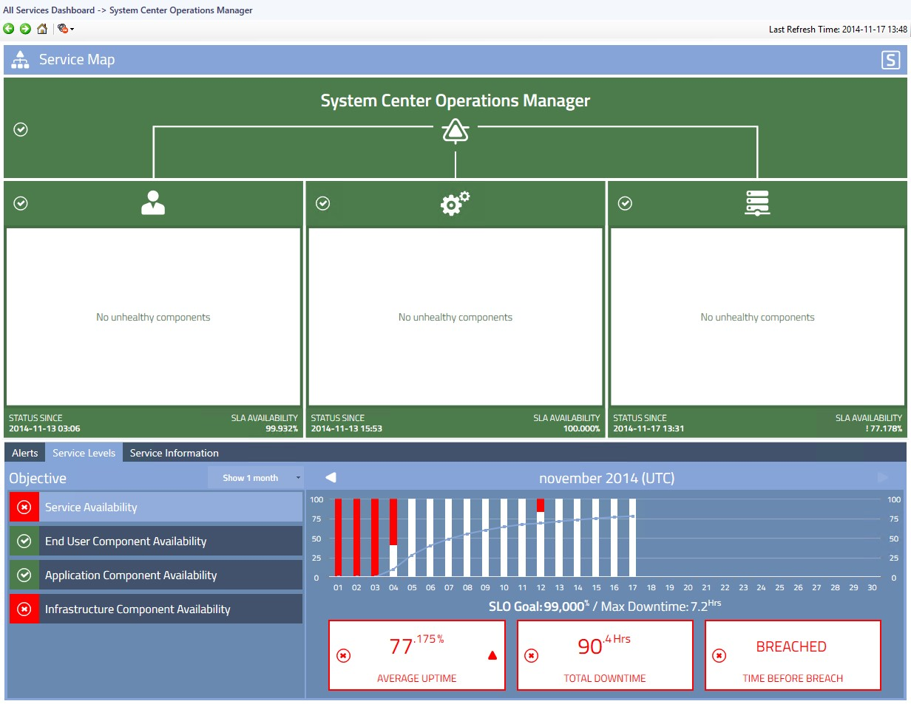

Operations Manager is to some people just known as a monitoring tool which can help you monitor your servers and applications. The monitoring can go really deep into both OS and applications to give you a real overview of your environment and you will also be warned when something´s about to go wrong followed by a critical alert if not taken care of. When you run your services and applications, such as web shops or other business critical systems you would want to know the status and availability of these services to be sure that they are up and running as supposed. To make this possible, we create Distributed Applications to visualize your services and SLA´suing Operations Manager and by that we´ll be able to monitor the level availability as well as the status. This is one way to take the monitoring one step further and not just check on the different components themselves. Below, I will show how this is done in Operations Manager followed by a couple of ways to display this to our users and management. After having looked into how it´s done in the standard SCOM way I will show how it can be done when using Savisions Live Maps instead.

### **Visualizing the services**

The service I will focus on in this post is SCOM itself. To do this, I have created the Distributed Application so that it will look the same as the one I created using Live Maps. The three components seen in the picture below is;

- End user components
    - This part consists of the Operations Manager Data Warehouse Watcher, Operations Manager Operational Database Watcher, Report Console Watcher and the Web Console Watcher.
- Application Components
    - This part consists of all the Data Access Service instances and all of the Management Configuration Service instances. This means that all our Management Servers will fit right into this service.
- Infrastructure Components
    - This part consists of all the members of the SCOM group “Operations Manager Management Server Computer Group”.

By pointing at services and the group in the last two parts, we´ve made the service dynamic and we won´t have to update it manually when adding a new Management Server. After having created the Distributed Application we can open it in the “Diagram view” and we will see it as in the picture below where we can drill down and expand the different parts to see the underlying components included in the service.

An overview of my Distributed Applications can be seen in the below picture, the only one I´ve created myself is the “SCOM – Operations Manager” since the other ones came with their respective management pack and were automatically populated by servers and services matching the parameters. What´s nice with this dashboard below is that when you click “DNS Domain Orneling” for example the “SLA State” and “Service Level Agreements” sections will be updated with the respective SLA level and availability. This is the easiest way to get a clear overview of your services health state when doing it using Operations Manager only.

### Visualize services and SLAs using SCOM and Live Maps

A great add on to Operations Manager is Savisions Live Maps which does all of the above in a simpler way and presenting the services in a better way. When creating new distributed applications or importing the ones you´ve already created they are stored in the Operational Database just like any other DA and you will have access to them from both the Live Maps web console as well as the Operations Console. The service I´ve created for this demo is the exact same as the above, with the exact same parameters and criteria’s so the below picture will look quite familiar besides from the Icons used. Since the services are stored as Distributed Applications, you will always have access to them and you´r able to open the “Diagram view” inside the Operations Console to check the status just as we did above. The access to the services created can also be set in a much more flexible way than with SCOM. With Live Maps, you can control the access to every service and you can stop people from being able to drill down and look deeper into the health of the service.

One of the big differences lies in the presentation of the service health and the below picture shows the standard “All Services Dashboard” which contains all of your services created and giving you a really nice overview of the services provided to the organization or the customers. The view below will be directly updated when something happens to any component of the service, like if a server crashes the service will be marked red and you will see the infrastructure as red (the one to the right) so you know where the problem is. Since you can control who will have access to this view and what access he or she gets, this is a great view to present to your organization or your customers on a web page or on a Sharepoint site.

When you want to see the availability of a service you just click on it in the overview. In this example I choose to check the availability of Operations Manager and I will not only get the availability of the service itself but also for every part (End User Components etc. as mentioned earlier). As you can see in the below picture, I´ve forced some downtime to make sure I don´t just receive green and great numbers. Since I´ve set this service to a SLA at 99.0% it can only be down for 7.2 hours a month before breaching the SLA and here It´s been down for 90.4 hours instead meaning this SLA would have been breached a long time ago. In this case, we can see that the part breaching the SLA is the Infrastructure Component availability.

By using Live Maps to visualize your services and to display the availability levels you will receive a smoother creation process along with a better presentation. If you´ve already created a lot of services inside SCOM, you can just import these into Live Maps and they will be shown in the Live Map instead. Another great thing is that you can have Live Maps automatically discover applications such as Sharepoint, Exchane and Active Directory and populate these services with your servers and applications giving you custom made services out-of-the-box.

### **Wrap up**

In this post I´ve shown how you can present your services both using SCOM and Live Maps and as you can see above, Live Maps presents the services in a better way. What I haven´t shown here is the creation process, this is another part where Live Maps differs from SCOM since this is much easier and you will have your services created in much less time than if you would have done it without Live Maps. If you´r also using System Center Service Manager, the views and services created using Live Maps can also be presented from within Service Manager.

As always, if you have any questions leave a comment and I´ll get back as soon as I can :)
