When i moved my blog around new years eve i mentioned that I´m going to look more into Azure in this blog and one thing that I´ve written about earlier is Azure Operational Insights. If you´ve been around for a while, it might not come as a chock that I like working with OpInsights and to combine it with our on-prem SCOM. When working with OpInsights, we use Intelligence Packs to gather data and most of the Intelligence Packs available on this date don´t need any additional configuration on-prem to function. However, if you want to use the "Capacity Planning" intelligence pack there are some requirements to fulfill before being able to gather data from your on-prem environment. What´s needed is Operations Manager, Virtual Machine Manager and a connection between those two and that´s the first part I will go through how to do.

**Connecting Operations Manager and Virtual Machine Manager**

Log on to your Virtual Machine Manager server, open up the VMM console and navigate to the Settings section and click “Run As Accounts”. Then click “Create Run As Account” and follow the steps seen below. This is done to make sure the same credentials are used all the time and to make life easier.

[](http://media.orneling.se/2015/02/1.jpg)

Give the account a name and specify the user credentials. Make sure that the user specified has administrative rights inside SCOM, otherwise you won´t be able to make the connection since a part of the process is importing the necessary management packs into SCOM.

[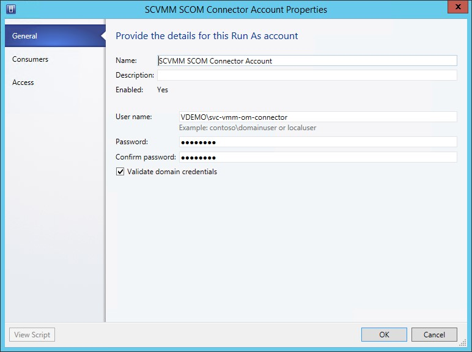](http://media.orneling.se/2015/02/2.jpg)

The below picture shows what you will see **after** having created the connector so the “Consumers” tab won´t show anything until the connector is established.

[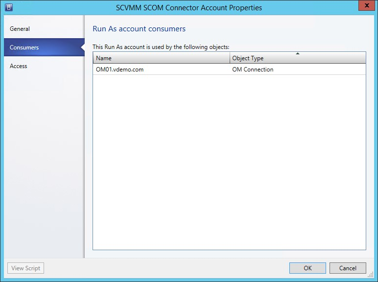](http://media.orneling.se/2015/02/3.jpg)

After having completed the Run As Account, click OK to close and then go to the Settings tab followed by clicking “System Center Settings”. Click ”Operations Manager Server” and then Properties to open the wizard which will take you through the creation process.

[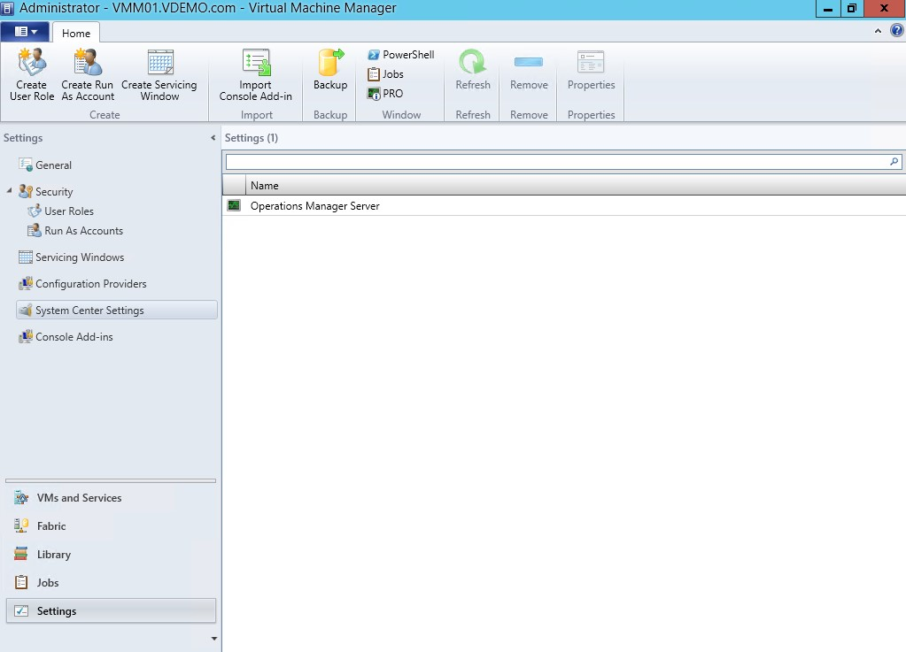](http://media.orneling.se/2015/02/4.jpg)

[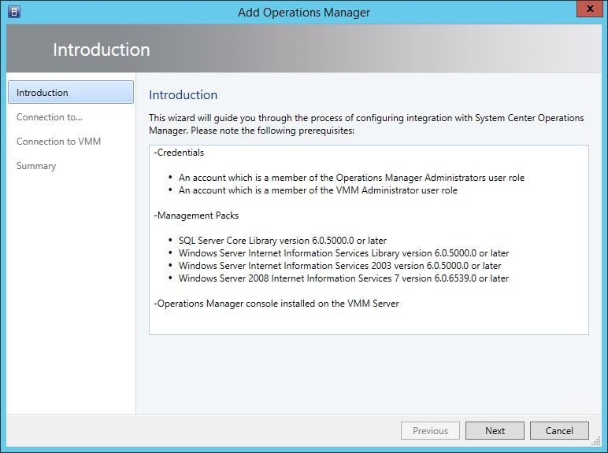](http://media.orneling.se/2015/02/5.jpg)

Specify your SCOM management server and then click “Use a Run As Account” followed by “Browse...”

[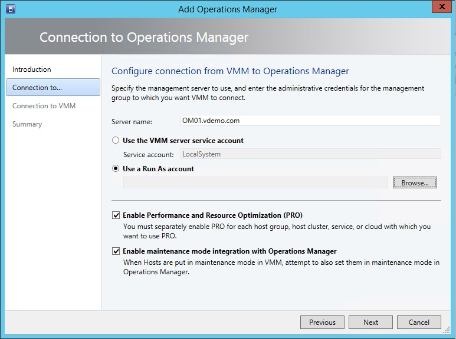](http://media.orneling.se/2015/02/6.jpg)

Mark the account you created in the above steps and click OK. This is the account that will be used to connect SCOM and SCVMM and import the management packs necessary into SCOM.

[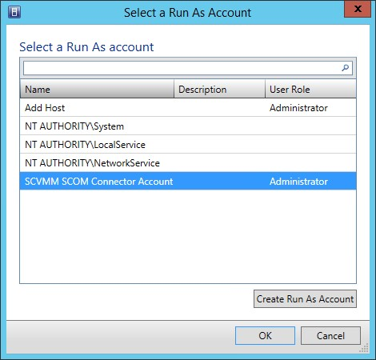](http://media.orneling.se/2015/02/7.jpg)

The next step is to specify which account should be used to push information from SCOM into SCVMM. I´ve used the same account here, just make sure the account is an admin in SCOM and it will be set to admin in SCVMM as well.

[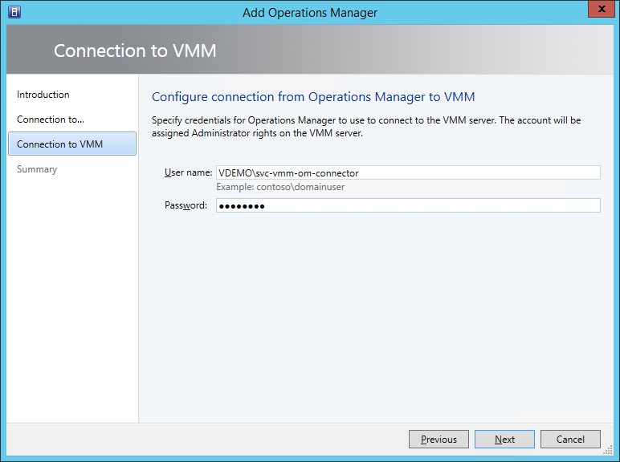](http://media.orneling.se/2015/02/8.jpg)

A cool (and useful) feature in SCVMM is that you can click “View Script” and check out the script that´s about to be run in the background.

[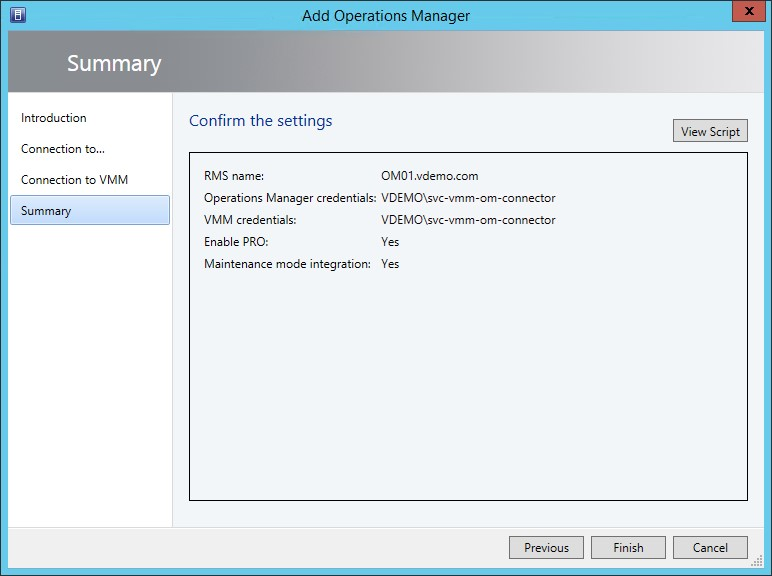](http://media.orneling.se/2015/02/9.jpg)

The script for the connection can be seen below:

```
$vmmCredential = Get-Credential

$opsMgrServerCredential = Get-SCRunAsAccount -Name "SCVMM SCOM Connector Account" -ID "dcb05fe8-ad48-4e6a-b48e-edb6a2826a20"

New-SCOpsMgrConnection -EnablePRO $true -EnableMaintenanceModeIntegration $true -OpsMgrServer "OM01.vdemo.com" -RunAsynchronously -VMMServerCredential $vmmCredential -OpsMgrServerCredential $opsMgrServerCredential
```

After clicking Finish, go to Jobs in the console where you can follow the process of creating the connector.

[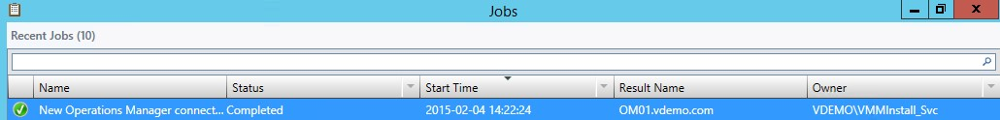](http://media.orneling.se/2015/02/10.jpg)

Now, switch to the SCOM console to check that the connector is successful and really is importing information from SCVMM.

The first thing we want to check is that the management packs have been imported so navigate to Administration -> Management Packs. Find every MP related to SCVMM by searching for it (Ctrl+F if you  don´t see the search window). As you can see there are multiple MP´s imported (as this connector were initially setup by me a while ago the dates when the MP´s were imported might seem strange at first sight) :)

[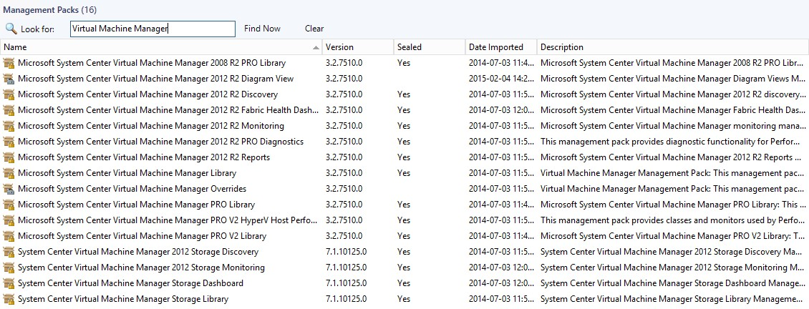](http://media.orneling.se/2015/02/11.jpg)

Now we want to see what´s been discovered by SCOM so let´s head over to the Monitoring pane, the discovery might take some time so go grab something to eat or something while waiting. Here we can see that the VMM server is really discovered by SCOM. As you see with all the dashboards, you can also see the health of your Private Clouds etc. inside SCOM as well.

[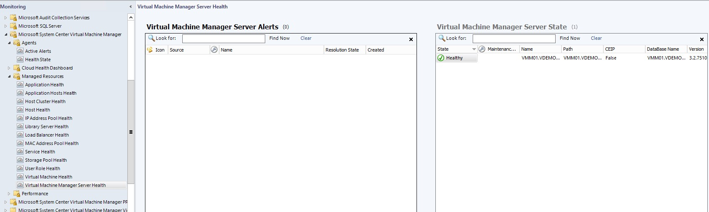](http://media.orneling.se/2015/02/12.jpg)

[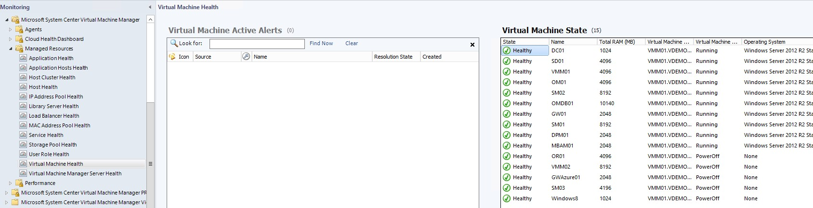](http://media.orneling.se/2015/02/13.jpg)

**Activating the Capacity Planning intelligence pack**

Now that we have setup the connection between SCOM and SCVMM, we´ve met the requirements to get the Capacity Planning working. If you´ve ever activated an intelligence pack before, you might know how it´s done. It´s exactly the same procedure as all the other IP´s.

Log on to AOI [here](http://preview.opinsights.azure.com "Azure Operational Insights") and then click "Intelligence Packs". (Dont have an account yet? Check my post [here](http://blog.orneling.se/2014/05/set-new-system-center-advisor-preview/#more-11421) on how to onboard.

[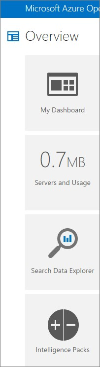](http://media.orneling.se/2015/02/14.jpg)

Choose the "Capacity Planning" IP and then click "Add".

[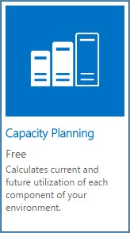](http://media.orneling.se/2015/02/15.jpg)

[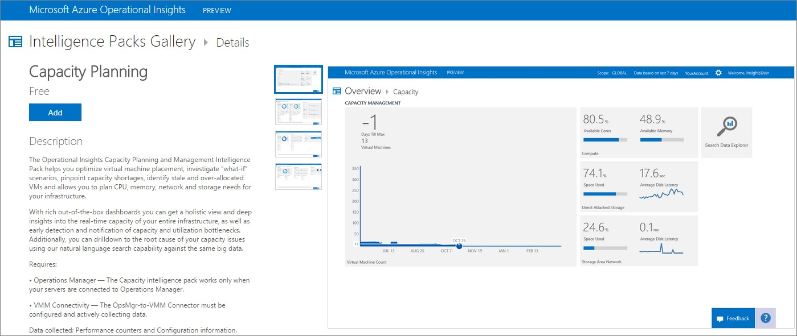](http://media.orneling.se/2015/02/16.jpg)

Now that we´ve added the Intelligence Pack, we need to gather some patience as this may take a while. In my case, i added the IP friday afternoon and checked back monday morning and then it looked like below :) This is just an overview of all the IP´s and as you can see, I´ve activated everyone available to this date.

[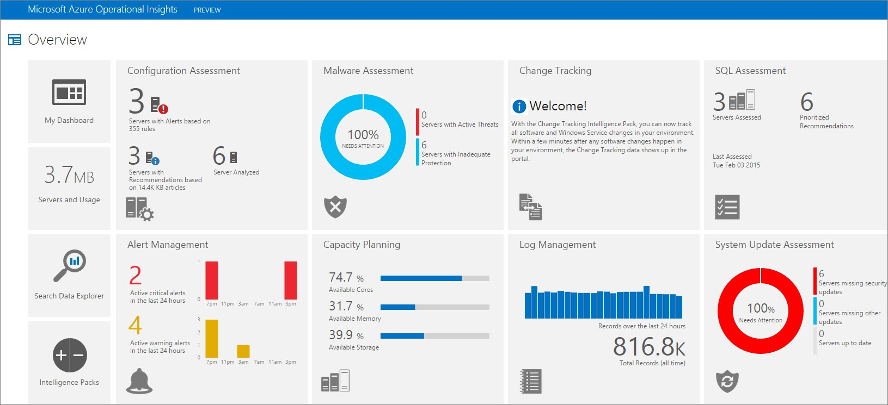](http://media.orneling.se/2015/02/17.jpg)

Clicking the "Capacity Planning" tile will present us the below first overview of what´s been discovered and analyzed.

[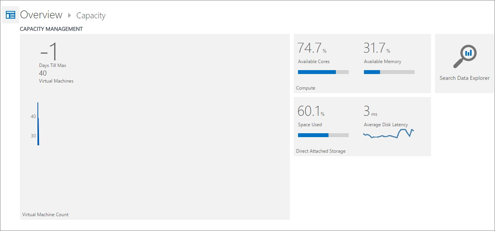](http://media.orneling.se/2015/02/18.jpg)

As with all IP´s there are some standard saved searches you can use as seen below.

[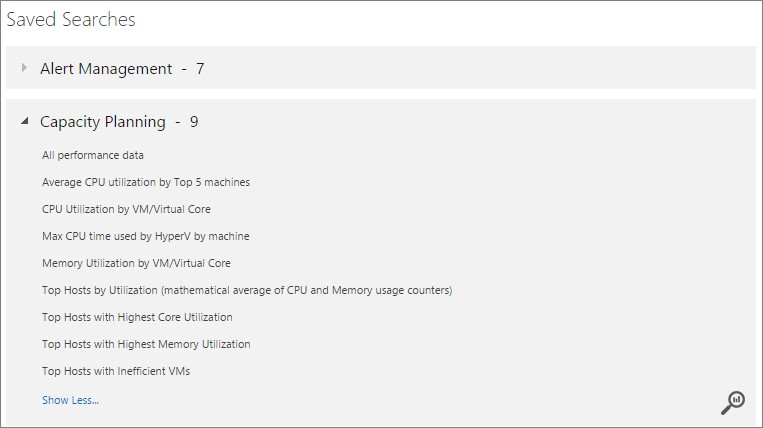](http://media.orneling.se/2015/02/19.jpg)

The below search is something I just put together in a minute and as you can see here, a lot of parameters is available to use for filtering.

[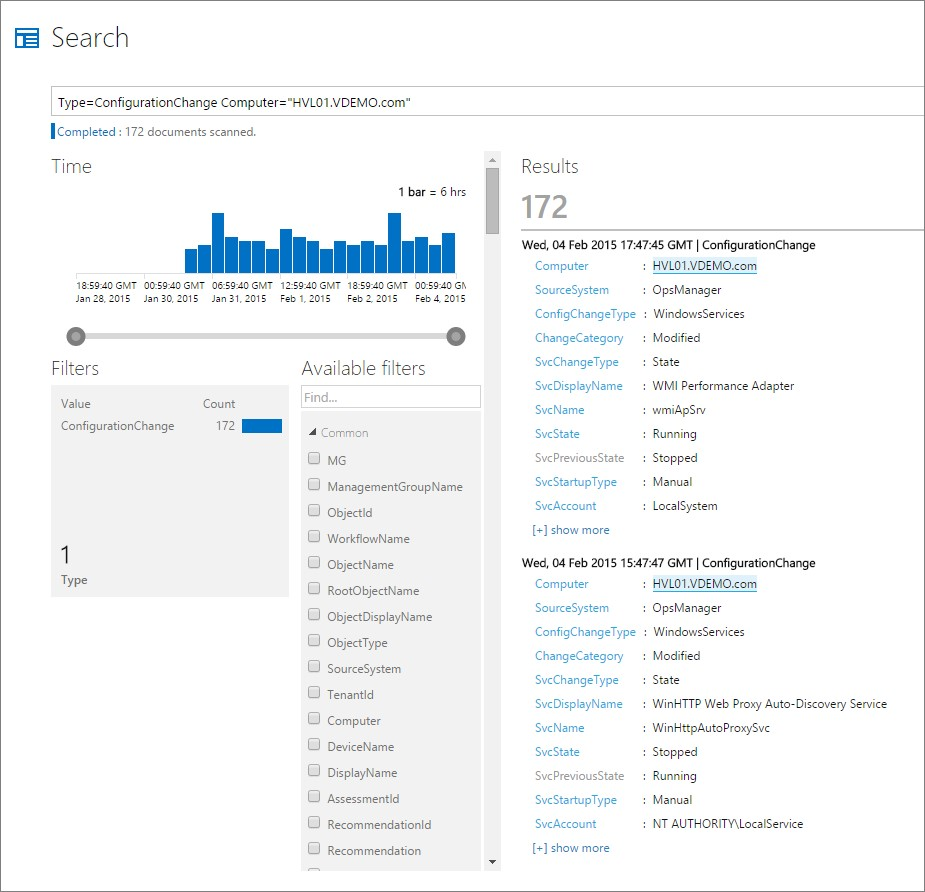](http://media.orneling.se/2015/02/20.jpg)

**My Dashboard**

Another cool feature is the ability to custom create your own dashboard where you can put the tiles you care about while leaving the other areas to your colleagues. This dashboard is real easy to customize by just clicking "Customize" which you can see in the bottom right corner of the below picture. Here you´re able to use your saved searches (as the one i created above) and a lot of other searches. What´s cool here is that you can also set thresholds to show what thresholds are OK and not OK.

[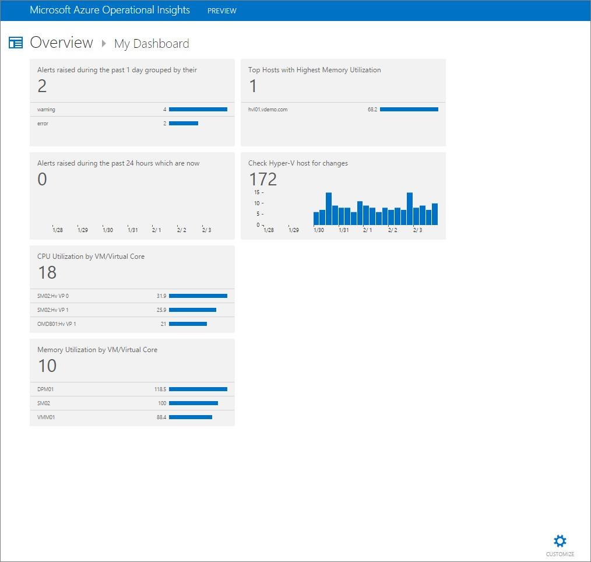](http://media.orneling.se/2015/02/21.jpg)

By checking into SCOM after all of this information have been gathered we can see that three more Management Packs have been imported to cover the Capacity Planning functionality.

[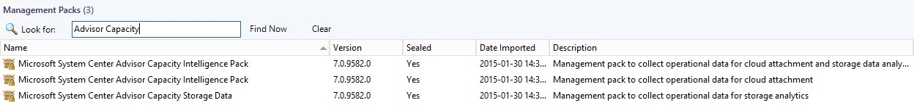](http://media.orneling.se/2015/02/22.jpg)

**Wrap up**

The things I´ve shown here in this post is just another great part of using Azure Operational Insights with your already existing SCOM environment. By just looking into the Intelligence Pack section in OpInsights we can see that there are several IP´s on the way right now meaning we will see much more in the future. Right now there are two IP´s listed as "Coming Soon", "AD Assessment" and "Security and Audit". I think it´ll be real interesting to see where OpInsights are heading as this is something we will see much more of in the not to far away future.

As usual, if you have any questions, leave a comment below :)
