A couple of weeks back I had a not so interesting (to put it mildly) moment when one of my hard drives failed and I lost contact with it. This wouldn´t have been a great issue if it wasn't for the fact that 10 minutes later, another sudden disk death situation appeared. Of course, I had backup of (almost) all of the data meaning I just had to buy a couple of new disks and restore the information I could access from one of the failed hard drives. However, the other disk were completely dead and the only thing I could do was to return it to the manufacturer and get it replaced on the warranty. As I mentioned, almost all of the data were recovered (thank you OneDrive for keeping a lot of my files safe) and parts of it were recovered using Azure Client Backup. This is a really great feature which can save you lots of headaches when something goes wrong, you´ll never know when Murphy shows up. I will go through the steps of creating the backup vault which is where all of the backed up files is stored, how to create backups of your files and of course how to restore it.

**Set up the client backup**

To get going here, first we need to create a backup vault in Azure which is shown below in the following steps.

Choose to create a new "Backup vault", give it a name and choose the region you want the data to be stored in.

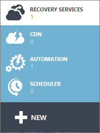

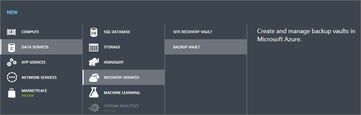

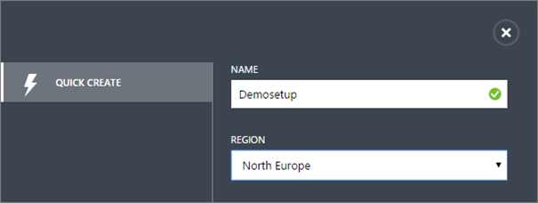

After having created the vault, go to Recovery Services and then choose your vault which in this case is the "Demosetup".

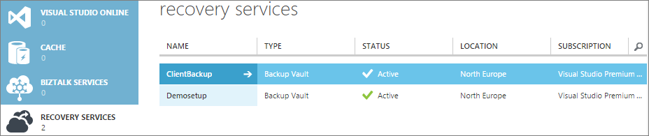

Download the vault credentials and the agent matching your server.

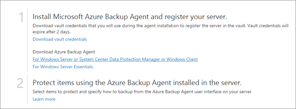

Step through the installation process on the server where your files are placed like I´ve done below.

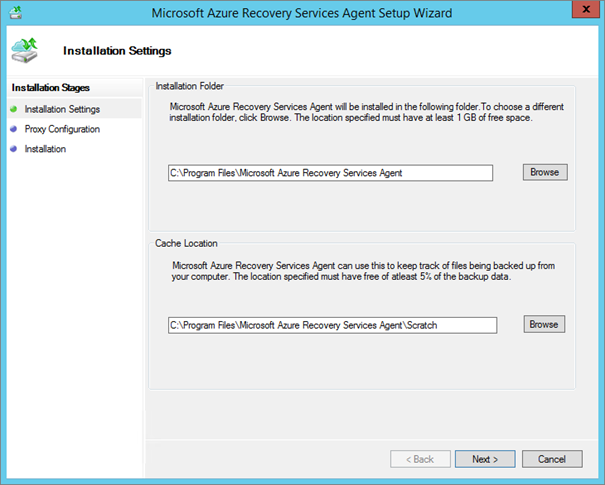

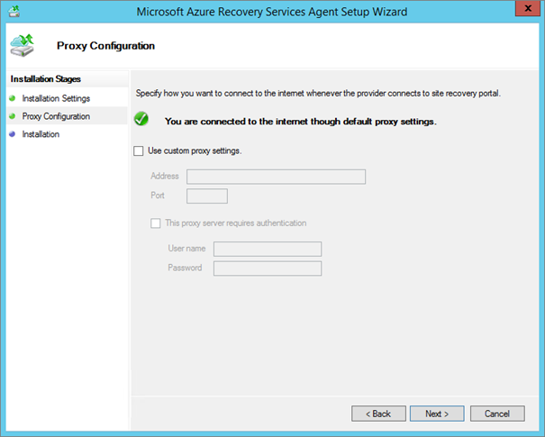

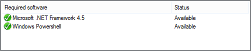

Now that the agent have been installed, the next step is to register the server so that it can access the vault and upload the files to it. This is where your vault credentials comes into the picture.

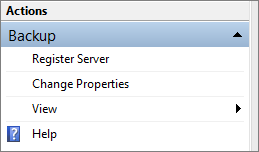

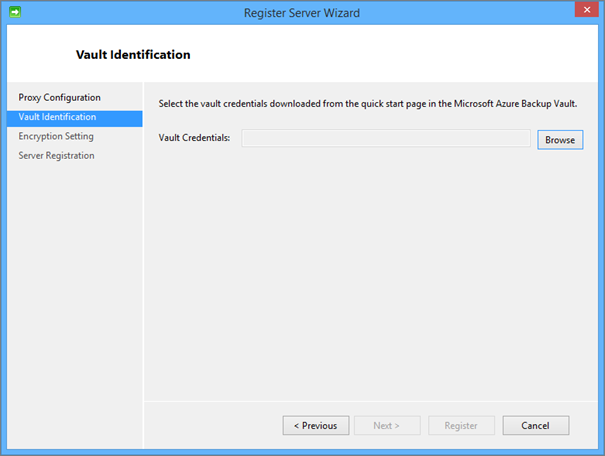

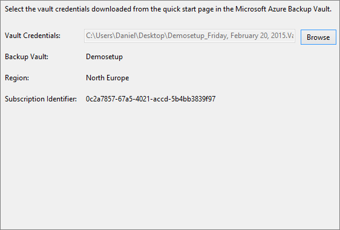

This step is very (I mean very) important to pay attention to. The passphrase that you choose here is your key to the data so be aware of where you put this file. In the next screen you´ll see the path to the file. Secure this file and make sure that you don´t lose it cause if you do, your data is out of reach.

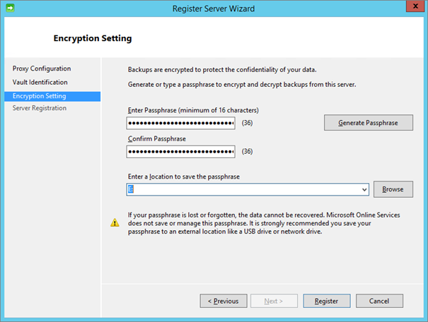

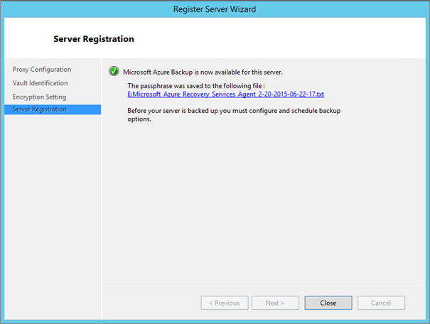

The server is registered and able to back up your data to the Azure vault so now it´s time to give it a try.

**Backing up the data**

Launch the Microsoft Azure Backup agent you just installed and then click Schedule Backup.

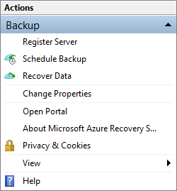

The following procedure is pretty much straight forward. For demo purposes, I´ve chosen to back up my unsealed SCOM management packs to make sure I don´t lose my overrides that I´ve made in my lab environment.

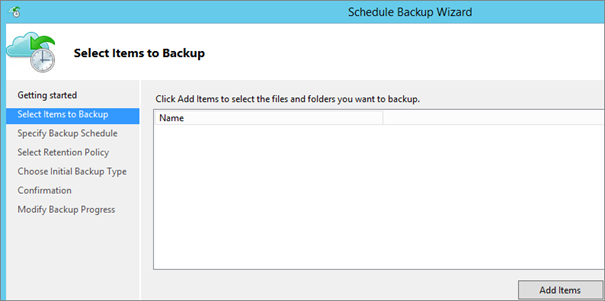

Choose what data to back up.

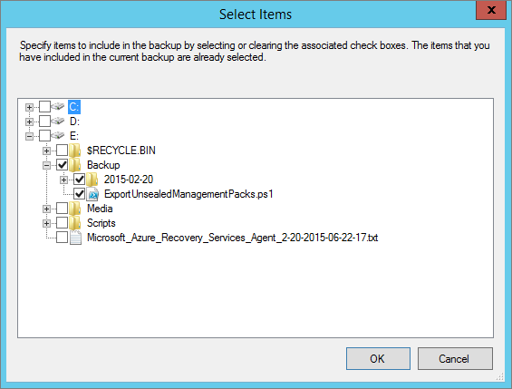

Specify a schedule to suit your needs.

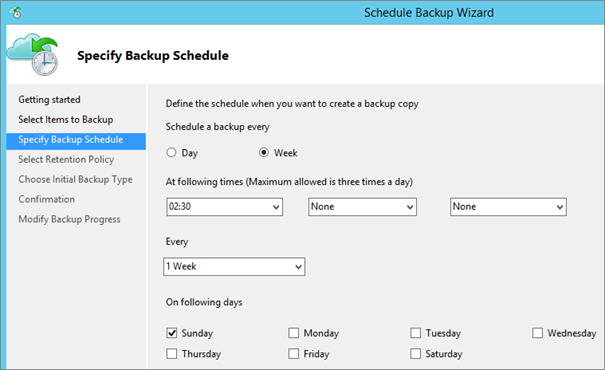

Set up a retention policy to make sure you have all the data you need. The below values are the default to give you a hint of what you can expect out of the box. Step through the rest of the process and click Finish.

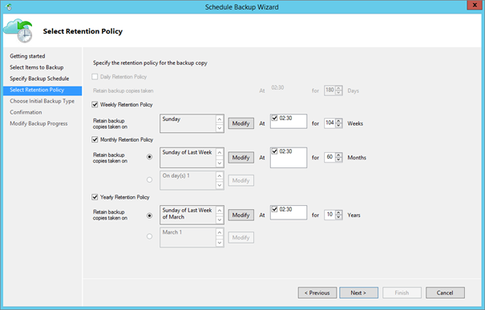

Now that we´ve created the backup schedule, it´s time to try it out. Now this may take some time, depending on the size of the folders to back up and your internet connection. Right now I´m on a 100/100 Mbit connection meaning it should go really fast (and it did).

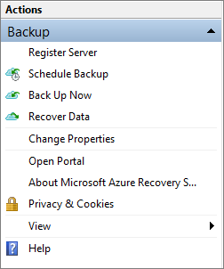

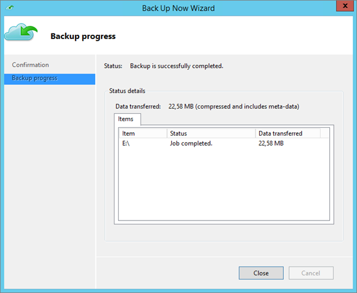

After the backup agent shows that it´s ready, you can also go into the Azure portal to verify that files are actually backed up. As you can see below, my folder has been successfully backed up as it´s supposed to.

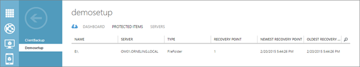

**Data recovery**

Backing up your data is awesome and crucial, enough said. But what we really need is of course to be able to restore the data in case of a failure as for me with my hard drives. To show that the recovery really is working the way it´s supposed to I simply deleted the folder from the drive.

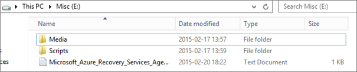

To recover data, just click Recover Data and you´ll launch a new wizard letting you pick the data to restore.

Choose where your backed up files were placed (if you choose Another server you´re gonna need the vault credentials along with the passphrase of that vault to register that server as well.)

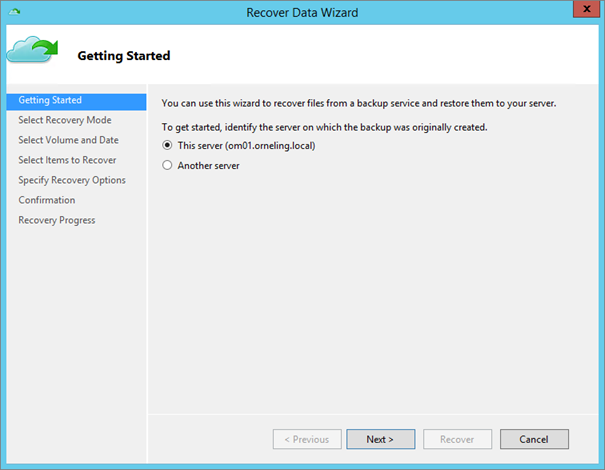

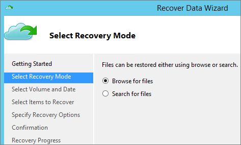

Pick one of the restore points to recover that particular set of data.

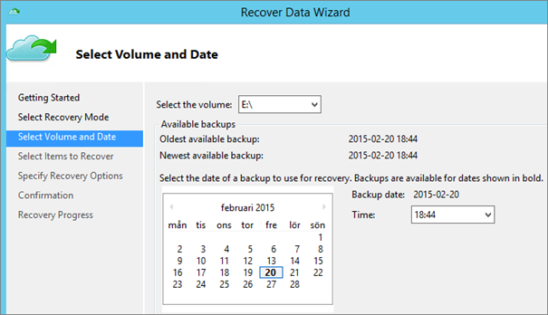

Choose what to recover. In this case i wanted the complete Backup folder and as you can see it also contains a Powershell script. This script is used to back up my unsealed SCOM management packs which I´ll come back to in just a moment.

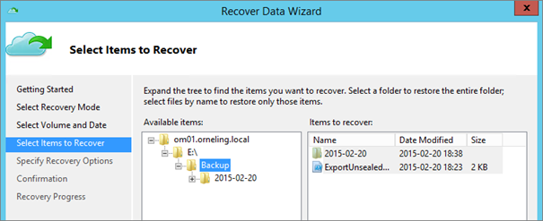

Choose where to restore the data and whether you want copies of the files or to overwrite newer data.

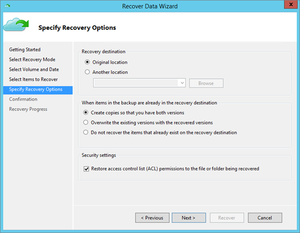

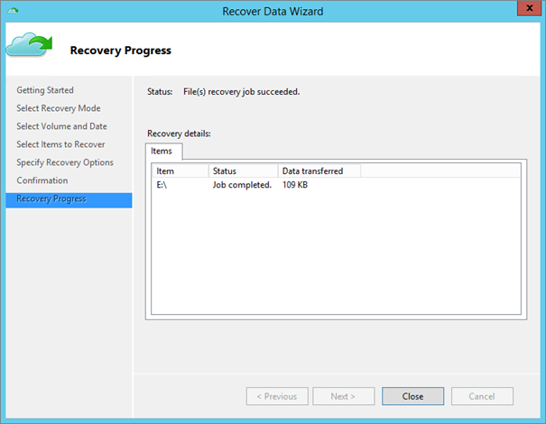

To show that this is really working, I´ve tried running the scheduled task for backing up my SCOM management packs. The task points at the Powershell script seen below which were non-existent since I deleted the complete Backup folder. And as you can see, I have been able to restore my deleted folder and instantly start using the data again.

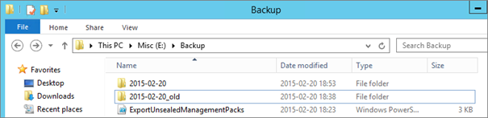

**Wrap up**

As you can see in this post, It´s really not that big of a deal to set up Azure Client Backup and It´s really easy to recover the data as well once it´s been damaged or deleted. Even though one of my disks were completely dead (yes, I know about Raid ;) ) I was able to restore almost all of the data. When it comes to pricing of this service, you can check it out [here](http://azure.microsoft.com/en-us/pricing/calculator/?scenario=data-management "Azure pricing calculator"). The first 5 GB of data is free so feel free to try it out. If you want to run the script I´m using to back up my unsealed SCOM management packs, check [this](http://blog.orneling.se/2014/05/backup-your-unsealed-management-packs/ "Backup your unsealed management packs") blog post.

If you have any thoughts of the post, feel free to leave a comment below.
