One thing that might not be as obvious as you would wish in SCOM is how to send reports through e-mail. Inside SCOM there is no possibility to configure a SMTP server to send SCOM reports through e-mail as there is for sending notifications. So what to do? In this post I´ll show how to send reports using a Gmail account since I don´t have a mail server in my lab environment and it might come in handy to some of you out there who are in the same situation. If you already have a SMTP server in your domain then congratulations, you can skip half of the post since it´s really that easy to set up.

**Configuring the SMTP server**

To be able to use a Gmail account for this purpose, I need to set up a SMTP server to relay my e-mails for me. Simply install the Feature "SMTP Server" from within Server Manager/Add Roles and Features.

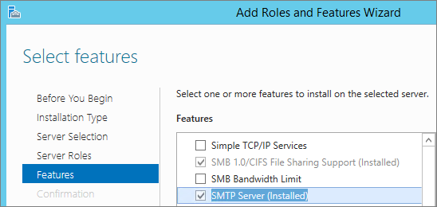

Launch the Internet Information Services (IIS) 6.0 Manager (not the IIS 7 console cause that aint the place to make these changes) J.

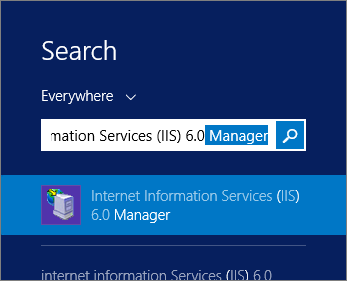

Right click \[SMTP Virtual Server #1\] and choose properties, then go toe the Access tab and select "Relay…"

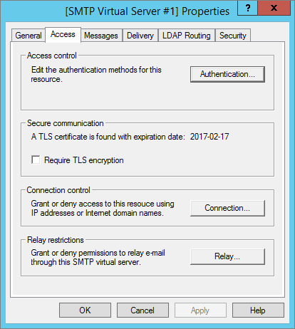

This is where you can decide whether or not computers should be able to send mail through this SMTP server. Click "Add" to specify which servers should be allowed to send e-mails through this SMTP server.

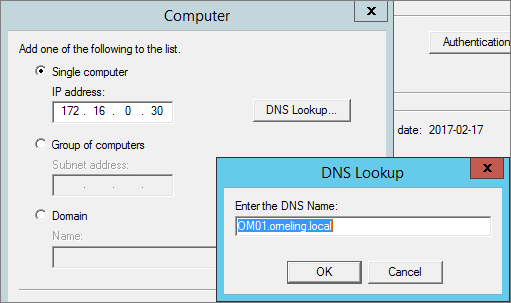

Add all your servers that you want to send mail through and click OK.

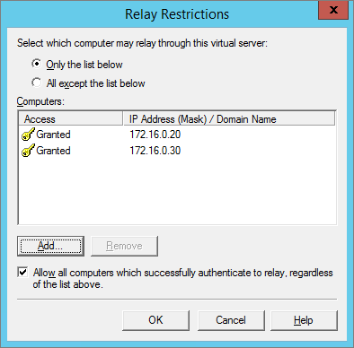

Go to the Delivery tab and then select "Outbound Security". Fill in you Gmail account credentials and mark TLS Encryption followed by OK.

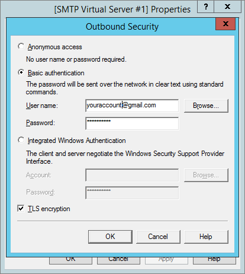

Select "Outbound connections" and change the TCP port from 25 to 587 and click OK.

Click Advanced and fill in the Gmail SMTP server as seen below. The SMTP server to use for Gmail is smtp.gmail.com.

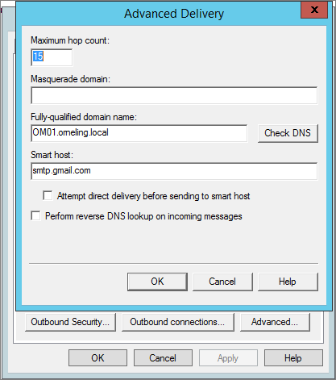

That´s it for the SMTP Server configuration. Now it´s time to configure SQL Server Reporting Rervices (SSRS) to send mail through this relay.

**Configuring SQL Server Reporting Services**

Go to your server where SQL Server Reporting Services is installed and launch "reporting Services Configuration Manager" from the start menu.

Go to the "E-Mail Settings" section and make the changes as seen in this example. Set a sender address and your internal SMTP Server that you just set up (for example. Smtp.yourdomain.com).

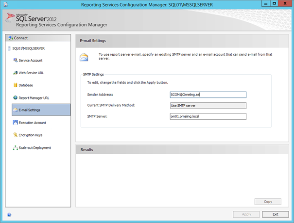

That´s it. Close the reporting configuration and head over to the SCOM console.

**Creating the report to be sent to the e-mail address**

Head over to the SCOM console and go into the Reporting pane. Take out the report you would like to have e-mailed to you and choose Schedule from the "File" menu.

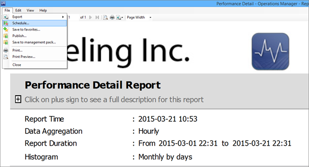

Set the address where the report shall be sent and choose if you want it as a PDF, HTML, CSV etc.

Create a schedule to suit your needs. In this case I´m just going to go with a one-time report for demo purposes.

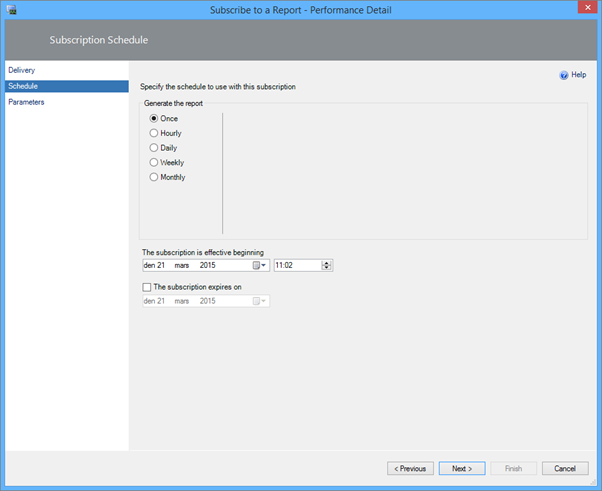

Step through the rest of the wizard and then wait for the right time for your report. Log in to your e-mail account and enjoy your new report which in this case is delivered as a PDF file.

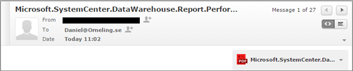

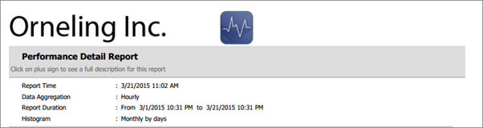

**Summary**

As you can see, there´s not much that need to be done in order to send reports through e-mail from SCOM. Simply, all you have to do is to configure the SQL Server reporting services to use your SMTP server and then you can schedule your reports to be sent on a given time.

If you have any questions or any other thoughts about the post, drop a comment below.
