As I mentioned in my last post which you can find [here](http://blog.orneling.se/2015/05/system-center-2016-operations-manager-whats-new/), SCOM 2016 has quite a lot of nice new features such as the scheduled maintenance mode. What I will show you briefly here is how to install the technical preview 2 of SCOM 2016 and what it takes to do so. You will also get a glimpse of the new scheduled maintenance mode feature :) Download the Technical Preview of System Center 2016 [here](https://www.microsoft.com/en-us/evalcenter/evaluate-system-center-technical-preview?WT.mc_id=Blog_SC_Announce_TTD). **Prerequisites**

If you´ve ever installed SCOM 2012 or 2012 R2, the only difference is that you _**must**_ be running SQL Server 2014 to be able to install the product. I did try to install it using a SQL Server 2012 instance as well but then I couldn´t find the instance from within the setup process. Other than the SQL part, the prerequisites are the same. Take a look at [this post](http://blog.orneling.se/2014/04/let-powershell-install-scom-prerequisites/) on how you can automate the installation of all the prereqs.

**The installation process**

The installation process is similar to the one you see for 2012 R2 and even the first screen you see after launching the setup says System Center 2012 R2.

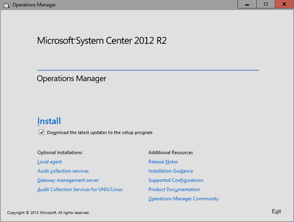

Choose your features to install on the server and  move on. I will install the Reporting server later on my SQL server.

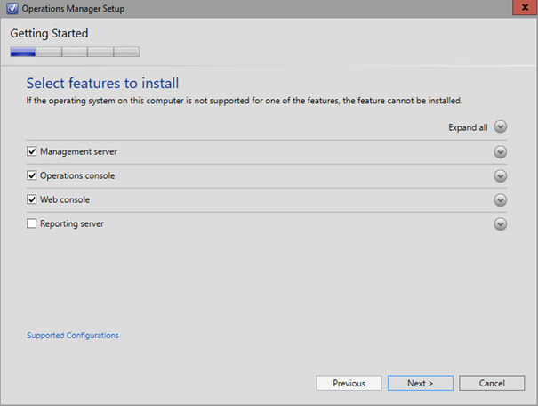

At this point, I´ve run the script you will find in my prereqs post linked above and I´m good to go.

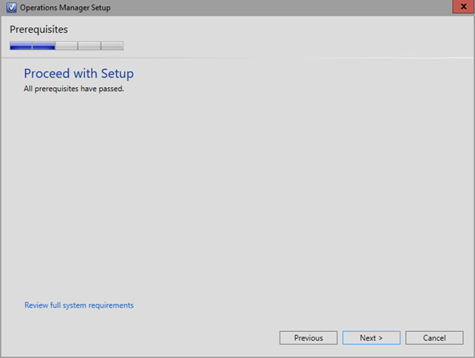

I choose a new Management Group name, very easy to find out which version it´s running :)

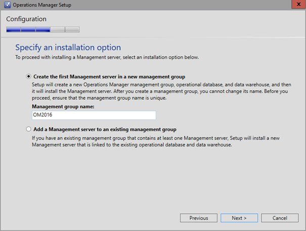

Point out your SQL Server 2014 server and move on. It might also be a good idea to set the DB size a bit higher but since this is a really small demo environment I did just set it to 5 GB´s instead.

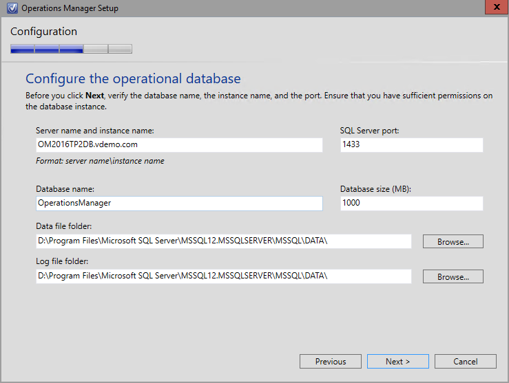

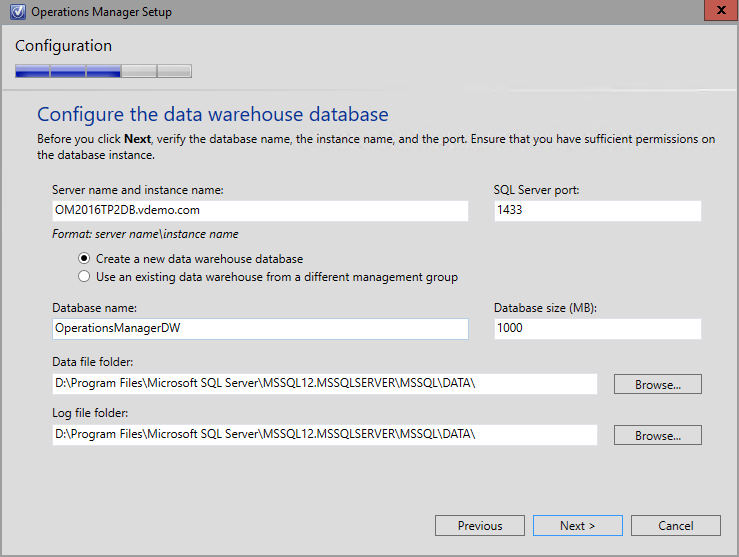

Put in your accounts. In this case I already had all the accounts created in my AD since I´m running another switched off 2012 R2 Management Group.

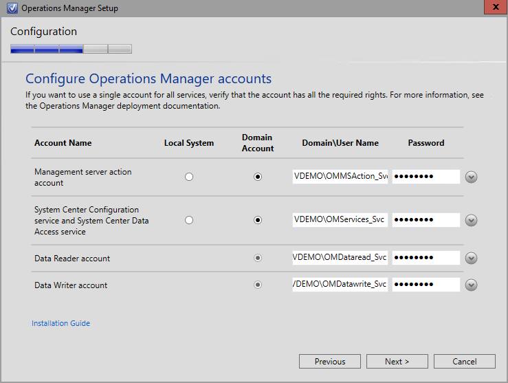

Just as expected, the setup shows an error and it´s perfectly normal. It just tells you to install a license key which can be done using the Operations Manager shell or a regular PowerShell session later on.

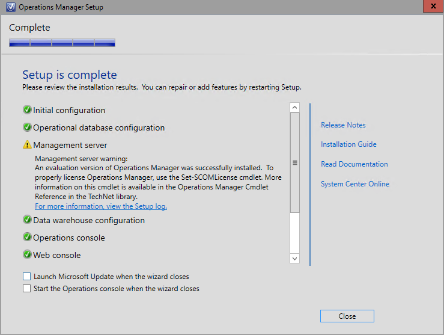

Now, the first time you see any difference from 2012 R2 is when you check "About Operations Manager". The version numer of 2012 R2 is 7.1.10226.0, this is the base version number and then there´s always the UR´s with it´s version numbers as well. As you´ll see in the picture below, SCOM 2016 has a version number of 7.2.11097.0.

**A first look at the the maintenance scheduler**

When you´ve opened the Operations Console and have clicked the Administration pane, you will see something much appreciated and something that me and a lot of you out there have been waiting for a long time. I´m talking about the "Maintenance Schedules" button! As I mentioned in my last post, this will show up in SCOM 2016 but hopefully in an Update Rollup for 2012 R2 as well. After clicking the button, you will see an overview of your scheduled maintenance modes. To set up a new schedule, click "Create Maintenance Schedule" to the right.

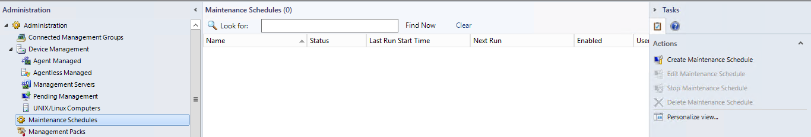

Choose which server(s) should be affected by the schedule. Here you can pick single objects or groups of objects.

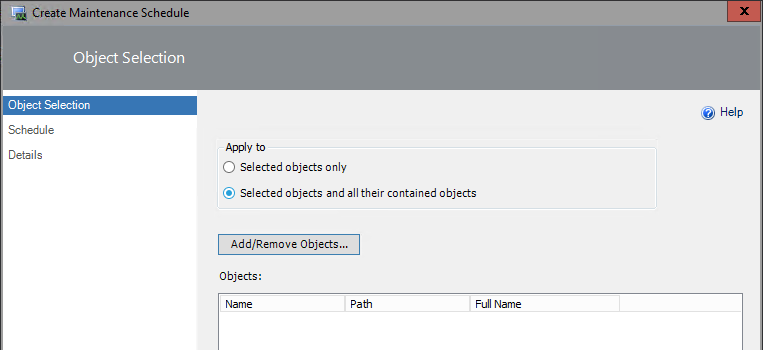

Pick your objects and move on.

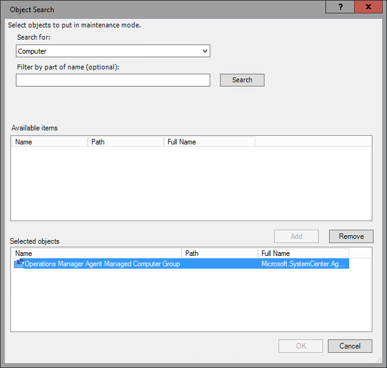

This is where the fun part begins. Set your schedule to a "Once" in a lifetime happening or a recurring event. Set your start time and end time and move on. If you´ve tried the Scheduled Tasks feature of Windows, this might seem familiar.

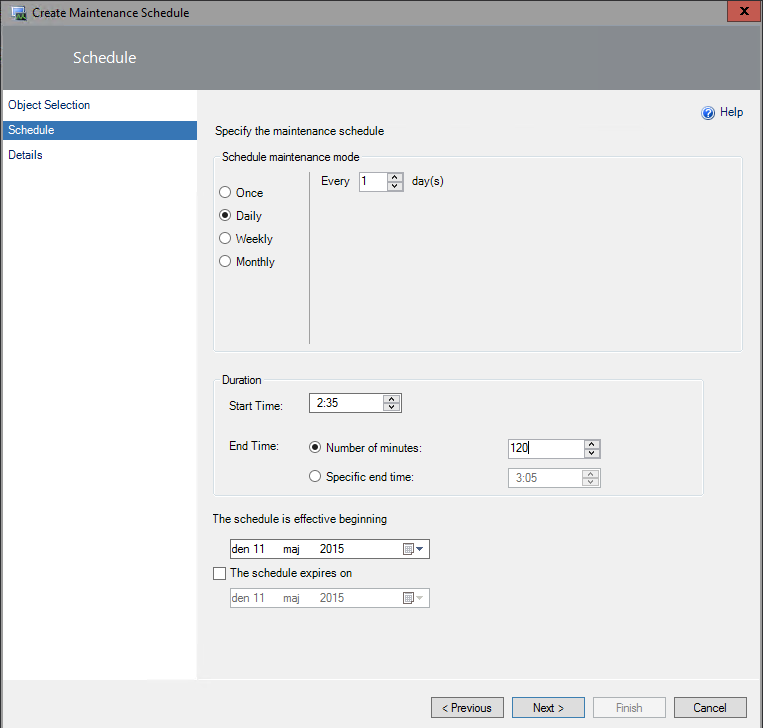

Give your schedule a name, categorize it and type a comment on why the schedule is needed.

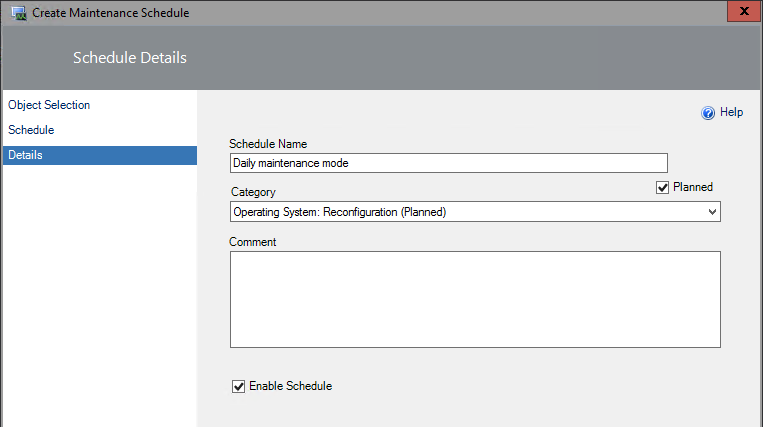

As seen below, you can also set recurring dates as to the day after patch tuesday every month for example.

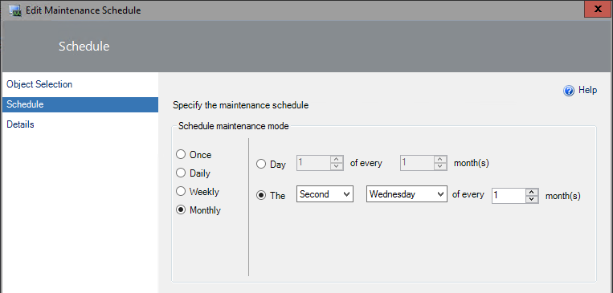

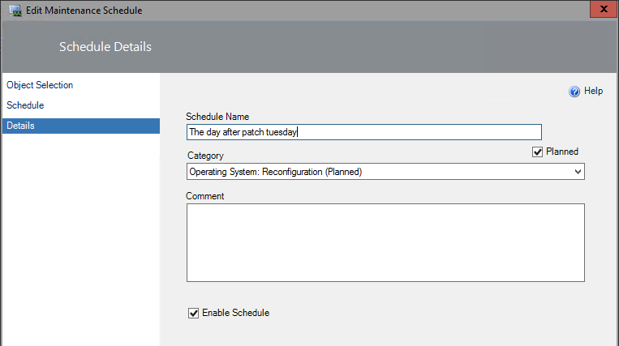

An overview of the schedules will show up in the console right after you´ve created it and you´ll see who created it, when it was last run and when it will run the next time.

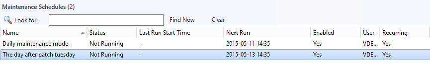

But where is the information stored? I dug into the OperationsManager DB and found a table named "dbo-MaintenanceModeSchedule" which contains all the information you just saw above. To find the information shown in the below picture, execute the query found below.

[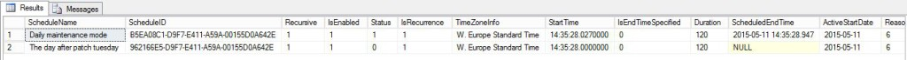](http://media.orneling.se/2015/05/maintenancemodechedule.jpg)

`SELECT TOP 10 [ScheduleName] ,[ScheduleID] ,[Recursive] ,[IsEnabled] ,[Status] ,[IsRecurrence] ,[TimeZoneInfo] ,[StartTime] ,[IsEndTimeSpecified] ,[Duration] ,[ScheduledEndTime] ,[ActiveStartDate] ,[ReasonCode] ,[Comments] ,[LastModified] FROM [OperationsManager].[dbo].[MaintenanceModeSchedule]`

**Summary**

What I´ve shown here is just a small bit of the news I mentioned in my last post. I will keep digging into this new release and report about my findings on my blog as well. So haven´t you tried the new Technical Preview yet? Do it, It won´t let you down (i think) :) Now I´m just waiting for the preview MP´s for Server 2016 to show up so I can monitor my new servers as well.

As always, if you have a question or just want to get in contact leave a comment below.
