As you all (hopefully) know, Live Maps Unity is a way to extend the monitoring with Operations Manager into looking at the application level instead of just looking at different components. It´s a great way to visualize the services and the status of those and it gives us the opportunity to, in an easy way find out about SLA levels of both the services but also the underlying layers of the service.

One of the main things I´ve run into when working with Live Maps and business service management is the ability to show the services dashboard on a separate screen. When working with one of my customers, there were some main requirements to take care of.

- The IT Management (CIO etc.) should only see the status of the services created to know whether it´s Green, Yellow or Red.
- The application owners should be able to drill down and see all the information contained in the service, including SLA levels as well.

To do this, we created new user groups in the AD which we then delegated rights to firstly from SCOM.

**So how is this done?**

Start by navigating to Administration and then User Roles in the Operations console as seen below. Among others you will see the user roles listed below. The four Live Maps roles you will see as a read-only role is Helpdesk Engineers, IT Management, Service Owners and CIO. As a demo for this blog post, I have created two new AD accounts called OMITTechnician and OMITManagement which will be members of the two roles Helpdesk Engineers and IT Management. Right click the role you want to assign and choose Properties (or just double-click the role).

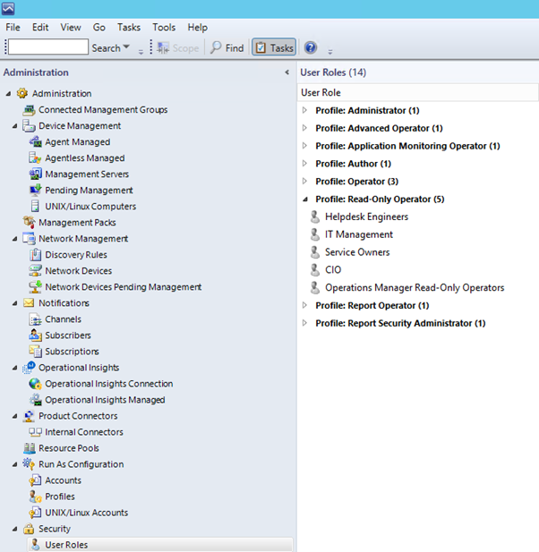

Click Add and then browse for your account or group that you want to add. When doing this in your production environment, I would strongly recommend using AD groups instead of single accounts that I´m using below. By using AD groups instead, it will be a lot easier for you to add the rights to new users of each role. Assign the respective role to the user and move on. Since these are ready-made roles, you won´t be able to edit the scope and views so just move on by clicking OK.

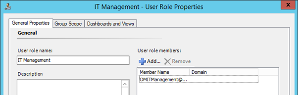

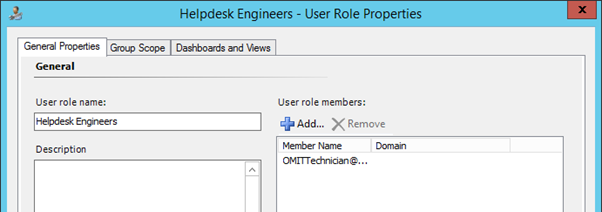

The next step is to update the services and to assign rights to the respective role. This is done from within the "Live Maps Authoring Console" and by opening up each service you want the user/group to be able to see. When you´ve opened up your service, navigate to the Security tab. What I´ve done below is to assign the following roles:

- IT management will be able to show the service on the dashboard (the service map) and to open the service map. After this, no more layers will be shown.
- Helpdesk Engineers will be able to step all the way down in each service assigned to them.

This has to be done for each service you want to assign. After having saved the service(s), you will be able to log on to the Live Maps web console and show the services on the screen.

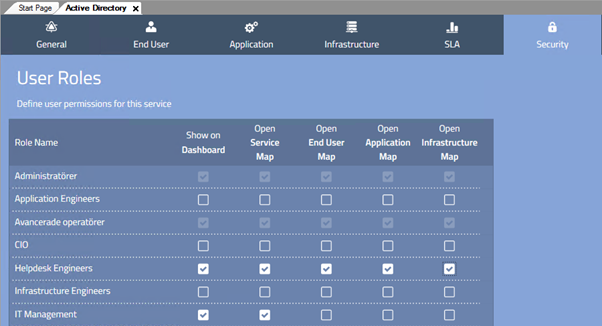

**Logging on as the OMITManagement user**

Remember that I assigned "Show on Dashboard and "Open Service Map" to the IT Management role. Since I only did this update to two of my services, these services is all that user will see when logging on to the Live Maps web console.

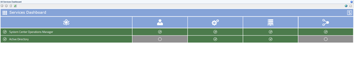

Below, I have stepped down one step into the "SCOM" service and so far it looks familiar. What happens next though, when clicking on one of the layers (User, Application and Infrastructure) is something different. Since I´m not allowed to open the different layers (End user Map etc.), I will only see the state changes that has taken place for each layer of the service as seen below.

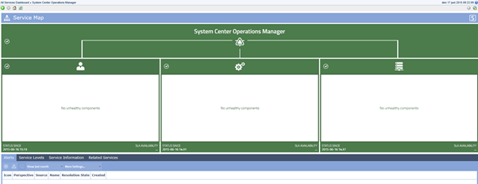

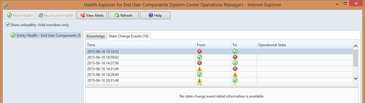

**Logging on as the OMITTechnician user**

The next user I created got the right to go all the way into the services but I have only made the change for three of my five services. As you can see below, the technicians can also see the "Direct Access" service.

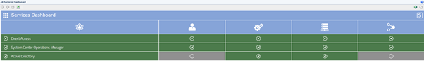

When going all the way into the service and into the Infrastructure layer, I can see the components that make up the infrastructure part of the service. This way the technician gets full read rights to the services assigned.

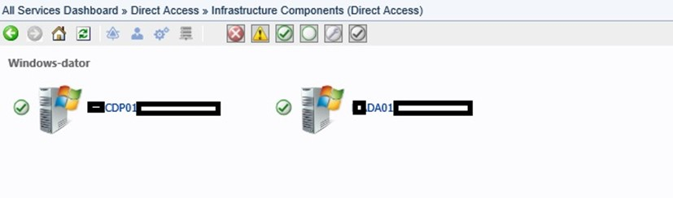

**Logging on as an OM Admin user**

Now that I´ve shown how the different roles work, I want to show what it looks like to me as a SCOM administrator. As you can see below there are five services in my dashboard instead of just 2 and 3 for the roles I assigned above. This is possible since I am an administrator and have full access in the SCOM environment.

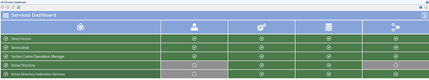 

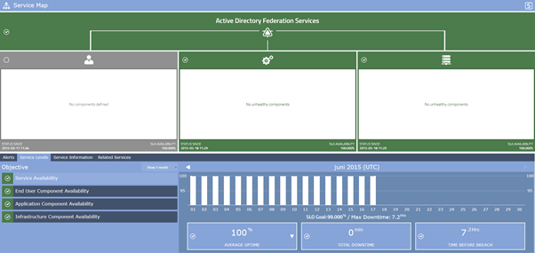 

**Summary**

So, what I´ve shown in this post is a way for you to delegate different access rights to the different services based on the users work role and department etc. In the specific customer case I mentioned, this really helped out in showing the correct amount of information to the right people. By dividing the roles as we´ve done here we make life easier for the personnel and the employees will only see what´s relevant to them in their work role.

To find out more about how this can be done, contact Savision for a technical demo.
