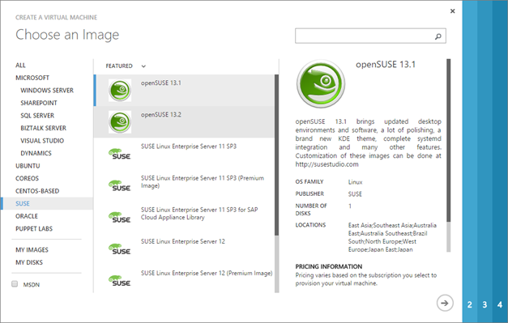
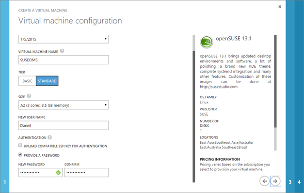
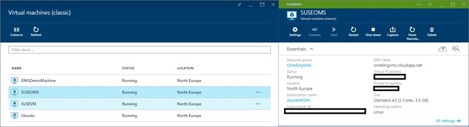
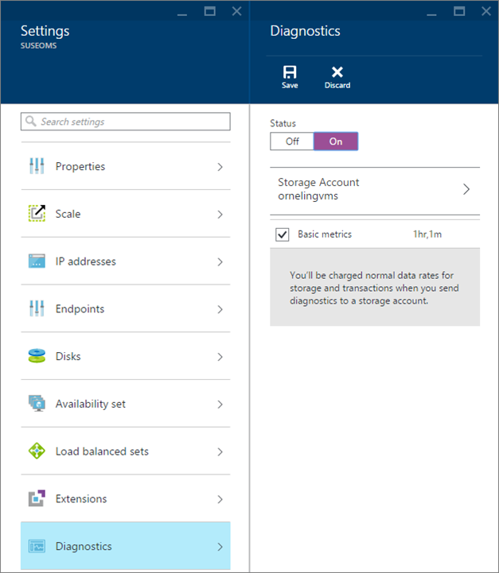
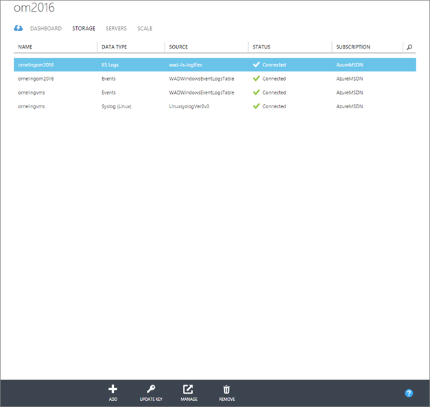
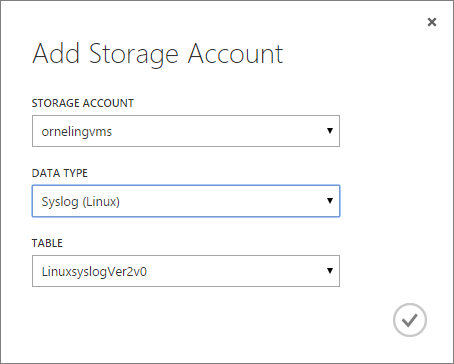
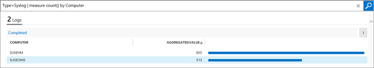
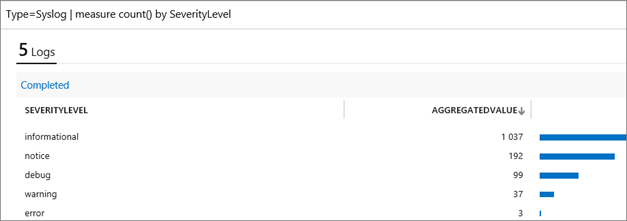
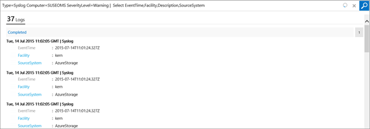
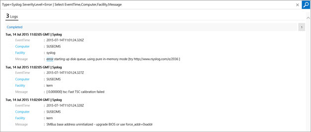

In my earlier posts regarding Operations Management Suite (OMS) I have covered how to get the information from the servers both directly from the agent but also by connecting OMS and SCOM. But, what if you want to receive logs from a server without the need to install an agent?

In this post I will cover how it´s done when collecting logs from a VM running SUSE 13.1 created in Azure from the gallery. **Creating the VM**

The first thing I had to do was obviously to create the VM in Azure, I just picked an openSUSE 13.1 template and moved on.

Name your VM, size it, set a user name and password and move on. About ten minutes later I was ready to roll and my VM was up and running. Just remember to install the VM agent in the next step (checked by default) before provisioning your VM.

**Activating Diagnostics for the VM**

After the VM have been created, you need to activate diagnostics for the VM. In order to do the following steps, you need to first create a storage account in Azure. When you´ve got your storage account, navigate to your VM in the Preview Portal ([portal.azure.com](http://portal.azure.com)) and then click "All settings" as seen to the right in the below picture.

Choose "Diagnostics" and turn it on, then choose your Storage Account that you just created (or had created earlier) and save.

**Picking up diagnostics into OMS**

Now there´s only one step left before you can see your diagnostics in OMS. In the old Azure portal ([manage.windowsazure.com](http://manage.windowsazure.com)), navigate to Operational Insights and choose your workspace where you want the information to be seen. If your workspace isn´t visible in Azure, you need to create a new OpInsights instance in Azure and link it to your workspace you want to use so that it´s visible in the Azure portal.

When you´re into your workspace, go to the Storage pane and then click "Add" in the bottom of the screen.

Choose your storage account and Data Type, in this case Syslog (Linux) and then click OK to save the settings.

**Checking the Syslog events in OMS**

After some time, in this case with my latest VM (SUSEVM) it took about 15 minutes before logs started showing up. An easy way to find out if there are any logs gathered is to run the query seen below which will show you how many log entries have been collected for each computer.

The query to paste in the search field: _Type=Syslog | measure count() by Computer_

Another query to check on the status of your servers is the one below which will show you the number of entries based on the severitylevel.

The query to paste in the search field: _Type=Syslog | measure count() by SeverityLevel_

And here´s two queries to gather warning and error event log entries from both a specific server but also general for all your servers.

The query to paste in the search field: _Type=Syslog Computer=SUSEOMS SeverityLevel=Warning | Select EventTime,Facility,Description,SourceSystem_

The query to paste in the search field: _Type=Syslog SeverityLevel=Error | Select EventTime,Computer,Facility,Message_

**Wrap Up**

What I´ve shown in this post is how easy it is analyzing Linux syslogs in OMS with a little help from Azure. It´s possible to collect diagnostics the same way from a windows server based VM which I will show in another post.

As always, got questions? Leave a comment below J
