When you have invested in Live Maps from Savision, you´ve opened up a whole new world with great opportunities of monitoring your business services. One of the first things many people associate Live Maps with is the service map where all the business services are displayed along with their status. This map displays not only the service name itself, but also three (hey, there are four you may think. The fourth is the "related services" section) different categories displayed. The three categories are End user components, Application components and Infrastructure components. In this blog post, I´ll show how we can use the Operations Manager web console to display it as an end user component in a previously created business service covering Operations Manager and its parts. To be able to set this up correctly, I need an account with read-only rights (minimum) to Operations Manager which I´ve already created and have had the rights assigned to it. **Preparations**

As I mentioned above, the account I´m using is already created. The reason I need this account is because the web console won´t just let anybody in, therefore we need an account with the right to access the console.

Since the AD account is already created, I just need to set it up inside SCOM as well. If you´re not familiar with this process, in the Operations Console navigate to Administration and then click Accounts. Choose to create a new Run As Account in the right pane. Start by giving the account a display name in Operations Manager, this doesn't have to reflect the AD user name as I have done below.

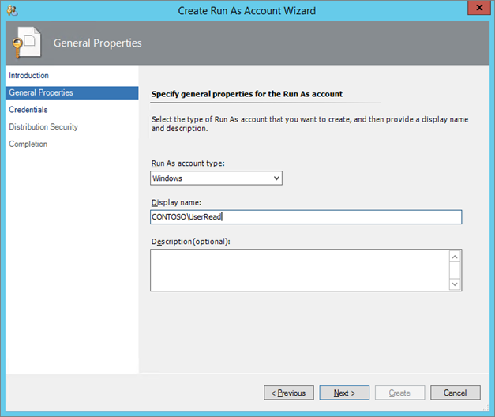

Type the AD user name and the password together with the domain as I´ve done below and carry on.

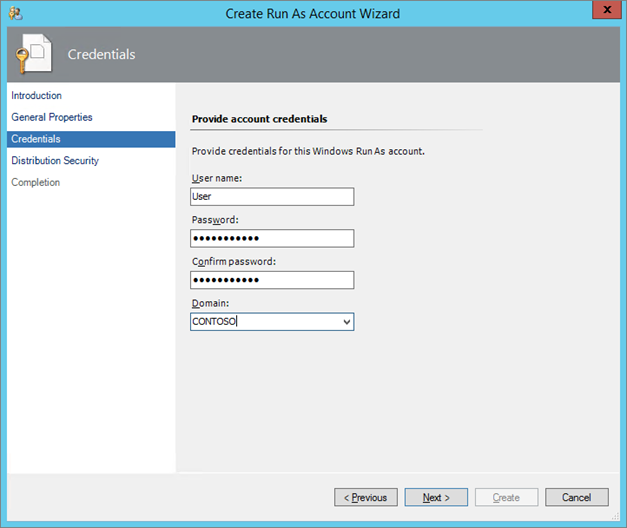

To avoid distributing the account to all servers and to keep the safety of the environment, choose the more secure option. This should by the way be your standard way of distributing accounts to remain the safety of your environment.

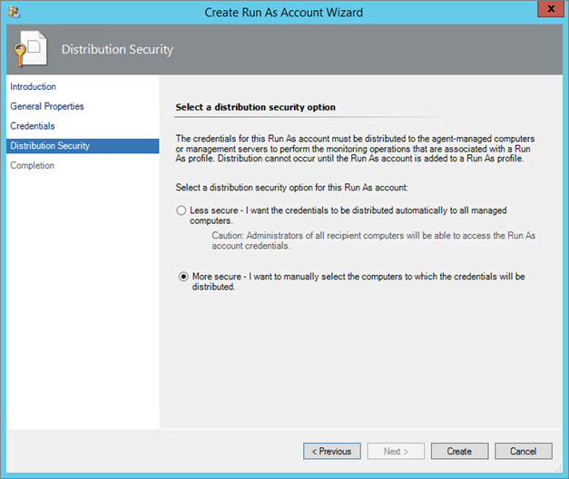

Once you´ve clicked create, you need to just double click the account you just created and go into the distribution tab and click add.

Now, to what should we distribute this account? The default option when you open this window is to distribute it to single servers. Instead, I´m going to distribute this to my "All Management Servers Resource Pool". This means that every time I add a new management server to my management group, this account will automatically be distributed to that new server as well.

**Creating the monitor**

Now that the account has been created its time to create the monitor which will look at the web console to see whether it's alive or not. Go into the Authoring pane, expand "Management Pack Templates" and right click any of the "Web Application Availability (or Transaction) Monitoring". Then click "Add Monitoring Wizard…".

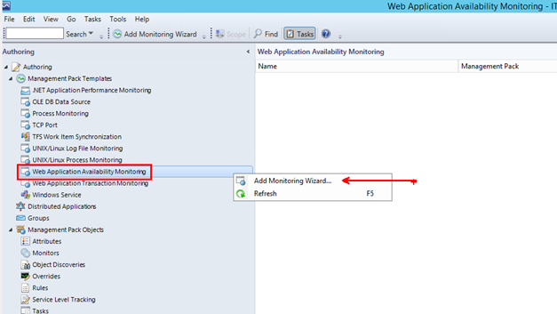

Click "Web Application Transaction Monitoring" and move on.

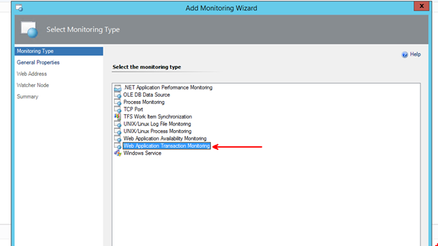

Give the monitor a name, this will be the display name so you can name it whatever you want. Also choose a management pack to store the monitor in. In this case I created a new unsealed management pack which I´ve chosen below to store my monitor.

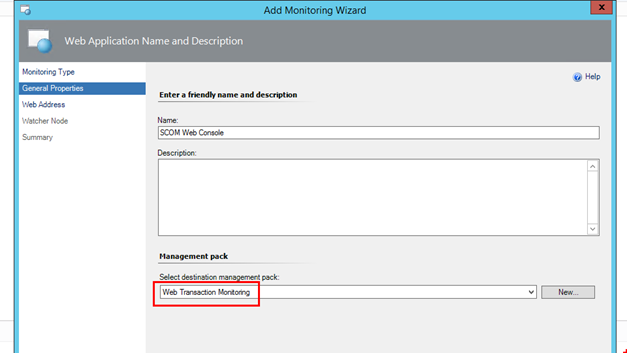

Put in the URL to your SCOM web console. The default is _"[http://your](http://your) management server with the console installed/OperationsManager"._ If you've chosen to use HTTPS during setup, just change the setting to use HTTPS instead.

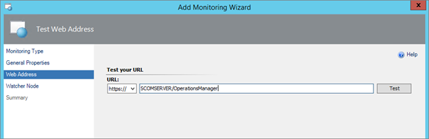

On the watched node pane, choose the server(s) from which you want the monitor to run. Remember I distributed the account to all my management servers, meaning I could check all my management servers at this step. Also check how often you want the monitor to run. In this case I choose 15 minutes.

Since the web console won´t let anybody in, the monitor will now fail with a 401 http response. Hey, at least we know there´s something answering on this URL, right?

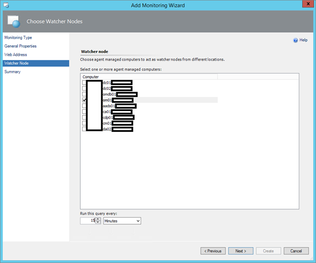

Click "Configure Advanced Monitoring or Record a browser session" before you click Create.

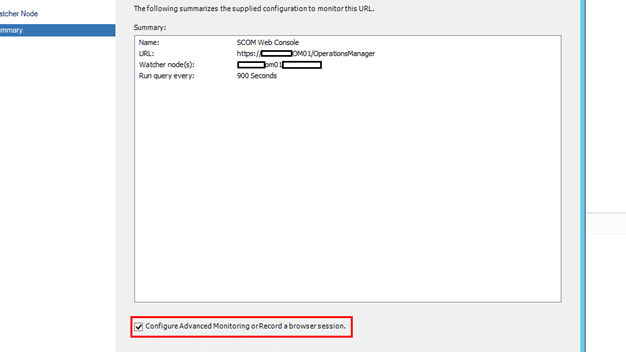

When you see this page, you can tune the monitor to alert on specific HTTP responses, when it exceeds a given response time etc. In this case, I´m going to stick with the defaults and just check that the web console lets me in.

To the right, click "Configure settings" as seen below.

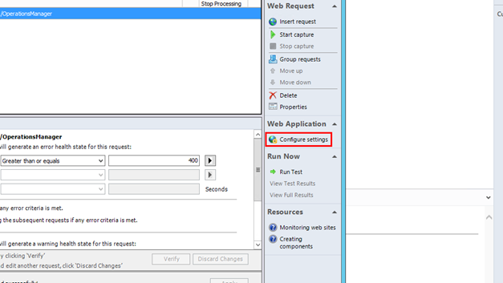

Under "Select Authentication Settings, choose NTLM and then choose the Run As Account you created during the preparations. This is the last step of the monitoring creation so end by clicking OK and then Apply your settings in the Monitor window.

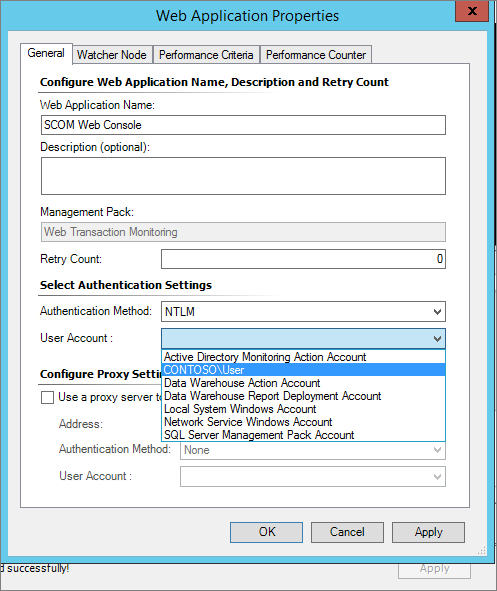

To check the status of your monitor, navigate to the monitoring pane and then expand "Web Application Transaction Monitoring" and check the Web Applications State view. It may take some time for this monitor to turn green, think about the time frame you set up for the monitor.

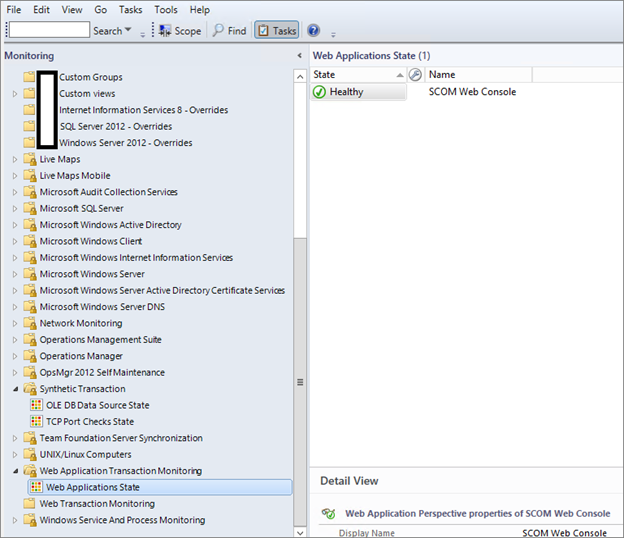

**Using it in Live Maps business services**

The last step of this post is to add the monitor as an end user component to the SCOM business service (which I created prior to writing this post). Open up the Live Maps authoring console from one of your management servers and then choose your service to the left and double click it to edit.

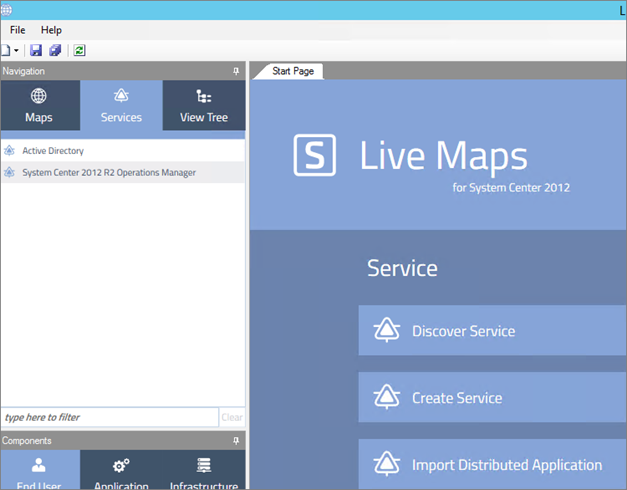

To the left, from the drop down choose "Web Application Transaction Monitoring Test".

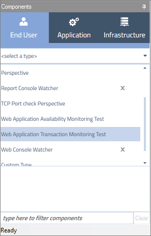

You will now see the monitor created earlier and you can drag and drop it to the business service in the right window. Save the service in the right pane and go back to the service map.

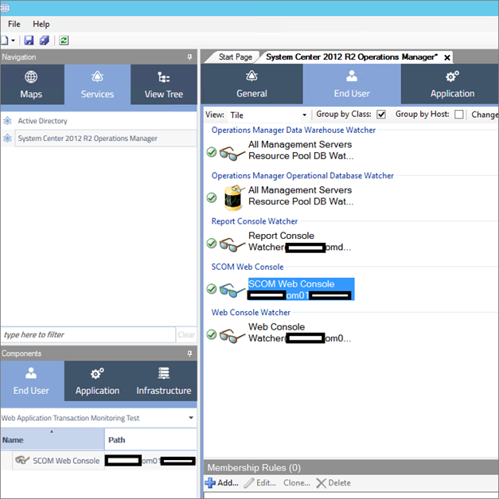

Click the "End User Components" section of the service and you will see all the components just as I do below with my SCOM business service. Notice that it´s turned green meaning my monitor worked out just as expected with the authentication working out as planned.

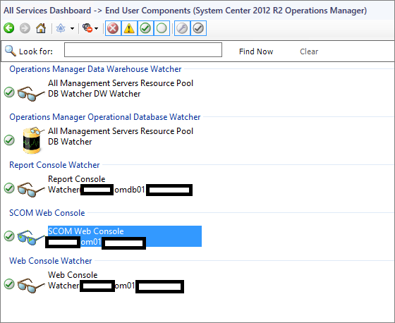

The last view of this post is the service map where you can see the end user components section is all green even after I added the web console monitor.

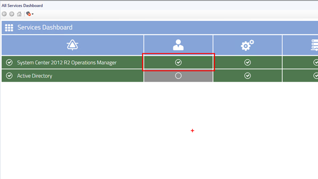

**Summary**

What I have shown here is a really good (and did I say it was easy?) way of monitoring a web page and then displaying the status of it using Savision´s Live Maps. This is a good example which you can use to monitor practically any web page you want, a SharePoint site for example. The authentication process makes it possible to log on to the site to really verify that its working and responding the way it´s supposed to. So now that you know how to monitor your portals using SCOM and Live Maps, will you "try this at home"?
