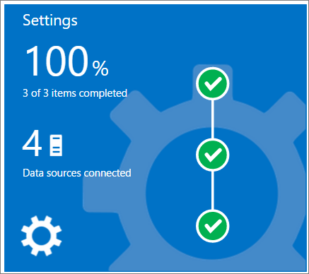
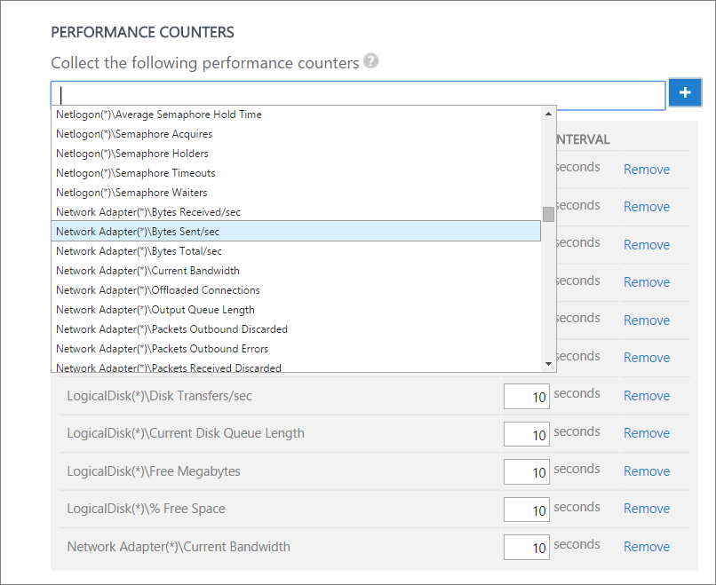
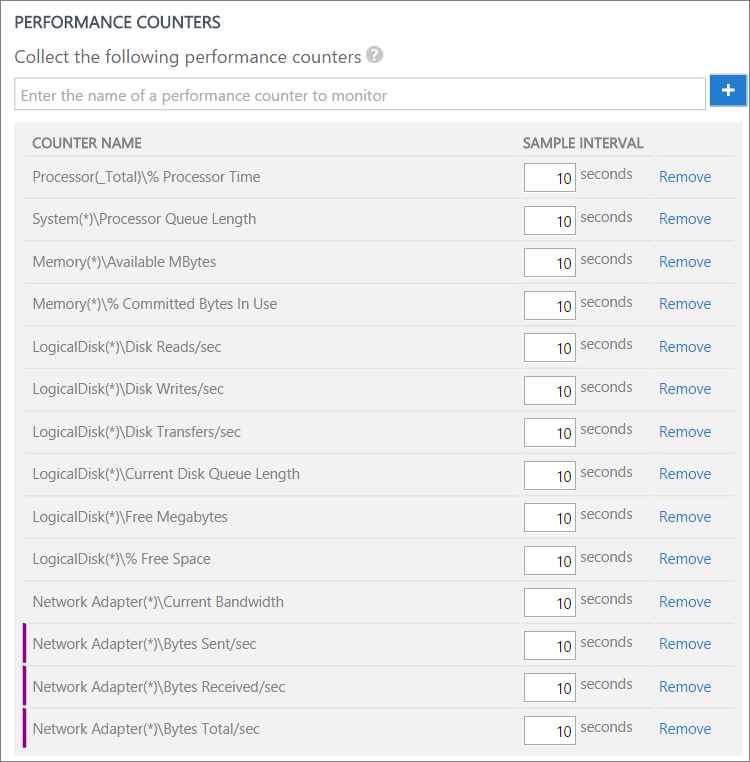
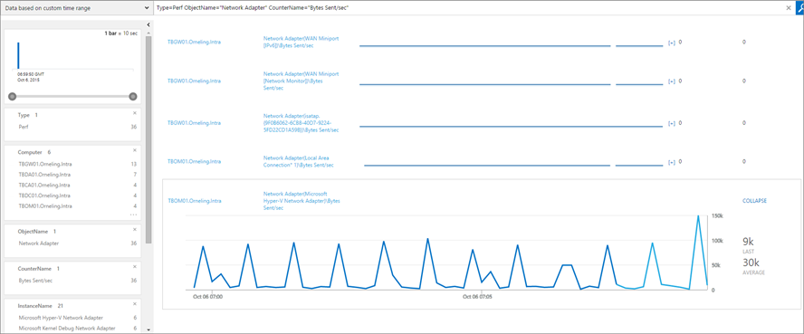
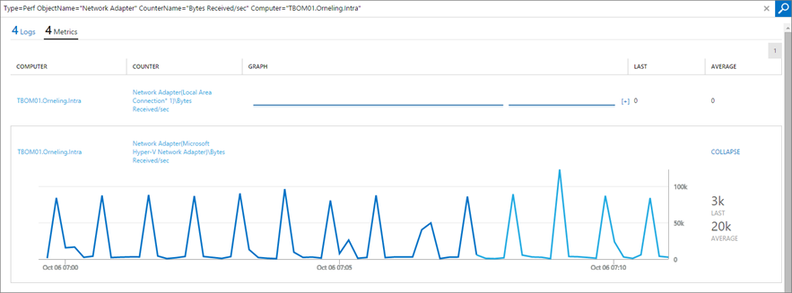
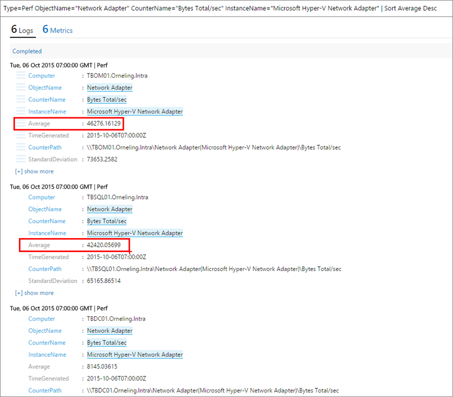
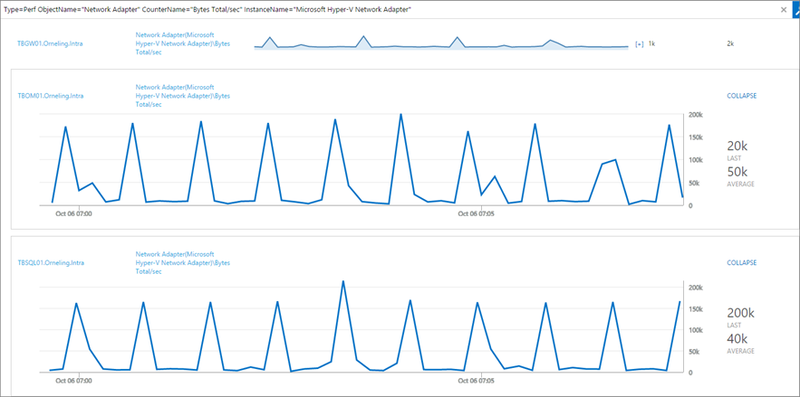
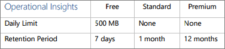

When it comes to monitoring servers, traditionally SCOM has played a big part in taking care of it. Nowadays, Operations Management Suite works as a complement and in some cases a (very) light monitoring solution with all its features. One of the things that became publically available a while back is the (near real time( Performance monitoring in OMS. What this feature does is that it gathers performance data from our connected servers with an interval of your choice, ranging from a 10 sec interval at its lowest. Below, I will go through how it works and what information you can receive from the servers. **Setting it up**

Once logged into the OMS workspace of your choice (perhaps you have only one workspace, and not like me that has about six or seven workspaces available) and click Settings to the right and click your way in to the "Logs" tab.

This is where you choose which performance counters you want to receive information about. There are some standard counters but in this case I´ll show how you can add more counters. If you know that you want to collect data about your network adapters, simply type Network Adapter and you will get those counters available and you can just click to add them to the list. If you want to list the counters available, just put a space in the beginning and you will be able to browse through the list to pick the counters of interest.

As you can see below, I´ve added three counters marked with a purple line. Choose which interval on which you want to collect data and finish by clicking Save at the bottom. So where´s the difficulty in that you may ask? I don´t know, I haven't found it yet! J

**Searching the data**

After a while, about 10 minutes for me, my servers had started reporting performance data for me. The servers you see below are connected to OMS through my On-prem Operations Manager setup. The picture seen below shows all the information gathered for the counter named "Bytes Sent/sec" so it´s not the best view to go deep as it shows all possible network adapters throughout my environment.

The query seen below: _Type=Perf ObjectName="Network Adapter" CounterName="Bytes Sent/sec"_

Now, let's dive a little bit deeper into a specific server. As you can see below, it´s pretty obvious which network adapter is being used but here I have also pointed out a specific server. To check for a specific server, simply add the _Computer="ServerFQDN"_ line to the query.

The query seen below: _Type=Perf ObjectName="Network Adapter" CounterName="Bytes Received/sec" Computer="TBOM01.Orneling.Intra"_

The next step is to dive into a specific set of network adapters to get more accurate data. This is done (in this case) by adding the _InstanceName="Microsoft Hyper-V Network Adapter"_ into the query as this will only show the active network adapters on my servers. As you can see below, I have sorted my servers based on the _"Bytes Total/sec"_ counter and added _Desc_ in the end of the query to make sure I see the highest number first. And as a you can see, my SCOM server leads the way with my SQL server not far behind. Just as expected to see those two top servers J.

The query seen below: _Type=Perf ObjectName="Network Adapter" CounterName="Bytes Total/sec" InstanceName="Microsoft Hyper-V Network Adapter" | Sort Average Desc_

To get a good grip of the servers and the network traffic, you can execute the same query as above but without the "_| Sort Desc"_ part. This will give you a nice view of what it looks like. Once you´ve found your view, you can add this to _"My Dashboard"_ which you can find at the main screen of the OMS workspace.

The query seen below: _Type=Perf ObjectName="Network Adapter" CounterName="Bytes Total/sec" InstanceName="Microsoft Hyper-V Network Adapter"_

As you can see below on my dashboard, I have added multiple search queries that I have picked out to show the data I want to find easily. By clicking the _"Network Adapter Bytes Total per sec"_ button, you will see the view seen above again where you can adjust the time frame by dragging the bar to the left.

In this case, I will collect data for a month before it gets overwritten. There are three tiers of OMS you can choose from which you can see below that states how much data you can transfer to OMS and the retention time of it.

**Summary**

What I´ve shown here is an easy way to get going with collecting performance data and to start browsing it. As you saw above, there´s a heck of a lot of performance counters you can choose from so OMS really makes life easy for you and it´s really easy to present those views to the dashboard as well. If you like what you see and would like to see more information on your server network activity, you should check out the Wire Data solution which I will go into in a later blog post.

If you have any questions, just leave a comment below.
