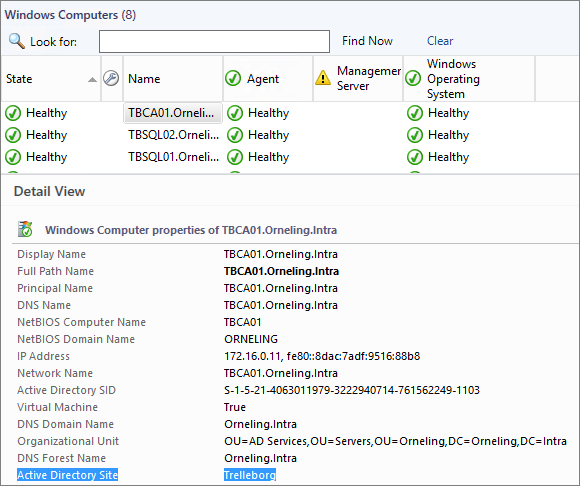
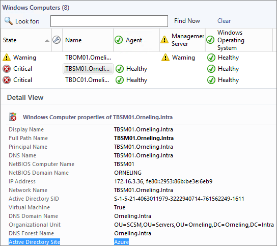
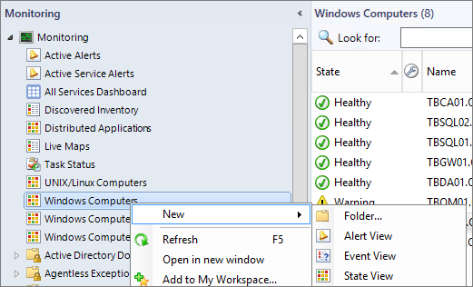
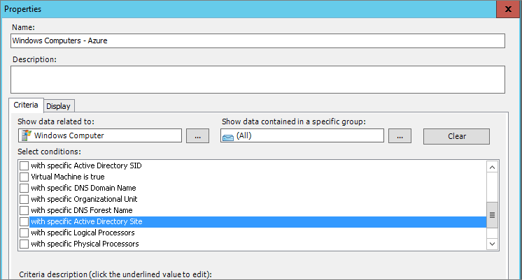
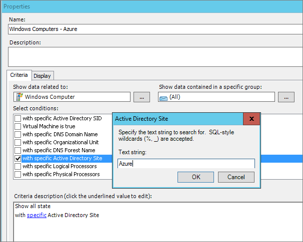
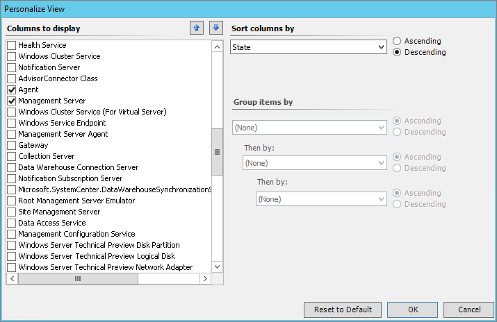
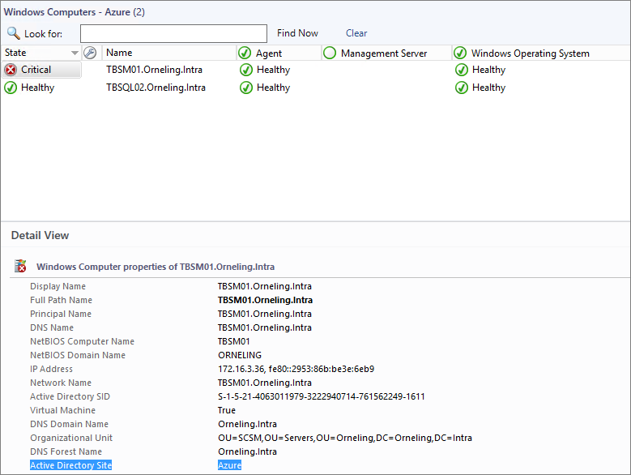
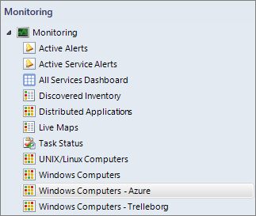

In times of the cloud and when everyone is more or less considering moving to the cloud, often there is a need to separate what is deployed in the cloud and what is deployed on-prem. Practically, it doesn't make any real difference if a server is deployed in the cloud or on-prem which is the beauty of it. On paper though, it might be nice to separate these assets from each other to get a good grip on what the environment looks like. In this post I´ll show how you can separate your cloud servers from you on-prem servers using something as simple as just an AD site. The only thing I´ve prepared for this post (besides from setting up a connection on-prem to Azure of course) is to create an AD site named "Azure" which associates the Azure subnets to this AD site.

**Setting up the view**

As you will see in the below picture, I´ve taken a look at the standard "Windows computers" view in Operations Manager which contains all my servers no matter where they are placed. Notice the "Active Directory Site" field below which is Trelleborg (home, sweet home) for the TBCA01 server.

The same picture here below but with a server at the "Azure" AD site instead.

To create a new view, right click Monitoring and then choose to create a new state view.

Name your view as I´ve done below for the Azure site. Then click the "…" button to the right of "Show data related to" as you can see below and choose "Windows Computer". This will change the scope of the view and will also give you some more opportunities to choose from. The one we´re interested in here is the "with specific Active Directory Site" so just place a check mark in that one.

Click "specific" which is seen in blue below and type in the site name. In this case I simply type Azure to use this site for this view. Click OK and you will see your servers. It may take some time before newly deployed agents show up in the new view since the discoveries have to be finished before populating information on AD site and such. Once these discoveries have run, you will be good to go.

In order to set up the view so that it looks exactly like the standard one, right click the pane just above the servers (Agent, etc.) and click "Personalize". Then make sure to add the following fields.

- Agent
- Management Server
- Windows Operating System

As you can see now you have the exact same view as the standard but it will only show those agents that is placed in Azure as IaaS VM´s in the 172.16.3.0 subnet as I´ve done in my environment. Note the value filled into "Active Directory Site" in the below picture.

To create the below picture I just created one more view in the exact same view with the only difference of the AD site name. In this case I typed "Trelleborg" instead and I now have a great view for my on-prem servers and my Azure servers. Pretty nice, huh?

**Wrap up**

As you may already have figured out, this method is in no way limited to Azure servers or so. The AD sites I used above could be whatever as Sydney or Chicago, it depends on which AD sites you may have set up in your organization. It´s a really easy way to separate servers based on site and will most likely help out in keeping track of the environment.

As always, if you have any questions just drop a comment below.
