Every time a new employee starts its employment in a company, a new user should be created, a new mailbox should be created etc. Does this seem familiar? Have you been there? Is this one of the recurring tasks you wish someone else could do instead of you? Would you like it to be automated where you just put in some values and then someone else takes care of it?

If you have answered yes to one or more of the above questions, then you should definitely keep on reading, because this is exactly what I will help you out with in this post. **What do we need?**

If you´ve been around my blog for a while, you might have noticed a thing called Operations Management Suite (OMS). OMS is not only log analytics which is the part I´ve written about mainly for a while. There are several other things you can use it for, such as backup and automation. Right now, you can probably guess which part it is that I will be referring to in this post…Yup, the correct answer is automation. Automation have been on many peoples lips the last years so this might feel familiar to a lot of you out there. But nowadays, this is (quite) easy to set up and to get going. The first thing we need is to have an OMS workspace linked to our Azure subscription which is covered [here in the first section](http://blog.orneling.se/2015/06/onboarding-operations-management-suite-part-1/) and then [in this post](http://blog.orneling.se/2015/06/onboarding-operations-management-suite-part-2/). Once this is done and the workspace is created, log in to it and add the Automation solution.

**Putting it all together**

To be able to do all of this, we need a server with the OMS agent installed and connected to OMS from where we can run these workflows (runbooks). Once the server has been installed and connected, open up a Powershell window as I´ve done below (2 pictures down) in the server and do as I have done below. The information you need can be found inside your Azure automation account and you need to fetch the URL and the Primary Access Key. Copy these strings. 

Take the strings you just copied and paste them into Powershell just as I´ve done below. The commands can be found below.

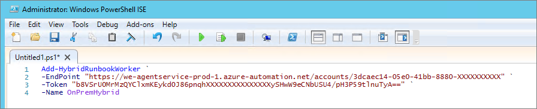 The PowerShell command to run: `` C:\Program Files\Microsoft Monitoring Agent\Agent\AzureAutomation\7.2.7037.0\HybridRegistration Add-HybridRunbookWorker ` `` ``-EndPoint "YOUR URL" ` `` ``-Token "YOUR PRIMARY ACCESS KEY" ` `` `-Name OnPremHybrid ` Run the above command and your server will be registered with Azure Automation as a Hybrid Worker. This means that you can use this server to perform the tasks you want to do from Azure. Once the command has completed, go back to the Azure portal and check the "Hybrid Worker Groups" pane. 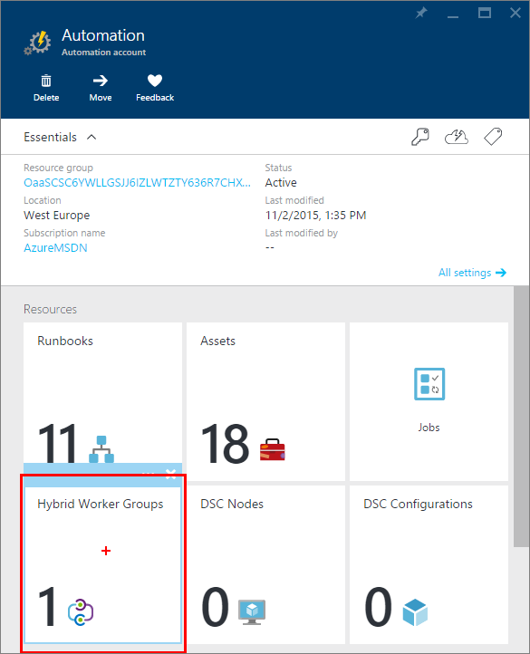

Voilá! Your server is now a Hybrid Worker.

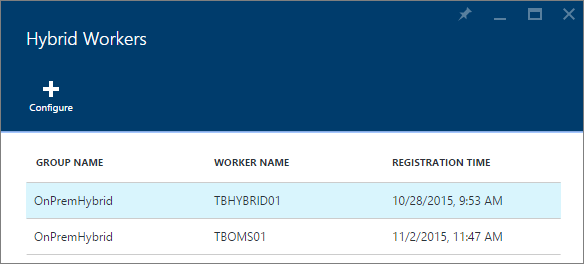

**Important, read this!**

Now before you do anything, save yourself the head aches and angry faces I´ve made during this process. If you´re running Windows Server 2016 TP3 on your DC just like me, you need to delegate control over the OU to the computer object of your hybrid worker. In this case TBOMS01. If you don´t, you will run into access denied while the runbook is executing the New-ADUser command. This is because the OMS agent runs under Local System and cannot be changed. One of my colleagues and friends, [Andreas Molin](http://guidestomicrosoft.com) who has helped me out during my troubleshooting ran the same script in his environment without problems. The only difference is that he is running Windows Server 2012 R2 in the bottom.

To do something with all of this, we need to create a runbook. In the "preview" portal of Azure ([portal.azure.com](https://portal.azure.com)) go to Automation Accounts.

Click your automation account that you want to use.

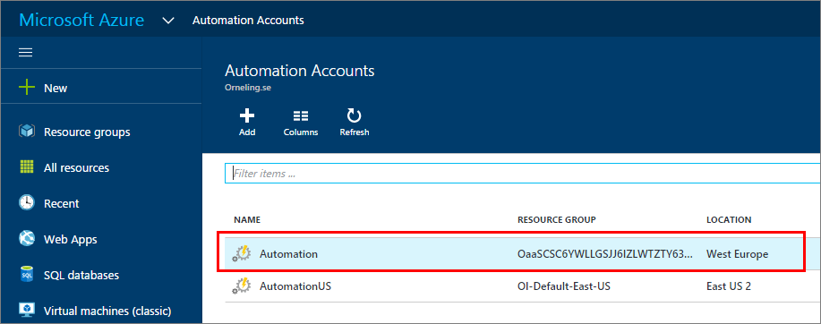

Before we can get going with this, we need to create an asset. Assets can be things as credentials and certificates etc. that is used to authenticate to remote resources.

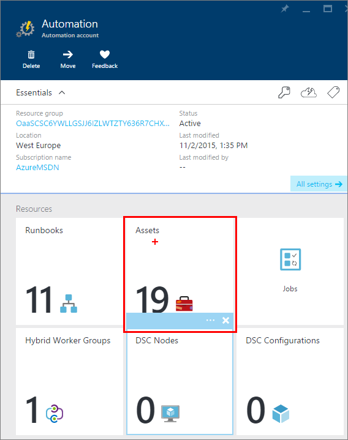

The next thing is to create a runbook, click Runbooks.

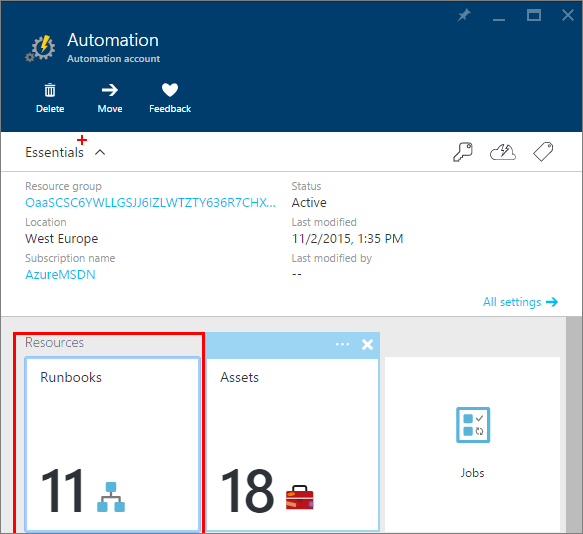

Click "Add a Runbook" and then choose to either create a new Runbook or to import an existing Runbook. If you would like to use my Runbook, you can just import it as I have done in the picture below. The Runbook can be downloaded [here](https://onedrive.live.com/redir?resid=6D1ADA54BC0F77B9!32929&authkey=!APAMYJEOjKhYyi8&ithint=file%2cps1) from my OneDrive or from GitHub [here](https://github.com/DanielOrneling/OMS-Automation---Create-AD-User/). You are also able to get it from the Runbook Gallery inside Azure, just click Browse gallery below if you´d like and search for "Create AD User" and you´ll find it.

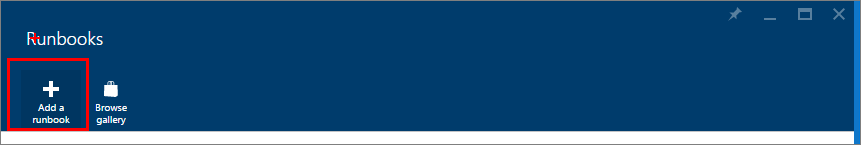

The name shows up in red below because the runbook is already present in my automation account, but just carry on and import the Runbook.

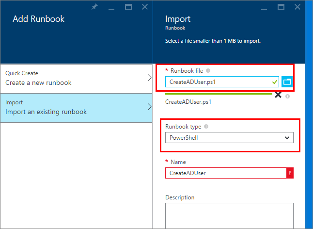

Below are the properties of the Runbook created. Click Edit to find out what is being done.

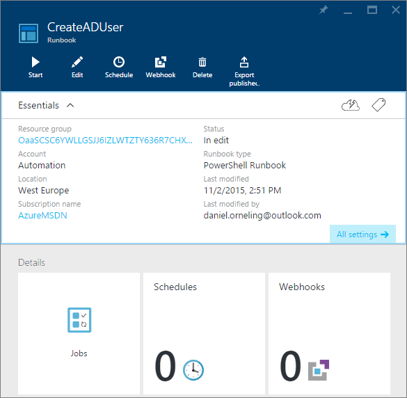

Below is the script which will be executed. As you can see, this is a completely normal PowerShell script to create a user. The first thing that happens is that the script will ask you for the parameters like first name, last name and password etc. These parameters will then be used when executing the script to set he values needed.

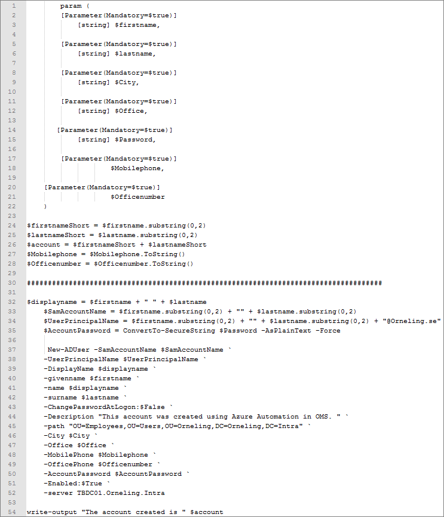

When finished with reviewing the script, click Publish and we´ll get to the cool part to see that it actually works.

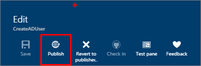

The below picture is just to show that the user doesn´t exist.

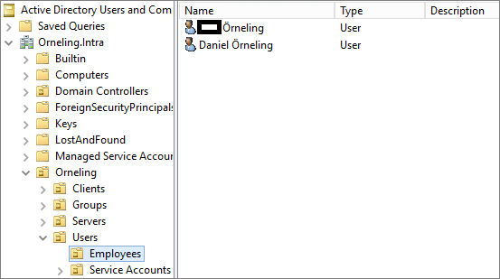

Click Start and move on.

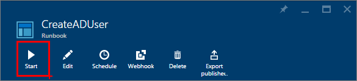

Fill in the fields just as I´ve done below, choose to Run on "Hybrid Worker" and then which group to run against. Click OK, sit back and relax.

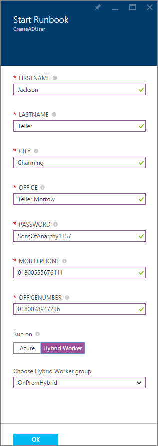

To see what´s happening, click Output and you will soon see that the account is created.

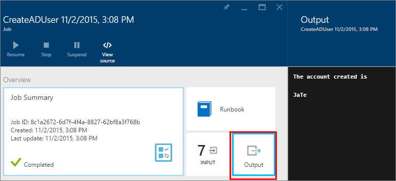

Let´s head over to the AD again to check. Yup, he´s there. Jax Teller is now one of my employees J (yes, I´m a big fan of Sons of Anarchy).

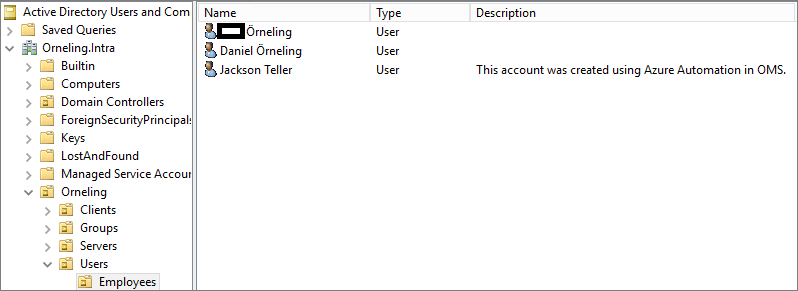

Just to verify that all fields are there, here he is.

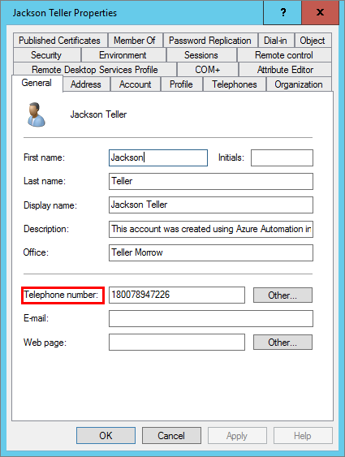

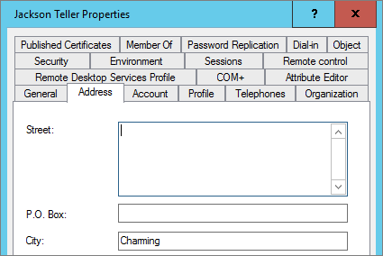

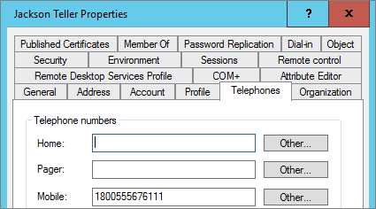

And lastly, the user is ready to log on to my servers (where I´ve allowed him to.

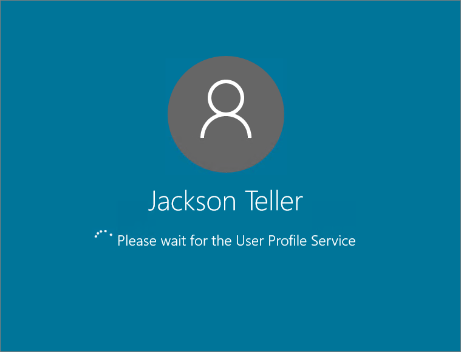

**Summary**

So to summarize all of this, this can really make life a lot easier when dealing with new user accounts. The main benefit of using a solution like this is that there are no room for human errors. The one thing that can go wrong here is if the user/admin puts in the wrong value when launching the script. So now that you´ve seen how you can create AD Users with Azure Automation and OMS, what will be your next move?

Another thing that needs to be mentioned as well is that this so far just works on native OMS agents and not those that is connected to OMS through Operations Manager. This is because the Hybrid Worker role isn´t supported (_yet_) when using SCOM and OMS together. In this case I installed a new server with the AD management tools installed and then I ran it through that server.

If you have any questions about what I´ve done here, leave a comment below. In a later post, I will also look into how you can deliver these Runbooks to your personnel for them to be able to create users without going through the IT helpdesk first.
