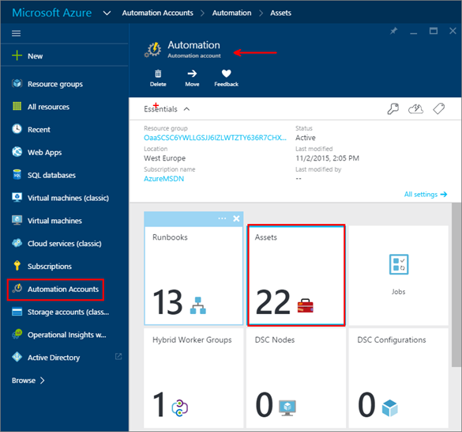
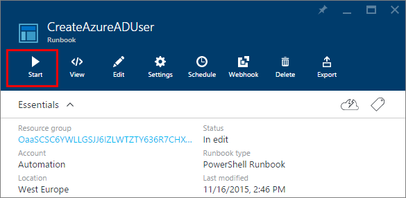
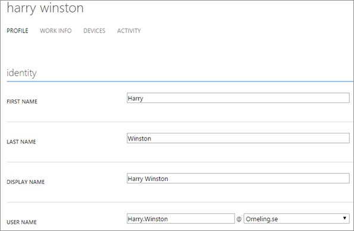
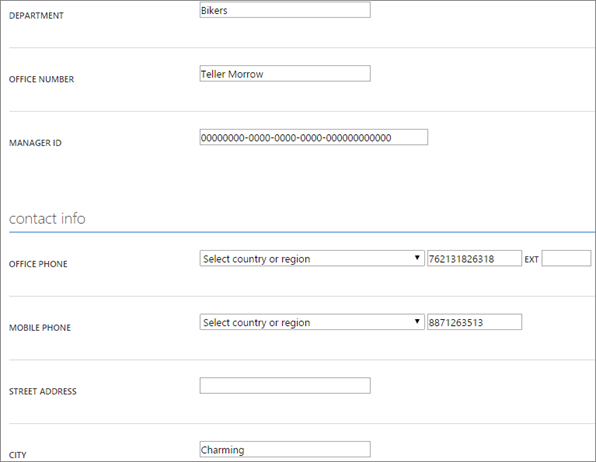
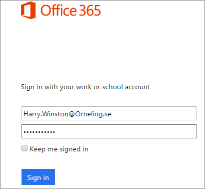

A few weeks back I wrote [this post](http://blog.orneling.se/2015/11/automatically-create-ad-users-with-azure-automation-and-oms/) about how you can use OMS and Azure Automation to create new users in your on-prem AD. That solution uses the Hybrid Worker Role of Azure Automation and works perfect as long as you want the user on-prem. But what about those of you that doesn't have an on-prem AD anymore, or never had one? There´s no need to cry over that repetitive task anymore, cause I´ve got the solution for you. Do you want a way to automatically create new users in your Azure AD where all you have to do is to type in the name, city, office etc.? Then keep on reading, cause this is what you´re looking for. **Setting it up**

This time I have created a new runbook which is a PowerShell script for you to either paste into a new runbook (covered in this post) or import it from the Azure gallery of runbooks. Before we move on, there is one tiny prerequisite for all of this to work. Since this runbook will connect to your Azure AD, you need to import the Msonline PowerShell modules into Azure Automation. Check [this post](http://blog.orneling.se/2015/11/import-new-modules-into-azure-automation/) for a guide to how it´s done.

Now that you have imported these modules, let´s get to it. Step into the ["New" portal of Azure](https://portal.azure.com), navigate to Automation Accounts and then choose your automation account. Click Assets as seen below.

Step into the "credentials" vault and choose to add a new credential.

Type in the credentials of a user with administrative rights to your Azure AD. The user seen below is a global admin and is therefore able to create the users I want it to. Save and click your way into "Runbooks" instead. Now, remember the name you gave this credential as this will be used further down in the post.

Now it´s time to create the runbook (or import it from the Azure gallery instead if you feel like it. Search for Create Azure AD User and you will find it).

Click "Add a runbook" as below, give it a name and choose "PowerShell" as the runbook type. You can find the code for the runbook either from my [GitHub](https://github.com/DanielOrneling/Azure-Automation---Create-Azure-AD-user) repository or my [OneDrive](http://1drv.ms/1WVEmwK). Create the runbook and then paste the code into the text box.

Now you will have to change two things. The first thing you need to do is to change "@Yourdomain.xx" to your own domain instead of Orneling.se as I´m using. The second thing you need to change is the name of the credential you´re using. In my case it´s "AzureAdmin" which will be used.

Once you have made the changes necessary, save and publish the runbook so that we can try it out.

Close the runbook editor and click start.

Type in the name and office and so on for the user, leave the "Run on" option to run on Azure and click OK.

Now you can sit back, relax and enyoy while your repetitive task of creating a new user is automated for you. Click Output to see the information on the new user and also check for the green checkmark to say "Completed" to the left in the below picture.

Now you can head back to the Azure AD in the ["old" Azure portal](https://manage.windowsazure.com/) and check your users. You will now see that the new user have been created. Now, both "Jax" and "Opie" exist in my organization (Yup, I´m still using Sons of Anarchy as an example). Click on the user you just created to see the information about him or her.

As you can see all of the fields I used in the runbook is there and not much is left for me to do with the user.

So, can I log on with the new user? Yup!

Now, the first thing I needed to do when I logged on as the new user was to make sure my account is safe so that I don´t lose access to it. As you can see below, the phone number will be quite difficult for me to verify since I just randomly typed in a number but as long as you put in real numbers, this will be a piece of cake for the user.

Now you have a new user in your Azure AD and you haven't had to put any effort in it at all. Pretty neat, huh?

**Summary**

Now I have shown how you can create Azure AD users with Azure Automation but also directly into your on-prem AD. Of course it takes me some time to write these runbooks with some (both fun and annoying) errors but as you can see, there´s not a lot that you need to do to make sure this will work in your organization as well. If you want to find out more about the password policy used for Azure AD accounts, check [this Technet article](https://msdn.microsoft.com/en-us/library/azure/jj943764.aspx?f=255&MSPPError=-2147217396) out which will show you all you need to know about it.

If you have any questions about this post and solution, leave a comment below so that I can get back to you.
