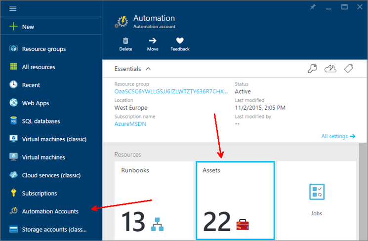
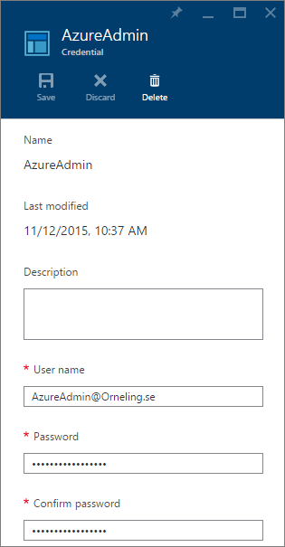
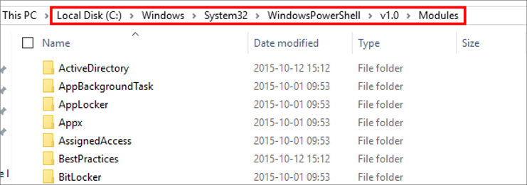
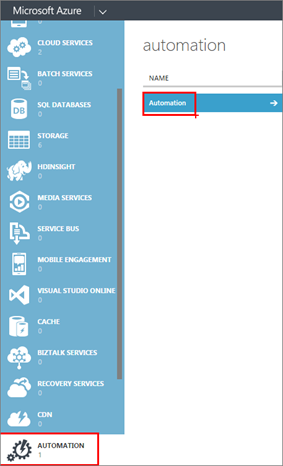
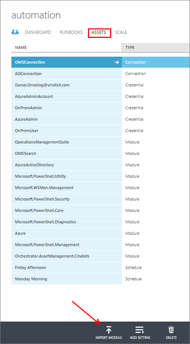
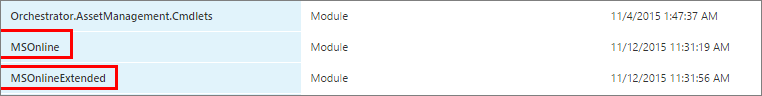
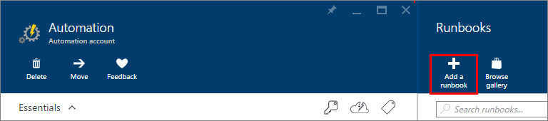
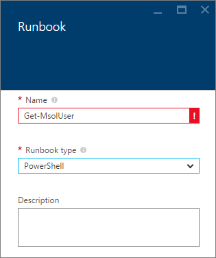
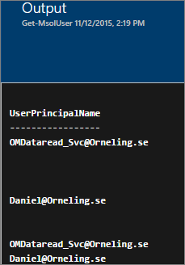

When you start working with Azure Automation, you will most likely run into the fact that not all of the PowerShell modules you are used to is available in there from the beginning. A while back I wrote a post on how you can create an AD user in your on-prem AD using Hybrid Workers which you can find [here](http://blog.orneling.se/2015/11/automatically-create-ad-users-with-azure-automation-and-oms/). Since we´re moving more and more towards different cloud services, such as Operations Management Suite, Office 365 and so on, we have the need for our identities to also exist in the cloud. In this case as a follow-up on my previous post, I want to show you how you can create an Azure AD user as well using Azure Automation. For this to work, a couple of things needs to be configured first. In this post I will show how to get ready to automate this kind of tasks. **Creating the credential as an automation asset**

The first thing you need to do is to make sure you have an account in your Azure AD with administrative rights that you can use to connect to Azure. To do this, go into the Azure portal (I´m using the new "preview portal" for this) and go on to Automation, choose your automation account and then click "Assets".

Now, click Credentials and then "Add a new credential" and type in the information needed as I´ve done below.

Now you have what it takes to authenticate against your Azure AD.

**Import new modules into Azure Automation**

The next step is to import the Azure AD PowerShell module as an Azure Automation asset. First, install the preview module which you can find [here](https://connect.microsoft.com/site1164/Downloads/DownloadDetails.aspx?DownloadID=59185). Once the module is installed, go into the folder where it was installed. In my case, it was "C:\\Windows\\System32\\WindowsPowerShell\\v1.0\\Modules".

Scroll down and find the modules "MSOnline" and "MSOnlineExtended", right click each of them (one at a time), click "Send to" and then "Compressed folder". This will most likely ask you to save it to your desktop as it can´t save to that folder by default.

Now you should have two Zip files on your desktop, open up the "old" [Azure Portal](https://manage.windowsazure.com) and go over to Automation and choose the same automation account that you used earlier. I had problems running the scripts once I had imported the modules through the new preview portal so that's why I´m using the old portal instead.

Head into the "Assets" tab and then click "Import Module". Upload the two zip files and wait for it to finish.

When the modules are extracted you should see them as below.

**Testing the modules**

Head back to the new portal, step into your Automation account and click "Runbooks" followed by "Add a runbook".

Name your runbook, choose PowerShell as runbook type. This one is red just because I´ve already created the runbook.

Paste the below PowerShell code into the field and then click Save followed by Publish. This code will call for the credential asset you created earlier and check for all your Azure AD users.

$login = Get-AutomationPSCredential -Name 'AzureAdmin'

Connect-MsolService -Credential $login

Get-MsolUser | Select UserPrincipalName

Save and Run this runbook and you´ll get all your users from your Azure AD in the form of "Firstname.Lastname@Yourdomain.com".

**Summary**

Now, what I´ve shown here isn´t the fanciest you´ve ever seen (or is it?) but still, it helps you getting started with Azure Automation and Azure AD. As I mentioned, this is what I had to do to be able to finish my next post on how to use Azure Automation to create Azure AD users. Now you can probably guess what my next post will be about? J If you have any questions on this post, leave a comment and I´ll get back as soon as possible.
