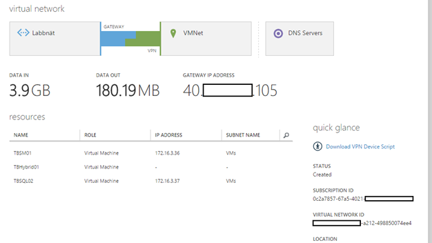

As most people working in IT and who has done so for a while knows, there is a "new" thing called the cloud which have taken more place than earlier. When talking about "the cloud", some questions show up almost every time like what is the difference between a public and a private cloud? Why should I use the cloud?

Another question that shows up more frequent is whether my on-prem investments in System Center are useless now that I have the cloud right "over my head"? What about my recent investments in new hardware which is being managed by System Center or simply in System Center itself? Yes, the cloud will deliver new servers within minutes but that doesn't mean you investments are in vain. The unlimited resources of the cloud come real handy in different scenarios; one scenario can be when you are about to get new hardware and in this case you may just as well put your servers in the cloud while another scenario brings you to a hybrid solution where you extend your datacenter up into the cloud. This way, you can take advantage of the scalability of the cloud and only use those servers you put up there when needed.

Download your free copy of the whitepaper [here](https://www.savision.com/free-whitepaper-make-most-cloud-microsoft-system-center-azure?utm_source=email&utm_medium=email&utm_content=Email%3A+9-12-15&utm_campaign=TLC+Whitepaper+-+Daniel+Orneling+2015). The cloud don´t only deliver new VM´s on your demand, Microsoft Azure which I´ve looked at delivers a lot more than just VM´s, it will deliver backup, web sites and much more. One thing in particular which I´ve gone through is the Microsoft Operations Management Suite which will help you keep track of your environment and follow up on things like servers needing security patches, Active Directory health and much more. In my opinion, the cloud (Azure) will only bring me good things with this new way of working and allowing me to really get the most out of my environment. It doesn't matter if my applications are deployed on-prem or in the cloud anymore, I can still manage them from one console and I can still use Savision´s Live Maps Unity to monitor and get SLA levels from all my business services. All in one console!

**A sneak peek of the whitepaper**

_One of the most important things in all of this, connecting the ground to the cloud is of course how it´s done. When talking about Azure and the IaaS solutions, there is two ways to connect. The first way is the site-site VPN which provides you with a tunnel on-prem to the cloud and connects your on-prem networks with those networks that have been created in Azure by you. This will give you direct access to your cloud servers and storage accounts for example. Find out how it can be done in my previous blog post found [here](http://blog.orneling.se/2015/09/connect-your-on-prem-servers-to-azure) and read more about the VPN solutions [here](https://azure.microsoft.com/en-us/services/vpn-gateway/)[.](http://blog.orneling.se/2015/09/connect-your-on-prem-servers-to-azure/)_

_A quick view of what it may look like using the site to site VPN._

_What´s next is a heavily updated version of Live Maps 7.5 that will change a lot of what we know about Live Maps today. With this new version we will be have Live Maps and Cloud Reporter inside a single web console._

You think this sounds interesting and want to know more? Then you should definitely pick up your free whitepaper that i´ve written for [Savision](http://www.savision.com) which was released on December 9. Stay tuned to find out what you need to know about the cloud and how you can use it to leverage from the cloud.

Download your free copy of the whitepaper [here](https://www.savision.com/free-whitepaper-make-most-cloud-microsoft-system-center-azure?utm_source=email&utm_medium=email&utm_content=Email%3A+9-12-15&utm_campaign=TLC+Whitepaper+-+Daniel+Orneling+2015).
