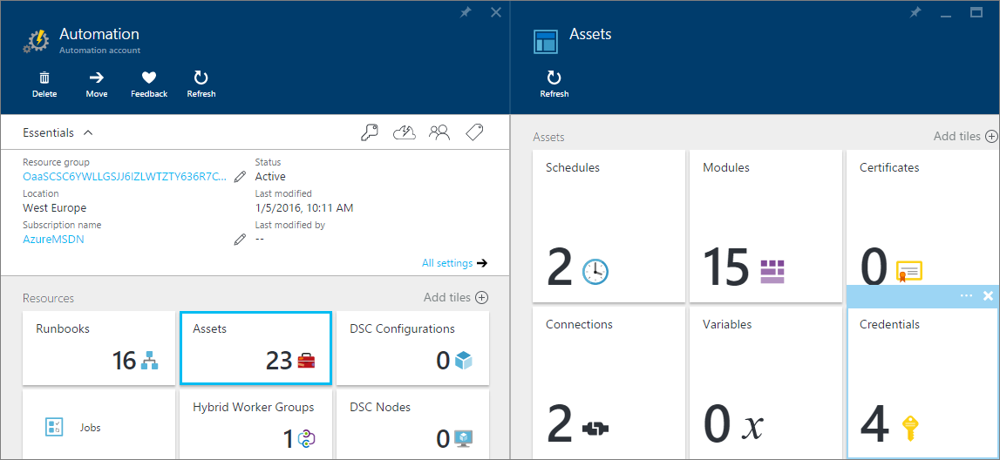
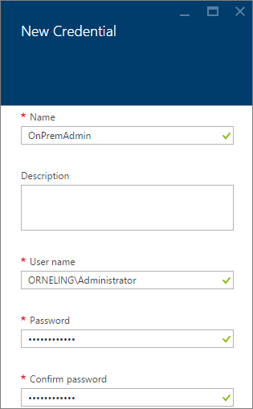
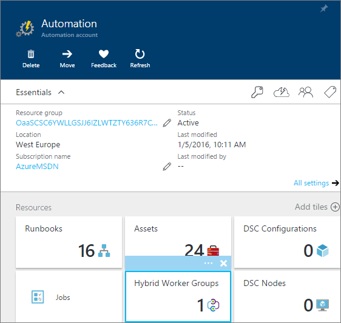
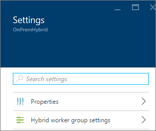
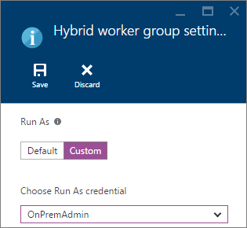
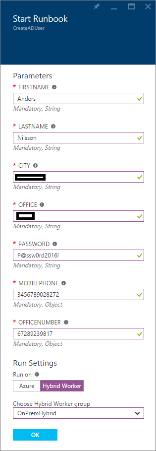
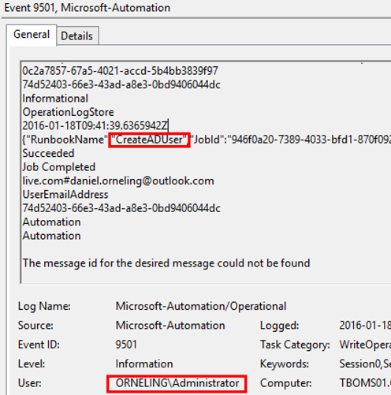

In my earlier posts about what you can do with Azure Automation and OMS I have been using the Hybrid Worker Role for some, and for others I have run them directly in Azure. Now, what´s new since I wrote these posts is that you no longer need to delegate rights in your AD to the computer account running the agent connected to OMS. This has been changed as the team behind the Hybrid Worker Role have added the ability to run your scripts with a given run as account. In this post you will see how you can use Run as accounts with hybrid worker groups in Azure Automation.

If you want to read the historic posts, you´ll find them below:

- [Import new modules into Azure Automation (Part 1)](http://blog.orneling.se/2015/11/import-new-modules-into-azure-automation/)
- [Automatically create AD users with Azure Automation and OMS (Part 2)](http://blog.orneling.se/2015/11/automatically-create-ad-users-with-azure-automation-and-oms/)
- [Create Azure AD users with Azure Automation (Part 3)](http://blog.orneling.se/2015/11/create-azure-ad-users-with-azure-automation/)
- [Create service accounts using Azure Automation and OMS (Part 4)](http://blog.orneling.se/2015/12/create-service-accounts-using-azure-automation-and-oms/)
- [Delegate automation rights in Azure Automation (Part 5)](http://blog.orneling.se/2015/11/delegate-automation-rights-azure-automation/)
- [Reset AD user password using Azure Automation and OMS (Part 6)](http://blog.orneling.se/2016/01/reset-ad-user-password-using-azure-automation-and-oms/)

Once you´ve read the posts and when you have registered a Hybrid Worker group, it´s time to point out the credentials to use for executing the runbooks.

**How to set it up**

Start by logging in to the Azure portal and navigate to your automation account, followed by a click on "Assets". Then click "Credentials" as you can see below (click on the image to enlarge it).

Choose to add a new credential, type the user name and password of an administrator in your environment and click Save. Now, I´m using Administrator for demo purposes but I strongly recommend you to use another account for these actions instead.

Okay, so the credential has been created and we´re ready to configure the Hybrid Worker group we created earlier. Step out of the credentials vault and move over to "Hybrid Worker Groups" instead as seen below.

Choose your worker group, in this case it´s "OnPremHybrid" I want to configure. Then click "Hybrid worker group settings".

Click "Custom" and choose the credential you just created and Save. After this step, all runbooks executed against this worker group will be executed using this account. So instead of delegating rights in your AD to the computer account, instead you should make sure the user account has the access needed.

**Trying it out**

Now that we´ve finished the configuration, it´s time to test if it works the way it´s supposed to. I will fire up my runbook to create an on-prem AD user to verify the functionality.

About half a minute after taking the above picture I had received the below output. My user had been created

Just to make sure that the runbook had been executed with the right account I stepped over to the agent which functions as the hybrid worker. Looking inside the Automation log I could see that the runbook had been run and indeed, using the right account J

Now you won´t have to delegate rights to the computer accounts anymore, you can delegate it directly to a user instead.

**Summary**

Now this wasn´t one of my larger posts but it still shows the pace at which Azure Automation and OMS are evolving. With this new feature you can run the runbooks using an account of your choice instead of a computer account.

If you have any other questions, leave a note in the comment field and I´ll get back as soon as possible.
