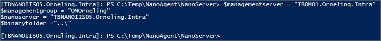
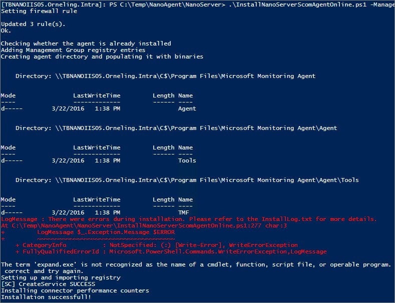
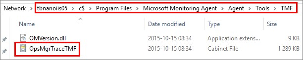
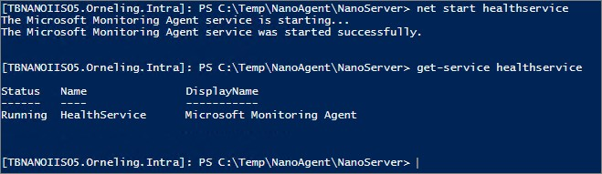
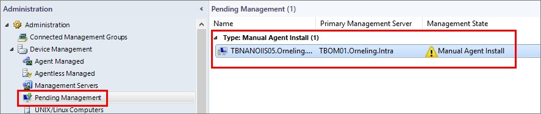
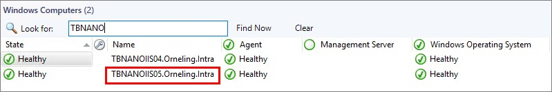
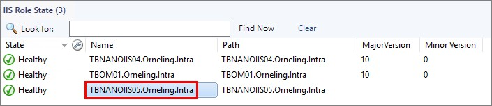
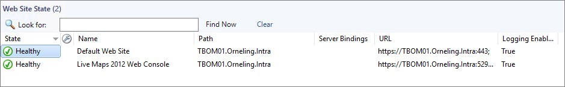

**This post is covering Windows Server 2016 and SCOM 2016 TP4. A new post covering Windows Server 2016 and SCOM 2016 TP5 can be found [here](http://blog.orneling.se/2016/05/set-monitor-nano-server/).**

So its time for some blogging again. With all that we have in front of us with a new generation of System Center but also Windows Server 2016, there´s plenty of fun stuff to write about. In my last post I showed how to get started with the Nano server which is a part of Windows Server 2016. If you havent already, find it below.

- [Getting started with Nano server (Part 1)](http://blog.orneling.se/2016/03/getting-started-with-nano-server-3/)

The topic for this post is to show you how to monitor your Nano server that you created in the previous blog post using System Center 2016 Operations Manager TP4. For this post I have created a brand new Nano server according to the steps of the previous post meaning I will set up a new IIS server once again. I did run into some trouble while preparing this post so thanks to the Nano server product team for helping me out with some issues. **Monitoring the Nano server** The main issue I ran into was an authentication issue, and following the guides provided by Microsoft I just couldn´t get the agent installed. Some hours later I finally got it running. The solution which wasn´t a part of the official guide is called CredSSP, which lets an application delegate the user's credentials from the client to the target server for remote authentication. Read more about CredSSP [here](https://msdn.microsoft.com/en-us/library/windows/desktop/bb931352(v=vs.85).aspx). After I had found this, I was able to run the installation and all went smoothly from there. Below, you will find the steps needed to install the agent and the steps needed leading up to the installation moment.

**Enable CredSSP to be able to delegate credentials.** Let´s start by configuring the Nano server for CredSSP. In this case it´s TBNANOIIS05 I´ll be using, so just change this to your Nano server name instead.

\# Set up the remote session to your Nano server.
$computer = "TBNANOIIS05.Orneling.Intra"
$credentials = Get-Credential (Credential "ORNELING\\Administrator")
$session = New-PSSession -ComputerName $computer -Credential 

Enter-PSSession -Session $session

# On the remote (Nano) server, run the following command:
Enable-WSManCredSSP -Role server -Force
Exit-PSSession 

# On your local server which in this case is the SCOM Management Server, run the below command.
Enable-WSManCredSSP -Role Client -DelegateComputer \*.Orneling.Intra -Force 

**Copy the installation content and install the agent.** The NanoAgent folder used below can be found in the SCOM media so make a copy to a place of your choice.

\# Make a local copy of the SCOM Agent installation files on the Nano server
Copy-Item "E:\\Media\\SCOM\\NanoAgent\\" \\\\TBNANOIIS05\\C$\\Temp -Recurse

# Set up a new remote session to your Nano server, now using CredSSP.
$computer = "TBNANOIIS05.Orneling.Intra"
$credentials = Get-Credential (Credential "ORNELING\\Administrator")
$session = New-PSSession -ComputerName $computer -Credential $credentials -Authentication Credssp

Enter-PSSession -Session $session

Add your SCOM management server as a trusted host. Just change TBOM01 below to your management server name instead and execute the commands in the same session that you entered above.

\# If you haven´t done so already, execute the below command to add the SCOM server as a trusted host. \* will work as a wildcard for all servers as well.
Set-Item WSMan:\\localhost\\Client\\TrustedHosts "TBOM01" -Force

Swith path to the folder where you copied the installation media.

Set-Location C:\\Temp\\NanoAgent\\NanoServer

Set the parameters to use when installing the agent. You will need the management server name, the management group name and the Nano server name.

$managementserver = "TBOM01.Orneling.Intra"
$managementgroup = "OMOrneling"
$nanoserver = "TBNANOIIS05.Orneling.Intra"
$binaryfolder ="..\\"

After you specified the parameters, execute the below command to install the agent.

.\\InstallNanoServerScomAgentOnline.ps1 -ManagementServerFQDN $managementserver -ManagementGroupName $managementgroup -NanoServerFQDN $nanoserver -BinaryFolder $binaryfolder

 As seen above, we ran into an error with Expand.exe not being recognized. When looking into the installation script I found the below line:

expand.exe $InstallLocation\\Tools\\TMF\\OpsMgrTraceTMF.cab $InstallLocation\\Tools\\TMF\\OpsMgrTraceTMF.tmf
$script:foldersCreated = 1

Obviously this line has to do with the OpsMgrTrace tool so let´s check that the folder has been created. 

Yup, it´s there so let´s see if we can fire up the agent. Let´s try to start the agent as seen below.

Starting the agent were no problems so let´s move over to the SCOM console.

**Checking out the monitoring within SCOM** Going into Administration and then Pending management, you will find the agent there. Mark your Nano agent and click Approve to the right. This is the default behavior which you can easily change to automatically let in new manually installed agents in your management group.

Looking at the “Windows Computers” state view under Monitoring reveals the below information. It may take a few minutes before the agent turns to green so be patient.

**IIS Monitoring** So what can we see in SCOM regarding the fact that this is also an IIS server? Today we can only see that it is in fact an IIS 10 web server, but that’s about it right now.

According to Microsoft, Nano server monitoring support for IIS will be coming soon and it´s first after that when we can dig deep into our web sites and application pools etc. Read more about what you can do with the Technical Preview MP´s [here](https://blogs.technet.microsoft.com/momteam/2016/01/22/technical-preview-management-packs-for-windows-server-2016-server-roles-have-been-updated/).

As you can see below our web sites aren´t being discovered so we´ll have to wait for another version of the MP to make it happen.

**Summary** What you´ve seen in this post is how you can easily enable SCOM monitoring for your Nano server just as any other server in your environment. Now, this isn´t as easy to set up as for the rest of the servers where you can just run a discovery through the domain and install the agent to a hundred servers at a time. But then again, this is just a technical preview and I´m sure we will see improvements in the installation process as well over time. I hope you have gotten some information here that you can use when trying out Nano server yourself. I will continue looking into Nano server so keep your eyes open for more blog posts in this series. Until next time, if you have any questions just leave a comment below and I´ll get back to you as soon as possible.
