One of the better releases in a while has been the ability to monitor VMware with OMS. Earlier this year a new solution was released for OMS Log Analytics for monitoring VMware for you from your environment. This is something that we have done for years now with SCOM but now the time and capabilities have come to OMS as well. The first problem I ran into with this blog post was the fact that all my VM´s are running on Hyper-V and therefore, I had no VMware host to run the test on.

Okay, that’s a pretty small problem since all I had to do was to fire up a computer that I had lying around at home and install VMware ESXi to it. I did run into some problems during the installation with the network drivers, but nothing that my Google skills couldn´t handle.

While working with this solution, I have run into pretty much every known error there is getting this solution to work properly. That´s why I have made such a massive post out of this to give you a smoother on-boarding process

To be able to monitor VMware in this phase, we need to use Syslog forwarding, which means that we need to put a Linux server in between the VMware host(s) and OMS. For this blog, I am using a Linux VM running SUSE Enterprise 12 SP1 which also has the OMS agent installed (more about that later) but you can use any of the below distributions:

- Amazon Linux 2012.09 through 2015.09
- CentOS Linux 5, 6, and 7
- Oracle Linux 5, 6, and 7
- Red Hat Enterprise Linux Server 5, 6 and 7
- Debian GNU/Linux 6, 7, and 8
- Ubuntu 12.04 LTS, 14.04 LTS, 15.04, 15.10
- SUSE Linux Enterprise Server 11 and 12

Read more about the OMS agent for Linux [here](https://docs.microsoft.com/sv-se/azure/log-analytics/log-analytics-linux-agents).

Okay, now that the fundamentals are crystal clear, let’s get to it!

**Configuring Syslog forwarding on the ESX host**

The first step to monitoring the host is to setup Syslog forwarding to the Linux VM that we set up. I logged into the host using the web interface and then clicked my way to the “Syslog.global.logHost” setting as you can see below. [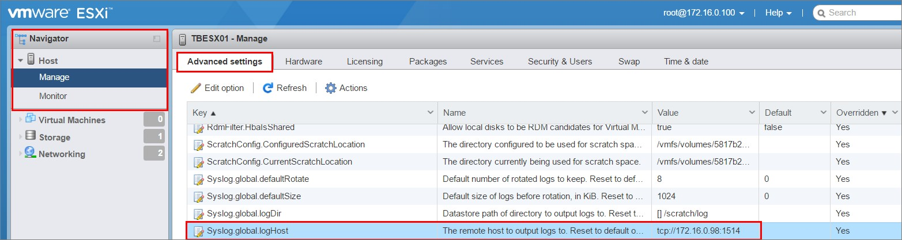](http://media.orneling.se/2016/11/1-1.jpg)

Click edit, paste the below and save.

_tcp://ip address of your VM:1514_

**_Note: Now, you should also make sure that the firewall in the Linux VM allow the host to send the logs on the port TCP 1514._**

Also make sure that the “_config.HostAgent.log.level_” setting is set to _Info_ to make sure that you receive information into OMS.

That´s all the configuration you need to do in the GUI of the host, but there´s still more work to do.

**Creating a firewall rule in the ESX host**

The next step is to allow the traffic out of the VMware host on the port 1514. To change the firewall directly on the host you need to log into the host through SSH. To do this I am using Putty which is the terminal program of my choice since way back.

Download Putty [here](http://www.chiark.greenend.org.uk/~sgtatham/putty/download.html) if you haven´t done so already.

Okay, so the first thing we do after logging in as root is to display the active firewall rules on the host. As you can see below, the traffic we want to send isn´t specified in the list and therefore will be denied.

Run the command “_Esxcli network firewall ruleset list_” to display the rules. [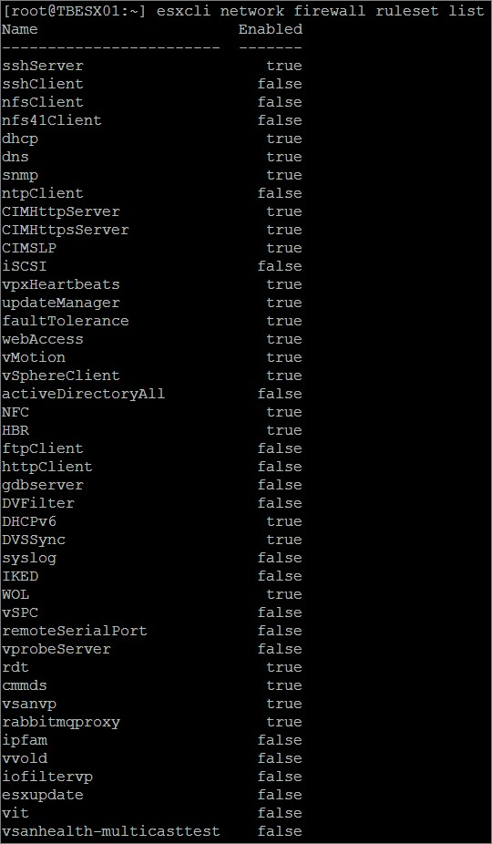](http://media.orneling.se/2016/11/2-1.jpg)

Let´s get to it and create the firewall rule but first, back up the /etc/vmware/firewall/service.xml file by running the command:

_cp /etc/vmware/firewall/service.xml /etc/vmware/firewall/service.xml.bak_

Modify the access permissions of the service.xml file to allow writes by running the chmod command:

To allow writes:

_chmod 644 /etc/vmware/firewall/service.xml_

To toggle the sticky bit flag:

_chmod +t /etc/vmware/firewall/service.xml_ Open the service.xml file in a text editor. Use the following command to open the file;

_vi /etc/vmware/firewall/service.xml_

Add this rule to the service.xml file. The rule will allow outbound traffic on the port 1514: [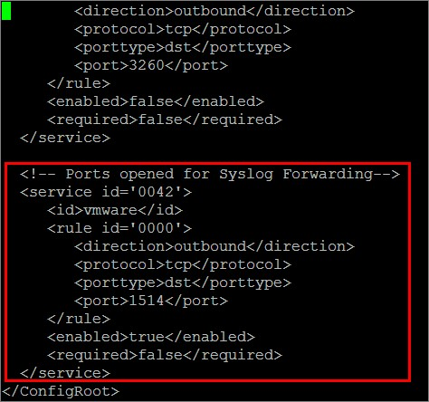](http://media.orneling.se/2016/11/3-1.jpg)

Exit the editor by clicking Escape and then typing _:wq_ followed by Enter. This will save the changes and exit the editor.

The text to add:

_<!-- Ports opened for Syslog Forwarding-->_

_<service id='0042 or another ID depending on your environment'>_

 _<id>vmware</id>_

 _<rule id='0000'>_

 _<direction>outbound</direction>_

 _<protocol>tcp</protocol>_

 _<porttype>dst</porttype>_

 _<port>1514</port>_

 _</rule>_

 _<enabled>true</enabled>_

 _<required>false</required>_

_</service>_

Revert the access permissions of the service.xml file to the read-only default by running the command:

_chmod 444 /etc/vmware/firewall/service.xml_

Refresh the firewall rules for the changes to take effect by running the command:

_esxcli network firewall refresh_

List the rules again to confirm by running the command:

_Esxcli network firewall ruleset list_

You should now see your newly created firewall rule as I did in the picture below. 

Now the traffic should be able to through all the way but before we can try it out we need to make sure that the Linux VM is listening on the port. For this, we need to install the OMS agent.

If you run into any problems with opening the VMware firewall or need any other information, you can find lots of it on this link who also helped me opening the port in the first place: [VMware KB](https://kb.vmware.com/selfservice/microsites/search.do?language=en_US&cmd=displayKC&externalId=2008226).

**Configuring the agent side**

Okay, the last step we need to take is to install and configure the OMS agent on the VM.

To install the agent, go to the settings pane in the OMS portal and navigate to Connected Sources and Linux Servers. [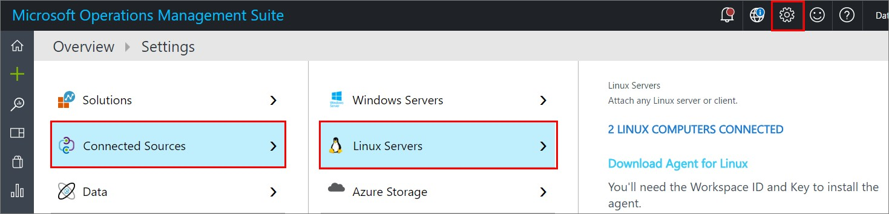](http://media.orneling.se/2016/11/6-1.jpg)

At the bottom, you will find the command you need to run on your VM to install the agent. I used my home NAS as the middle hand since I didn´t want to write the whole string by myself, which allowed me to just paste the string into the Gnome Terminal in my VM. [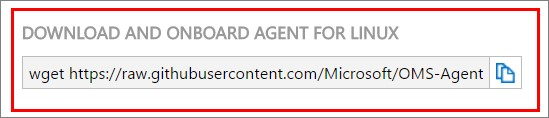](http://media.orneling.se/2016/11/7-1.jpg)

The OMS agent is installed on the VM and if all is done correct and the firewalls are open out of the VMware host and into the Linux VM, you should be able to run a test from the VMware CLI using Putty as before. Run the below command to verify connectivity:

_nc -z ”ip address of your VM” 1514_ [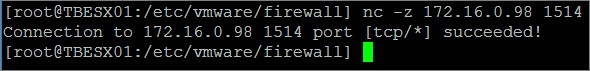](http://media.orneling.se/2016/11/5-1.jpg)

As you can see the traffic is allowed and we can continue configuring the agent.

In the terminal of your VM, go to the _/etc/opt/microsoft/omsagent/sysconf/omsagent.d_ directory and copy the _vmware\_esxi.conf_ file to the _/etc/opt/microsoft/omsagent/conf/omsagent.d_ directory with the below command:

_sudo cp /etc/opt/microsoft/omsagent/sysconf/omsagent.d/vmware\_esxi.conf /etc/opt/microsoft/omsagent/conf/omsagent.d_

Then change the owner/group and permissions of the file. See below how it’s done:

_sudo chown omsagent:omiusers /etc/opt/microsoft/omsagent/conf/omsagent.d/vmware\_esxi.conf_

This will make sure that the OMS agent sees the information and also is allowed to read the information.

Restart the OMS Agent for Linux by running the below command:

_sudo /opt/microsoft/omsagent/bin/service\_control restart_

You should now be able to perform a log search for “_Type=VMware\_CL_” in the OMS portal as you see below.

[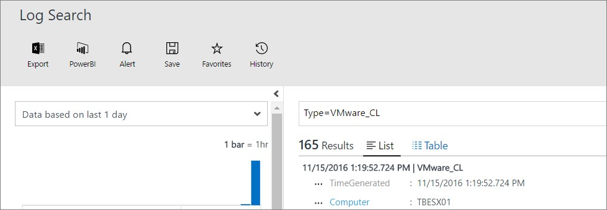](http://media.orneling.se/2016/11/8-1.jpg)

To read Microsoft article on how to make all the configuration, click [here](https://azure.microsoft.com/en-us/documentation/articles/log-analytics-vmware/):

If you still don´t see anything after a couple of minutes, keep reading the next part below. If you do however get some results from your query, just keep scrolling a bit.

**Problem sending data to OMS even though the firewall was open**

As I mentioned in the beginning of this post I have run into pretty much every known issue with this solution and this is the last issue I´m going to go through today.

Apparently, there´s a bug in ESXi with the Syslog timestamp and we need to add a line to another config file.

Run this command to back up the _/etc/vmware/hostd/config.xml_ file before making any changes to it:

_cp /etc/vmware/hostd/config.xml /etc/vmware/hostd/config.xml.orig_

Change the rights to the file like you did with the firewall file with the following command:

_chmod 644 /etc/vmware/hostd/config.xml_

Using a text editor, open the _/etc/vmware/hostd/config.xml_ file and locate this section. Use the following command to open the text editor:

_vi /etc/vmware/hostd/config.xml_

You will see something like the picture: [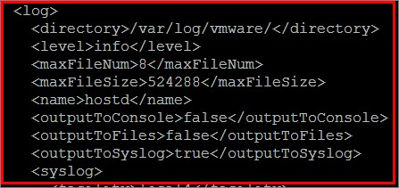](http://media.orneling.se/2016/11/9-1.jpg)

Add the line _<useOldLogPrefix>true</useOldLogPrefix>_ below the _<log>_ header as seen below. [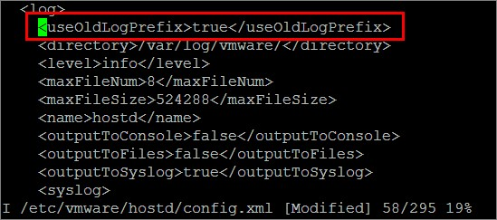](http://media.orneling.se/2016/11/10-1.jpg)

Exit the editor by clicking Escape and then typing _:wq_ followed by Enter. This will save the changes and exit the editor.

Revert the rights to what they were before by running the following command:

_chmod 444 /etc/vmware/hostd/config.xml_

Run this command to restart the syslogd service:

_esxcli system syslog reload_

To read the VMware KB on this issue, click [here](https://kb.vmware.com/selfservice/microsites/search.do?language=en_US&cmd=displayKC&externalId=2111202).

**Checking out the VMware Monitoring solution**

Now let´s head over to the OMS portal again to see what is happening.

Awesome! My host has starting to send some nice data up to OMS and I can start using the solution. [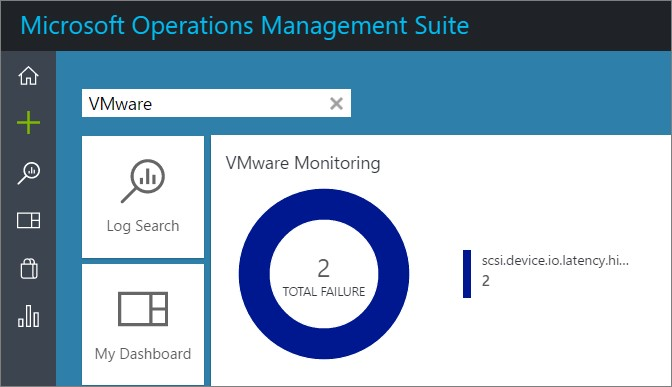](http://media.orneling.se/2016/11/11-1.jpg)

The picture below was taken about 24 hours after the first data were shipped up to OMS and now there is some information for me to go through. I did some tests with creating and deleting a VM on my host and the information showed up within minutes in the portal. [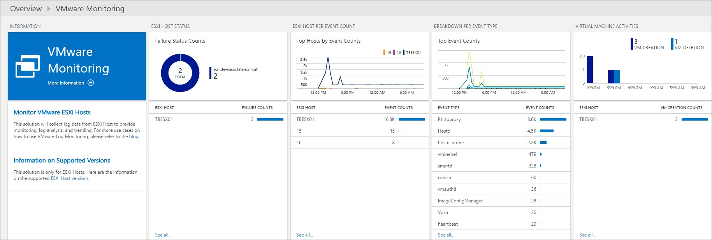](http://media.orneling.se/2016/11/12-1.jpg)

The below query gave me a view of my VMs hosted on the server. This would show you all your VM´s spread on all your hosts throughout your environment and give you a good summary of the amount of VM´s. [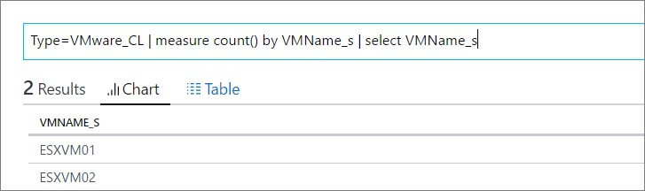](http://media.orneling.se/2016/11/13-2.jpg)

Below you will see which processes are sending the most data up to OMS. [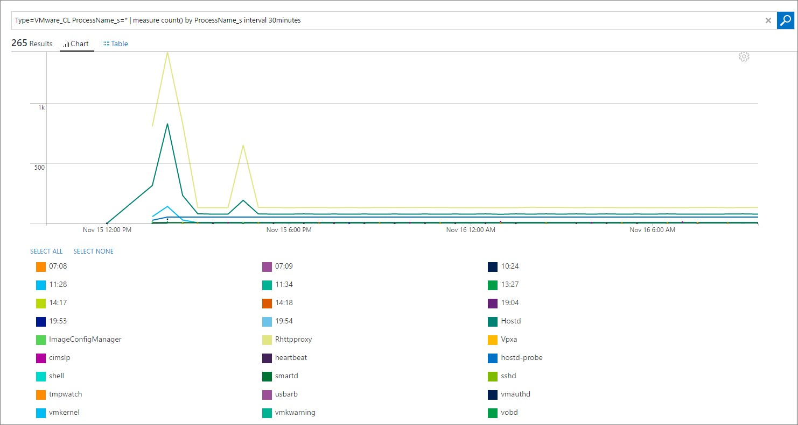](http://media.orneling.se/2016/11/14-1.jpg)

**Summary**

So, at last I have got it up and running and I am now monitoring my VMware host at home. It´s been fun working with this solution since it has demanded more from me and I´ve had to dig into the Linux world more but also into VMware and theVMware CLI world.

What I see at this early stage is a good start of the VMware monitoring journey that OMS has begun, but at this moment I don’t see us ditching the VMware monitoring we are doing today with SCOM. However, this is a great complement and will provide us with great capabilities in analyzing the VMware environment and giving us a great overview of the environment.

Hopefully this post has helped you getting started with the OMS solution and as always, if there are any questions just leave a comment below.

**Update 2016-12-07**

I have posted an idea over at User Voice asking for the possibility to monitor performance data as well, such as CPU and memory utilization for both the host and VM´s.

If you like me think this solution is something you want to see evolving, please contribute by voting for the idea [here](https://feedback.azure.com/forums/267889-log-analytics/suggestions/17357269-allow-for-performance-data-to-be-monitored-by-the). All you have to do is to enter your e-mail address and your name.
