A couple of weeks ago I started working for a new company which I wrote about [here](http://blog.orneling.se/2016/10/new-challenges-ahead/) and I am now the product manager for OMS with a focus on Log Analytics and Azure Automation. However, this does´nt mean I have given up on SCOM just to focus on OMS.

I am just as passionate about SCOM as I´ve been before and you will see some of that in this post. Since I started working for [Approved Consulting](http://approved.se/) I have had the opportunity to start digging into the analytic tool they have been developing during the last year. Some of you may have seen some of it before in a copuple of postings made at [ITServiceAnalytics](http://www.itserviceanalytics.com/) (ITSA), but I will now start digging into the different parts of it to show what you can do with it.

In this first posting, I will do some performance reporting using SCOM reporting but I will also show how it´s done using ITSA to show the different ways to generate reports. For all of this to be nice and easy, we are using a Distributed Application for a sales platform with all of its components.

It´s been created using Savision Live Maps but still, a regular Distributed Application that we can use to generate reports. You don´t have to use a DA for this to work, but it sure makes it a lot easier as you can filter your data in a complete different way. **Doing it the SCOM way** In this example I am using the Veeam Report Library which you can download for free [here](https://www.veeam.com/report-library-system-center.html). For this first example I will choose what group I will target. Notice I have already added some objects such as ”% Logical Disk Free Space” and so on. [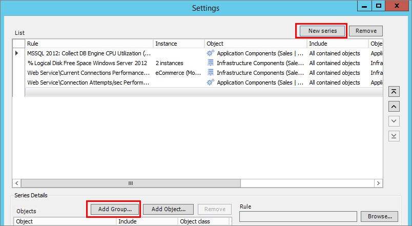](http://media.orneling.se/2016/11/1.jpg)

Searching for e-commerce will show me those differerent groups greated with the DA. As you can see below, there are three groups matching the three layers of the Live Maps business service; • End User Components • Application Components • Infrastructure Components

For the example I´m showing here, I will use the Application Components group. This will allow me to generate reports against those objects included in that group. [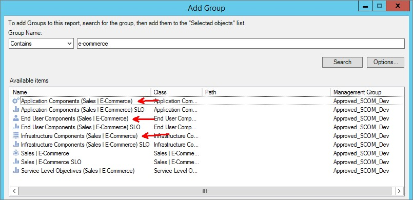](http://media.orneling.se/2016/11/2.jpg)

The next step is to choose what rule I want to look at. You will find this button in the lower right section once you have picked your group. [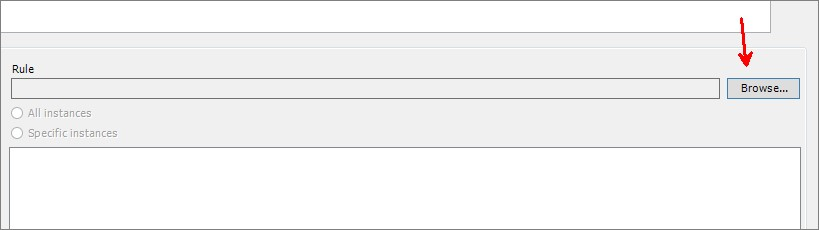](http://media.orneling.se/2016/11/3.jpg)

You can search either by Management Pack name or you can browse directly to the rule. In this case, I have picked out the Performance Object as ”SQL Database” followed by the counter ”Log Free Space (%)”.

If you have multiple SQL MP´s installed, such as 2008 and 2012 as I have here, just pick the one included in the service (DA), which in this case is SQL Server 2012. [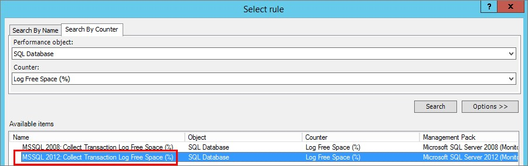](http://media.orneling.se/2016/11/4.jpg)

The next step is to choose which instance you want to use. Here you could choose all instances or just single instances, different disks for example. I´ll move on with ”All instances” for now. [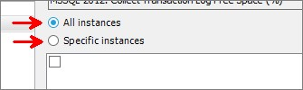](http://media.orneling.se/2016/11/5.jpg)

Once I run the report, this is what we´ll see. As you can see you have a Min/Max value (the blue field), a sample count and a Trend (the purple line) that shows you the performance data you asked for. It´s still not really easy to read, and it´s not that good looking either. [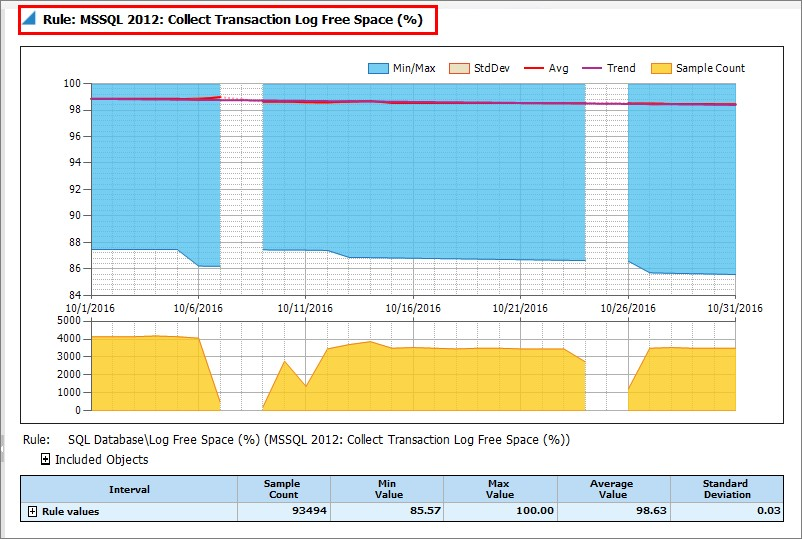](http://media.orneling.se/2016/11/6.jpg)

Okay, so what about the other way using IT Service Analytics instead?

**Doing it the ITSA way** Okay, so now you have seen how it´s done the original SCOM way, it´s absolutely doable but it takes a good portion of your time to set up the report to gather the performance data on all the objects included in the service (DA). With IT Servie Analytics instead, you will have a completely different approach on how to do it.

For this blog post I am using the report (which is a part of ITSA) ”Entity Details” to show me the performance data that I want to see. To begin with, I pick the service I want to see more about which in this case is ”Sales | E-Commerce” as you can see below. Once I have picked the service to use, I have narrowed down the possible reporting object to only those that are a part ot this service. [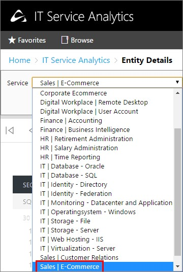](http://media.orneling.se/2016/11/7.jpg)

The next step is to choose what type of data you want to see. This view displays only those object types that are a part of the service, nothing else. You could just pick all available types here but I want to move on with just ”SQL Database” for now. [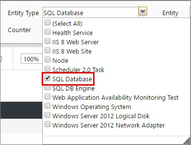](http://media.orneling.se/2016/11/8.jpg)

So now over to the ”Entity” part. Since I chose only SQL Database in the last step, I will only see those databases that are a part of the service. Had I chosen ”SQL DB Engine” as well, then I would see the SQL Server instance here as well. [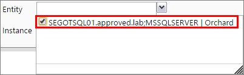](http://media.orneling.se/2016/11/9.jpg)

The next step is to choose what counter I want to look at. The counters seen below are related to what you picked as the entity type above. Since I have chosen SQL Database, I will only be presented with the counters connected to that entity type. [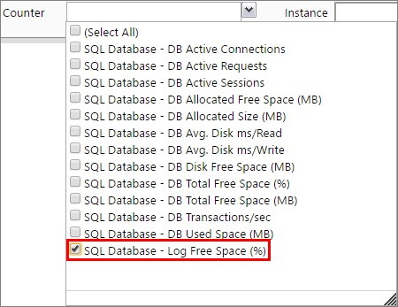](http://media.orneling.se/2016/11/10.jpg)

The last step is to choose which instance I want to use. In this case I have the option ”No instance set”. This is one part where it really gets interesting. The instance(s) that you see here are only those that have any data related to it.

Let´s say that you had a disk with the label D: without any generated performance data, then you wouldn´t see that disk as an available instance. The drop down will never show you any instance that then would turn up blank. [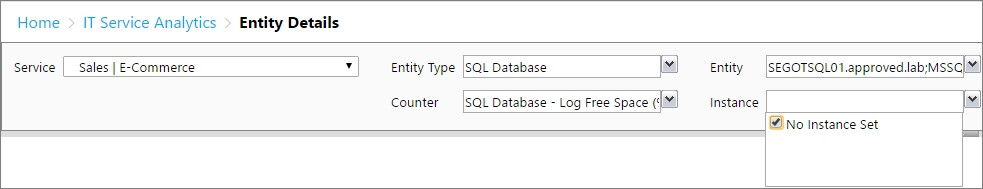](http://media.orneling.se/2016/11/11.jpg)

Okay, all the steps are finished and it´s time to see what we can get from the report. [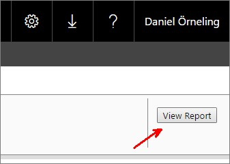](http://media.orneling.se/2016/11/12.jpg)

This view is what I got with the report I just generated. You will get yesterday´s data together with data from the last 30 days. The data is reloaded from the Data Warehouse every 15 minutes so the current data you see will never be older than 15 minutes. And also, "Average R12 Months" displays the average data from the last 12 months as a reference point.

Another thing you may notice as well is the information saying ”This is flagged as a wasted resource”. This is based on the usage of the log space. As you can see the average value lies at 100% free space, which means that there is no point in having all that free space available for the instance.

If there is a forecast connected to a counter, such as a disk that is about to run out of free space you would get that information just as well on a disk space report.

[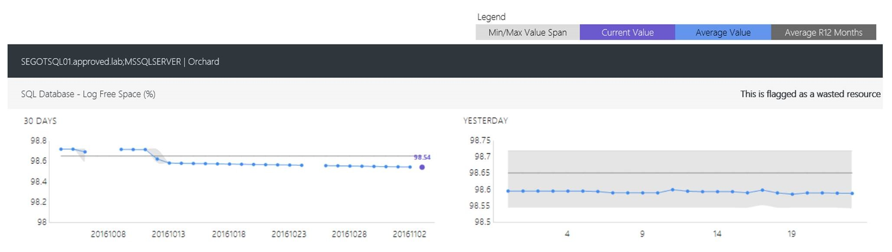](http://media.orneling.se/2016/11/13-1.jpg)

The notes you can receive on your data at this moment are:

- Wasted Resource
- Performance Bottleneck
- Forecasted issue
- Deviating from baseline
- Accelerating

The last example I´m going to show for today is a logical disk free space counter. As you can see below I have picked out ”Windows Server 2012 Logical Disk” as the entity type and ”Logical Disk - %Free Space” as the counter. Once again, the only instances you see are those that are connected to the objects in the service. In this case I selected only C: as an instance. [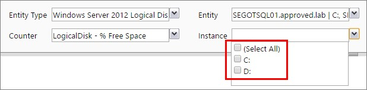](http://media.orneling.se/2016/11/14.jpg)

Here you can follow the percentual free space during yesterday but also through the last 30 days. Very easy to get an overview in other words. [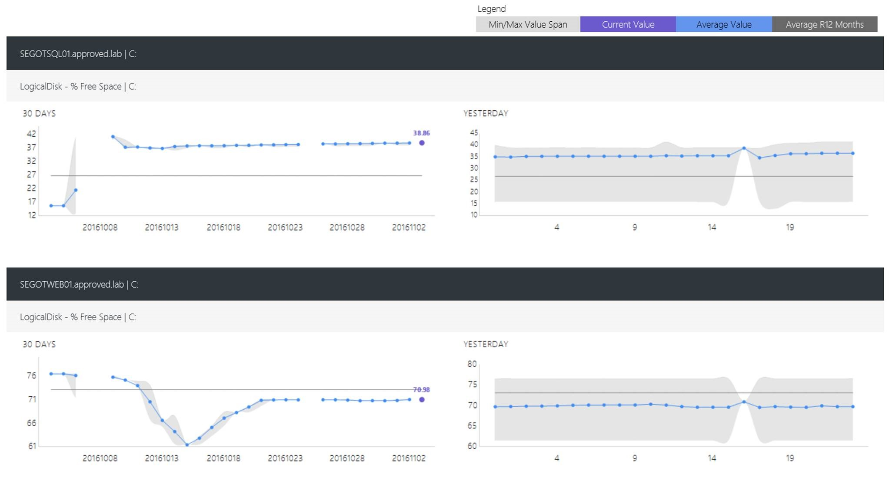](http://media.orneling.se/2016/11/15-1.jpg)

**Conclusion** Now I have shown how we can generate performance reports from SCOM in two different ways, the built-in way and the other way. For me that haven´t been around IT Service Analytics from day one, it´s a new experience that makes it really easy to generate reports based on the data that SCOM has gathered.

So which one is the winner in this test? I think generating reports using IT Service Analytics beats the built-in reporting big time. The main reasons to why I think ITSA is the better choice:

• Pick your service and only get to choose from those objects and counters that are a part of the service. This allows for you to generate a report in almost no time. • Get forecasts and know when a resource is either under- or over-sized. • You don´t have to build a new report to change the data that is displayed, just change the entity type and objects and simply rerun the report.

If you like what you´ve seen so far of IT Service Analytics, you can find more information [here](http://www.itserviceanalytics.com/) or if you want a personal demo, you can request it [here](http://www.itserviceanalytics.com/resources/i-would-like-a-demonstration/). I will keep digging into ITSA and the other modules that are part of the solution and report my findings in the blog as well.

If you have any questions about what I´ve done here, just leave a comment below.
