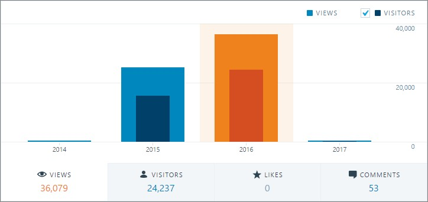
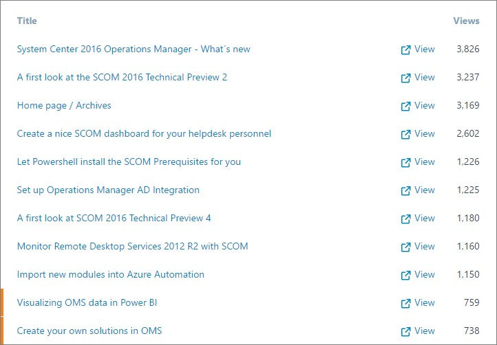
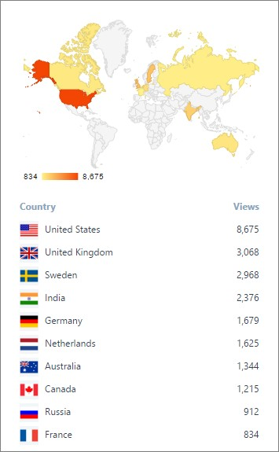

So, the year has changed one more time and 2016 has now switched over to 2017. For me 2016 was a good year, I switched positions twice and have now landed in my new role at [Approved Consulting](http://approved.se/). As I usually do around this time of the year (along with most bloggers I suppose) I´ll summarize the blog year below.

**Views and visitors**

I saw early in the year that I would break 2015 years’ numbers pretty fast. Looking back at 2016, that’s exactly what happened and the numbers for 2016 ended at a total of 36 079 views and 24 237 unique visitors.

The numbers of 2015 were 24 863 views and 15 353 unique visitors so a lot better thanks to all of you reading my blog posts. The most popular day was January 14th with a total of 362 views.

**Most popular posts**

During the year, I wrote 26 posts and we are now at a total of 106 posts since I started writing my blog posts back in December of 2012. Sadly there are no statistics from anything earlier than 2014 since I were on another blog back then.

Anyway, the 10 most popular blog posts from last year is seen below. Obviously there’s still a lot of interest in SCOM since the number 1 post with 3 826 views were [System Center 2016 Operations Manager - Whats new](http://blog.orneling.se/2015/05/system-center-2016-operations-manager-whats-new/).

There are some OMS posts as well in this list but those were posted quite late in the year so the numbers aren´t that great for those posts.

**Origin of my readers**

The top ten countries are listed below with the number of views. The number 1, United States is the same as 2015 but the second place has switched and Sweden have moved down to a third place, beaten by United Kingdom with 100 views.

**Summary**

That´s all for now folks, I hope you like what you´ve seen here and I will do my best to keep filling the blog with interesting material during this year as well.

And of course, thanks to all of you for reading my blog and thanks to my sponsors!

Feel free to comment below and see you in 2017.
