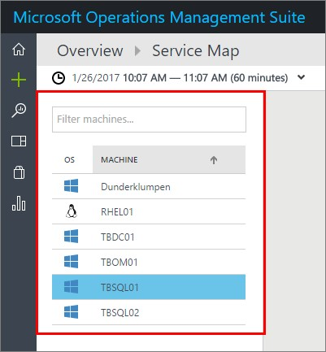
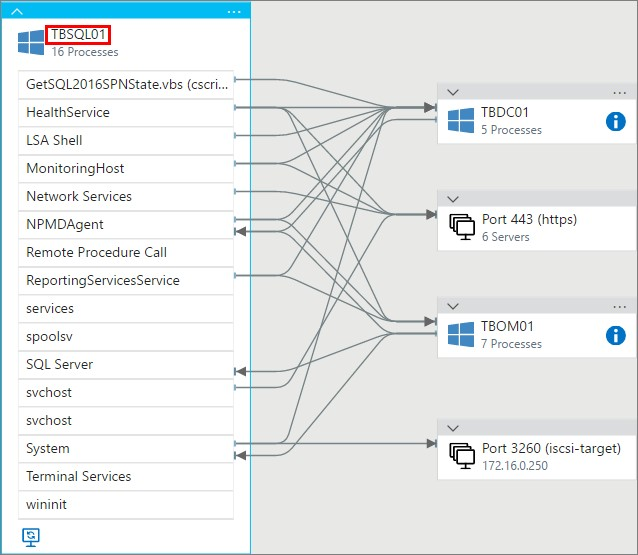
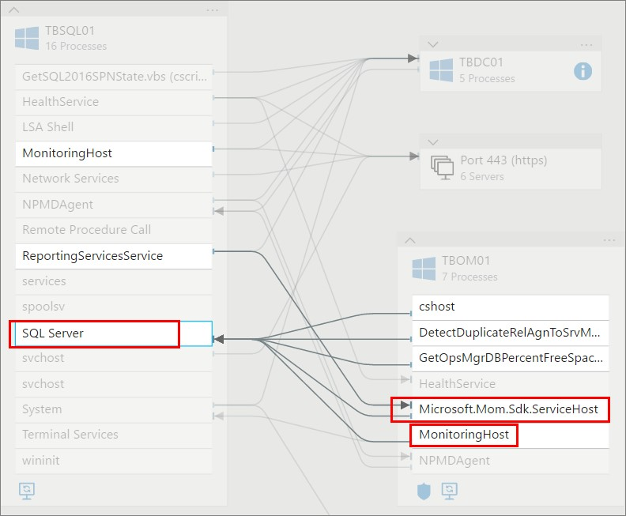
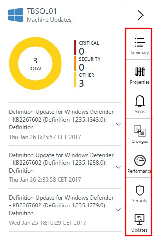
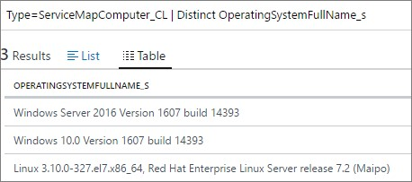

A couple of months back, Microsoft made Service Map available as a part of OMS. It all began about 18 months ago when Microsoft acquired Bluestripe and their product FactFinder. FactFinder helped SCOM users to visualize connections and let them see what relationships there were between different components in their environment.

Soon it became clear that this was about to be rebuilt and launched as a part of OMS. About a month or so ago, Service Map were made available as a public preview in the Azure region West Europe as well. This meant that I could add this solution to my Log Analytics workspace, and now here we are!  :)

**Getting started**

To get going you need to complete three tasks. You must add the “Service Map” solution in your Log Analytics workspace.

Then you need to install the OMS agent on your server and in this first post I´m going to look into Windows servers. You could either install the agent manually as shown [here](https://docs.microsoft.com/en-us/azure/log-analytics/log-analytics-windows-agents), or you could take advantage of my blog post where I presented a PowerShell script to do it for you. Find the blog post [here](http://blog.orneling.se/2017/01/installing-oms-agent-with-powershell/).

Once the agent is installed and connected to your workspace, you need to install the Dependendy Agent which is used to discover the relationships between the servers. This agent needs to be installed on each server you want to gain information about.

Download the agent [here](https://aka.ms/dependencyagentwindows) and install it to get started.

I do plan to update the installation script to include the dependency agent as well but due to faulty installation switches I haven´t been able to do so yet.

_Note: There is a known issue with the Dependency Agent and servers running Windows Server 2016 on a Hyper-V platform with the secure boot option enabled. In this scenario, the server would complain about drivers not being signed and Microsoft actively works to resolve this issue. I resolved it in my lab environment by simply unchecking the Secure Boot option, however this isn´t something I recommend you to do in your production environment._

**Checking it out**

Now that the agents are installed and you have added the solution, you will soon start seeing information transported to OMS. This first sight shows you a summary of your reporting servers. In this case I have 5 Windows Servers and 1 Red Hat server reporting up to OMS. I will go through the Linux part more in a follow-up post later. Just click on the server you want to check out and move on.

The first thing you see is a summary of what´s running on the server, such as SQL Server and the MonitoringHost for example. You will also see by the arrows in which directions information are being sent and received. Looking below, you will see that TBSQL01 is talking to my domain controller (of course) and to TBOM01 which is my SCOM management server. In the case where information is being exchanged with OMS for example, you would see this information under the “Port 443” option. Service Map information is being sent directly to OMS and doesn´t take the route through your SCOM management server(s) so that´s why we can see Port 443 as a separate part.

Clicking on the SQL Server as I´ve done below you will see the traffic that goes from here and where it goes to. As you can see the TBOM01 server is reporting to TBSQL01 since that´s where my SCOM databases are placed. As you can see its really easy to see more in detail what traffic is going where. If you want to check out more information on “Port 443” for example, just click the small arrow just above the Windows logo or the three screens below. You will then see exactly what the server is communicating with.

Another option you can add is the “self-links”. This means that you can visualize those processes are communication to each other within the server.

Showing the “self-links” below, you can see that MonitoringHost is communicating with SQL Server. This is because I´m monitoring SQL Server with SCOM, and MonitoringHost will then send that information to my SCOM management server.

Pictured below is also an ICSI-target that I´ve mounted on the server, which is connected to my NAS. So as long as the connection is there, you will see it with Service Map.

Below is some of the additional information you will easily get access to. To the right of the visualization chart you will see a lot of information about your server. You can see properties such as the OS running on the server, CPU info, memory amount, the time of the last reboot and much more. This is all sent to OMS by the Service Map agent and real easy for you to follow up on.

The different sections below are all connected to other OMS solutions, such as Change Tracking, Alerts and Updates.

The updates section is connected to the Update Management solution, and will display what updates are missing or if the server is completely up to date as it is. Just click the section you want to check out and you will see information related to your server.

And the last thing for today, all of this data is of course searchable since it´s a part of Log Analytics. Below is just a simple query that shows how you can easily see what operating systems are running on your servers that are reporting to the Service Map solution.

The query to use (or simply copy) is “Type=ServiceMapComputer\_CL | Distinct OperatingySystemFullName\_s”.

_Tip: If you want to check it out a bit more, do a search for “Type=ServiceMapProcess\_CL” which is the other type of Service Map data you can work with._

**Summary**

This is just a quick glimpse of what Service Map has to offer and I will go through more features in a later posting. So far what I´ve seen from Service Map is really nice. It´s really easy to check out what´s installed on a server and to see what´s running under the hood. However, it would be nice to see more information about the applications running within the servers, but we´ll see what Microsoft may come up in the future.

I hope this could help you get started with Service Map, and if you run into any problems or if you have any questions about what I´ve done here just leave a comment below.
