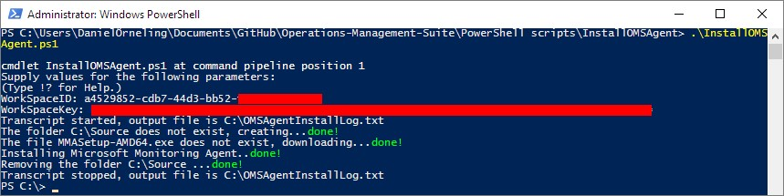
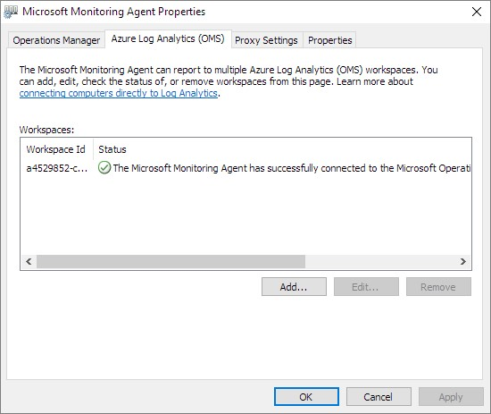

Operations Management Suite (OMS) is a great thing and easy (and fast) to getting started with just installing an agent on a server. However, installing OMS agent would be nice to get automated and instead of doing it with the command line it could be done with PowerShell, compared to doing it manually which would take s significant amount of time. Keep reading to find out how to install OMS agent with PowerShell.

I have checked the command line installation option and that isn´t as good and fancy as doing it with PowerShell, hence this post. I have put together a PowerShell Script that will download the agent, install it and remove the installation files. All you need is the Workspace ID and Workspace Primary Key.

**Running the script**

You need to run the script as an administrator, and you will also need internet access from the server to download the files. However, if you don´t have internet access you could always download the agent somewhere else and copy it to the folder C:\\Source and the agent would be installed by the script. Then you could still use the OMS gateway to communicate with OMS.

See below for what it looks like running the script; 

Now when the installation is done, you can check out the properties of the agent in the Control Panel under “System and Security”. Hopefully you will see what I see below, and you will very soon see your server in the OMS workspace. 

The script is seen below for you to just copy it, and I have also uploaded it to TechNet Gallery [here](https://gallery.technet.microsoft.com/Install-OMS-Agent-with-2c9c99ab).

<#
Author:		Daniel Örneling
Date:		28/12/2016
Script:  	InstallOMSAgent.ps1
Version: 	1.0
Twitter: 	@DanielOrneling
#>

# Set the Workspace ID and Primary Key for the Log Analytics workspace.
\[CmdletBinding(SupportsShouldProcess=$true)\]
param(
    \[parameter(Mandatory=$true, HelpMessage="The ID of the Log Analytics workspace you want to connect the agent to.")\]
    \[ValidateNotNullOrEmpty()\]
    \[string\]$WorkSpaceID,

    \[parameter(Mandatory=$true, HelpMessage="The primary key of the Log Analytics workspace you want to connect the agent to.")\]
    \[ValidateNotNullOrEmpty()\]
    \[string\]$WorkSpaceKey
)

# Set the parameters
$FileName = "MMASetup-AMD64.exe"
$OMSFolder = 'C:\\Source'
$MMAFile = $OMSFolder + "\\" + $FileName

# Start logging the actions
Start-Transcript -Path C:\\OMSAgentInstallLog.txt -NoClobber

# Check if folder exists, if not, create it
 if (Test-Path $OMSFolder){
 Write-Host "The folder $OMSFolder already exists."
 } 
 else 
 {
 Write-Host "The folder $OMSFolder does not exist, creating..." -NoNewline
 New-Item $OMSFolder -type Directory | Out-Null
 Write-Host "done!" -ForegroundColor Green
 }

# Change the location to the specified folder
Set-Location $OMSFolder

# Check if file exists, if not, download it
 if (Test-Path $FileName){
 Write-Host "The file $FileName already exists."
 }
 else
 {
 Write-Host "The file $FileName does not exist, downloading..." -NoNewline
 $URL = "http://download.microsoft.com/download/1/5/E/15E274B9-F9E2-42AE-86EC-AC988F7631A0/MMASetup-AMD64.exe"
 Invoke-WebRequest -Uri $URl -OutFile $MMAFile | Out-Null
 Write-Host "done!" -ForegroundColor Green
 }
 
# Install the agent
Write-Host "Installing Microsoft Monitoring Agent.." -nonewline
$ArgumentList = '/C:"setup.exe /qn ADD\_OPINSIGHTS\_WORKSPACE=1 '+  "OPINSIGHTS\_WORKSPACE\_ID=$WorkspaceID " + "OPINSIGHTS\_WORKSPACE\_KEY=$WorkSpaceKey " +'AcceptEndUserLicenseAgreement=1"'
Start-Process $FileName -ArgumentList $ArgumentList -ErrorAction Stop -Wait | Out-Null
Write-Host "done!" -ForegroundColor Green

# Change the location to C: to remove the created folder
Set-Location -Path "C:\\"

<#
# Remove the folder with the agent
 if (-not (Test-Path $OMSFolder)) {
 Write-Host "The folder $OMSFolder does not exist."
 } 
 else 
 {
 Write-Host "Removing the folder $OMSFolder ..." -NoNewline
 Remove-Item $OMSFolder -Force -Recurse | Out-Null
 Write-Host "done!" -ForegroundColor Green
 }
#>

Stop-Transcript

**Summary**

I hope this will help you out in installing OMS agents in your environment. What´s good to know is that I have deactivated the section in the script that deletes the C:\\Source folder when the installation is done. This is simply because you shouldn´t delete the folder if you have any other important files in there. Feel free to use the line if you want to, but you will need to activate yourself by editing the script and removing the lines 64 and 75.

If there are any questions, just leave a comment below and I´ll get back as soon as possible. Otherwise, have fun deploying OMS agents in your environment :)
