A while back I wrote a post where I went through the basics and how to get started with the new feature Service Map, which is a part of OMS nowadays. Read the post [here](http://blog.orneling.se/2017/01/a-first-look-at-oms-service-map/). That post only showed how to get started and what kind of information you will get from the solution, but it didn´t say anything about troubleshooting. And at last, it did just explain how to get started with your Windows servers (or clients for that matter).

Today I will go through how to get up and running with Linux servers as well, as well as some troubleshooting.

**The prerequisites**

When considering the Service Map agent, the following Windows operating systems are supported.

Windows Server

- Windows Server 2016
- Windows Server 2012 R2
- Windows Server 2012
- Windows Server 2008 R2 SP1

Windows Desktop

- Windows 10
- Windows 8.1
- Windows 8
- Windows 7

Now when it comes to installing the Service Map agent on your Linux servers, you need to make sure the server is running any of the following distributions. Just because the OMS agent is supported doesn´t mean that the Service Map agent is. Since the Service Map agent is separate from the OMS agent (right now, anyway) you must make sure the server OS is supported for the Service Map agent as well. Find the supported distributions below;

Red Hat Linux 6

- 6.0 all the way up to 6.8

Red Hat Linux 7

- 7.0 all the way up to 7.3

Red Hat Linux 5

- 8 all the way up to 5.11

Oracle Linux 5

- 8 all the way up to 5.11

Oracle Linux 6

- 2 all the way up to 6.6

SUSE Linux 10

- 10 SP4

SUSE Linux 11

- 11
- 11 SP1
- 11 SP2
- 11 SP3
- 11 SP4

**Installing the OMS agent**

I won´t go through the installation process for the Linux OMS agent any more than just showing where to find the installation string. Head into the settings of your workspace and you will find the information as seen below. Install the agent on your server(s) by running the command and you are good to go on with Service Map. [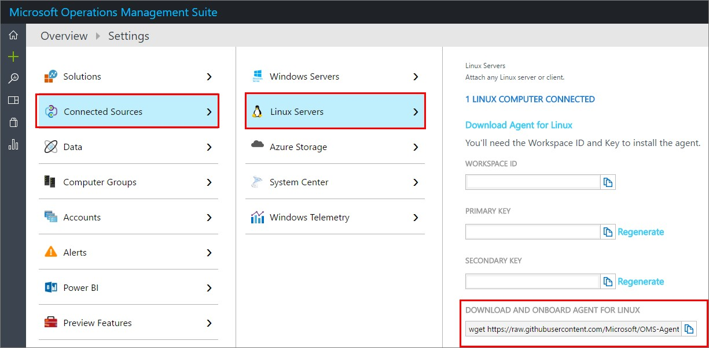](http://media.orneling.se/2017/02/1-1.jpg)

**Installing the Service Map agent on a Linux server**

Okay, the installation of the Service Map agent isn´t that fancy either, you just need to run two lines of code and you’re done. Downlod the agent by executing the following command: _“wget_ _ht__tps://aka.ms/dependencyagentlinux__”_. By using this URL, you will always get the latest version of the agent.

Once the agent is downloaded, install it using the following command: “_sh InstallDependencyAgent-Linux64.bin”._

_You´re good to go and you should be able to see the server reporting into your OMS workspace._

**Looking at the data**

If all went well you will see the server in the list of computers in the Service Map solution. In my case, there are seven servers, which also makes it easy to follow the steps around in my environment. To see more about the “next step” for a process, you will need an agent deployed to the next server in line as well. [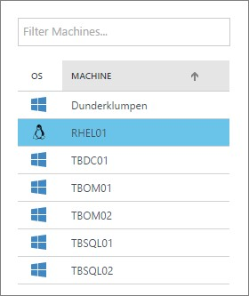](http://media.orneling.se/2017/02/2-1.jpg)

For this demo, I have created a web site running on my Linux server, just to display some more information rather than just the default stuff. You can see each process that is running, just as you would for the Windows servers that I showed in my previous post. [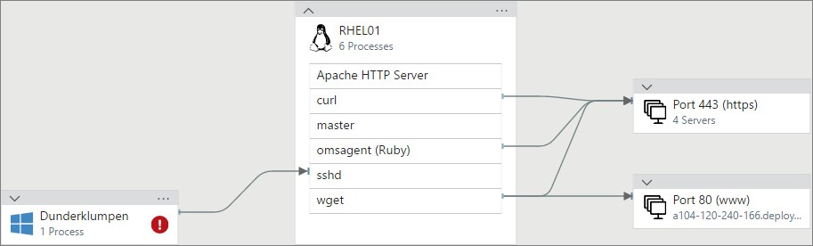](http://media.orneling.se/2017/02/3-1.jpg)

Notice the “wget” command that I ran just to get the agent. In this case the agent were already deployed so I updated it and because of that, I could collect the “wget” command I ran as well. Notice that you can see the URL I pointed out to download the agent. Real easy to keep track of what’s happening in the servers :) . [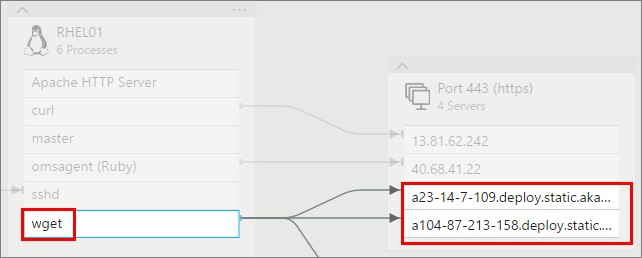](http://media.orneling.se/2017/02/4-1.jpg)

And I can also see what program I used to connect to my server and from which computer. Now remember, hadn’t I deployed an agent to my other computer as well I wouldn’t get the information you see below. Since I have an agent on both computers I can see these connections through Putty as well. [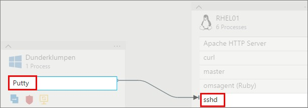](http://media.orneling.se/2017/02/5-1.jpg)

Just as I showed for the Windows servers, you can see information about the server as well. These areas that you see below are all connected to other solutions in OMS, meaning that the changes you see below are gathered by the Change tracking solution. [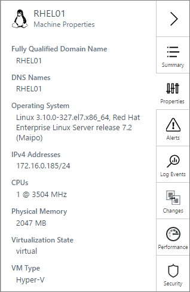](http://media.orneling.se/2017/02/6-1.jpg)

**Troubleshooting**

If something goes wrong and you start seeing errors or your servers aren´t reporting to OMS, there are some steps you can take to find more information. Or you could use this information once in contact with Microsoft support.

To generate a support file which will help you troubleshoot the deployment of the Service Map agent, follow the below steps.

Head over to the directory where the script is located with this command: “_cd C:\\Program Files\\Microsoft Dependency Agent\\scripts”._

Execute the script using this command: _“cscript CollectDependencyAgentData.vbs”._

The file is saved in the %USERPROFILE% directory for the current user as a ZIP file. [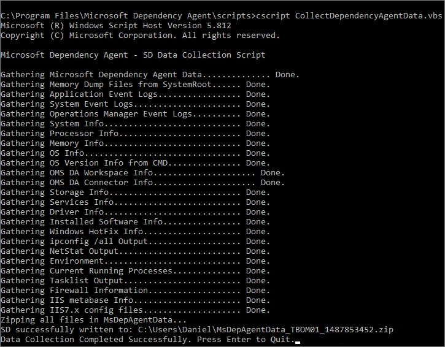](http://media.orneling.se/2017/02/7-1.jpg)

Looking into the file, this is what you´ll receive. It will (hopefully) give you the information you need, otherwise it may be a good start to lead you in the right way. [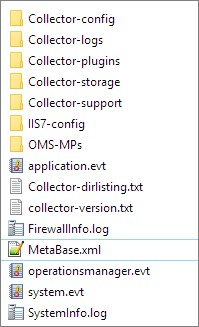](http://media.orneling.se/2017/02/8-1.jpg)

To generate a support file for the Linux agent as well, execute the following command using an account with root access: _“/opt/microsoft/dependency-agent/lib/scripts/collect-dependency-agent-data.sh”_. [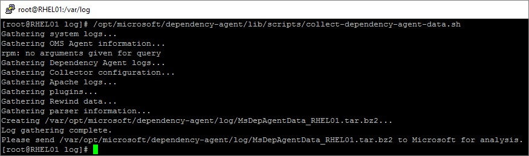](http://media.orneling.se/2017/02/9-1.jpg)

**Checking out the data via the log search**

I mentioned it in my previous post but I want to mention it again. All the data you gather within your workspace is searchable through the Log Search. This makes it easy to find more information on every server, just as you see below where I have collected information on how my SQL Server instances are patched in my environment. [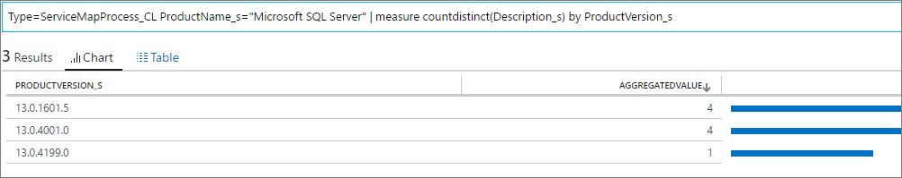](http://media.orneling.se/2017/02/10-1.jpg)

If you like me doesn´t know in your head which build numbers belong to which version, I can recommend this blog post: [https://buildnumbers.wordpress.com/sqlserver](https://buildnumbers.wordpress.com/sqlserver).

To find out what operating systems you are running, you can run this query: “_Type=ServiceMapComputer\_CL | measure countdistinct(ComputerName\_s) by OperatingSystemFullName\_s”_. [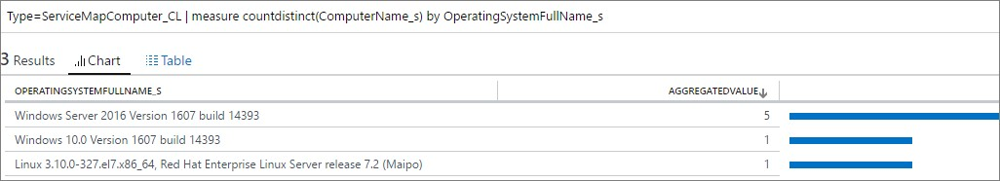](http://media.orneling.se/2017/02/11-1.jpg)

**Summary**

Okay, so now you´ve seen some more about the Service Map solution. Not only have you gotten to know how to get started with the Windows agent, but also with the Linux part. I think this could help out big time when I need to know exactly what relations there are between servers and how they affect each other. I definitely think we will see much more of this solution in the future as this is something that I think many customers really wants.

If your missing anything, you can always log a request at the user voice site [here](https://feedback.azure.com/forums/267889-log-analytics/category/184492-service-map) and hopefully your prayers won´t go unanswered.

If you have any questions about what I´ve done here, don’t hesitate to leave a comment below.
