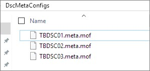
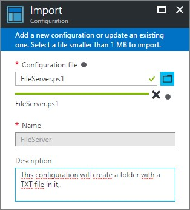
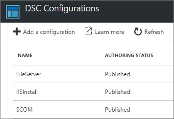
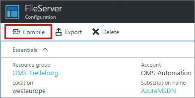
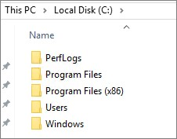
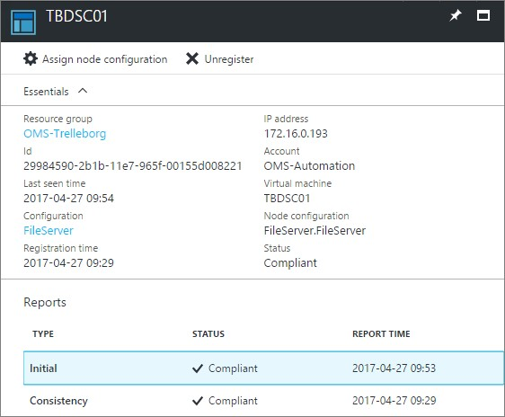

One of the things I work with in my role as a product manager for Operations Management Suite (OMS) is the automation part of the suite. In this case, it means Azure Automation that can do a lot for us in terms of automating our recurring tasks. This post will be the first post about what you can do with Desired State Configuration (DSC) as a part of Azure Automation.

Before we get started there are some things worth knowing. As a part of OMS, the licensing for DSC is based on per-node and the listing price is at $10 per node/month. This means that each server you want to configure using DSC is assigned this license.

**Getting started**

Before we get started there is one prerequisite you need to take care of; the latest version of WMF 5 (Windows Management Framework) needs to be installed on the server about to be configured as a DSC node. This makes is possible for the node to communicate with Azure Automation. You can find WMF 5 [here](https://www.microsoft.com/en-us/download/details.aspx?id=50395). This isn´t necessary if you’re running Windows Server 2016 as I will be doing for this post.

The first thing we need to do is to create a file stating what to communicate with and what to do. This is called a MOF file and is what makes is possible to retrieve configuration, but also to register the server as a node to Azure Automation DSC.

To create this configuration file, I have prepared a PowerShell script that you can use. For this to work, you need to get the registration URL and Primary Key of your Automation Account. Find these in the Azure Portal as I´ve shown below. 

In the script below, just add your values at lines 93 and 94. At line 95, you can add your server name(s) instead of the ones I´ve used. Running the script will create a MOF file for every server you added in a folder called “DscMetaConfigs” in the folder you´re standing with the PowerShell window. You might also want to look at line 100 where you should set the behavior for the DSC node. The default behavior that is also in the script here below, is “ApplyAndMonitor”. This configuration mode will Apply any new configuration you assign to the node, but should it deviate from the configuration later it will show up as non-compliant and this will be logged.

If you really want to force your way onto a server, you could use ApplyAndAutoCorrect instead. Beware though that this can be real risky to use in a production environment since all the changes you make that don´t go along with the configuration will be wiped away. In other words, don´t use this configuration mode without having thought it through first.

- **ApplyOnly**: DSC applies the configuration and does nothing further unless a new configuration is pushed to the target node or when a new configuration is pulled from a server. After initial application of a new configuration, DSC does not check for drift from a previously configured state. Note that DSC will attempt to apply the configuration until it is successful before **ApplyOnly** takes effect.
- **ApplyAndMonitor**: This is the default value. The LCM applies any new configurations. After initial application of a new configuration, if the target node drifts from the desired state, DSC reports the discrepancy in logs. Note that DSC will attempt to apply the configuration until it is successful before **ApplyAndMonitor** takes effect.
- **ApplyAndAutoCorrect**: DSC applies any new configurations. After initial application of a new configuration, if the target node drifts from the desired state, DSC reports the discrepancy in logs, and then re-applies the current configuration.

With this script the configuration will be checked within the server every 15 minutes, and the server will check with Azure Automation for new configuration rules every 30 minutes.

Run the script below with the changes I´ve pointed out above and you have the first step cleared.

  # The DSC configuration that will generate metaconfigurations
 \[DscLocalConfigurationManager()\]
 Configuration DscMetaConfigs
 {

 param
 (
 \[Parameter(Mandatory=$True)\]
 \[String\]$RegistrationUrl,

 \[Parameter(Mandatory=$True)\]
 \[String\]$RegistrationKey,

 \[Parameter(Mandatory=$True)\]
 \[String\[\]\]$ComputerName,

 \[Int\]$RefreshFrequencyMins = 30,

 \[Int\]$ConfigurationModeFrequencyMins = 15,

 \[String\]$ConfigurationMode = "ApplyAndMonitor",

 \[String\]$NodeConfigurationName,

 \[Boolean\]$RebootNodeIfNeeded= $False,

 \[String\]$ActionAfterReboot = "ContinueConfiguration",

 \[Boolean\]$AllowModuleOverwrite = $False,

 \[Boolean\]$ReportOnly
 )

 if(!$NodeConfigurationName -or $NodeConfigurationName -eq "")
 {
 $ConfigurationNames = $null
 }
 else
 {
 $ConfigurationNames = @($NodeConfigurationName)
 }

 if($ReportOnly)
 {
 $RefreshMode = "PUSH"
 }
 else
 {
 $RefreshMode = "PULL"
 }

 Node $ComputerName
 {

 Settings
 {
 RefreshFrequencyMins = $RefreshFrequencyMins
 RefreshMode = $RefreshMode
 ConfigurationMode = $ConfigurationMode
 AllowModuleOverwrite = $AllowModuleOverwrite
 RebootNodeIfNeeded = $RebootNodeIfNeeded
 ActionAfterReboot = $ActionAfterReboot
 ConfigurationModeFrequencyMins = $ConfigurationModeFrequencyMins
 }

 if(!$ReportOnly)
 {
 ConfigurationRepositoryWeb AzureAutomationDSC
 {
 ServerUrl = $RegistrationUrl
 RegistrationKey = $RegistrationKey
 ConfigurationNames = $ConfigurationNames
 }

 ResourceRepositoryWeb AzureAutomationDSC
 {
 ServerUrl = $RegistrationUrl
 RegistrationKey = $RegistrationKey
 }
 }

 ReportServerWeb AzureAutomationDSC
 {
 ServerUrl = $RegistrationUrl
 RegistrationKey = $RegistrationKey
 }
 }
 }

 # Create the metaconfigurations
 # TODO: edit the below as needed for your use case
$Params = @{
 RegistrationUrl = 'The URL of the automation account';
 RegistrationKey = 'The primary key for the automation account';
 ComputerName = @('TBDSC01','TBDSC02','TBDSC03'); # Replace with your server names
 RefreshFrequencyMins = 30;
 ConfigurationModeFrequencyMins = 15;
 RebootNodeIfNeeded = $true;
 AllowModuleOverwrite = $False;
 ConfigurationMode = 'ApplyAndMonitor'; # Use ApplyOnly, ApplyAndMonitor or ApplyAndAutoCorrect
 ActionAfterReboot = 'ContinueConfiguration';
 ReportOnly = $False; # Set to $True to have machines only report to AA DSC but not pull from it
 }

 # Use PowerShell splatting to pass parameters to the DSC configuration being invoked
 # For more info about splatting, run: Get-Help -Name about\_Splatting
 DscMetaConfigs @Params

After running the script, this is what you get. 

**Configuring the server**

Now that you have the MOF file(s), copy it to a folder on the server. In this case I put it in C:\\Windows\\DSCConfiguration.

Open a PowerShell window on the server and run the following command: “Set-DscLocalConfigurationManager -Path C:\\Windows\\DSCConfiguration\\” **Just change the path to match your environment**.

You should now be able to see the server registered as a node in Azure Automation. 

**Creating a configuration**

Now it´s time to create the configuration we want to push out to the servers. For this post, I will use a pretty simple configuration just to get you started. We´re going to create a folder and a file in the same folder.

There are two things I want to explain at first. The first line is the configuration name, in this case FileServer and the third row declares what part of the configuration the node will take. In this case, there is only one called FileServer. However, if you were to create this example for webservers instead, you could add one Node section called WebServer and another one called NonWebServer. The difference between those would be that in the first section you declare that the Windows Feature IIS should be Present, while in the other section you would use Absent instead for IIS.

Anyway, in this example we will create a folder called “DSCDemo” in the root of the C drive. In the next part, we will create a file called Demo.txt in the same folder. After having created the file, we´ll also add some content to the file to show that it works. The last line to take notice of in this example is the “DependsOn” line. This means that if there is no folder called DSCDemo, it will abort and report this deviation up to Azure Automation. Depending on which configuration mode you´re using, it could just report it as non-compliant or it could correct it by creating the folder and the file again.

Save the script below as FileServer.ps1

configuration FileServer
{    
    Node FileServer
    {
        File Folder
        {
            Ensure = "Present"
            DestinationPath = "C:\\DSCDemo"
            Type = "Directory"
        }

        File DSCDemo
        {
            Ensure = "Present"
            DestinationPath = "C:\\DSCDemo\\Demo.txt"
            Contents = "This is a demo of Azure Automation DSC!"
            DependsOn = "\[File\]Folder"
        }
    }
}

**Create the configuration in Azure Automation and appoint it to the server**

Head over to your Automation Account and go to “DSC configurations”, then click “Add a configuration”. 

You can now see your configuration(s) in the portal. Click the one you just created. 

The last thing to do is to compile the configuration. This will place the configuration on the pull server, which will make it available to our servers.

Click Compile and wait a minute or two for it to finish. 

What we´re doing next is to assign the node configuration to one of our servers. Once the compilation job is successful, head over to your DSC node again where you will find the “Assign node configuration” button. 

Choose your configuration and click OK. In this case I will be using the one called “FileServer.FileServer”.

Remember what I said about the different nodes of the configuration. WebServer and NonWebServer. These would show up as IIS.WebServer and IIS.NonWebServer. The configurations will show as “ConfigurationName.NodeName”.

**Applying the configuration and checking the compliance status**

Now, the configuration is on its way out to the server. And just to show you what it looks like before the config, see the picture below. 

You can always force an update of the configuration with the PowerShell command “Update-DscConfiguration”. This is what I´ll do for this demo as well.

A few seconds after running the command, it looks like below. Take notice of the file path and the content of the file as well. 

Looking at the DSC node in the Azure Portal again, we can find some information about if the server has been compliant or not. 

**Summary**

Now that the server is up and running and we can control the configuration of the server, we´ve come a long way. The only thing we need to do now is to think about what configurations we want to apply to our servers. For this first post I used a simple example just to help get you started. In the upcoming posts, I will use some other configurations that might be helpful to you as well. It might also be a good way of getting started in your work with automation.

If you have any questions about what I´ve done here, leave a comment below. If not, happy automating! 😊
