A while back I got a question from a customer who wanted to update some of their alerts with the name of the server generating the alert. This can somewhat be found already by looking at the Path of the alert but this wasn´t good enough and they wanted to see just the server name, not the FQDN. My idea was to solve this using a PowerShell script which updated the alert with the server name and injecting it into Custom Field 1 of the alert.

To do this I am using the mentioned script along with the notification functions in SCOM. It´s really easy and fast to set up, see how it´s done below.

**Preparations**

The first thing you need to do is to download the script from my TechNet Gallery [here](https://gallery.technet.microsoft.com/Update-your-SCOM-alert-b7893737) and place it in the same folder on all your servers that are part of the Notifications Resource Pool. To find out which servers are members of this resource pool, navigate to Administration and then Resource Pools.  
  
Find the Notifications Resource Pool, right click it and choose “View Resource Pool Members…”.  
[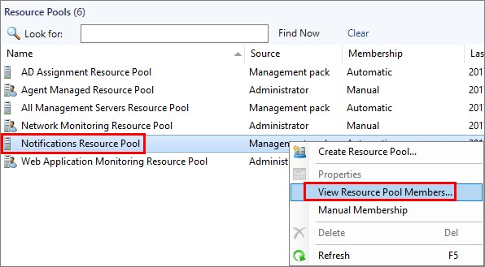](http://media.orneling.se/2017/06/1.jpg)

Now you´ll see the servers where you need to place the script. In my lab environment, I´m using “E:\\Scripts\\SetAlertCustomfield\\SetAlertCustomfield.ps1” as the full path of the script and it looks the same on both my management servers.  
[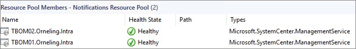](http://media.orneling.se/2017/06/2.jpg)

The script will be executed can be seen below. If you would like to update another Custom Field, just change the Custom Field number on row 20.

```
<#
Author:  Daniel Örneling
Twitter: @DanielOrneling
Date:    25/6/2017
Script:  SetAlertCustomfield.ps1
Version: 1.0
Description: Use this script to set the computer name for each alert concerning low disk space.
#>

# Set up a connection to Operations Manager
Import-Module OperationsManager
New-SCOMManagementGroupConnection

# Get the alerts to work with
$alerts = Get-SCOMAlert | where {$_.Name -eq "Logical Disk Free Space is low" -and $_.ResolutionState -ne "255"}

# Update each alert with the information from the property NetbiosComputerName
foreach ($alert in $alerts)
{
Set-SCOMAlert -Alert $alert -CustomField1 $alert.NetbiosComputerName
}

Exit
```

Just to show what it looks like default I have generated an alert for you to see below. And as you can see there is nothing in Custom Field 1. Pay attention to “Last Modified By”, you´ll understand why later in this post.  
[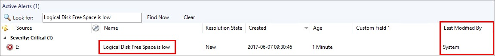](http://media.orneling.se/2017/06/3.jpg)

**Create the channel**

Now that the script has been put in its place, it´s time to create the channel which will be updating the alerts.

Navigate to Administration -> Notifications -> Channels, right click the empty space, choose New and “Command…”. Name your channel and move on.  
[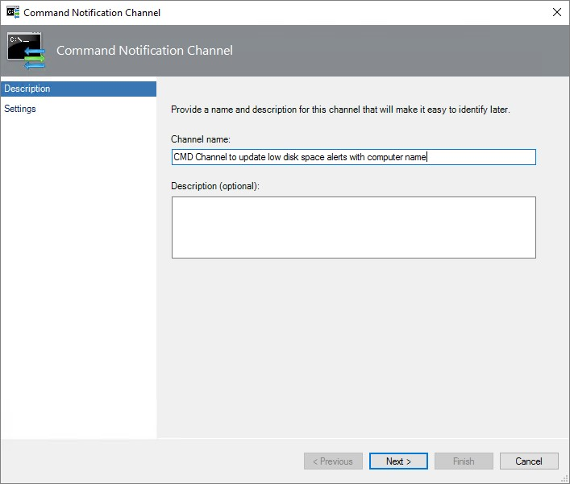](http://media.orneling.se/2017/06/4.jpg)

Here you need to put the path of the PowerShell exe and the full path of the script. The command line parameters are what will be executed in the PowerShell session. In this case, only the script will be run and nothing else. Click Finish and your channel is created and ready to update alerts for you.  
[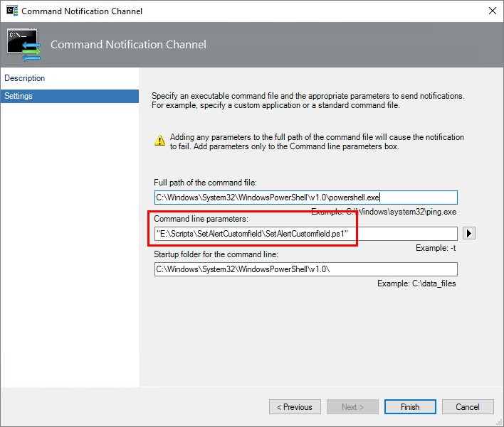](http://media.orneling.se/2017/06/5.jpg)

**Create the subscriber**

The next thing we need to create is a subscriber, this needs to be done to connect the subscription with the channel in the end.

Navigate to Administration -> Notifications -> Subscribers, right the click the empty space and choose “New…”. Name your subscriber and move on.  
[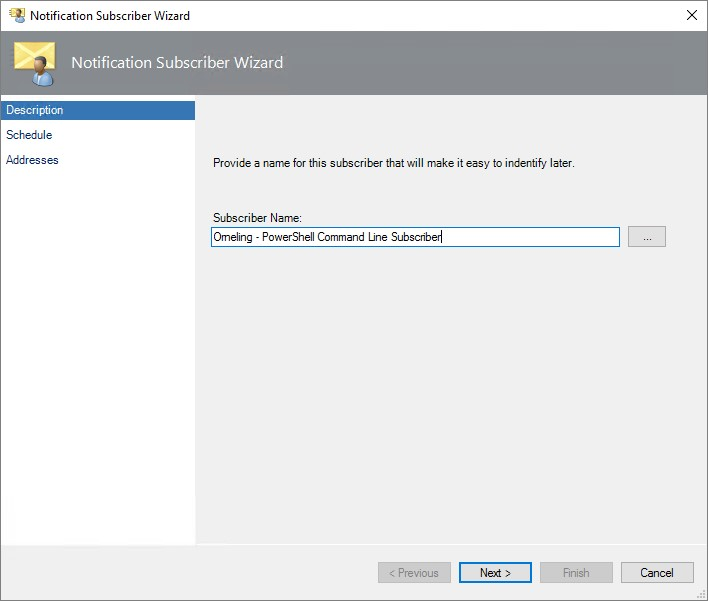](http://media.orneling.se/2017/06/6.jpg)

Just click past this option. Obviously, you want this subscriber to work around the clock.  
[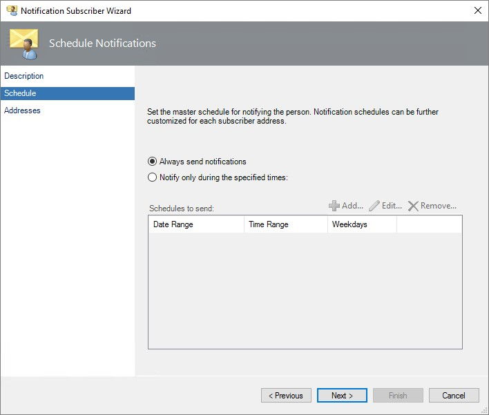](http://media.orneling.se/2017/06/7.jpg)

Heading on to Addresses, you need to create a new one for this subscriber. Just click “Add…”.  
[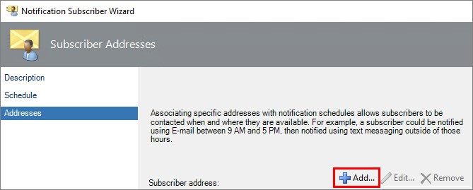](http://media.orneling.se/2017/06/8.jpg)

Give the address an appropriate name and click Next.  
[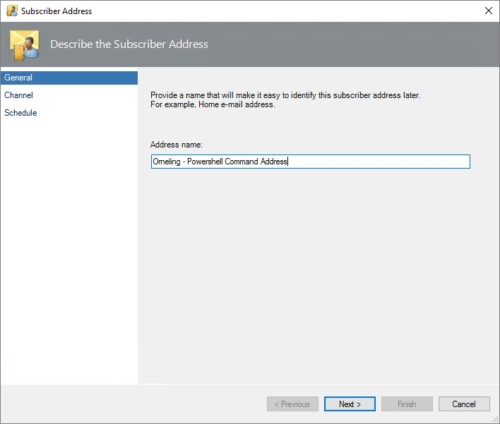](http://media.orneling.se/2017/06/9.jpg)

The next thing is to choose how notifications should be delivered to this subscriber. In this case, we´re going to choose Command as Channel Type and then picking the command channel we just created.  
[](http://media.orneling.se/2017/06/10.jpg)

Stay with “Always send notifications” and click Finish.  
[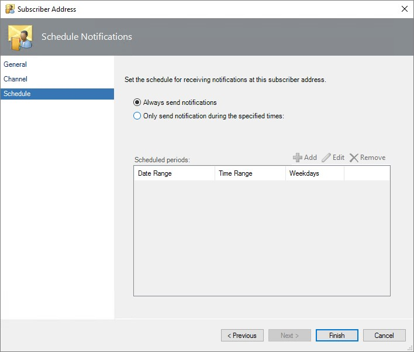](http://media.orneling.se/2017/06/11.jpg)

Click Finish again and your subscriber is ready.

**Create the subscription**

The last thing to do before we can try it out is to create a subscription. This will be used to trigger the channel on certain alerts.

Navigate to Administration -> Notifications -> Subscriptions, right click the empty space and choose “New…”. Name the subscription, kind of like I´ve done below and move on.  
[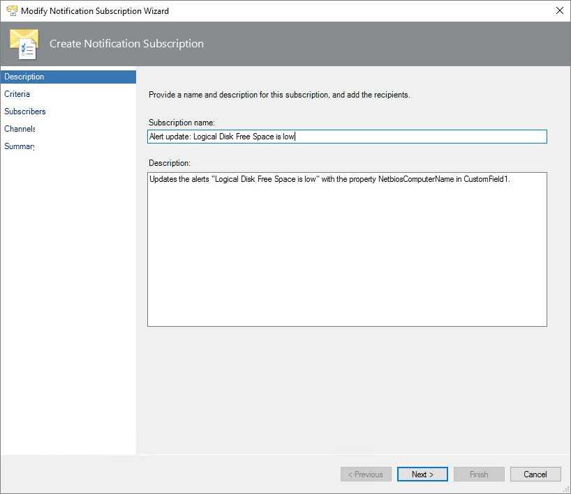](http://media.orneling.se/2017/06/12.jpg)

In criteria, there are three filters we need. The first is that we want the channel to update the new alerts, the resolution state in this case is 0. The second filter we need to put it is the “with a specific name” where we put in the name of the alert. In this case its “Logical Disk Free Space is low”.

The last thing we need to define is the “last modified by” where we will type in %System%. The reason for this is that when an alert is first created, its created under “System” as the user who last modified it. As soon as we have updated the alert using the script, it will be changed to last modified by the user that is your SCOM Action Account. By putting in “%System%” above, we can stop SCOM from adjusting the alert repeatedly. This way, the alert will only be updated once by this channel and the other subscriptions can take over and do their job instead.

Click Next to move on.  
[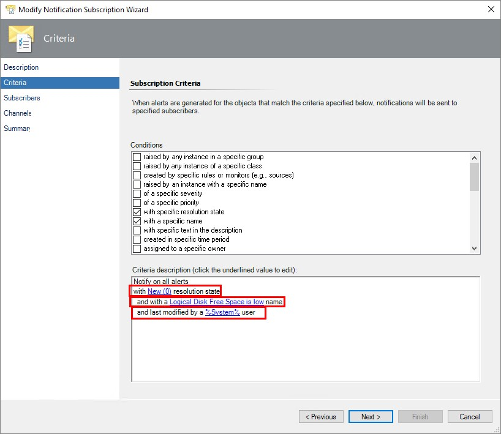](http://media.orneling.se/2017/06/13.jpg)

Under the Subscribers pane, click “Add…”.  
[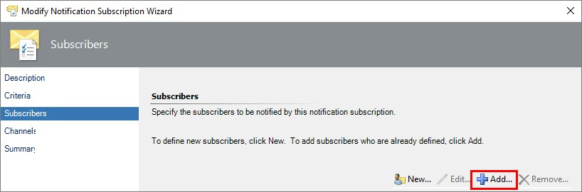](http://media.orneling.se/2017/06/14.jpg)

Click Search and add the command line user created earlier.  
[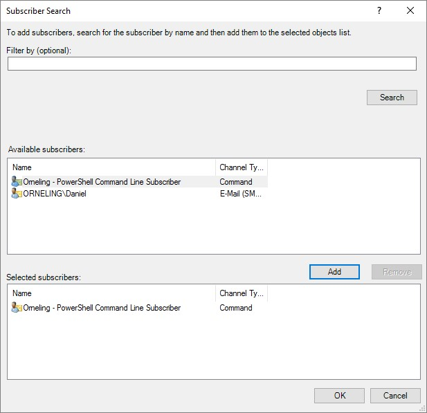](http://media.orneling.se/2017/06/15.jpg)

Head over to Channels and click “Add…”.  
[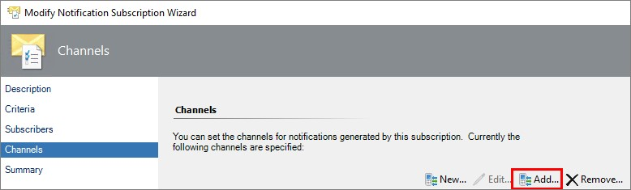](http://media.orneling.se/2017/06/16.jpg)

Once again, click search and add your CMD channel created earlier.  
[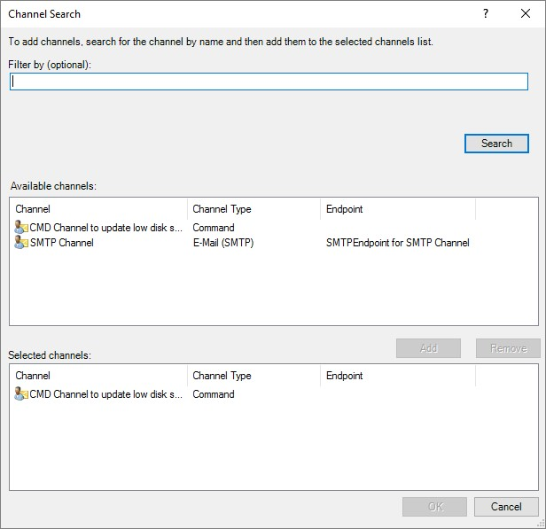](http://media.orneling.se/2017/06/17.jpg)

This is also a part you need to pay attention to. For this subscription, we will use “Send notifications without delay”, but you will need to adjust your other subscriptions to use a delay of 2-3 minutes to give SCOM time to update your alerts with the Custom Field information.

Click Next followed by Finish are you´re ready.  
[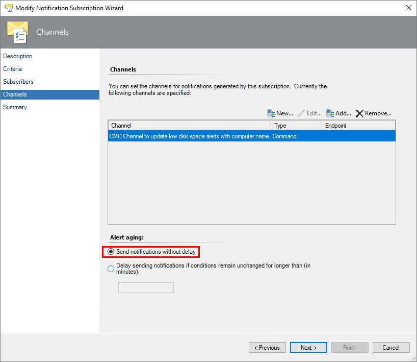](http://media.orneling.se/2017/06/18.jpg)

**Testing the script**

Time to test the solution. Since I didn´t have a full disk, I just made copies of copied filed to fill the disk and generate the alert again. About 30 seconds after the alert were created, it had been updated with the information as seen below.  
[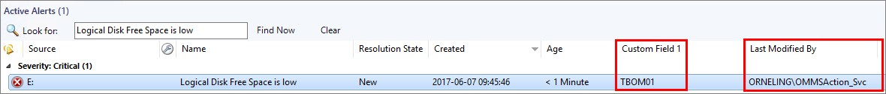](http://media.orneling.se/2017/06/19.jpg)

Sweet, that works like a charm and you don´t have anything else to do just some minor adjustments to your other channels and subscriptions. You need to update your channels for SMTP to include Custom Field 1 (or whichever you chose) as well in the mail body that is sent out to the subscribers.

And as I mentioned above, you also need to update your other subscriptions to use a delay of 2-3 minutes for this channel to have time to work on the alert before it can be sent out.

**Summary**

Okay, so we have a way of updating the alerts with the information we want to include. It´s really easy and fast to get going, and can of course be used for other alerts instead if you´d like. What I´ve done here shows how easy it is to update an alert with some custom information. This is just an example, and as the field NetbiosComputerName is blank in many alerts this example is "locked" to only these alerts. However, you can always find the information you want about the alert through PowerShell and modify the script as you like.

If you have any questions about what I´ve done here, leave a comment below.

**Update:** Since launching the post, I´ve seen that the disconnecting of the session might fail. I have updated the script both in the post and over at TechNet Gallery. Download the script again and you will receive the updated version instead.
