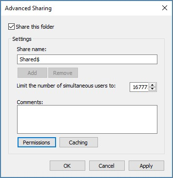
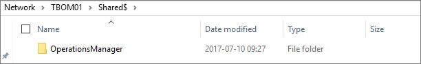
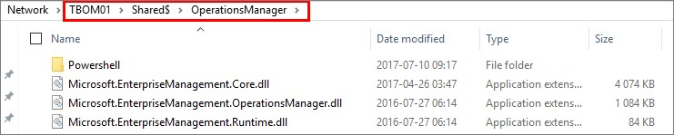
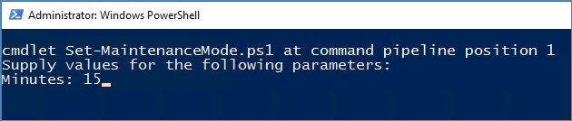
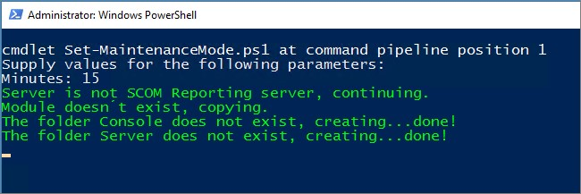

### **UPDATE 2018-09-07**

_I have rewritten parts of the script to function with SCOM 1801 and newer as well. The script in this post is meant to run on SCOM 2016, but the steps you shall pursue are the same for 1801 and newer as well. You´ll find the correct download links further down in the blog post._

Are you a SCOM admin? Have you ever received a call or an e-mail from a user or technician asking you to put a server in maintenance mode in SCOM? You have? Then I think you have something in common with most SCOM admins out there. Today, I will share a solution letting you put a server into maintenance mode directly from the server itself.

This will help your technicians by letting them put the server into maintenance mode themselves, and it will save you from some phone calls.

The solution consists of a PowerShell script that will be placed on each server, and a shared folder containing some DLL files and the Operations Manager PowerShell module.

To get it running, you need to perform the following tasks;

- Create a share on one of the management servers
- Download the script to a server and edit the script
- Copy the DLL and PowerShell files needed to run the script

### **Getting started**

Start by creating a folder named “Shared” on one of your management servers with another folder named “OperationsManager” in it. Then right click the “Shared” folder and select “Properties”. Then click the “Sharing” pane followed by “Advanced Sharing…”.

Mark “Share this folder” and then add a dollar sign after the share name. See the picture below for what it should look like; 

Click Permissions and verify that “Everyone” has Read access. Click OK and then Apply and close the window. Now verify that the share is working as it should, as seen below; 

Your share is ready and you can move on to copying the files needed to run the script.

Download the script place it (preferably) on the desktop of a server that isn´t a SCOM Management Server.

- _For SCOM 2016 environments, download the script [here.](https://gallery.technet.microsoft.com/Start-SCOM-Maintenance-38591fec)_
- _For SCOM 1801 and newer environments, download the script [here](https://gallery.technet.microsoft.com/Start-SCOM-Maintenance-94633ef8)._

To get started you will need to adjust some parameters of the script. The following is what need to be changed:

- On line #35; type the fully qualified domain name (FQDN) of one of your management servers.
- On line #36; type in your domain name as seen in the script. se for example.
- On line #39; type in the shared path to be used.
- On line #43; Make sure that the path is exactly as it is on your SCOM reporting server.

The script is seen below;

<#
Author:  Daniel Örneling, Approved Consulting
Twitter: @DanielOrneling
Date:    10/7/2017
Script:  Set-MaintenanceMode.ps1
Version: 1.0
Description: Use this script to set a server into maintenance mode in Operations Manager. Note: This works only for SCOM 2016. 
			 If you´re using SCOM 1801 or newer, you should use this one instead: https://gallery.technet.microsoft.com/Start-SCOM-Maintenance-94633ef8

Copy the following files to a shared folder named "OperationsManager";

From C:\\Program Files\\System Center <generation>\\Operations Manager\\Server\\SDK Binaries
Microsoft.EnterpriseManagement.Core.dll
Microsoft.EnterpriseManagement.OperationsManager.dll
Microsoft.EnterpriseManagement.Runtime.dll

Also copy the folder "PowerShell" located in "C:\\Program Files\\Microsoft System Center <generation>\\Operations Manager" to the same folder as above.

In order for this script to work, you need to go through the following parameters and make sure they fit your environment;
$ManagementServer
$Domain
$SCOMModuleRemotePath
$SCOMReportingPath
#>

# Type in the amount of minutes you want to put the server to maintenance mode
param
    (
	\[Parameter(Mandatory=$true)\]
	\[string\] $Minutes
	)

# The name of the management server to connect to and the local domain. Adjust the values to match your environment.
$ManagementServer = "FQDN of your management server"
$Domain  = "YourDomain.com"

# Set the parameters needed
$SCOMModuleRemotePath = "\\\\Your Management Server FQDN\\Shared$\\OperationsManager\\" # Type in the remote share where the files are placed
$SCOMLocalPath = "C:\\Program Files\\Microsoft System Center 2016\\Operations Manager"
$SCOMModuleLocalPath = "C:\\Program Files\\Microsoft System Center 2016\\Operations Manager\\Powershell\\OperationsManager"
$SCOMModule = "C:\\Program Files\\Microsoft System Center 2016\\Operations Manager\\Powershell\\OperationsManager\\OperationsManager.psm1"
$SCOMReportingPath = "C:\\Program Files\\Microsoft System Center 2016\\Operations Manager\\Reporting"

# Check if the server is a SCOM reporting server or not
if (Test-Path $SCOMReportingPath)
{
#$SCOMLocalPath = "C:\\Program Files\\Microsoft System Center 2016"
Write-Host "Server is SCOM Reporting server. Copying module." -ForegroundColor Green -ErrorAction Ignore
Copy-Item "$SCOMModuleRemotePath\\\*.\*" -Destination $SCOMLocalPath -Recurse -ErrorAction Ignore
Copy-Item "$SCOMModuleRemotePath\\Powershell" -Destination $SCOMLocalPath -Recurse -ErrorAction Ignore
}
else
{
Write-Host "Server is not SCOM Reporting server, continuing." -ForegroundColor Green
}

# Copy the OperationsManager module to the server
if (Test-Path $SCOMLocalPath)
{
Write-Host "Module already exists, no action needed." -ForegroundColor Green
}
else
{
Write-Host "Module doesn´t exist, copying." -ForegroundColor Green
Copy-Item $SCOMModuleRemotePath -Destination $SCOMLocalPath -Recurse
}

Set-Location -Path $SCOMLocalPath
$Folders = "Console","Server"

foreach ($Folder in $Folders)
{
Write-Host "The folder $Folder does not exist, creating..." -ForegroundColor Green -NoNewline
New-Item $Folder -type Directory -Force | Out-Null
Write-Host "done!" -ForegroundColor Green
}

# Load the DLL´s needed to import the module
\[Reflection.Assembly\]::LoadWithPartialName("System.EnterpriseServices") | Out-Null 
\[System.EnterpriseServices.Internal.Publish\] $publish = New-Object System.EnterpriseServices.Internal.Publish
$publish.GacInstall("C:\\Program Files\\Microsoft System Center 2016\\Operations Manager\\Microsoft.EnterpriseManagement.Core.dll")
$publish.GacInstall("C:\\Program Files\\Microsoft System Center 2016\\Operations Manager\\Microsoft.EnterpriseManagement.OperationsManager.dll")
$publish.GacInstall("C:\\Program Files\\Microsoft System Center 2016\\Operations Manager\\Microsoft.EnterpriseManagement.Runtime.dll")

#Get the PowerShell Module Path
$PSModulePath = \[Environment\]::GetEnvironmentVariable(“PSModulePath”)

#Add to the existing path the additional path to the Operations Manager module
$PSModulePath += “;C:\\Program Files\\System Center 2016\\Operations Manager\\Powershell\\”

#Set the new path to the PSModulePath variable
\[Environment\]::SetEnvironmentVariable(“PSModulePath”,$PSModulePath)

# Import the module and connect to Operations Manager
Import-Module $SCOMModule
New-SCOMManagementGroupConnection $ManagementServer

# collect the computer name running the script and set as a parameter
$ServerName = $env:computername + '.' + $Domain

# The user name of the logged on user	
$LoggedOnUser = $env:USERDOMAIN +"\\"+$env:USERNAME	

# Put the server in to maintenance mode for the appointed amount of minutes
$AgentInstance = Get-SCOMClassInstance -Name $ServerName
$Time = ((Get-Date).AddMinutes($Minutes))
Write-Host "The server $ServerName will be put in maintenande mode for $Minutes minutes. Starting maintenance mode." -ForegroundColor Green
Start-SCOMMaintenanceMode -Instance $AgentInstance -EndTime $Time -Reason "PlannedOther" -Comment "Script generated maintenance mode."

New-EventLog -LogName "Operations Manager" -Source "PowerShell Script" -ErrorAction SilentlyContinue
Write-EventLog -LogName "Operations Manager" -Source "PowerShell Script" -EventID 1217 -EntryType Information -Message "The server $ServerName has been put into maintenande mode by $LoggedOnUser for $minutes minutes."

Start-Sleep -Seconds 5
Exit

 

First, let’s verify that you can reach the “OperationsManager” folder by using the UNC path. The path should look like \\\\YourManagementServer\\Shared$\\OperationsManager.

Now, copy these three DLL files from “C:\\Program Files\\System Center 2016\\Operations Manager\\Server\\SDK Binaries”;

- EnterpriseManagement.Core.dll
- EnterpriseManagement.OperationsManager.dll
- EnterpriseManagement.Runtime.dll

Copy these three files and place them in the “OperationsManager” folder you just created.

You then need to copy the folder named “PowerShell” from "C:\\Program Files\\Microsoft System Center 2016\\Operations Manager" on your management server and place it directly under the “OperationsManager” folder.

Once you have copied all these files, your shared folder should look like below; 

### **Run the script**

Now that the share has been created and the files are copied, you should be able to run the script.

Run the script from the desktop by right clicking it and choose “Run with PowerShell”. Next, you need to type in how many minutes the server should be placed in maintenance mode. The minimum value is 5 minutes. 

The script will now start to copy the files from the management server to the server where you´re running the script. This means that the next time you run the script from the server, no files need to be copied and you will save a few seconds executing it.

The script will copy the files, import the Operations Manager PowerShell module and start maintenance mode for the given number of minutes you typed in. This shouldn’t take more than 10 seconds tops, but it depends on your bandwidth between the servers.

### Logging

Once the script runs, an event with the ID 1217 will be written to the "Operations Manager" event log, stating that the server has been put into maintenance mode, including the number of minutes and also which user ran the script. A perfect thing to either make an informational rule or collect it with OMS Log Analytics. This way you can track how often servers are put to maintenance mode and who did it. 

### **Known issues**

The only known issue that might affect this script is related to PowerShell and has really nothing to do with the script. Normally PowerShell don’t allow for custom scripts to run on a server. To go around this issue, the execution policy needs to be set to Unrestricted.

This is done by running the following command: _Set-ExecutionPolicy -ExecutionPolicy Unrestricted_

### **Summary**

What you´ve seen here is how you can easily put a server into maintenance mode without having to go through a Management Server or a server with the Operations Console installed. The script has been built for SCOM 2016 but should work fine for SCOM 2012 as well, just change the paths to match your SCOM 2012 environment instead.

Another thing I want to point out is that the lines 1 through 96 is aiming to import the Operations Manager PowerShell Module. What you do after those lines are completely up to you. Feel free to update the script to do something else with the module if you want to use it for something else.

If you have any questions, drop a comment below and I´ll get back as soon as I can.
