A lot of companies that uses SCOM as a part of their processes wants to delegate control over certain areas to certain teams responsible for different services and areas. Instead of installing the Operations Console on all computers for all users, the web console (which is still in some ways depending on Silverlight) can be used for many cases to deliver information on an alert. Since the web console is used as a working tool, shouldn’t it be made properly available and easy to access to help people get to the alerts in a quick way?

The answer to that question if of course a “yeah, dude” and that´s what I will show in this series over two blog posts. In this first post I will go through how to set up a cluster to build the foundation for the console to be both fault tolerant and load-balanced.

For this series, I will be using the Windows Feature “Network Load Balancing” which is included in Windows Server.

**Necessary network configurations**

For this to work, I have added an extra NIC to both my SCOM servers that are running the web console. This is the NIC that will be a part of my cluster. For this to work, I need to enable MAC spoofing on the interface. Since I´m running my lab environment on Hyper-V, I’ll show below how it´s done on a Hyper-V VM.

Right click the VM and select Settings. If you haven´t done so already, add an extra NIC to the servers where you have installed the SCOM web console. Click Advanced Features and check “Enable MAC address spoofing”.

Repeat this process for the all your web console servers and set an IP address on the new interfaces in your servers. You´re ready to move on to the cluster creation. [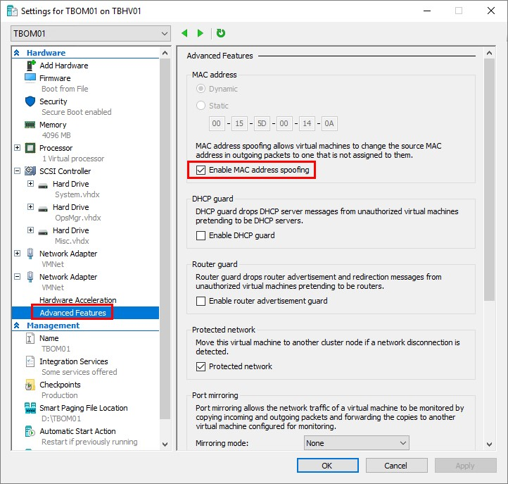]

**Creating the cluster**

Add the Windows feature “Network Load Balancing” on all servers with the PowerShell command _Install-WindowsFeature NLB._

Once the NLB feature is installed, launch the Network Load Balancing Manager from the start menu, right click “Network Load Balancing Cluster†and choose New Cluster. [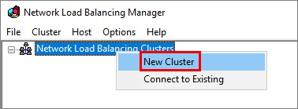](http://media.orneling.se/2017/10/2.jpg)

Now let´s pick the first host to be a part of the cluster. Type the host name and click connect. Now pick the IP address of the interface where MAC spoofing is enabled. [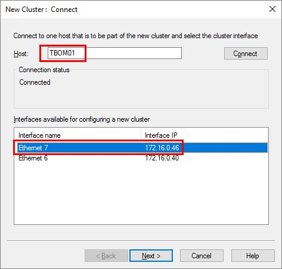](http://media.orneling.se/2017/10/3.jpg)

Click Next to move on in the wizard. [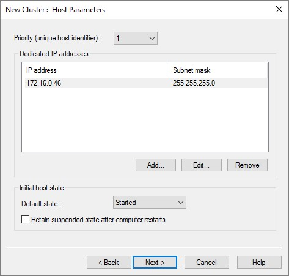](http://media.orneling.se/2017/10/4.jpg)

Add an IP address for the cluster. This is the IP address that we will go towards to reach the web console later. [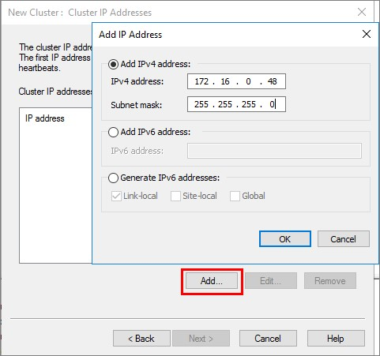](http://media.orneling.se/2017/10/5.jpg)

Add a name for the cluster. This is what I´ll be using to connect to the cluster later. [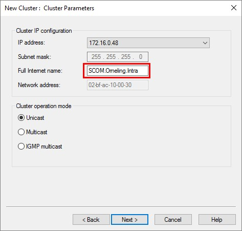](http://media.orneling.se/2017/10/6.jpg)

This is an important part of the process as it states how the NLB should be routing traffic. [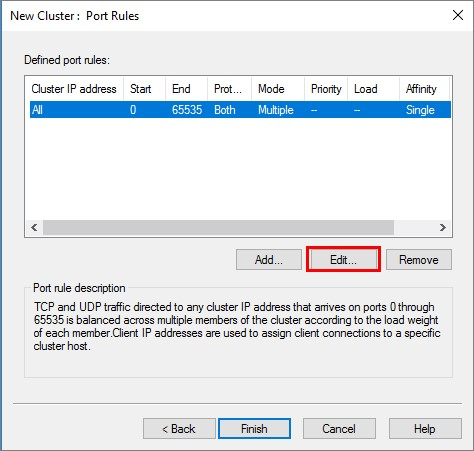](http://media.orneling.se/2017/10/7.jpg)

To have the cluster both fault tolerant and load-balanced, we need to choose None under Affinity here. This makes sure the traffic is distributed equally between the hosts that are part of the cluster. If we were to stick with the default “Single”, the traffic would have been routed to a single node with the highest priority. [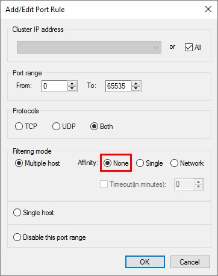](http://media.orneling.se/2017/10/8.jpg)

Click OK and finish the wizard to create the cluster.

Right click the cluster and choose “Add Host To Cluster”. [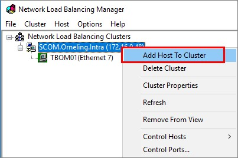](http://media.orneling.se/2017/10/9.jpg)

Enter the name of another host to join the cluster, pick the MAC spoofing enabled NIC and move on. [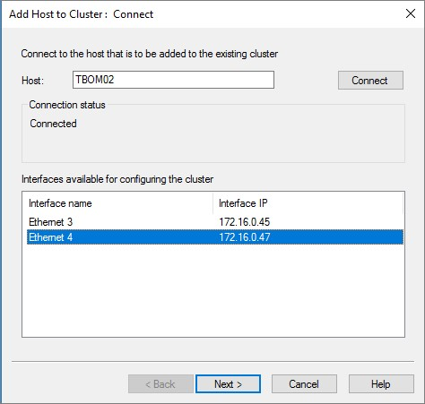](http://media.orneling.se/2017/10/10.jpg)

Just click through the rest of the wizard without making any additional changes and your cluster is good to go. Repeat this process for the remaining servers you want to join the cluster.

Now, you should be able to ping the cluster name. You might need to add a DNS entry as well, but as soon as you have name resolution you will see a result like this. [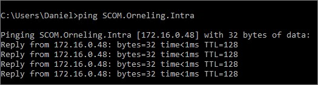](http://media.orneling.se/2017/10/11.jpg)

**Testing the cluster**

Now that the cluster is alive and kicking let’s try it out. To make this demo a little less boring I have edited the standard IIS starting page on my both servers to display the server name. As you can see below in the pictures I have accessed the cluster address from two servers. And as you can see, the traffic is load-balanced between the two and we are ready to move on to working with the web console. [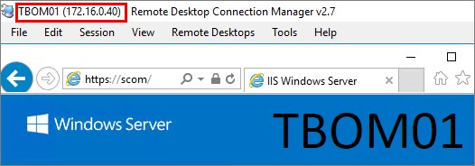](http://media.orneling.se/2017/10/12.jpg) [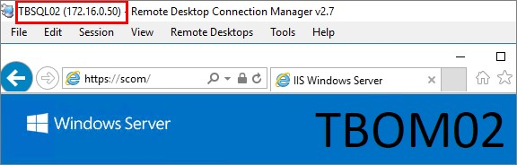](http://media.orneling.se/2017/10/13.jpg)

**Summary**

And that’s how to set up the load-balancing and fault tolerant part of the process. This is the foundation that we´ll use for accessing the web console later. I didn’t want to make a single mile long blog post so I decided to split the process in two separate posts. In the next post you’ll see how to configure the web console to work with the cluster.

This part might seem easy to get going with and that´s because it is easy to get going 😊. Hang tight for the next post in this series and as always, if you have any questions leave a comment below and I’ll get back as soon as possible.
