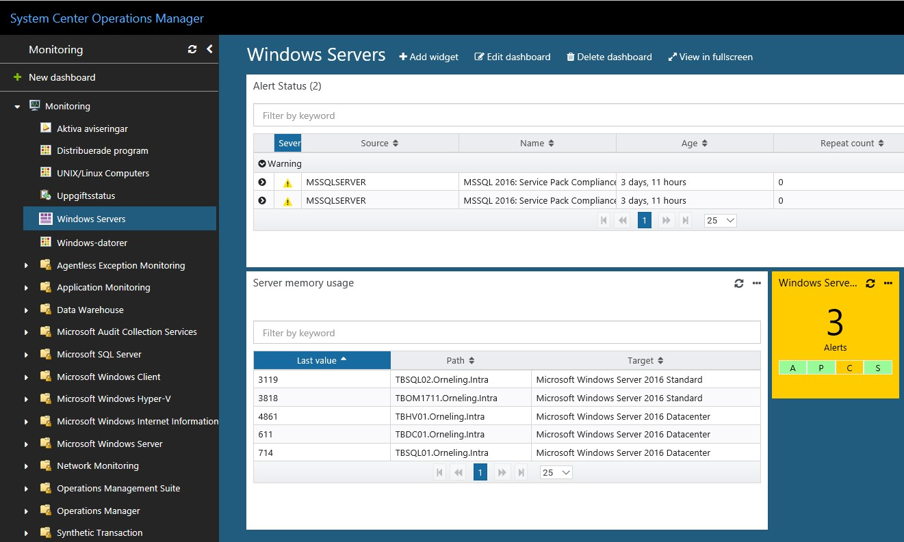

Earlier this year, Microsoft announced a coming big change for the System Center suite. Instead of launching new versions every fourth or fifth year as before, they will now release continuous updates. This means they will launch two new versions per year to fasten up the release cycles and to really keep the products up to date.

This isn´t anything new, it´s been done for Configuration Manager ever since Windows 10 launched about two years ago. This schedule, called “semiannual channel release” will now also include the other parts of the System Center suite. Except for System Center, this goes for Windows Server as well. Besides from Windows Server 2016, you can now download and install Windows Server 1709 (YY/MM).

The first release I will be looking at is the one that in the end will be named 1801. Last week Microsoft launched a Technical Preview of System Center 1711, a preview that will later become 1801 which is meant to be released in January.

**News in SCOM 1801**

Okay, so there´s a new version of SCOM on its way. But what are the news that will make it worth the while to look at SCOM 1801 instead of 2016? A whole bunch of news.

- Enhancements in performance that for example allow for the console to continue to respond while a management pack is imported, deleted or changed.
- ”Updates and Recommendations” that were launched with SCOM 2016 now includes third-party products based on customer feedback.
- Log file monitoring for Linux/UNIX servers. With the support for FluentD you can now monitor Linux/Unix logs just as well as you can monitor Windows server logs. Some of the news is that you can now use wildcards in the log names and directories.
- Added support for Kerberos authentication between management servers and Linux/Unix servers. This adds to the security since you no longer need to activate ”basic authentication” for Windows Remote Management (WinRM).
- Integration between Operations Manager and Service Map, which is a part of Operations Management Suite (OMS). This integration gives you the ability to automatically map your applications and have distributed applications automatically generated (and maintained) in SCOM.
- Support for installing SCOM on Windows Server 1709. Note that 1709 is Core-only. There is no GUI available in this version, instead you should be looking at [“Project Honolulu”](https://docs.microsoft.com/en-us/windows-server/manage/honolulu/honolulu) for remote management.
- A completely new way of upgrading SCOM to newer versions (YY/MM) directly from within the Operations Console.
- And last, but not in any way the least. A completely re-rebuilt all HTML5 web console with no dependencies to Silverlight! (Finally!) You can now create your own dashboards inside the web console stored in a management pack of your choice, which makes it easy to export and backup those dashboards to be re-used. This new console will work in several different web browsers since there are no Silverlight dependencies. See an example below.

**Licensing**

So, what about the fine print? To be able to adopt these new releases of both System Center and Windows Server with this new release cadence, you need to have software assurance in your license agreement with Microsoft. As long as you´ve got that, you´ve got the future ahead of you. If you haven´t, it might be a good idea to look into it.

**Summary**

That’s a short summary of the news in SCOM 1711 (1801), if you ask me some very welcome and long-awaited news. Unfortunately, there are still no information available regarding the supported upgrade paths from 2012 R2 or 2016 for example. As long as this information becomes available I will write about that as well so keep checking back to find more information on SCOM 1801 and later versions.

Check back to see more in-depth reviews of the new version on the blog.
