Recently Altaro VM Backup was released in a new version, 7.6. This VM backup solution works for Hyper-V and VMware and this version introduces a bunch of new features. In my lab environment I´m using their backup solution to back up my servers. I have written about this once before a couple of years back but since a lot has happened during the years, it´s time to write a new review.

The new stuff in this version are the following; **Continuous Data Protection (CDP)** When CDP is enabled, VMs can be backed up as frequently as every 5 minutes or the maximum frequency permitted by the backup location and environment. This ensures that in a data loss scenario only a few minutes of data would be lost. **Grandfather-Father-Son (GFS) Archiving** GFS enables users to choose to archive the backup versions over and above their continuous and daily backups instead of deleting them (local backups only). Now you can easily set up separate backup cycles to store a new backup version every week, every month and every year.

And then a couple of bug fixes. Read more about the news and bug fixes [here](https://www.altaro.com/vm-backup/whats-new.php).

**The installation** The installation took about one minute and the most exciting choice I had to make during the installation were the one you can see below, where to install the application. [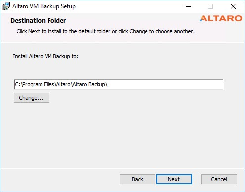](http://media.orneling.se/2018/03/1.jpg)

Finish the setup and jump directly into the management console and connect to “This Machine”. [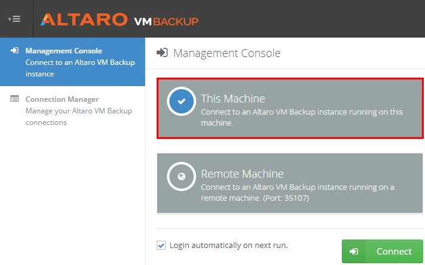](http://media.orneling.se/2018/03/2.jpg)

**Adding hosts to protect** So, it´s time to add the hosts we want to protect. For this review I´m going to back up my Hyper-V host that’s running on Windows Server 2016 and hosting my VM´s. Simply click Add Hyper-V / VMware Host. [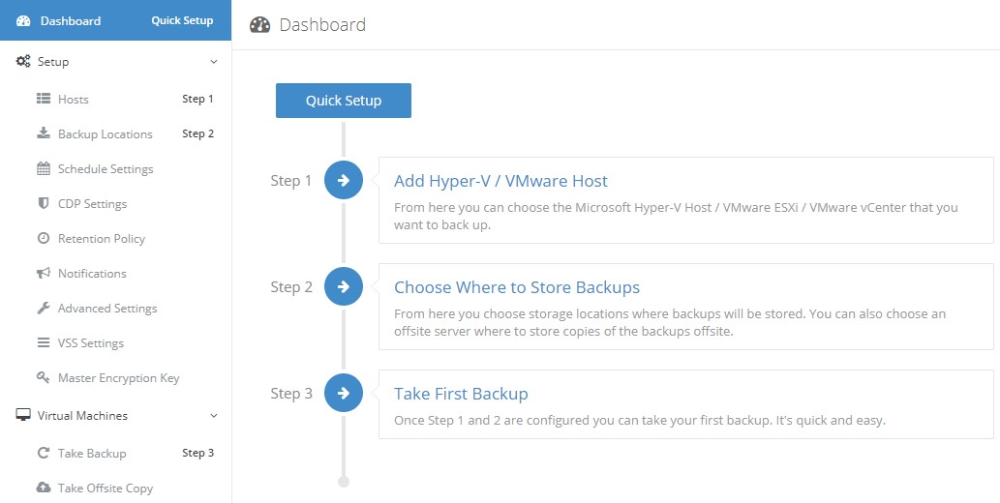](http://media.orneling.se/2018/03/3.jpg)

With VM Backup you can protect Hyper-V servers ranging from Windows Server 2008 R2 to 2016, vCenter, vSphere and ESXi ranging from 5.0 up to 6.5. [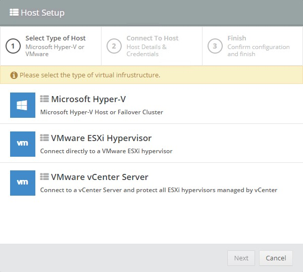](http://media.orneling.se/2018/03/4.jpg)

Fill in the details as I´ve done below and move on. If all is correct and the connection is open, you should be good to go. [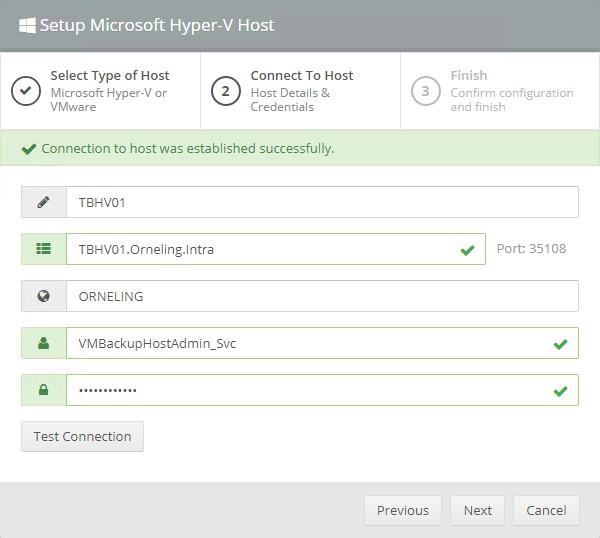](http://media.orneling.se/2018/03/5.jpg)

Hopefully you will meet the same I did. If not, make sure the port 35108 is open in the Windows Firewall on the Hyper-V Host and try again. [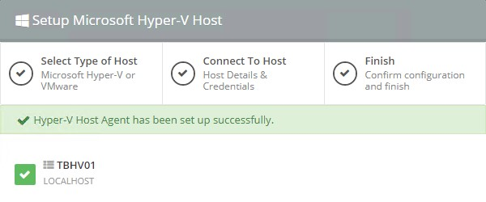](http://media.orneling.se/2018/03/6.jpg)

**Setting up backup locations** In my lab environment I´m going to use two different locations. My local NAS and an Azure Storage account to store my backups.

Move over to the “Backup Locations” section in the menu and you will see an overview of the VM´s along with the options to add backup locations. I´m going to start by adding my local NAS as a backup location, followed by the storage account. [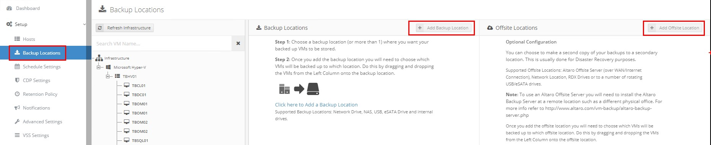](http://media.orneling.se/2018/03/7.jpg) Click the picture for a larger version

Take your pick, as you can see there are multiple options to where to store your backups. I´m going with my NAS, in other words a Network Path. [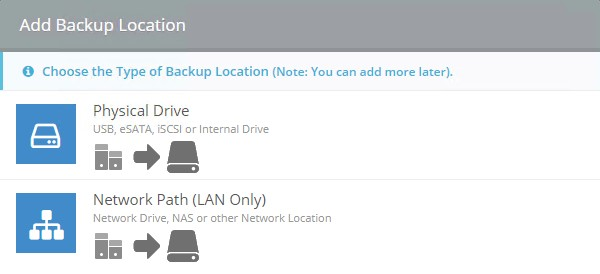](http://media.orneling.se/2018/03/8.jpg)

I entered the information needed to connect to the NAS and clicked “Test Connection”. All good and I could click Finish, and my backup location were set. [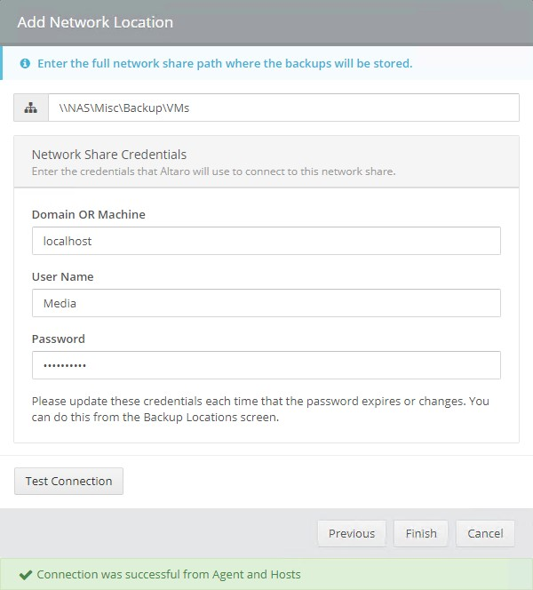](http://media.orneling.se/2018/03/9.jpg)

Time to add an offsite location. For this example, I will use an Azure storage account to store my backups. To be able to use this opportunity to store accounts in an Azure storage account, you need to meet the following requirements;

- Ensure you are running 7.5 or later to make use of this feature. Click here to download.
- You must be running the Unlimited Plus Edition in order to get access to this feature.
- It is supported for
    - VMware hosts (the Altaro Management machine must be running Windows Server 2012 and upwards)
    - Hyper-V Hosts running Windows Server 2012 upwards (the Altaro Management machine must be running Windows Server 2012/Windows 8 and upwards)

To find out more on how to set up an Azure storage account to use, look [here](http://support.altaro.com/customer/portal/articles/2814316). [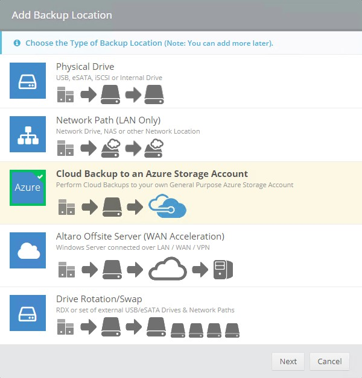](http://media.orneling.se/2018/03/10.jpg)

Copy the connection string found among the Access Keys for your storage account. [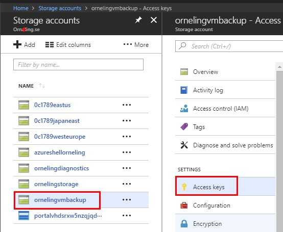](http://media.orneling.se/2018/03/11.jpg)

Paste the connections string to move forward as below and click “Test Connection”. You´re connection to the storage account is now complete so click Finish to move on. [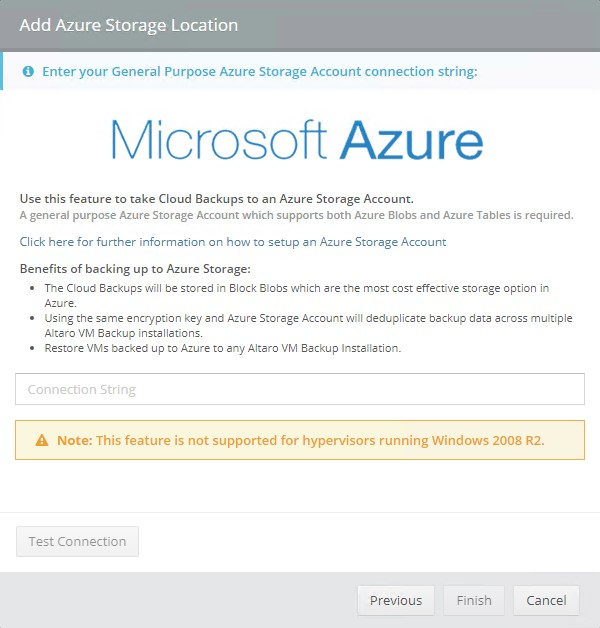](http://media.orneling.se/2018/03/12.jpg)

In the “Backup Locations” section, you can now drag and drop your VM´s (or a Host which will include its VM´s) to the different locations.

**Creating a backup schedule** In my environment, I have set up a schedule to back up my servers at 2 am Saturday nights, followed by an offsite copy. This can of course be configured to suit your needs, and you can create multiple schedules instead of just this one that I´m using. [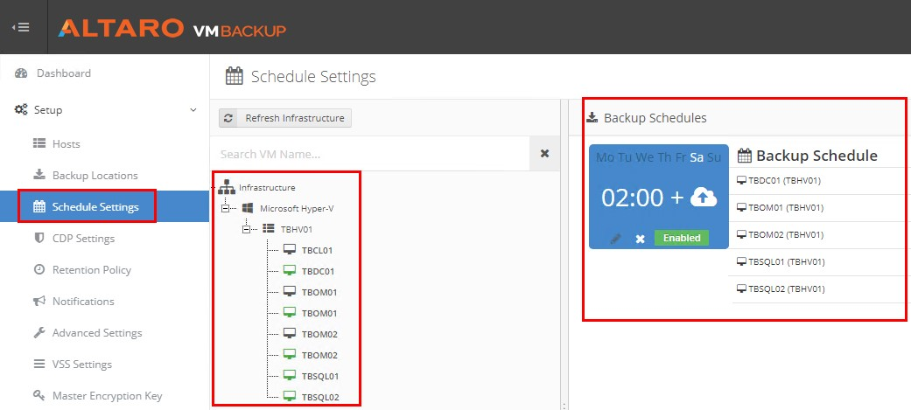](http://media.orneling.se/2018/03/13.jpg)

As you can see here, there are several possibilities to do backups at the time you´d like and on the day of your choice. [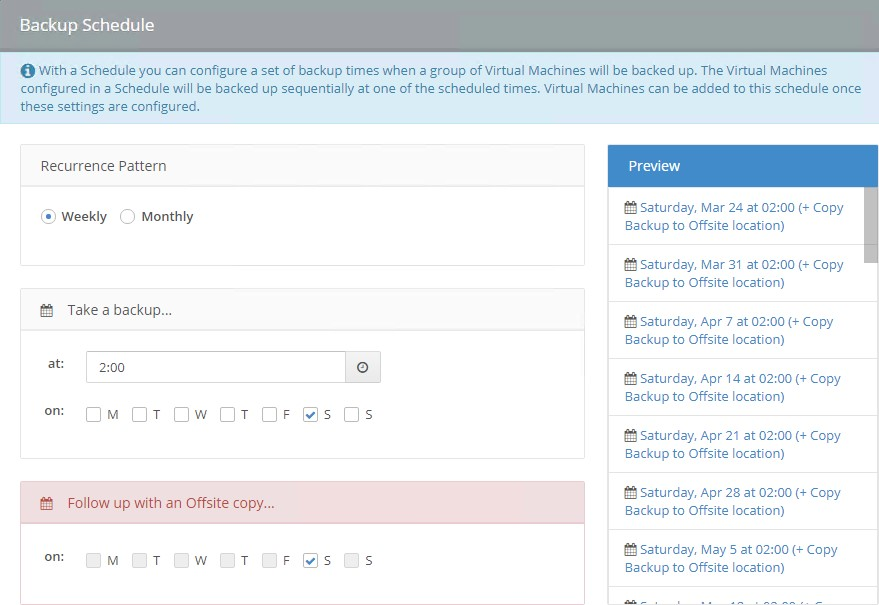](http://media.orneling.se/2018/03/14.jpg)

**Getting notifications** In the Notifications section there are two options. Email and Event Log notifications which are simple to setup and understand. 

Just type in the information needed to send E-mails through a SMTP server of your choice, put in a “From Address” and recipients. 

The Event Log notifications don´t offer much configuration possibilities. The first thing that come to mind for me is that this can easily be used with Azure Log Analytics to present Successful and Failed backups in a really easy (and good looking) way. [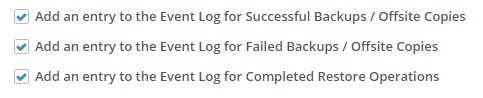](http://media.orneling.se/2018/03/17.jpg)

**Continuous Data Protection (CDP)** One of the news that I mentioned with this new version is the Continuous Data Protection. This allows for you to protect either all workloads or just single workloads to be protected much more often. You can protect the VM as often as every five minutes and take an application consistent backup every hour as seen below. Keep in mind that the backup will trigger a snapshot so think it through before you activate CDP protection to make sure the performance of the host(s) is affected as little as possible.

Note: As of right now CDP is only available for Hyper-V. VMware will be supported soon. [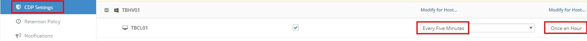](http://media.orneling.se/2018/03/18.jpg) Click the picture for a larger version

**Summary** For me that don’t work with backup as a specialty, VM Backup is real easy getting started with. All in all, the installation and the configuration of the backup locations, schedules, notifications etc. it took around 30 minutes (and I could have done it way faster). It´s easy to work with and works real fast. The backups are heavily deduplicated and my SQL Server which takes up 101 GB on the host took only 25 GB once backed up.

If you´re looking for a new VM backup solution, I really recommend looking into Altaro VM Backup and you can always get your free trial of the Unlimited Plus version (the same one I´m running) [here](https://www.altaro.com/vm-backup/download.php). Find more information on technical specifications and other questions [here](https://www.altaro.com/resources/faqs.php).

To summarize all of this, I really enjoyed trying this product out since it was very easy and intuitive with it´s easy to navigate user interface.
