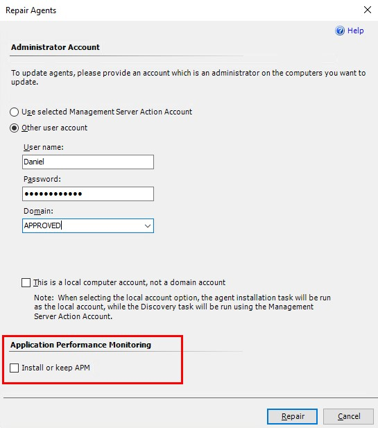
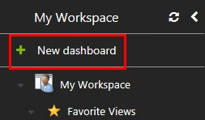
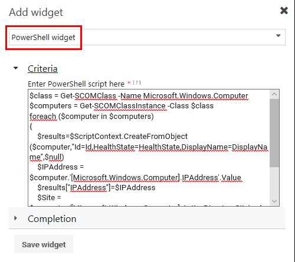
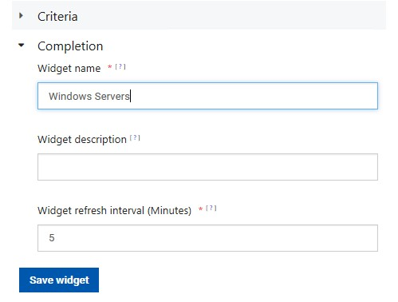

As I said in my last post, SCOM 1807 was released a few weeks back and I explained a little about the news and what they meant. This time it´s about showing them off to see how they work and what you can do with it. I have picked out some of the biggest news and played around with it to see how it works.

### **Removing the APM components from agents**

The first new thing I will show is how you can control whether APM should be installed on an agent or not. As I mentioned this has been an issue where APM might cause an IIS application pool to crash, especially concerning SharePoint.

This is real easy to configure and it’s all done either when installing a new agent or repairing an existing agent from the console (or PowerShell). As I have illustrated below, the APM components are on my agent. 

Run the ”Repair Agent” task and there you get to choose whether to keep APM or not. 

A moment later I could see here were no longer any APM components on the server. 

So, this feature is really easy to get going, of course it may take some time with changes and stuff to do this in a larger environment, but at least now we have a solution.

### **New PowerShell widget for the web console**

One of the other features I picked to write about is the new PowerShell widget that you can now use to display information of your choice through the web console. To show you what can be done I put together an example. This can just as well be done in “My Workspace” so you can build the dashboards there before you rebuild it to be visible to others.

Just click “New dashboard” to get started. 

Name the dashboard and choose where to store it. In my example I just kept the standard location but this should of course be different when making dashboards visible to anyone. 

Choose to use the “PowerShell widget” and you´re good to go. I have attached the example script I used for this demo so you can use it yourself and get going. This example will display the Health State, Display Name, IP Address and location of the windows servers in your environment 

The script you can use;

$class = Get-SCOMClass -Name Microsoft.Windows.Computer  
$computers = Get-SCOMClassInstance -Class $class
foreach ($computer in $computers)  
{  
    $results=$ScriptContext.CreateFromObject($computer,"Id=Id,HealthState=HealthState,DisplayName=DisplayName",$null) 
    $IPAddress = $computer.'\[Microsoft.Windows.Computer\].IPAddress'.Value
    $results\["IPAddress"\]=$IPAddress   
    $Site = $computer.'\[Microsoft.Windows.Computer\].ActiveDirectorySite'.value
    $results\["Location"\]=$Site
    $ScriptContext.ReturnCollection.Add($results)   
}

 

Finish by naming the widget and choose how often it should be refreshed. Click Save widget and you´re finished. 

This is what you get using my example, so you can get started. Feel free to add contributions in the comment section below. 

### **An effective configuration widget**

Another really great thing that’s new in SCOM 1807 is the effective configuration widget. To be able to use this feature, you need to add a “State widget” to your dashboard and select to show your windows computers. For this example, I have chosen to use the group “All Windows Computers” and the class “Windows Server 2016 and 1709+ Computers”. 

Click on a server and then hit the refresh button in the upper right corner of the “Effective configuration” box, and you will soon see the effective configuration. You can now drill down and have a look at what rules or monitors are active for that server, along with the potential overrides active. A nice feature which in an easy way lets us know exactly what our servers are tuned to do and when to do it. 

### **Change maintenance schedules in the web console**

The last new feature I´ll be showing in this blog post is the one that lets you manage maintenance schedules from within the web console, not just in the Operations console anymore. It gives you the same choices that you get in the Operations console, but in the non-heavy web console instead. Really nice and a really good addition. 

### **Summary**

This was my view of some of the news, at least the ones you can “touch” and really use in your daily work. Except for these new features, there are of course more that I haven´t mentioned in this post. Check my previous post here to read more about the other news as well.

If you have any questions, just leave a comment below and I´ll get back as soon as possible.
