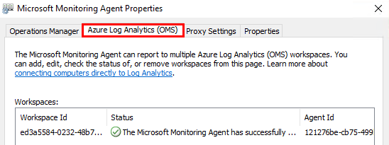
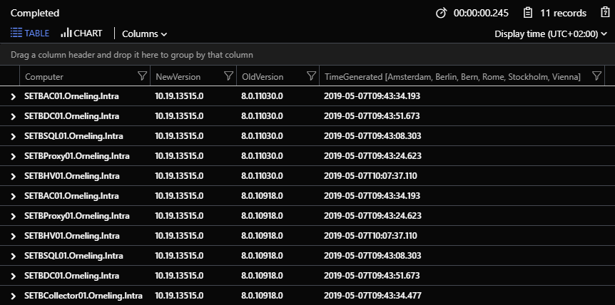
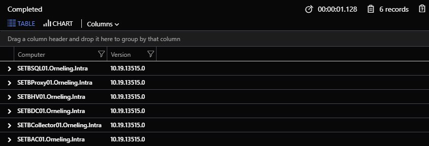

A while ago we were involved in a project with one of our customers where our goal was to connect a large amount of servers to Azure Log Analytics. They had already done this with a connection through SCOM, but when they added another management group to their servers, so called multi-homing it stopped working. This was a huge issue since the data they were sending to Log Analytics were really important to them, and we started discussing how to do this the best way. We eventually decided to go with a direct connection to Log Analytics, instead of going through SCOM as they had done before.

This was a really interesting project that we were more than happy to take on. But while there are several different ways of setting up the connection itself to Log Analytics, there´s a lot of factors to take in consideration.

## The issue

In this case, a large number of the servers where running an old SCOM 2012 agent which doesn’t have the opportunity to connect to Log Analytics since it´s missing the functionality for a direct connection to Log Analytics. The easiest way to see it on a server is to check the Microsoft Monitoring Agent properties in the Control panel. If it´s missing the “Azure Log Analytics (OMS)” pane, then it can’t be directly connected to Log Analytics, and therefore needs an upgrade.

[](https://media.orneling.se/2019/05/image.png)

The servers were already reporting to Log Analytics through SCOM, but now we chose to make a direct connection instead. One of the reasons were to be able to gain better control which servers were connecting to Azure, but also to skip SCOM as the middle hand.

## Keeping track of the agent upgrades

The upgrade itself may be done in a lot of different ways, it can be pushed through the SCOM console, deployed through Configuration Manager and other ways but in this case, it was done through Configuration Manager. The only challenge with pushing it through Configuration Manager is that you push it out to a certain collection of servers, but it can be difficult to follow the process as it´s not done in a “straight line” as if you had deployed it through PowerShell for example.

The main thing we needed to keep track of was that the agents were upgraded to the new version, but also that they continued communicating with Log Analytics. To do this, I wrote a query to be run in Log Analytics that checks the following things.

- Servers that are sending heartbets and that have a given version number
- Servers that are sending heartbets but don’t share the given version number above

Its basically two queries combined into one where a couple of fields are renamed to make it easier to follow and to make a nicer presentation. The good thing is that it doesn’t show anything until at least one agent that´s been talking to Log Analytics before has started reporting using the new version of the agent.

[](https://media.orneling.se/2019/05/image-1.png)

As you can see in the picture above, there are some different versions that´s been reporting to Log Analytics but the column “NewVersion” always shows the current version while you can see what version the agent have been upgraded from.

Since I´m using the “distinct” command in the query, you will never receive more than one line for each server and agent version.

The query can be seen below, just copy and paste it to the Log Analytics log search.

```
// Use this query to find out which servers have been upgraded from the earlier version of the agent to the new one.
// All that needs to be done is to replace the version number in the query with the version you´re upgrading to.
let old = Heartbeat
| where TimeGenerated > now(-1h)
| where Version in ("10.19.13515.0") // Update with the version number of the agent you´re upgrading to
| project-rename NewVersion = Version
| project Computer, NewVersion, TimeGenerated;
let new = Heartbeat
| where TimeGenerated > now(-1h)
| where Version !in ("10.19.13515.0") //Update with the version number of the agent you´re upgrading to
| project-rename OldVersion = Version
| project Computer, OldVersion, TimeGenerated;
old | join (new) on Computer
| sort by TimeGenerated desc nulls last
| distinct Computer, NewVersion, OldVersion, TimeGenerated
```

## Check all reporting servers, both old and new

If you were to just check which servers are reporting, even those that´s never been connected before, you could run a query like below instead.

[](https://media.orneling.se/2019/05/image-2.png)

This very simple query can be seen below, just copy and paste it to the Azure Log Analytics log search:

```
Heartbeat
| where TimeGenerated > now(-15m) 
| distinct Computer, Version
| sort by Computer desc nulls last
```

## Summary

This was a quick look at some of the things we needed to keep track of, and how we chose to do it. With these queries I´ve shown here, it´s easy to track the process since its displaying both the old version number and the new version number of the agents.

It´s amazing how much can be done to collect the information that’s stored in Log Analytics and how you can present it in so many ways. This was another fun and interesting project where we got the chance to help this customer on their way to a successful migration of their servers.

If you think this was interesting, keep your eyes open cause there´s more to come covering Azure Monitor. And if there are any questions, just leave a comment below and I´ll get back to you.
