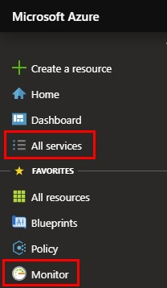
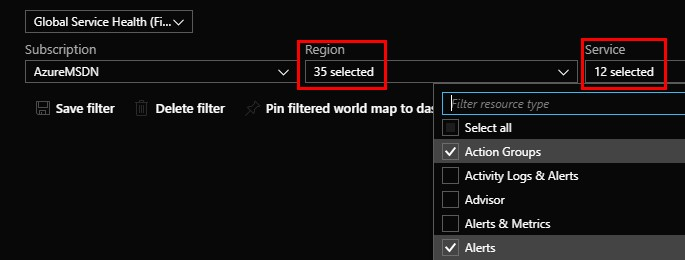
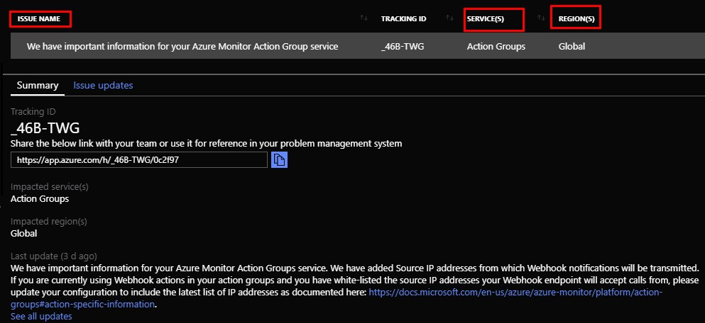
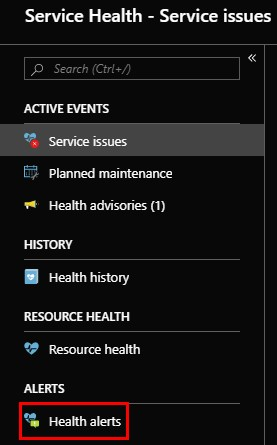
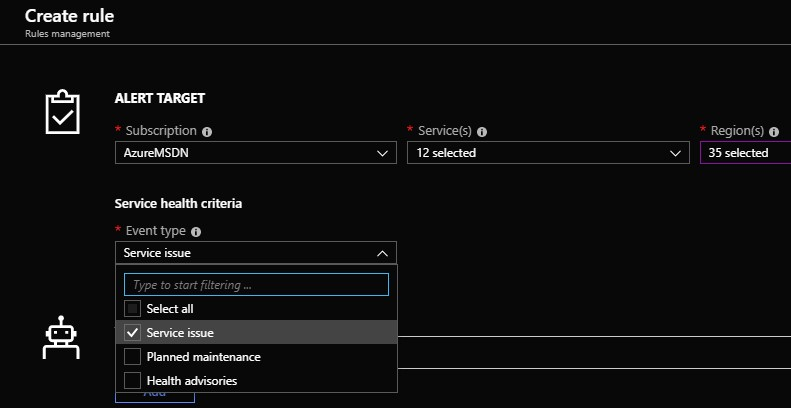
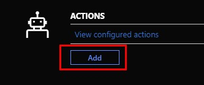
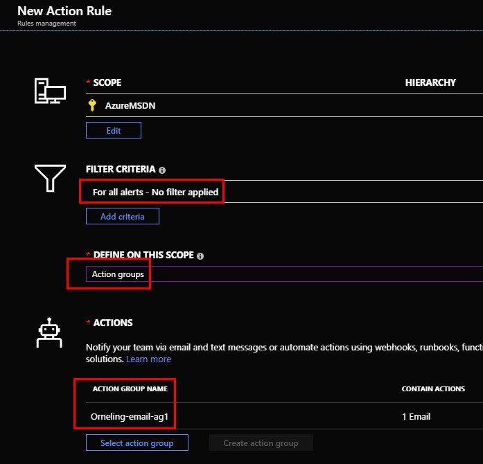
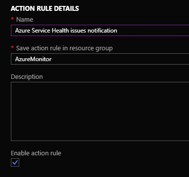
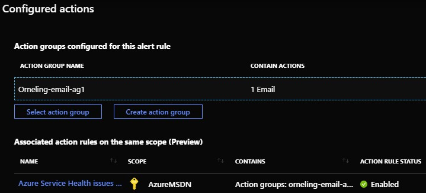
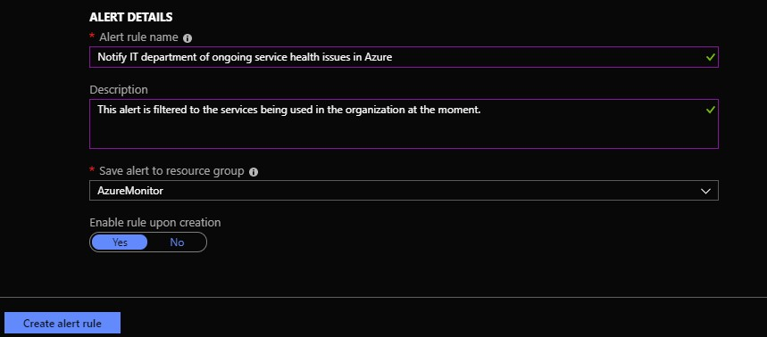

More and more services are moving to the cloud, Azure is one of the larges players but AWS and Google Cloud are also two large players. But just because resources are moving to the cloud doesn’t change the fact that we need to know how our environment is doing. Since I´m a monitoring guy, I write a lot about Azure Monitor and the capabilities of it to help us monitor our resources in the best possible way. But there is another aspect I want to touch as well, Azure service health.

While we monitor our resources using Azure Monitor, who monitors Azure Monitor as a service? Microsoft of course monitors all the Azure services to keep track of the status and to take immediate action when something goes down. We have the possibility to check up on Azure services from within Azure Monitor and that´s what I will be telling you more about with this post.

A few weeks back I wrote about how you can get started with alerting in Azure Monitor. If you haven’t read that post yet, I strongly recommend doing so before continuing with this post as it will help you understand what it is I´m doing and what I´m talking about. Find the post [here](https://blog.orneling.se/2019/05/azure-monitor-getting-started-with-alerting/).

## Checking the Azure Service health

To check the health of the services that make Azure great, move over to Monitor either from your favorites (like I did below) or through “All services” and then search for Monitor.

Now click Service health to the left in the menu.

In order to see the exact things you´re interested in, you need to filter what the alert will be based on. To be sure to receive notifications regarding global events as well as more local events, I have chosen to look at all regions. I have also scoped the amount of services to the ones that are interesting to me at this moment.

This would need to be updated when adding more services, but right now I don´t feel like receiving a notification about a service I´m not using.

While there were no ongoing issues with my services scope at the time of writing this blog post, I could see there were an active incident with Azure Automation three days ago. You can always click the issue name to learn more about the incident and to follow the progress in the case.

## Planned Maintenance and health advisories

If you´re curious about planned maintenance, which I think most of us would be when it comes to our IT environment, there is the tab “Planned maintenance” which will tell you more about planned maintenance that will affect your resources. Just as the active incidents above were none, there was no planned maintenance at the time of writing this blog post.

The other tab I want to tell you about is “Health advisories” which will tell us about changes that may affect our resources. In my case there was a change for the service “Action Groups” (which we will use in this blog post) that spanned all regions. You´ll get information of what´s been changed and you can also track the issue using either the Azure app ([Android](https://play.google.com/store/apps/details?id=com.microsoft.azure&hl=sv), [iOS](https://apps.apple.com/us/app/microsoft-azure/id1219013620)) or through the Azure portal.

## Creating alerts to notify about service health issues

Now, there are two ways of creating alerts. The first one is to click “Health alerts” to the left and create a new alert from there, as seen below.  There is a backside of using this way though, and that is you will start from scratch with the filter set to all services. Instead I choose to go back to “Service issues” where we were earlier and created our filtered view.

Click “Create service health alert”, and you will see that the service scope you set earlier is still there. The regions will still need to be changed though. But since I want to catch global events as well, I´m going to stick with all regions. Also, choose whether you want to receive “Service issue” alerts only, or if you want to receive information about planned maintenance or health advisories as well.

Next, click Add in the Actions section to configure the rule and the actions.

Click Select action group (if you read my previous blog you will either have at least one action group now, or know how to create a new one), and choose which one you would like to use. Then click “Create action rule”.

For this alert, I will not choose a specific filter criteria. I want to know everything that´s happening/happened.

Name your action rule accordingly so you can easily identify it later.

Now you should see something that looks like the picture below. Just click Done to save your progress.

Finally, name your alert rule and give it a description if you´d like (a description is always nice) and choose which resource group to store the alert in. Finish by clicking “Create alert rule”.

That´s it. From now on you will be notified about service health issues affecting any of your resources. The newly created alert will show up in the alert pane within Azure Monitor along with the other alerts created.

## Summary

Now that you have seen how you can be notified about ongoing Azure Service health issues, not only do you know how to receive the information, but also how to keep track of the progress. Even though Azure is one of the largest cloud providers, something will sometimes break but now we have a quick way of finding out. There are ways to go around many of the issues that may occur, through load-balancing between multiple nodes and also over multiple regions for example, as most issues don´t span over all regions.

I hope you appreciate the information about how you can get information about ongoing issues with Azure, and I will keep writing about Azure Monitor and other related services in the coming future.

And by the way, if you´re not already doing so, I can recommend following the Azure Support team on Twitter where it´s not only easy to get in touch with them but also receive a lot of information of ongoing issues. Find them [here](https://twitter.com/AzureSupport).

If you have any questions about what I´ve been doing here, leave a comment below and I´ll get back as soon as possible.
