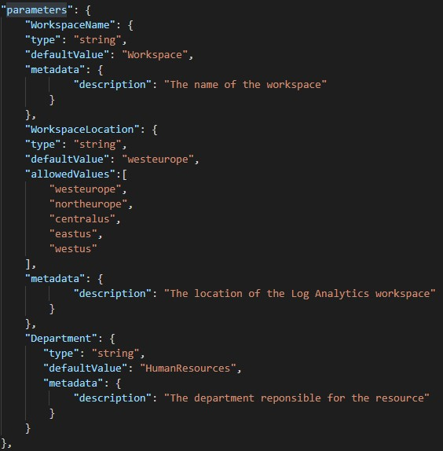
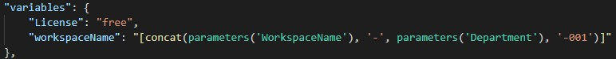
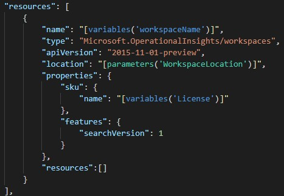
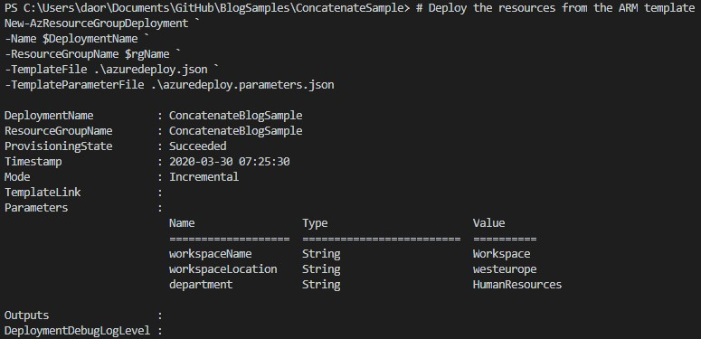

In my last post which you can find [_here_](https://blog.orneling.se/2020/03/getting-started-with-azure-arm-templates/), I wrote about how to get started writing ARM templates for you Azure deployments. In the end I provided an ARM template built solely for that blog post. But the template was really basic and didn’t have much logic built into it, except for addressing a parameter to name the automation account and a variable to set the location where to create the automation account.

As long as you don´t need anything else than just setting a simple name, that sample template works fine to create a simple automation account. But what if you want to comply with your naming conventions that you´ve come up with for your cloud resources? To do this we need to look at another ARM template function, which I use heavily to set the correct names etc. for my resources.

### Concatenate

The function I´m talking about is called concatenate and it´s used to combine several different input values and some static information if that´s needed. For this blog post I´m going to demonstrate how you can create a new empty Log Analytics workspace, combining different parameters for the purpose of naming the resource using the concatenate function. The three sections of the ARM template we´re interested in for this demo are parameters, variables and resources. Those three will be used together to finalize the naming of the resource.

#### **Parameters**

To be able to combine values, we need to put in a bunch of parameters. For this example, we will put in name, location and the department for which the workspace is deployed. You can see the complete parameters section below, just like we did in the last blog post. The only new addition is that I have used several different regions where the workspace can be deployed. If you try to put it in any other region than the ones I have typed below, the deployment will fail immediately, and you will have to go back and change the value.

#### **Variables**

For this example, we will use two different variables. A variable can be a hard-coded value, such as License below, but it can also be a combination of different values. That´s where the concatenate function comes into play.

In this case, I want my workspace to be named “Workspace-Department-001”. To be able to achieve this, we need to type like I have done in the picture below. In real life, this workspace will be named “Workspace-HumanResources-001”. It can be a little tricky at first with this concatenate function, but once you get a hold of it, it´s really neat to know and it will help you leave those hard-coded values that no one ever really wants to use.

#### **Resources**

To deploy our workspace, we need to use a resource of the type “Microsoft.OperationalInsights/workspaces”. The code you see below is also available as a snippet in the Azure Resource Manager Snippets _[extension](https://marketplace.visualstudio.com/items?itemName=samcogan.arm-snippets)_ I recommended in my last post. For this workspace to look the way we want, we need to change three values: name, location and sku.

See below for what it should look like in your template.

### **The complete template**

The complete template consists of 56 lines of code and will be deployed using the parameter values set in my “azureDeploy.parameters.json” file. I will link the template below for you to use however you like and to build upon. These 56 lines of code is really all you need to deploy a workspace with this naming convention, and you don´t ever need to touch most of these lines at all.

### **Deploying the workspace**

As last time, I have provided a PowerShell script that you can use to deploy the template, that will also be linked below together with the template files.

The deployment took about five seconds using PowerShell through VS Code and you can see the values from the parameters in the picture below.

Looking in the Azure portal we can find the new workspace in our shiny new resource group. The workspace has now been deployed and is ready to start collecting your information from servers, web apps, metrics and much more.

### **The resources used for this post**

You can find the template files needed along with the PowerShell script to deploy it in my GitHub repo [_here_](https://github.com/DanielOrneling/BlogSamples/tree/master/ConcatenateSample). Feel free to use it whichever way you like, it´s there for you to develop and to keep learning about writing ARM templates.

### **Summary**

As you have seen in this post, it doesn’t have to be that hard to leave the hard-coded values and going over to complying with your previously stated naming conventions. To be able to put together the resource name from several parameters instead, you can make your Azure environment a whole lot cleaner, and make it a lot easier to find which resources belongs to which department.

If you have any questions about what I´ve done here or just want to leave a tip for other readers, leave a comment below. Stay tuned for more posts in this ARM template deep-dive, next up is tagging the resources.

If you want to see another example of the concatenate function, you can have a look at Microsoft’s example [_here_](https://docs.microsoft.com/en-us/azure/azure-resource-manager/templates/template-functions-array#concat).
