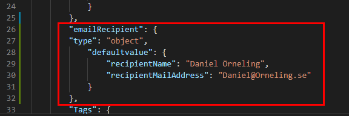
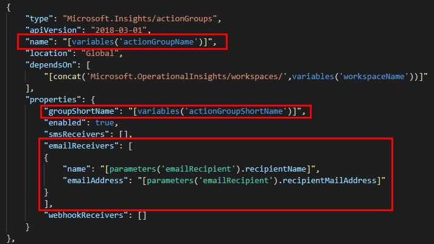
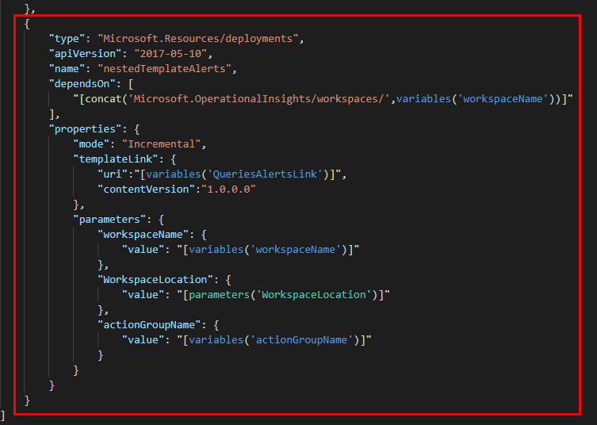
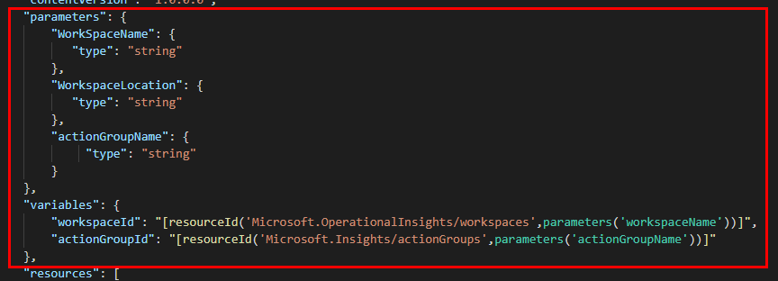

In my series of blog posts about working with ARM templates I have gone through a lot of different use cases. In the last post I covered how to deploy a nested template to keep the main template a lot cleaner. One thing all posts have in common is that I´m using Azure Monitor as the main track which I´m deploying. I have deployed dozens of Log Analytics Workspaces for this. Now it´s time for deploying Azure Monitor alerts as well.

Firstly, if you haven´t read my previous posts about ARM Templates you can find them below:

- [Getting started with Azure ARM templates](https://blog.orneling.se/2020/03/getting-started-with-azure-arm-templates/)
- [ARM Templates: Working with naming conventions](https://blog.orneling.se/2020/03/arm-templates-working-with-naming-conventions/)
- [ARM Templates: Working with tags in Azure](https://blog.orneling.se/2020/04/arm-templates-working-with-tags-in-azure/)
- [ARM Templates: Working with parameters in Azure](https://blog.orneling.se/2020/04/arm-templates-working-with-parameters-in-azure/)
- [ARM Templates: Working with nested templates in Azure](https://blog.orneling.se/2020/05/arm-templates-working-with-nested-templates-in-azure/)

I am deploying a workspace with a bunch of performance counters pre-configured on which the alerts rely on. If you don’t know how to do that yet, go through the previous posts where I show it in detail.

<!--more-->

### **Preparing the main template with parameters and variables**

Before we can deploy the alert rules, we need to state what kind of information we need. The first thing I´m going to do is to set the e-mail recipient of the alerts I will be creating. There is a possibility to ad SMS recipients as well, but I won´t go through that in this post. Basically, what you need to state is the name of the recipient and it´s e-mail address. I´ve chosen to put this as a parameter since this is most likely something that will change for most deployments.

The next thing I will do is to prepare the name of the action group to create, and a short name for it as variables. What you need to know is that the short name can never exceed 12 characters. That´s why I´ve put a rather simple name for it with the workspace name followed by “-AG”.

The QueriesAlertsLink variable is pointing to my Azure storage account, but you can use the link already in the template as it´s publicly accessible. This is where the main template will look for the nested template containing all the alert rules.

### **Preparing the main template with the resources needed**

In this main template we will add two resources. An action group and a nested deployment looking at the alert template itself.

As you can see below, I have highlighted the most important things in this deployment. As I mentioned above, you can create SMS recipients as well, but for this demo I will only add myself with my e-mail address. The action group depends on the workspace which is created through the main template, and it´s also towards that workspace the alerts will look for the information to trigger on.

The nested deployment itself isn´t that different from what I showed in my previous post. It´s basically another template and with one more parameter passed on, the actionGroupName variable. If you´re curious for more information about nested templates, read about that [here](https://blog.orneling.se/2020/05/arm-templates-working-with-nested-templates-in-azure/).

### **Looking at the template containing the alert rules**

Looking at the template used for deploying Azure Monitor alerts, we can see the parameters section will get the information that is being pushed in during the deployment. The workspace and action group name is used to pick up the resource Id of those two resources to be used later on.

The information needed to declare an alert in an ARM template is seen below. I have highlighted the important things that make up the alert itself. You can see I´ve pointed out the location of the workspace, the workspace as the data source and the query to run.

When it comes to the schedule, the maximum number you can set (as of the time writing this post) is 1440 minutes, which is equal to 24 hours.

I also tell which action group to use, along with the formatting of the alert being sent out.

### **Post-deployment checkup in the Azure portal**

As soon as the deployment succeeded, we can head into the Monitor section of the Azure portal and find our alert rules. All we need to do is to highlight the resource group we´re looking at. Now, we will immediately see all alerts that´s been created. As you can see below as well, the “Workspace-Finance-001” workspace is being used as the data source for those alert rules.

As soon as one of the queries has a result count of 1 or more, the alert will fire and in this case, I will receive an e-mail.

### **Summary**

As you see here, deploying Azure Monitor alerts don´t need to be that complicated. Sure, there´s a bit of a learning curve of doing it with ARM templates but once passed that it´s a lot faster.

The template itself isn´t that complicated, but there are some things to think about. The main thing I want to point out is the action group short name which needs to be a maximum of 12 letters. If you want to read more about setting up Azure Monitor alerts using ARM templates, look [here](https://docs.microsoft.com/en-us/azure/azure-monitor/samples/resource-manager-samples).

I have uploaded the templates and the PowerShell deployment script to my GitHub repo, which you can find [here](https://github.com/DanielOrneling/BlogSamples/tree/master/NestedTemplateAlertsSample). Use them just as you want.

If you have any comments or questions, leave a comment below and I´ll get back as soon as possible.
