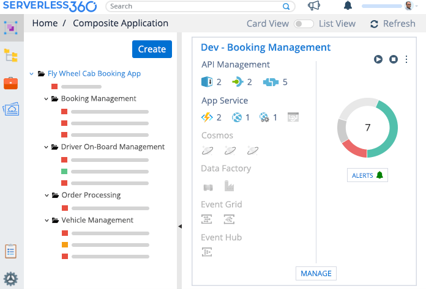
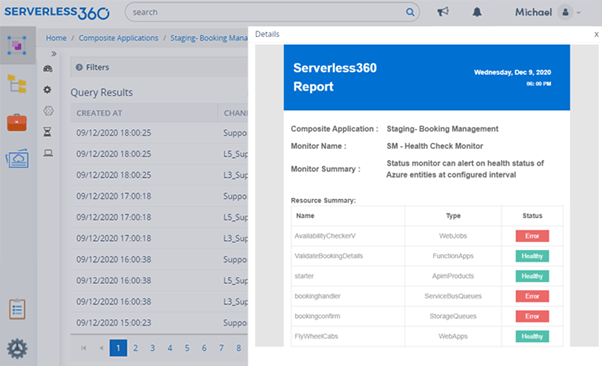
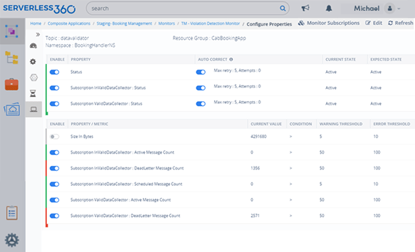
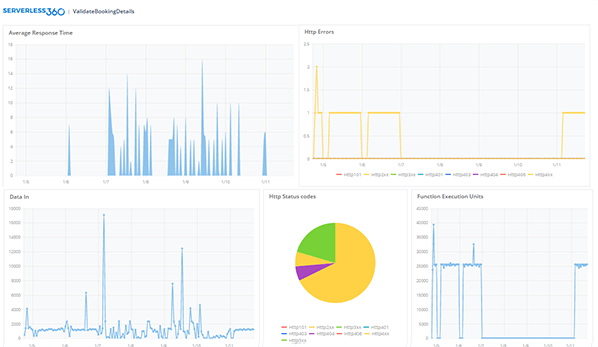

In the cloud adoption era, organizations urge to deploy their system to a modern cloud for a competitive edge. Microsoft made great strides in providing enterprise-grade to run highly scalable and reliable services. Given that, many Fortune 500 companies like Walmart selected Microsoft Azure as their solution providers.

Applications provisioned on Azure are built on top of architecture that is siloed and highly dynamic. Hence, it is inevitable to monitor the applications and services of Azure to maximise the availability, performance, reliability, and consumption.

<!--More-->

[Monitoring Azure Resources](https://www.serverless360.com/microsoft-azure-monitoring/){:target="_blank"}.Monitoring Azure Resources using the Azure-native tool can be challenging even for the most skilled and experienced person due to its complex and overlap offerings.

If you have tried monitoring in the Azure portal, you might have faced a situation where a tool-A would require monitoring a resource-R. Still, if you want to do another monitoring activity on the same resource-R, you will need to use tool-B. This would undoubtedly lead a user to collect cumbersome of data from disparate sources.
In this blog, we will look at some of the critical challenges users face while monitoring Azure resources using [Azure Monitor](https://www.serverless360.com/microsoft-azure-monitoring/){:target="_blank"} and how to overcome it.

### **Significant Azure Monitoring challenges**
Azure application monitoring poses a long list of challenges that users must overcome to achieve better performance and efficiency.

### **Lack of Application-level/holistic monitoring**
When examining typical Azure architecture’s anatomy, every application is designed with a combination of multiple siloed Azure resources like Service Bus, Azure Functions, and Virtual Machines across the stack. When the user intends to monitor in the business application context, it is impossible to do so.

Azure Monitor is restricted to monitor individual Azure resources, and users must move between different components to achieve visibility on them.

### **No Consolidated Report**
It is not possible to generate a consolidated health, performance, or availability report of all the resources that participate in the Azure applications.

It would be challenging to correlate the reports on every resource from the Azure monitor.

### **Limitations of Alert Rule**
In Azure Monitor, adding conditions to an alert rule comes with a considerable challenge where the users can apply only two conditions per rule. The ideal cost for adding those conditions would be $0.20. And hence, if you want to have more conditions, the only option available is to increase the number of alerts which would not be economical.

### **Unable to Monitor Resources Properties and Status**
Business needs would demand monitoring solution way beyond resources metrics, like status and properties of the resources and detect failures in orchestrations.

There is no way you can monitor the resource properties like Dead Lettered Message count in Service Bus Queue/Topic Subscription, Incoming messages to an Event Hub partition.

You can also monitor the status of the resources that may go down due to various reasons like component failure, server failure, or a faulty data centre network switch, rather than disasters like floods or earthquakes.

### **Lack of Auto-healing capability**
As we have seen above, there are quite significant reasons why a resource may go unavailable in different scenarios, and hence they turn to a disabled state. It is significant to ensure that mission-critical resources are always up and running despite unplanned outages and potential errors.

At a bare minimum, we should bring back the resources state to “Enable” (expected state) as soon as the issues get fixed at solution providers back end.

### **Limited data visualisation**
While Azure Monitor provides some pre-built dashboards, specifically for metrics, users might find themselves somewhat limited to how much they can customise the data displayed using in-built capabilities like Azure Dashboards, Workbooks etc.

 
### **Lack of notification channels**
In Azure Monitor, it is not easy to create incidents and support tickets to the most used platforms like PagerDuty and Service Now. It is not possible to Notify appropriate stakeholders on violations through various collaboration tools like Teams, Slack to stay on top of critical issues.

The email notification templates are pre-defined which the users cannot customise to best of their interest.

### **All-in-one solution for all your Azure monitoring needs – Serverless360**
With a detailed study and understanding of Azure application architectures & its monitoring needs, we built [Serverless360](https://www.serverless360.com/){:target="_blank"} to fill all the gaps in the Azure-native and other third-party monitoring tools currently available in the market.

It has the following capabilities to address the above monitoring challenges.

With Serverless360’s Composite Application feature, you can logically group all your siloed Azure resources in a single pane of glass to monitor in a business application context.\
\
Serverless360 built-in monitors provide you with a consolidated report on the status of all resources of your Azure application\
\
You can monitor any number of resources on multiple metrics in a single alert to eliminate the additional cost\
With Serverless360’s extensive monitors, you can monitor the properties and status of the Azure resources with customizable warning and error thresholds to prevent outages
Threshold monitor in Serverless360 allows restoring business by auto-correcting resource state absolutely with no manual intervention
\
Whether you are running Azure Functions, Logic Apps, Azure Data Factory, or something else entirely – Serverless360 got you covered. Visualize the performance of more than 100+ Azure resources with customizable, plug and play dashboards
\
Serverless360 supports a wide range of Notification channels like Pager Duty, Slack, OMS, Microsoft Teams along with Webhook and email channels that Azure Monitor does not support.