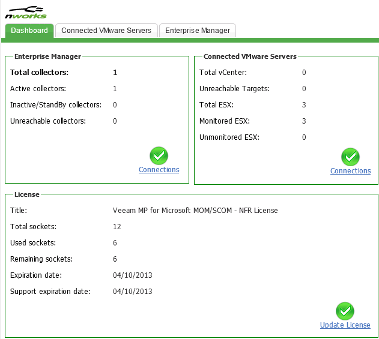

As you already know, Operations Manager is a great product that resides on Management Packs to provide monitoring for our servers and applications. Among the first things you learn when you start using SCOM is to deploy an agent to a server. To provide full monitoring of a server, the hardware should of course be monitored too. This is easy when running a physical server, but nowadays almost every server is virtualized. It´s possible to monitor Hyper-V, Citrix XenServer and also VMware ESXi. The focus of this post will be towards monitoring VMware ESXi.

### Veeam Management Pack

To provide monitoring for our VMware ESX environment, Veeam has developed a Management Pack that lets us monitor the complete environment, from CPUs to storage status. The MP was released last year and runs smoothly on MOM 2005 up to SCOM 2012 SP1.

### The components used

To be able to use Veeams solution, three components needs to be installed on a server. It can be installed on a management server as well as any other server.

The _Enterprise Manager_ component is the main component which takes care of the data to and from the ESX hosts. This component is installed on a server, MS or any other server. It´s up to you where you want to place it.

The _Enterprise Manager User Interface_ is the web interface used for setting up monitoring, keeping track of your licence usage and checking out on your collectors which is the next part required for monitoring the ESX environment.

The _Enterprise Collector_ is the part that´s actually communication with the ESX host. This might be installed on any server. Using the _Enterprise Manager User Interface_, the collector status and collector load can be seen and from there we can decide whether we need another collector or not.

The last part we need is of course the _Management Pack_ which is imported into SCOM as any other MP. There is no difference between importing the Veeam MP or a Windows Server MP.

### Receive the Management Pack

Register for a free 30-day trial [here](http://www.veeam.com/vmware-microsoft-esx-monitoring.html?ad=menu "here") and then download the Veeam Management Pack 5.7 for Microsoft System Center Ops Mgr 2007 and 2012 since this post is based on SCOM 2012

### How to implement Veeam MP

- Deploy Operations Manager agents to your vCenter servers and the servers you intend to use for setting up the Veeam monitoring components. If you are installing the components on your Management Server, skip this part and just deploy an agent to your vCenter server. Remember to activate the proxy feature for the agents that will monitor the environment.
- Launch the nworksEMS.exe file and go through the process and when prompted for the license, browse to your license file and import it. Use the default values during the process which will be TCP port 8084 and just let it finish. When the installation finishes, verify that there is a new Event log on the server called nworksEventLog.
- Launch the nworksUI.exe. If you are installing this component on the same server as the Enterprise Manager, log off and log on to the server again. This is required to activate the “nworks Enterprise Manager accounts” local group on the server. Users in this group will be provided administrator rights in the web interface. During the installation, enter the name of your Enterprise Manager server, specify a TCP port for the website (default 4430) and then click install. Confirm the installation by opening the web interface, either by clicking the icon (if it exists) on the desktop or via Start – All Programs – nworks – nworks Enterprise Manager. Log on using your windows credentials or credentials for a memeber of the above local group.
- Launch nworksVIC.exe and then enter the name of the nworks Enterprise Manager server and the TCP port used (default 8084). Enter the account of a user that is both Local admin on the Collector server and a member of the local group nworks Enterprise Manager Accounts on the server running Enterprise Manager. After providing this, click install.
- Open up the web interface again, now you should see “Total collectors: 1″ on the first page.
- Import the Management Pack into SCOM and let it finish.
- Get into the Operations Console and navigate to Monitoring – nworks VMware – \_Enterprise Manager Dashboard. Mark your collector server and choose Configure OpsMgr agent from the Actions pane to the right. Run this task for every collector.
- Apply the required overrides which is just another Management Pack that you can download [here](http://www.veeam.com/mp_resource_kit_5.7.0.1054_td.zip "here"). Just import the MP and let it finish.

Now you have implemented the Management Pack and the three main components. The last part in this post will be how to add an ESX host for monitoring.

- Log in to the Enterprise Manager User Interface and then navigate to _Connected VMware Servers._
- Click “Add VMware Server…”
- Enter the name or IP address of the server you would like to import, enter a user name, password and port. Use for example a root account and then use the port 443 which is the default port. Click Next two times and then Finish to accept the default settings.
- If you navigate back to the Dashboard tab it should look like this (apart from me monitoring more hosts)

Congratulations, you have just installed Veeam Management Pack for SCOM!

Tasks to complete after the deploymentBefore we start using the product, we should create a custom MP. This is done via the Operations Console, clicking the Administration pane and then Management Packs. Create a custom MP to contain the overrides for our newly imported Veeam MP. Before you can see information about your environment in SCOM, it has to be discovered. It can take up to four (4) hours before anything shows up in the Operations Console. If you don’t see anything, go grab another cup of coffee while waiting.

### How to buy the product

When you´ve tried out the product, I´m pretty sure that you would want to buy it and then of course some information is needed on how to do this. The licensing is per processor, so if you want to monitor 6 hosts with 2 CPUs each, you will need a license covering 12 CPUs.

Since I´m working with SCOM and have implemented this solution several times, of course i could help out with this as a specialist consultant via my employer.

### Resources needed for the implementation

I´m providing a URL to where you can download the resources needed to implement the Veeam MP. Documentation, overrides MP and the software can be found [here](http://www.veeam.com/vmware-microsoft-esx-monitoring/resources.html "here").
