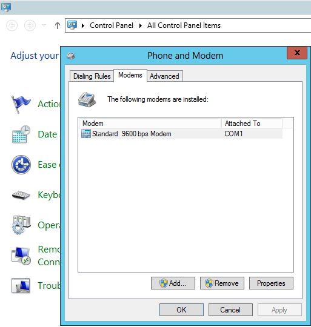
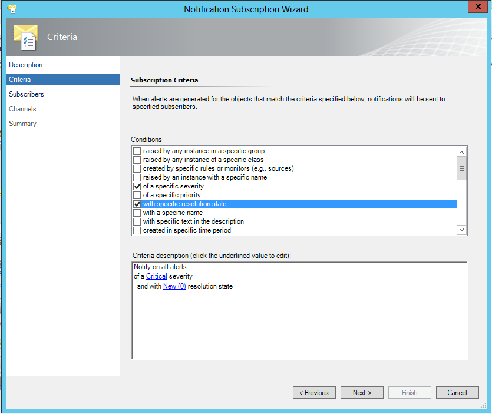

When you have implemented Operations Manager and imported the Management Packs that gives you the monitoring you want, the next step should be setting up notifications. The most common method to receive notifications is via a SMTP channel. This post will focus on how to set up SMS notifications in SCOM.

### What´s needed?

What you need to set up this quite easy part is three things.

1.  A SMS module/modem where you insert a SIM card so that your notifications can be sent to the recipients.
2. An IP converter that converts the signal from your modem so that it can be used on the network.
3. The last thing we need is Operations Manager (of course)

### How to set it up

When buying a SMS module and a network converter, you will also get some software from the manufacturer that will help you to find the modem on the network. Follow the instructions provided and connect the modem to a COM port on your server. To verify that the COM port is actually created, use the _Device manager_ and you will see whether your COM port has been created or not.

The next step is to add a modem to your server by using the control panel and then _Phone and modem._ When you press _Phone and modem_ you might have to fill in your area code. Just fill it in and press OK. Now you will see a window with three tabs; _Dialing Rules, Modems_ and _advanced._Press Modems and then click “Add…”. You can choose to either auto detect your modem or choose it from a list. In my case, i just go for the complete list. In the list that will be presented, choose Standard 9600 bps Modem and then choose your newly created COM port before you finish the wizard. It should now look like the picture below.



To verify if your modem works the way it should, you can use Microsofts SMS sender, a free application which you can download [here](http://www.microsoft.com/sv-se/download/details.aspx?id=5552).

### Creating the channel

It´s really easy to set up the SMS channel inside of the SCOM console, it´s almost impossible to fail  In the console, navigate to Administration -> Channels and then right click Channels and choose _New channel_ -> _Text Message (SMS)…_

Give your SMS channel a name and a description and then click Next, here you get to pick the format of the channel. What you choose here will affect what the message looks like in the recipients phone. The following string will send information about what server has caused the alert, name of the alert and at last the resolution state, e.g. New or Closed.

```
$Data/Context/DataItem/ManagedEntityPath$ $Data/Context/DataItem/AlertName$ $Data/Context/DataItem/ResolutionStateName$
```

When clicking Finish, the channel is created and our next step is to create the subscribers.

### Creating the subscriber

For those of you who are new to SCOM and notifications, Subscribers are the same thing as recipients.Here, you create a subscriber and their different contact methods such as e-mail address and phone number.

To create a new subscriber, navigate to Administration and then right click Subscribers and choose _New Subscriber…_ Give the subscriber a name, e.g. Daniel Örneling or you can look up the user in your AD by clicking the browse button. The next step is to choose wether you want notifications to always be passed along or by a schedule, in this case i always want to be notified.

Click OK and then proceed to Addresses and click _Add…_ Name the address, e.g. _Cell phone_ and then move on to _Channel_. Choose your Text Message channel that you created earlier in the drop down list and then add your phone number in the following format; +4676622xxxx and move on to _Schedule_. In this case i want to be notified by SMS during night time so i click _Notify only during the specified times:_ and then _Add…_ The schedule below will send notifications between 5 pm and 8 am.


Click Finish twice and your address and subscriber is created.

### Creating the Subscription

The subscription is where you decide what alerts you want to receive. To create a new one, navigate to Administration and then right click Subscriptions and choose _New subscription…_

Name the subscription, e.g. Orneling – Critical alerts during night time and proceed to _Criteria._ By choosing the criterias as below, you will receive a SMS for all critical alerts that are created from 17.00 to 08.00 (5 pm until 8 am).



Proceed to Subscribers by clicking Next to pick who will receive the notifications. Click _Add…_ and then _Search_ followed by adding the appropriate user and then OK. Proceed to Channel and then click _Add…_  to add your Text Message channel once again. Once the above steps has been completed, you will have set up your SMS notifications. You will receive your first message some time after 17.00 (5 pm) as soon as a critical alert is created.

As always, if you´ve got any questions about the post then you just have to leave a comment for me to get back as soon as possible.
