After Operations Manager has been installed and configured, there is often a lot of alerts to tune and there are several overrides to be made. This process may take a while and how long it takes depends on how much time you have to put into the tuning process. But after the tuning process, you have a great monitoring tool that is able to monitor all your servers, Hyper-V/ESX/XenServer hosts, network devices etc. Many times, the person setting up Operations Manager isn’t the one who will be working with it on a daily basis and therefore a monitoring view is the right thing to create for the ones who will be working with the monitoring.

I´ve created a custom view that shows the following;

- Top 10 servers by memory usage
- Active Alerts
- Servers in Maintenance Mode
- Service Level Agreements

I will go through how this particular view is created and hopefully, help some of you in the process of creating custom views.

### **How to create the view**

I´ve chosen to log on to SCOM as a specific user that has read-only rights on the monitored objects and to create the view under My Workspace instead of the Monitoring tab. This way, the view will only be visible to this particular user and not everyone that has access to SCOM.

- Navigate to My Workspace and right click Favorite Views, choose New and then Dashboard View
- Select Grid Layout and name your view

[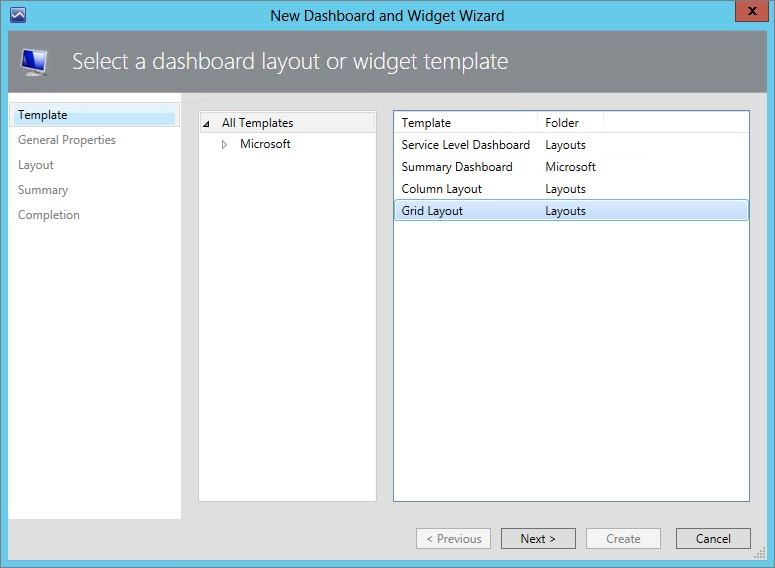](http://media.orneling.se/2013/12/1.jpg)

-  Choose the Layout that suits you best. I´m moving on with the one that’s shown in the picture below.

[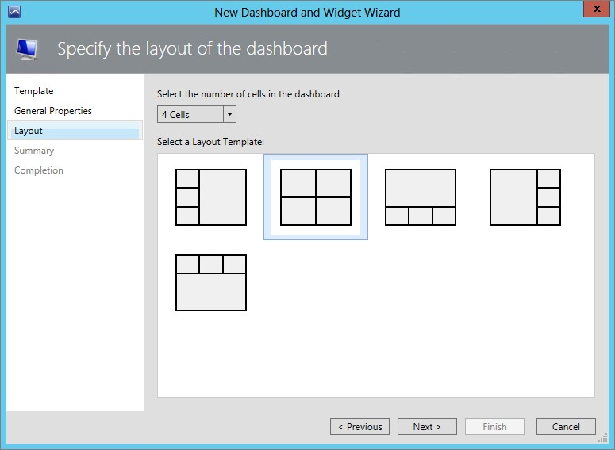](http://media.orneling.se/2013/12/2.jpg)

- Now that you have created the view, there are four empty fields just waiting for you to fill them with information. In the first square, click “Click to add widget…”
- Select Objects by Performance and click next, then name the widget. I´ve named it “Top 10 servers by memory usage”.
- On the next page, click the “…” button next to the “Select a group or object” and then search for “Windows Server Computer Group”. Then click OK

[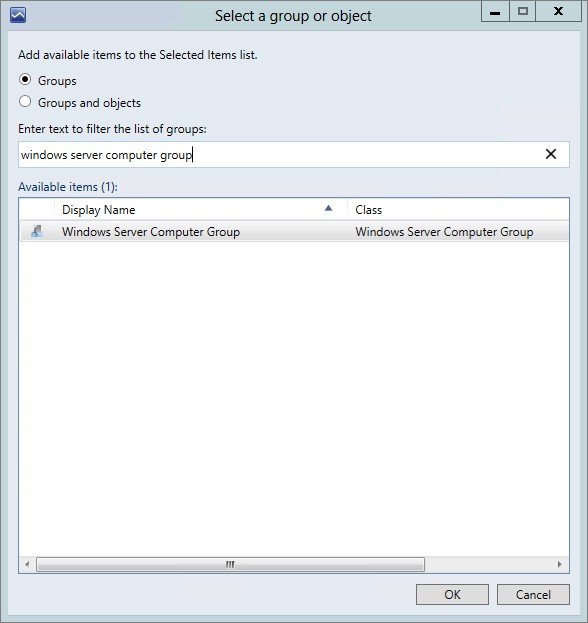](http://media.orneling.se/2013/12/3.jpg)

-  Now, click the next “…” button and then narrow down your search as shown in the picture and then click OK.

[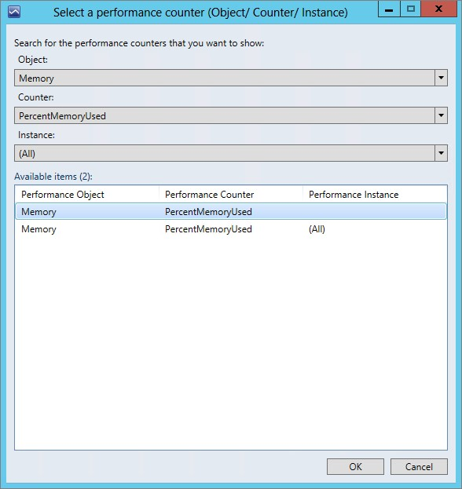](http://media.orneling.se/2013/12/4.jpg)

-  Click Next to move on and then choose your time frame. I want to see performance for the last week and then the top results. This way, I will be presented with the most memory consuming servers in the environment.
- On the following page, uncheck Target to keep it plain and simple.

[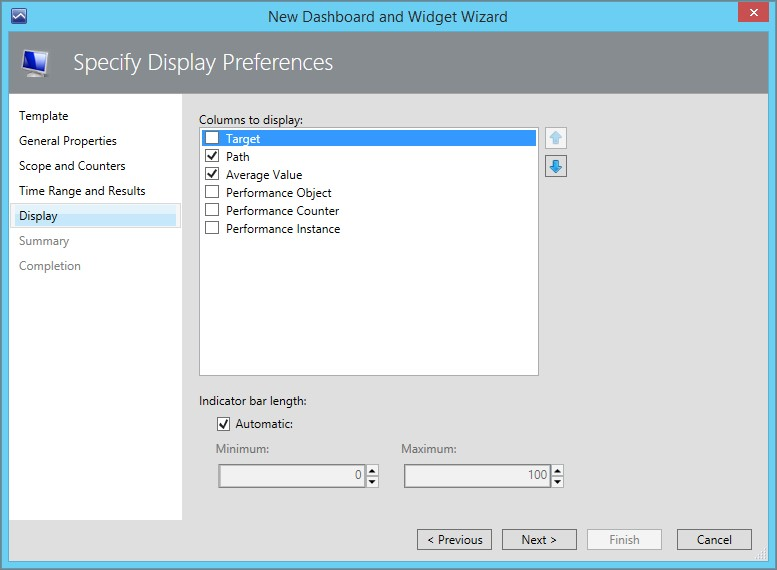](http://media.orneling.se/2013/12/5.jpg)

-  After clicking Finish, you will now see something similar to the below. The number one server is a Hyper-V host.

[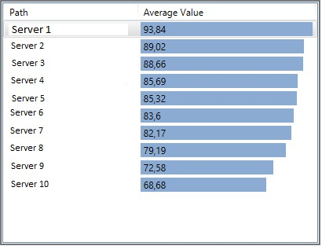](http://media.orneling.se/2013/12/6.jpg)

-  Moving on to the next widget, which is the Active Alerts view. Click “Click to add widget" and then choose Alert Widget.

[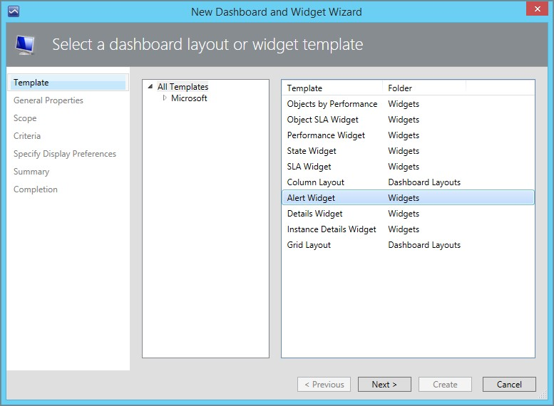](http://media.orneling.se/2013/12/7.jpg)

-  Name your view and stick to the default values until you get to the page where you define what you want to see. I´ve chosen Critical alerts only to keep this view simple.

[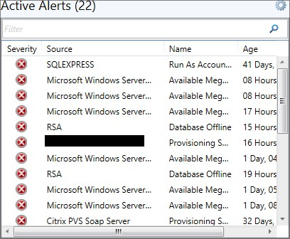](http://media.orneling.se/2013/12/8.jpg)

- The next view is quite simple, you create a State Widget, name it and then make the configuration as shown below:

[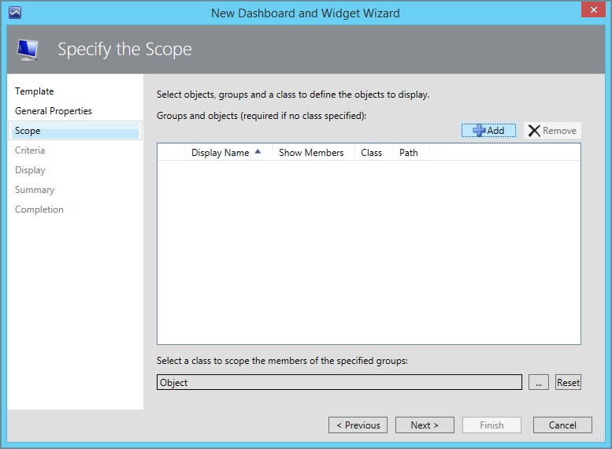](http://media.orneling.se/2013/12/9.jpg)

-  Choose Windows Server Computer Group

[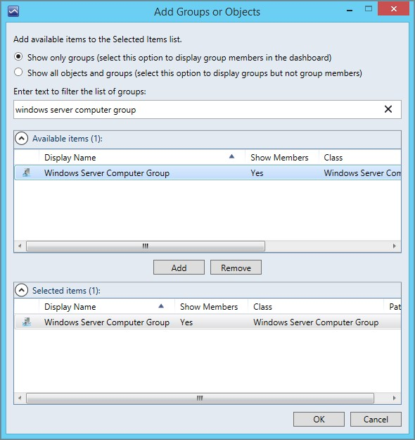](http://media.orneling.se/2013/12/10.jpg)

-  Choose “Display only objects in maintenance mode” and then finish the wizard.

[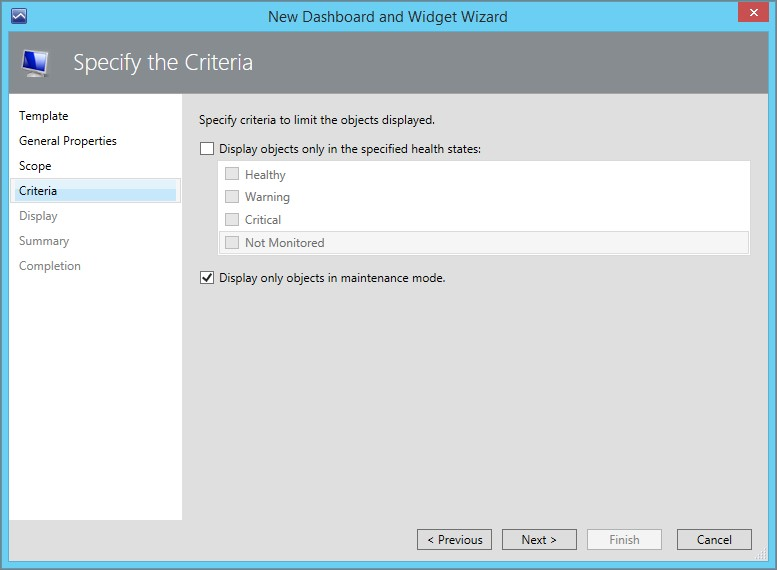](http://media.orneling.se/2013/12/11.jpg)

-  Now, you should see a new field where your servers put into Maintenance Mode is shown.
- The next widget it a little bit different and requires some work to be done before It´s possible. The short version; you need to create a Distributed Application, Create a Service Level objective and tie it to the DA. After this is done, the SLA widget can be created.
- I point out which SLA I want to check and then adjust the time to the last 30 days.

[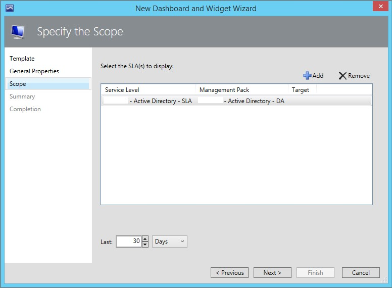](http://media.orneling.se/2013/12/13.jpg)

-  After the last widget has been created, my monitoring view now looks like below. Just the information the Helpdesk Personnel needs and everyone stays happy.

[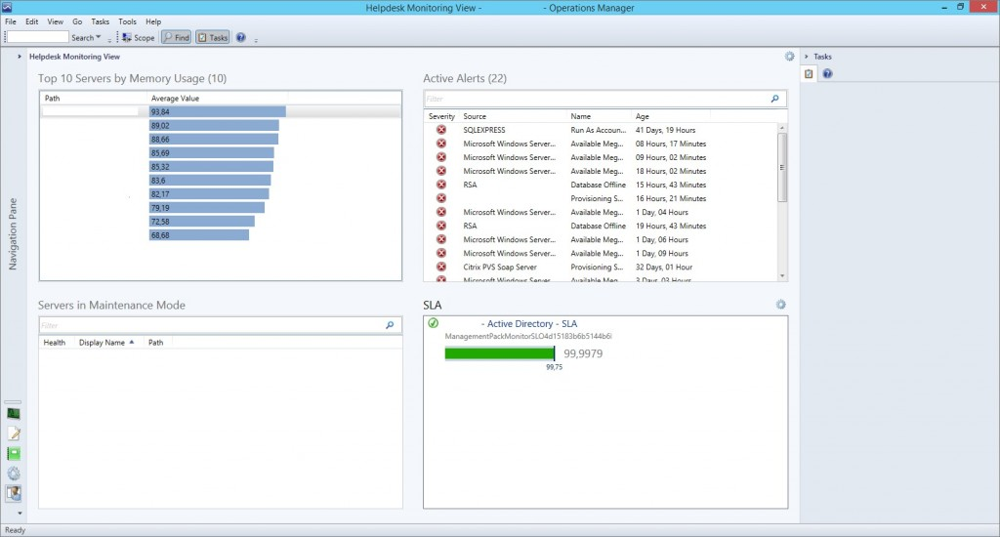](http://media.orneling.se/2013/12/14.jpg)

### Wrap up

When a view like this is created, you make life a lot easier for the helpdesk personnel to monitor the environment. Without this view, they would only rely on alerts such as high memory usage and low disk space. The above view is a pretty simple view but hopefully it´ll put you in the right direction of where to start and how to begin making the personnels job easier.

If you have any questions about this view or any other custom made views, just leave a comment.
