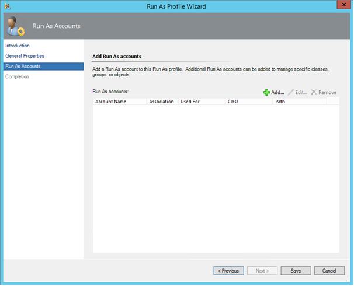
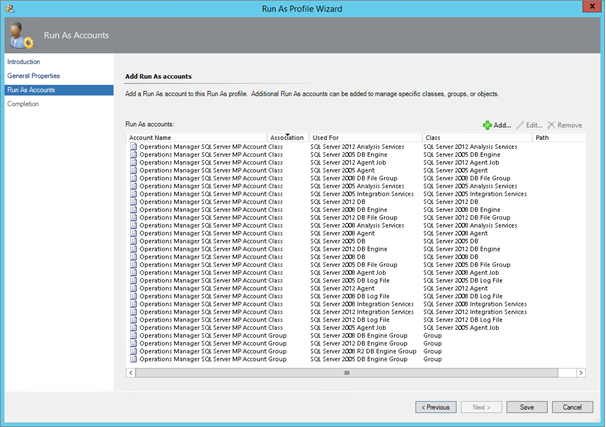

When i install SCOM for a new customer or just reinstall my lab environment, among the first Management Packs to be imported is the SQL Server Management Pack. As everyone who has ever seen this MP in action knows, this is a really powerful MP and it collects information about almost everything you can think of. However, importing this MP isn´t just Next, Next and then Finish. The first thing you should do is to create a new AD account destined to be used for the monitoring and then you need to delegate rights to this account on your SQL Server instances. This is seldom done by the SCOM administrator or the consultant so this is up to you to delegate to the right person. After the AD account has been created, you should create a Windows RunAs-account in SCOM and distribute this account to your SQL Servers only. However, the next step you need to take is to check in the Management Pack guide that come along with the MP (if you haven´t read it before, download it [here](http://www.microsoft.com/en-us/download/details.aspx?id=10631 "here") and read it). What it´ll tell you to do is to configure three profiles (SQL Server Default Action Account, SQL Server Discovery Account and SQL Server Monitoring Account) and add several classes and groups to them. This is a quite easy task but it will easily take somewhere between 30 and 45 minutes of your time if you count all the double and triple checks you make just to verify that It´s all there.

My opinion is that this isn´t the most fun part of working with SCOM so i decided to do something about it and since I´m looking more and more into Powershell, this would be my new best friend. I´ve composed a quite simple script but it still does the job for you and you can do something else during the process, like drinking coffee, documenting or whatever feels right :)

Before you can run the script, you need to create the AD account, create a RunAs account in SCOM of it and distribute it to your SQL Servers. Just grab the name of your RunAs account and paste it in the script at the top in the $Account parameter. See below:

```
$Account = Get-SCOMRunAsAccount -Name "Put your RunAs account here"
```

The script as it is now is best launched via the "Operations Manager Shell" which is installed on the management server(s). The script will define the different classes and groups that are to be used and also which account should be used. I´ve covered all of the SQL classes, from SQL Server 2005 up to 2012. Note that this script only covers the original SQL MP's and not the mirroring MP's. The script will then take care of the class and group configuration for you. I´ve tried the script a couple of times and from the original 30-45 minutes I managed to scale the time down to somewhere around 10 minutes for running the script.

### So what does it look like when running the script?

The picture below show what the "SQL Server Monitoring Account" profile looked when I had removed anything imported previously.

[](http://media.orneling.se/2014/03/Before-SQLScript.png)

The picture below shows what the same profile looks like after just 10 minutes when i launched the script.

[](http://media.orneling.se/2014/03/After-SQLScript.png)

### Wrap up

As you can see above, the script takes care of all the importing classes and groups that need to be done for the Management Pack to work properly.

The script can be downloaded [here](http://1drv.ms/1cXQJ5x "here") and feel free to use it. If you have any comments, just leave them below and I´ll get back as soon as i can.
