For those of you who were attending or following TechEd North America I Houston last week, it may not come as a surprise that during an Operations Manager breakout session the new System Center Advisor presented. So far, all that is available is a limited preview but I managed to register in the preview so this post will cover how to set up the preview to communicate with your on-premise Operations Manager management group. Since the Advisor is a cloud service, I thought it were appropriate (and fun) to write this blog post while cruising over the clouds. I´m right now on my way up to Stockholm over the day and thank you Norwegian for Wi-Fi in the air :)

### What is the System Center Advisor and what can it do for you?

The new System Center Advisor is a completely different solution that will be able to monitor event logs, scan the environment for malware, help with capacity planning, generating alerts and much more.

Read more about the possibilities [here](http://preview.systemcenteradvisor.com/) and watch the recording of the session dedicated to System Center Advisor [here](http://channel9.msdn.com/Events/TechEd/NorthAmerica/2014/DCIM-B369#fbid=).

What I will go through in this post is how to connect Advisor to Operations Manager and extending your on-premise SCOM management group to the cloud.

### The setup process

After signing up for the preview and receiving a confirmation by mail, the first step were to sign in to the solution at [http://preview.systemcenteradvisor.com/](http://preview.systemcenteradvisor.com/) and since my e-mail address weren’t tied to any accounts at this moment I had to create a new one.

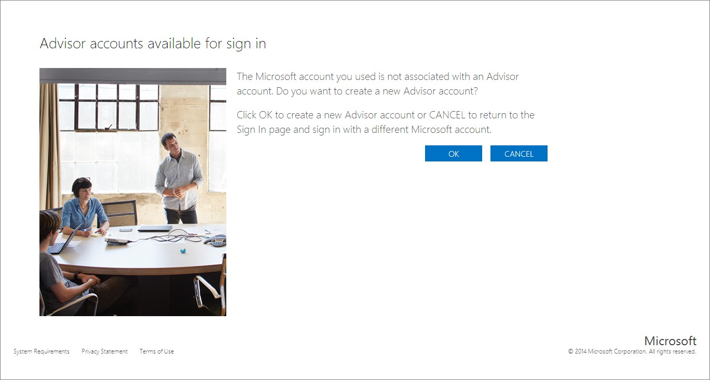

Name the account so you know what it is (I know, my name isnt the best but I´ll go with it anyway).

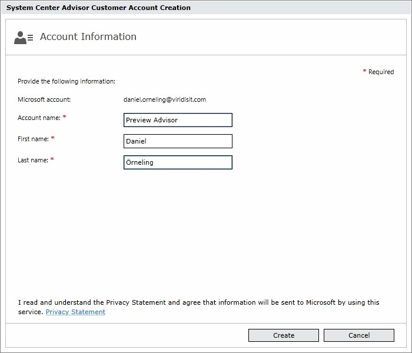

Next, I choose to try out the preview instead of the ”old” one and below you can see the differences between the both of them.

 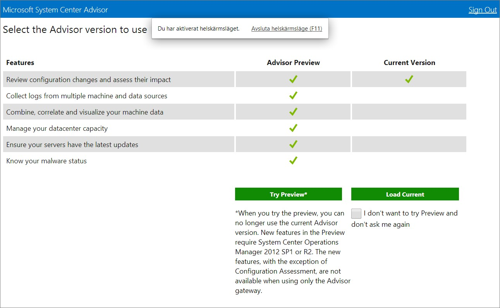

Agree to the Subscription Agreement.

 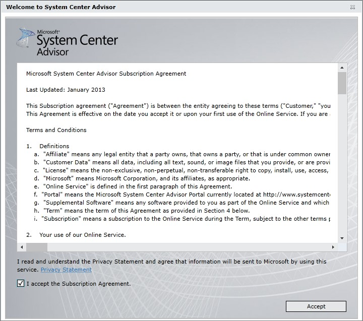

And voilá, the preview account has been created and I´m logged in to the brand new Advisor.

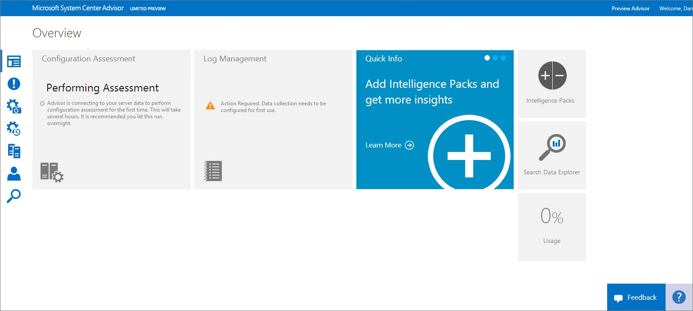

Now as we can see, there is nothing configured or gathered yet so the next step is to configure the management group to report up to the Advisor.

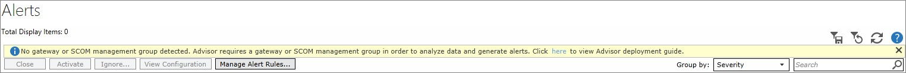

For those of you who have connected your management group to the old Advisor, this is exactly the same procedure.

Start by configuring the Advisor connection by navigating to Administration -> Advisor Connection

Click “Re-configure Advisor” to the right.

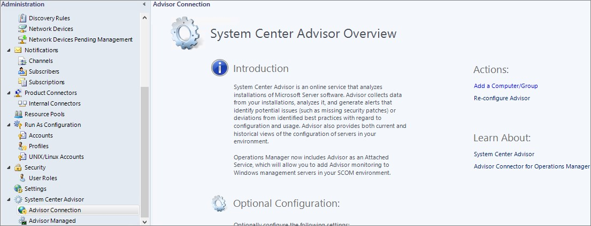

Connect to the Advisor by signing in with the account used during the registration process and choose the subscription you created earlier and step through the wizard.

The next thing is to point out which servers that should be monitored by Advisor. This is done by clicking “Advisor Managed” in the left pane followed by clicking “Add a computer/group…” to the right.

In my case, I just added three servers since I don’t have that many servers in my lab environment right now.

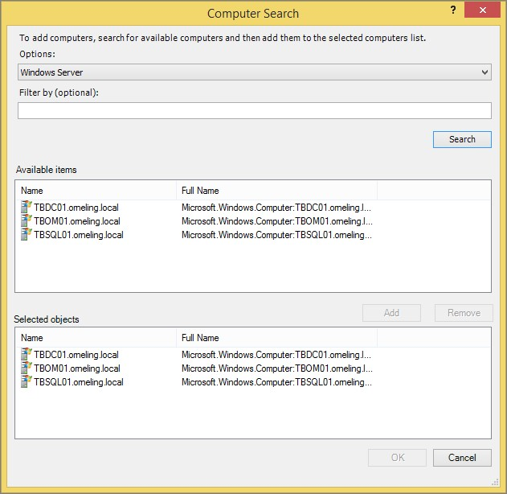

That´s it, the connection to System Center Advisor is now configured. After this is done, it may take a while before alerts and information start being gathered so be patient.

### The System Center Advisor Preview portal and the information gathered

After a while, my servers started reporting to the Advisor and I started seeing alerts generated about my servers. The Malware and capacity planning that I mentioned earlier are depending on “Intelligence Packs” which functions as Management Packs to perform the tasks required to work. For now, there are a few Intelligence Packs available but these will be followed by more Intelligence Packs:

- Capacity Planning: Calculates current and future utilization of each component of your environment. This one requires a Virtual Machine Manager to Operations Manager connection on-premise to work.
- System Update Assessment: Identifies missing system updates across your servers
- Malware Assessment: View status of antivirus and antimalware scans across your servers.
- Log Management: Configure and manage Windows Events that you want to collect and upload to Advisor.

### So what does the console look like?

When the information has started flowing up to Advisor, at log on you´re facing the below summary view:

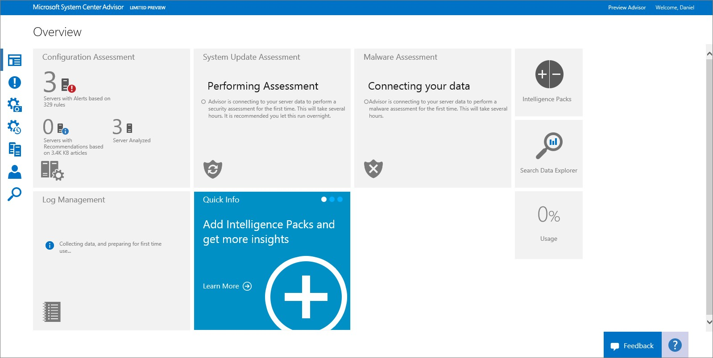

The Alerts view will show the alerts generated by Advisor. These alerts also shows in the Operations Console just like any other alert generated by a Management Pack. In my case there are only three alerts about a missing software update for my servers as you can see below.

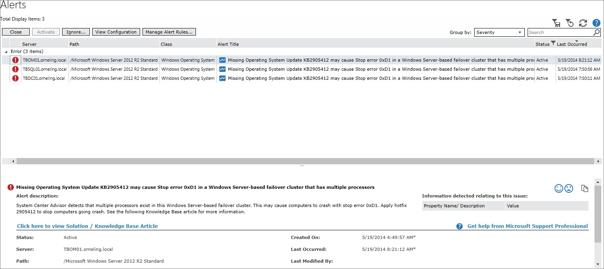

To the right in the console, there is also the “Search Data Explorer” that you can use to search for alerts and to see information about them. In this case I just made a search for “Missing update” and was presented the below information. Note that there is also the time period displayed to the right.

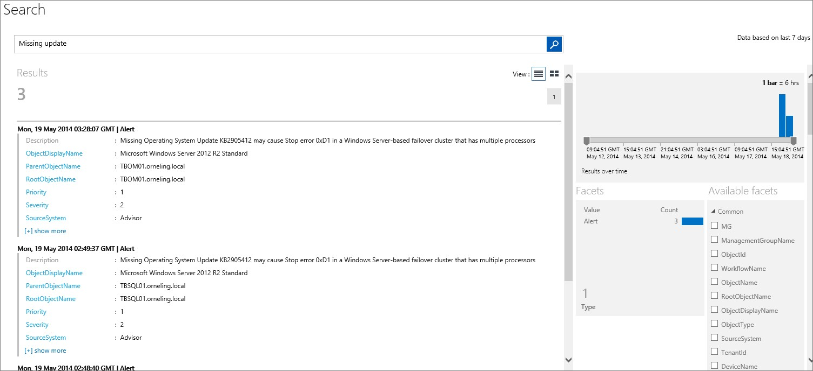

The last thing that I´m going to show in this blog post is the “Configuration: Change history” which at least I´m very excited about. Now, there is no more “I haven’t done anything but I may have done this…”. This feature can really come out helpful in the troubleshooting. See below for a screenshot.

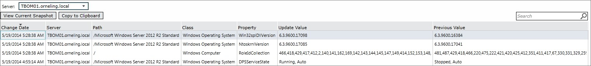

### Wrap up

This blog post only shows a tiny bit of what the Advisor can do but the main goal with the post is just to show how it´s set up. I will look into Advisor more in my following posts to dive deeper into it and help making it the success that I really think it might be. Since I attended TechEd last week (and the jetlag is slowly starting to leave me alone) I have a lot of blog posts coming up in the future so stay tuned for more to come. And at last, to help make Advisor a great product, don´t forget to leave feedback which you can do directly from the console and also vote for feedback provided by other users.
