For those of you that have read my blog for a while, it may not come as a shock that I´ve earlier looked into Veeams Management Pack for VMware. I´ve written a couple of posts about this MP and now the turn has come to their coming MP for Hyper-V. If you´ve ever imported Microsofts free Hyper-V MP, you might not be overly impressed by the possibilities there is in the MP. The free MP discovers your Hyper-V hosts, virtual machines and your networks but that´s pretty much it. The picture below shows what you can look into from the Monitoring pane and these views are great with the basic monitoring but what if I want more? 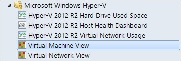

Veeam has come up with a new management pack which is still under development but I´ve laid my hands on the beta so that´s what I´m looking into in this post.

### How do I set it up?

Before you proceed and install the MP, make sure you´ve deployed an OpsMgr agent to all of your Hyper-V hosts and all of your VMM servers. The next thing is to connect your VMM setup with Operations Manager. See below for how it´s done.

Before you can integrate VMM and SCOM, you need to install the Operations Console on the VMM server from the OpsMgr install media.

Navigate to the Settings Pane -> System Center Settings. Then right click “Operations Manager Server” and select Properties.

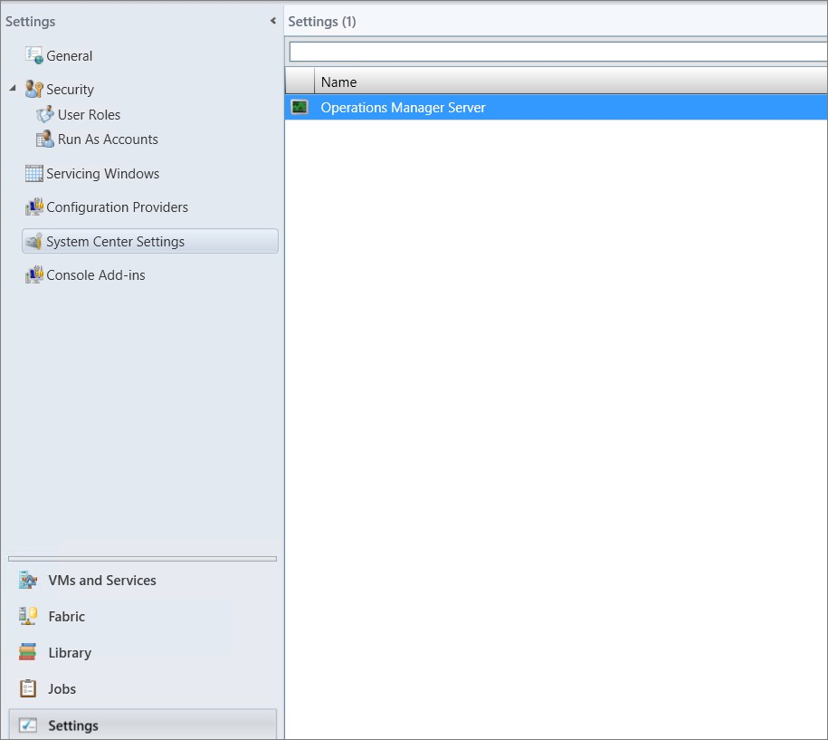

Make sure the Prerequisites are met and proceed.

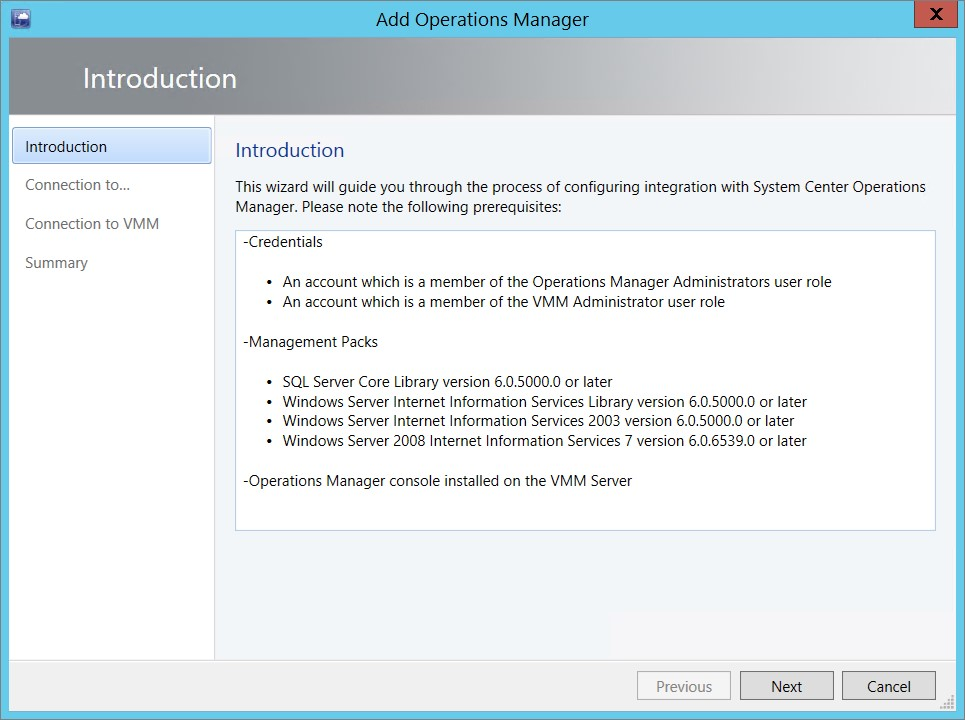

At this step, I had already prepared a new Run As account which has administrative rights in Operations Manager. If you haven´t done so, click browse and then create your new Run As account.

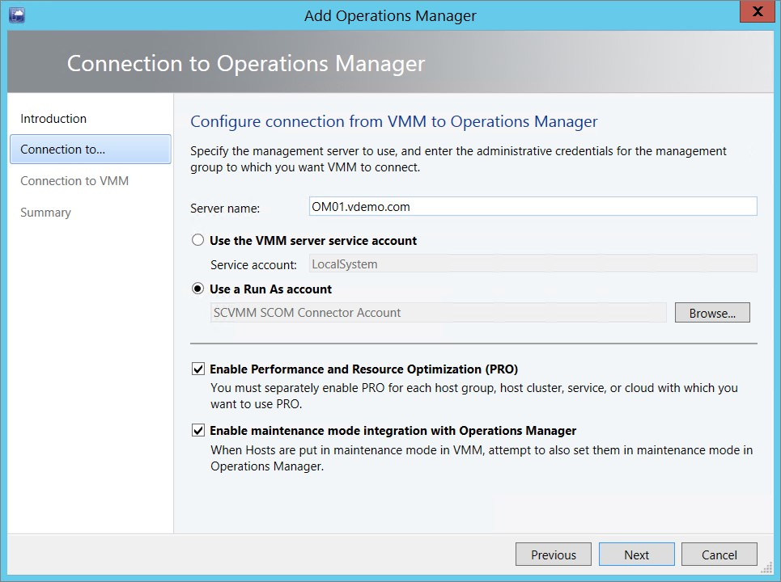

The next step is to point out a user with administrative rights in VMM. In my case, I choose a user which is a member of the admin group in VMM.

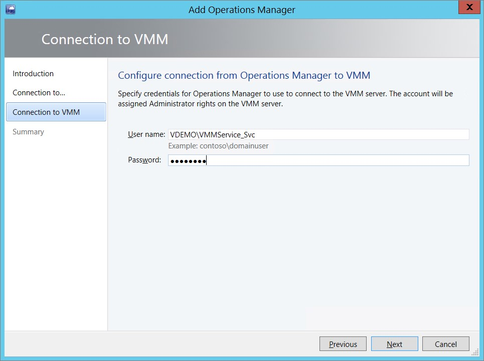

Finish the wizard and wait for the job to be completed.

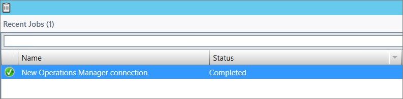

Now, it´s time to install the Veeam MP. Note that it may take some time for the VMM server and all the VM´s to show up in Operations Manager.

If you´ve ever installed the Veeam MP for VMware before this will look familiar but I´m going to go through the whole process to make it easier for you to install the MP.

The first thing to do is to download the media from Veeam and if you want to join the beta you can do this here).

After retrieving the media and the documentation, It´s installation time. The infrastructure needed is almost the same as for the VMware MP. The only difference is that now you don’t need a collector.

At the first screen after mounting the media and running Setup.exe I´m going to install the Veeam Management Pack suite.

After clicking Next and accepting the license agreements, It´s time for our first decision. Here, we´ll choose to install every component on the server. You can also change where to install the components.

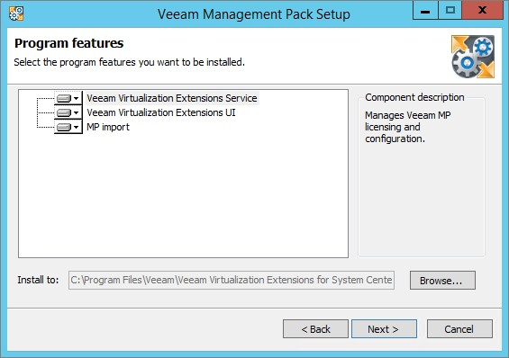

Point out the license key you´ve received from Veeam.

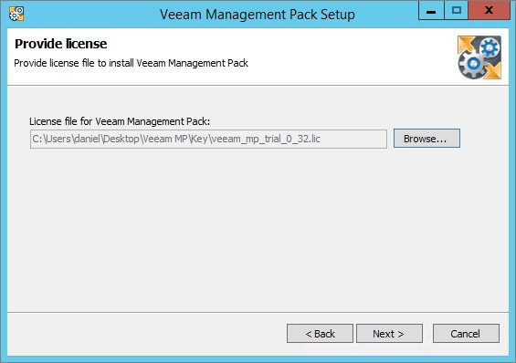

Make sure all prerequisites are met.

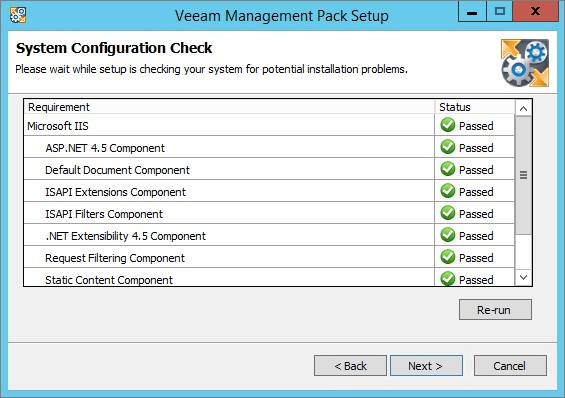

Note these ports, you´ll need to open them up in the Windows Firewall if it´s turned on.

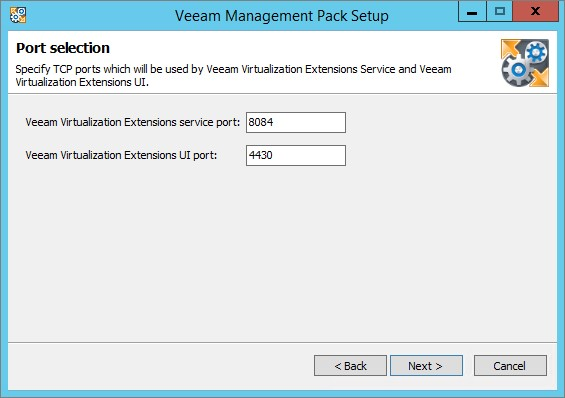

Choose which account should run the service.

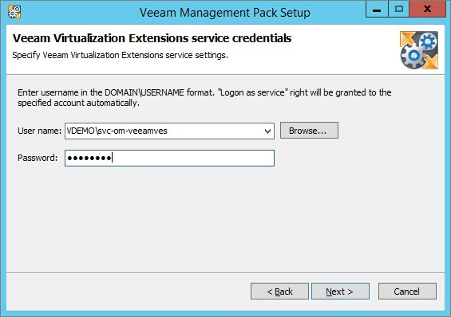

Hit install and go grab a cup of coffee or whatever you like to do while installing things :)

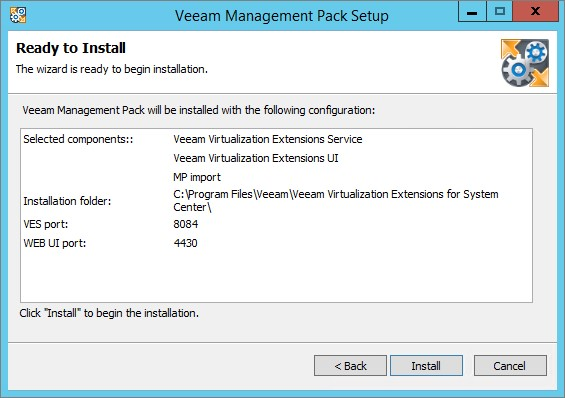

After having logged off and back on again, log on to the UI using the shortcut on the desktop or browsing to http://yourserver:4430. Here, you will see how many Hyper-V hosts have been discovered, this may take some time (again) before their discovered but be patient and you will end up with something like this.

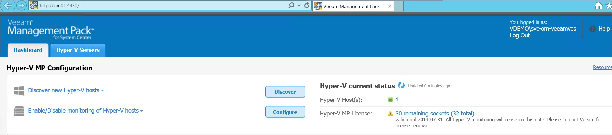

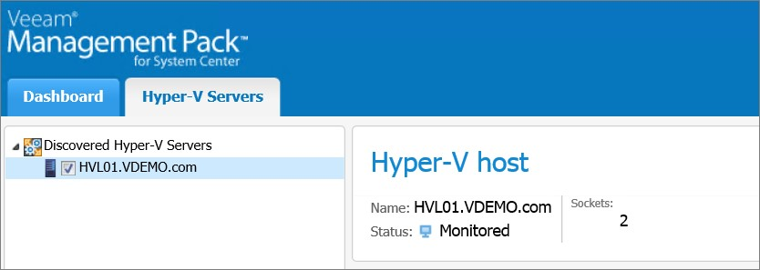

Now, there´s only one more thing to do before we can let everything be discovered and that is to configure a Run As profile. My configuration looks like below and now it´s time to wait for the discovery to take place.

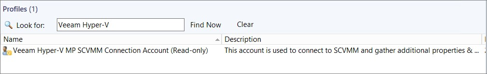

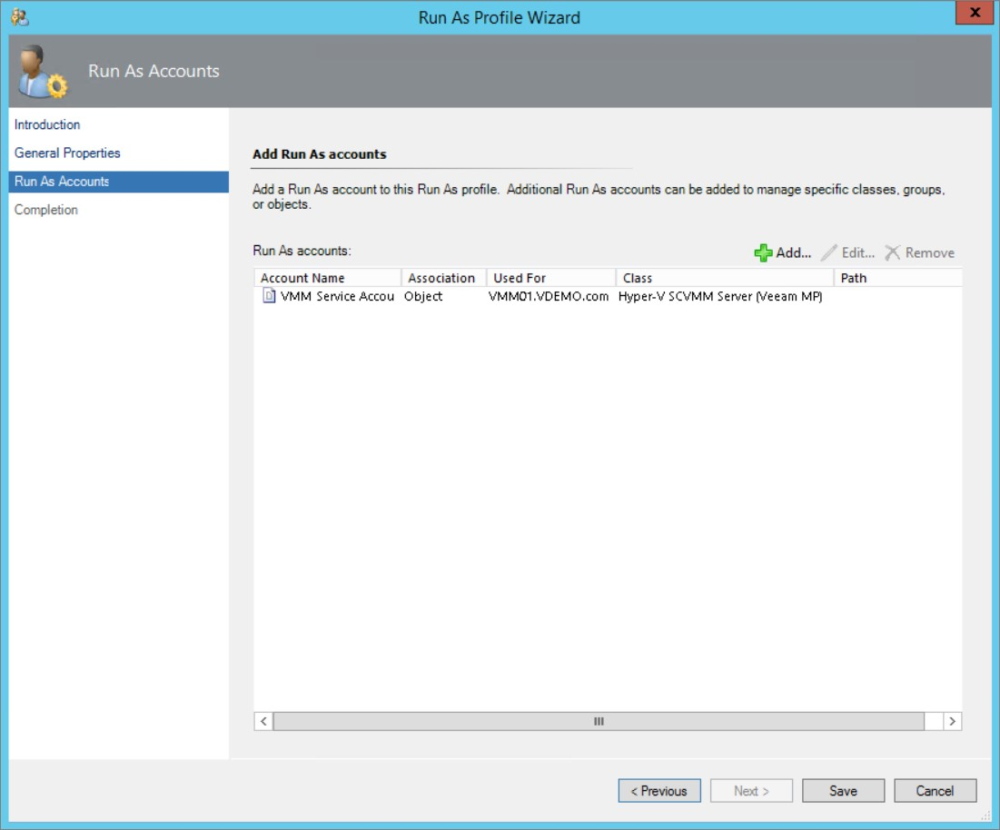

This UI isn´t quite as interesting as it is for the VMware MP but let´s take a look in Operations Console to see what´s been discovered :)

Let´s start with “all” the hosts. Not so fancy since I´ve only got one host in this environment but still a lot of great info about the host.

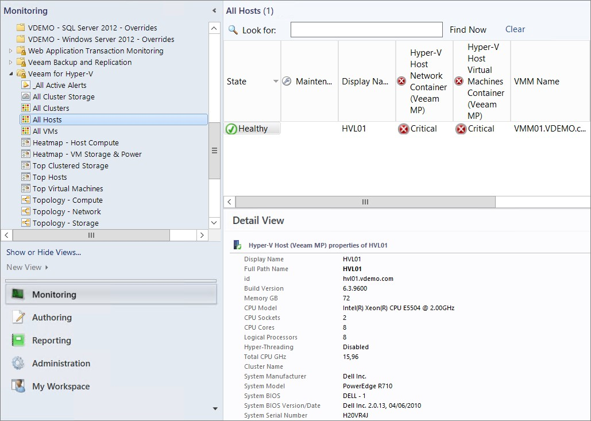

And all the VM´s with a lot of information and we can of course drill down to check the machine using Health Explorer.

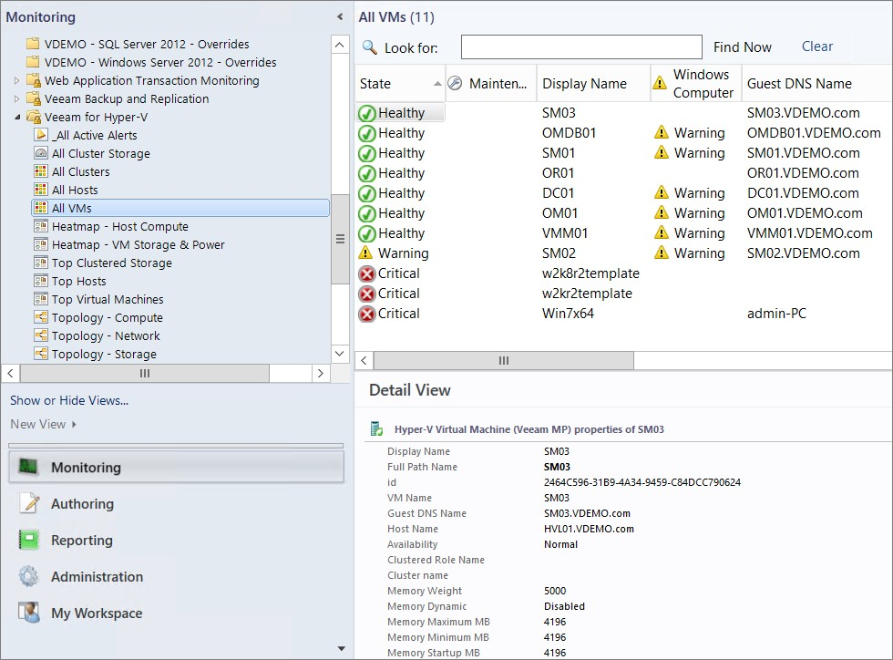

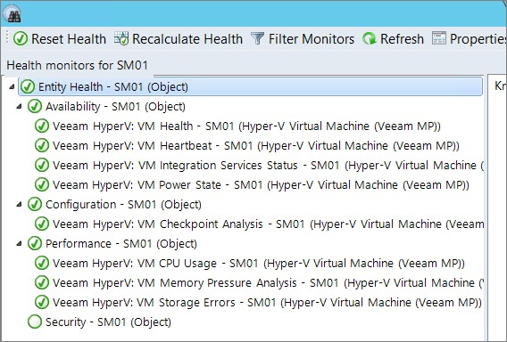

The Heatmap is also really nice, it shows in a pretty way how much memory is being consumed at the moment and also CPU.

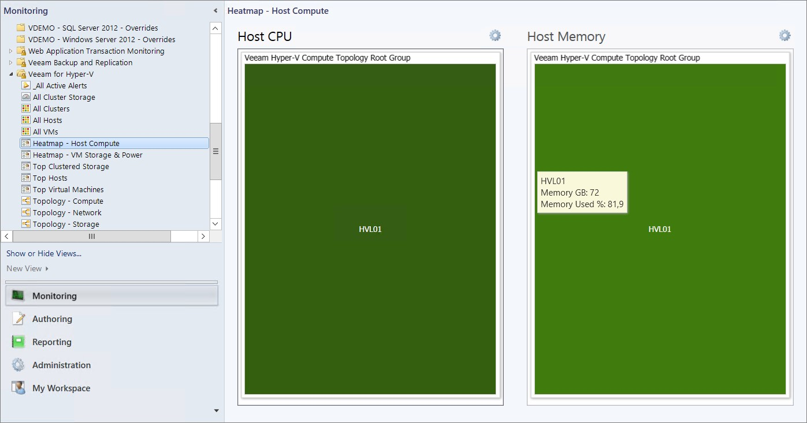

The reports shown below are just some of the available and as you can see, there´s a couple of more categories all containing interesting reports.

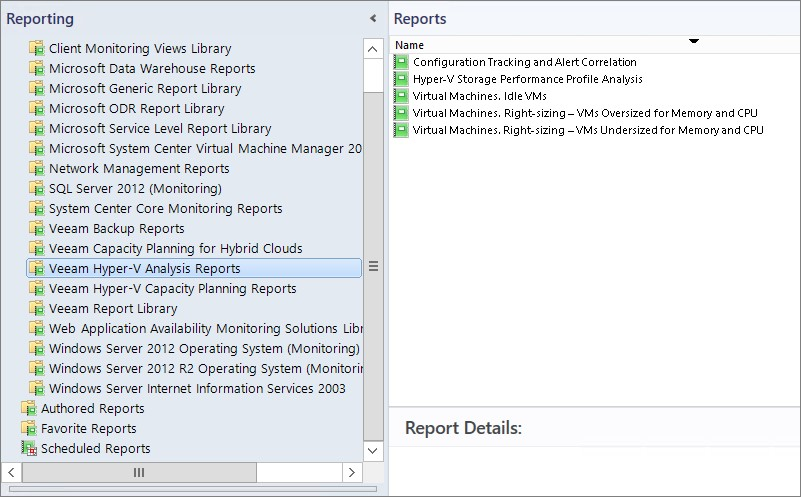

### Conclusion

I sure look forward to dive deeper into this Management Pack and I think this is a great complement to the free Hyper-V MP from Microsoft if you want to monitor your Hyper-V environment deeper. I don’t know right now when the MP will be released but looking at the beta site says July 2014 so it can’t be that far away at least. I´m sure I will get back to this MP further on in my later posts so stay tuned :)

Questions? The comments are all yours!
