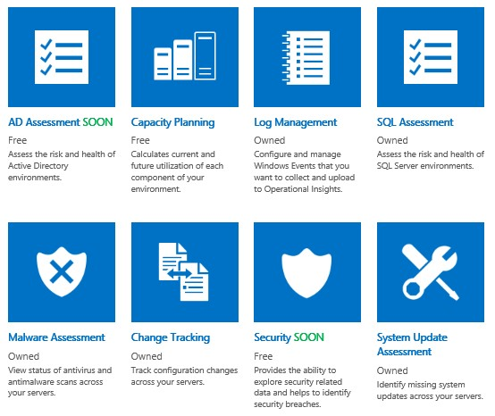
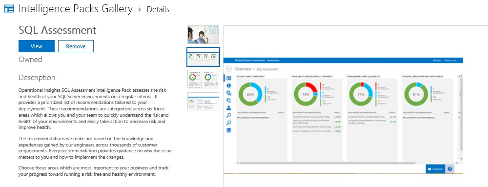
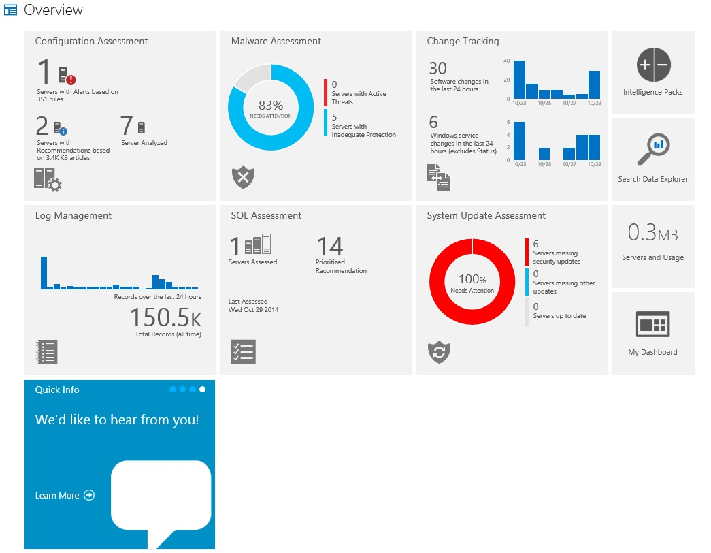
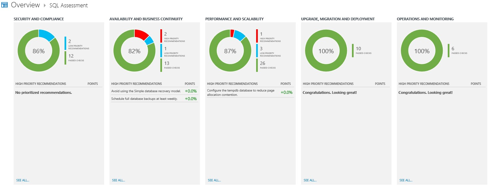
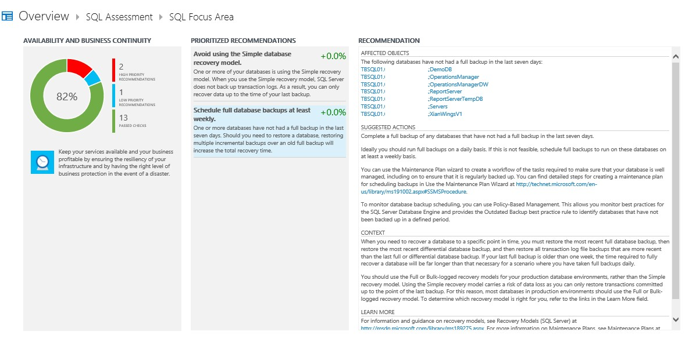

Yesterday during the keynote at TechEd Europe in Barcelona, Microsoft announced the preview of Azure Operational Insigts. For those of you that saw the presentation and thought that looked a lot like Advisor, you´re not wrong. The Advisor Preview is now Azure Operational Insights instead. I´ve been running the Advisor Preview since i attended TechEd North America in Houston this spring and now that Microsoft announced Azure Operational Insights instead I thought i should take a look at some new features. Since I´m already on the train and are running this with a connection to my on-prem SCOM lab environment i thought i should demonstrate a couple of new features. Read my other post on Advisor Preview [here](http://www.viridisit.se/managing-system-center-opsmgr/set-new-system-center-advisor-preview/ "How to set up the new System Center Advisor preview").

### Intelligence Packs

You might think that Intelligence Packs reminds you of Management Packs which are used in the (beautiful) world of SCOM and that´s a good thought. When working with Azure Operational Insights your using Intelligence Packs to run tests and evaluation of your servers so It´s more or less the same thing as a Management Pack. As of right now there are six Intelligence Packs available to use and the one I´m gonna focus on in this post is the SQL Assessment. See below for the available IP´s.

### Activating the Intelligence Pack

As you can see in the picture below, I have already added the IP to my subscription but the only thing that differs is that you should press Add instead. After adding the Intelligence Pack, Azure Operational Insights will start evaluating which servers has SQL Server installed on it and then it will run several discoveries and rules to see what actions you need to take in your environment.

### A first look after the environment has been evaluated

Since i had already connected my on-prem SCOM environment to Advisor Preview i did´nt need to do this part of the process now since my Advisor Preview subscription just got migrated into Azure Operational Insights instead. After about three hours my environment had been scanned and the Overview looked as below.

Now that my environment has been scanned, it can tell me what i should do with my SQL Servers. Right now, i only have one SQL server so that shouldn´t be too hard :)

As seen in the following pictures, it directly tells me what´s wrong with my setup and it can also tell me how It´s done. Also, similar to SCOM where you get the cause and several resolutions to your problem.

Going down one more step,  I can see exactly which databases needs attention to make my life easier while administering my SQL environment.

### Wrap Up

As you can see above, you can get a lot of information just from Azure Operational Insights and if you then connect it to your on-prem SCOM environment you will get a whole lot of information to help you in administering your server platform. I´m really looking forward to seeing more of Aure Operational Insights in the nearest future as i think it will add a real value in keeping track of what´s happening with the environment.

If you like me find this really interesting, don´t forget to sign up for the preview which you can do right [here](https://preview.opinsights.azure.com/ "Operational Insights Preview").

If there are any questions, the comments are as always open for you.
