For a while now, my on-prem lab environment have been almost at its max capacity and since I have moved from an apartment to a house by the sea for the summer and now into "the final" house, finally I got my 100/100 fibre connection again and it was worth doing something about it. My lab environment is at its fullest capacity I said, so what to do? A few years back I would have just browsed into the first store and bought some more internal memory which is what I´m missing now. But since today isn´t "a few years back", the obvious answer is to connect it to Azure. In this post I will show how I set up a site-to-site VPN to connect my on-prem site to work with my new site in Azure. In this case, I´m behind a home router with one single external IP address. If you would like to do this in a production environment, you should strongly consider a better setup than what I have at home and using a dedicated external IP address instead. Take a look below to find out how to connect your on-prem servers to Azure.

**Let´s get to it!**

Login to the [Azure portal](http://manage.windowsazure.com) Click the "New" button and then navigate as I´ve done below and choose "Custom Create".

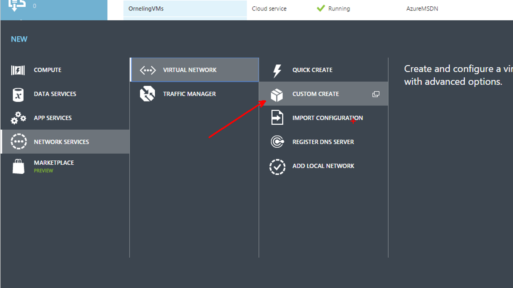

Give the network a name. This is what will show up in the portal and its where you will see statistics and so on.

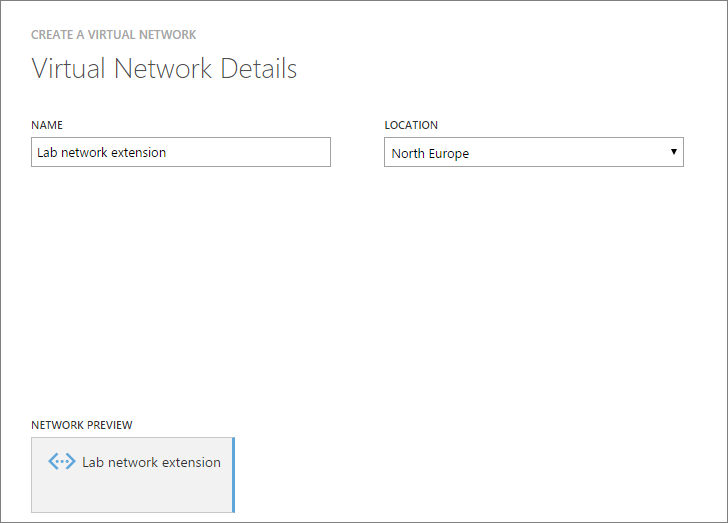

Point out your DNS servers. Since this is a lab environment with limited resources (I´m extending to Azure to solve this problem, right?) I´ve only got one DC (redundancy?) so this is the one I´ll point out to my new network. Since this is also going to be a connection between my site "Trelleborg" to Azure, I choose to "configure a site-to-site VPN". I am also creating a new local network for this blog post, however I will be using another pre-created network later which has been created in the exact same way besides from the IP subnets.

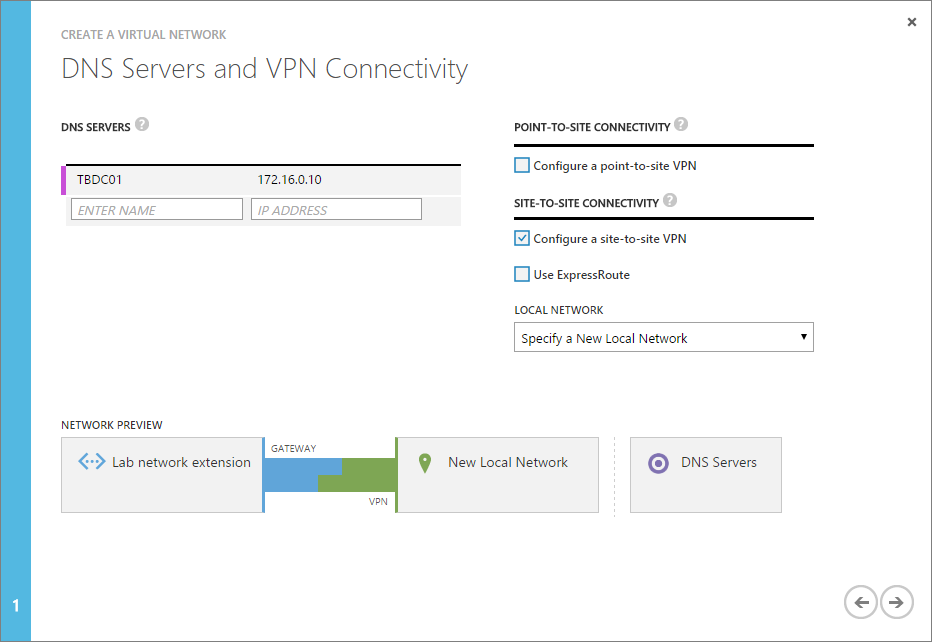

Pick your local network address space. For demo purposes, I created this local network as below. The network I will be using later in the post is in the address space 172.16.0.0/23 instead which better fits my on-prem site. Put your external IP address in the "VPN DEVICE IP ADDRRESS" box.

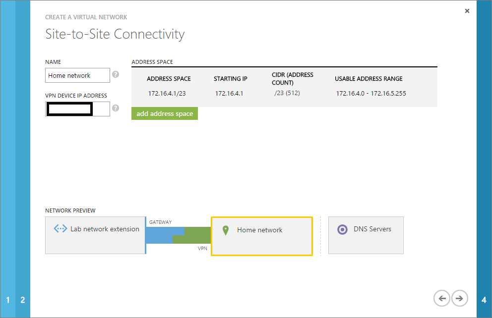

This is the place where you set which IP addresses your Azure VM´s will be using. You can build this network in any way you want, as long as you have the right subnetting skills J. The gateway network seen below will range from 10.0.0.128-10.0.0.135 while the VM´s will communicate in the address space 10.0.0.4 (first usable IP) to 10.0.0.126 (the last IP is a broadcast address). When setting up those subnets, the first four (4) addresses are occupied by Azure. As you see below, you can of course add more subnets for different departments VM´s for example.

_The gateway subnet is mandatory and is used to enable connectivity cross-premises within Azure, that´s why it shows up automatically and you can´t move forward without it._

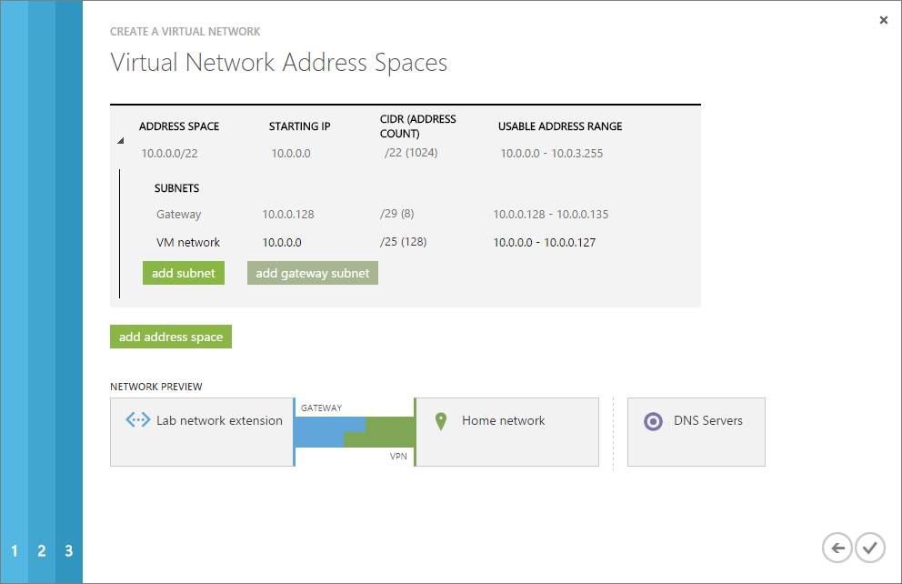

Just to show you that my other local network mentioned earlier really exists, this screenshot shows what it looks like. "VMNet" is the network I will be using to finish this blog post.

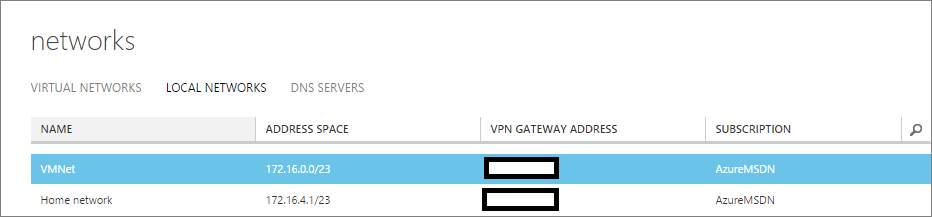

The last step to configure in Azure is to create the gateway connecting the Azure network to my on-prem gateway device, which in this case is a Linksys home router. Click Create gateway as seen below and then choose "Dynamic Routing". The gateway will take about 15-20 minutes to create so don´t be nervous, is hasn't crashed J.

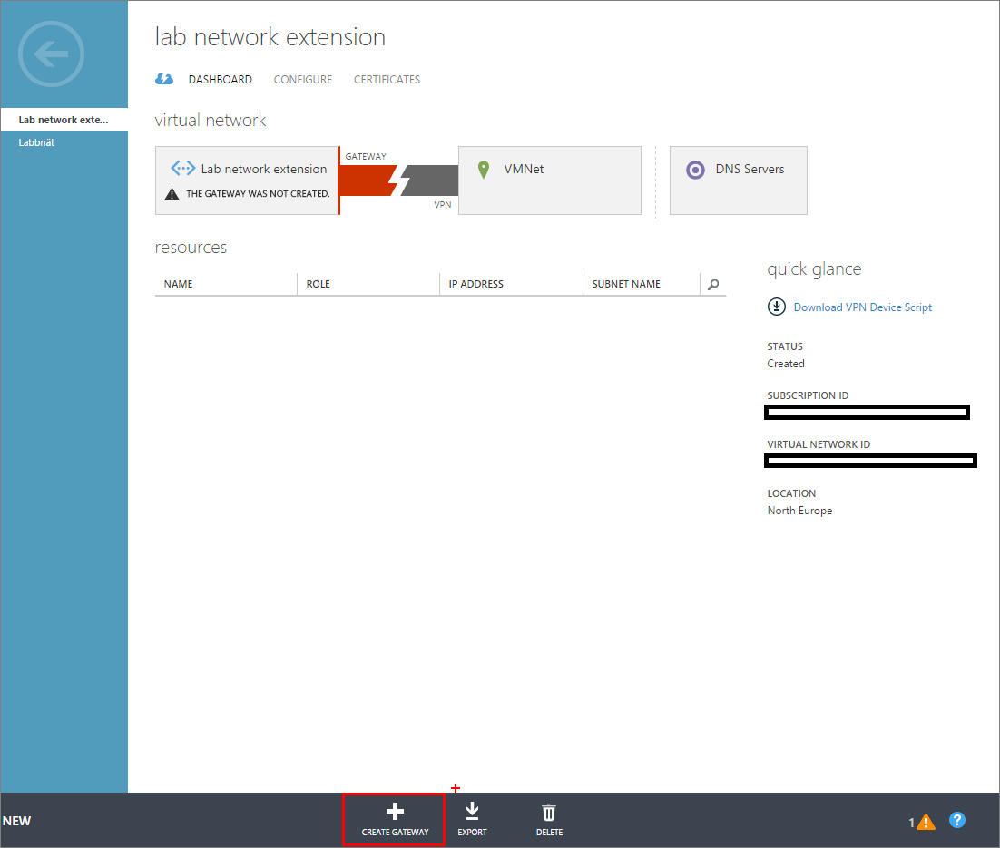

To make all of this work, there are some things to take care of at home as well. What I´ve done is to forward two ports from my router to an internal Windows Server 2016 TP3 server. The ports that are being used and needs to be forwarded is both UDP ports and they are as you can see UDP 500 and UDP 4500. In this case they´re being forwarded to my internal IP 172.16.0.60 which is the server I mentioned above.

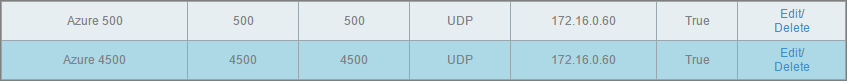

After the port forwarding was done, I just added a route in the TBGW01 (172.16.0.60) server with the command "route ADD 172.16.0.0 MASK 255.255.255.0 172.16.0.1" to make sure that traffic intended for my internal servers is routed the right way. Besides from this route which is made on the server, another route was created in the router directing traffic destined to the Azure network to the gateway server (172.16.0.60) to make sure the traffic ends up where its supposed to.

After the gateway have been created, all you need to do is to download a script to configure your gateway device. In this case, as I´m running a Windows Server 2016 TP3 I´ll have to pick the Server 2012 R2 option. Click "Download VPN Device Script" to the right.

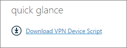

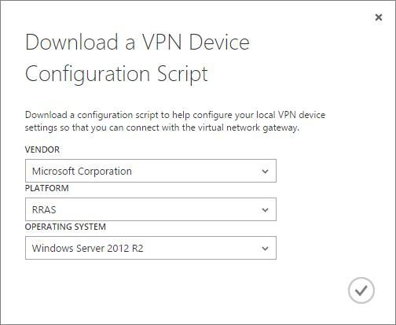

Once the script has been downloaded, copy the file to your server and rename it with the extension ".ps1" to make it a Powershell script. Go to your server and run the script which may take somewhere between 2-7 minutes based on the performance of your server. I have had some trouble with the line of the script that should restart the Remote Access service so I removed the line before running the script. After a manual restart of the service, I was able to connect the VPN to the Azure gateway with some Powershell commands seen below.

In an elevated Powershell console, start by importing the module needed with the command "Import-Module RemoteAccess" followed by the command "Connect-VPNS2SInterface –Name "your IP". The correct command can be found at the bottom of the script.

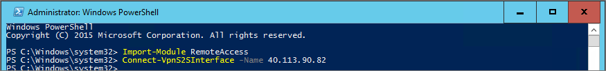

The last step is to verify that we´re really connected with the command "Get-VPNS2SInterface".

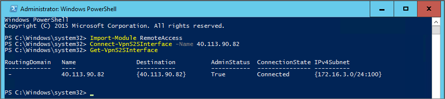

Now go back to the Azure portal where you see the gateway and click Connect at the bottom pane.

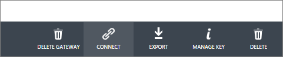

You will after a short while see this instead and we´re now connected and the on-prem servers can start communicating with the Azure VM´s.

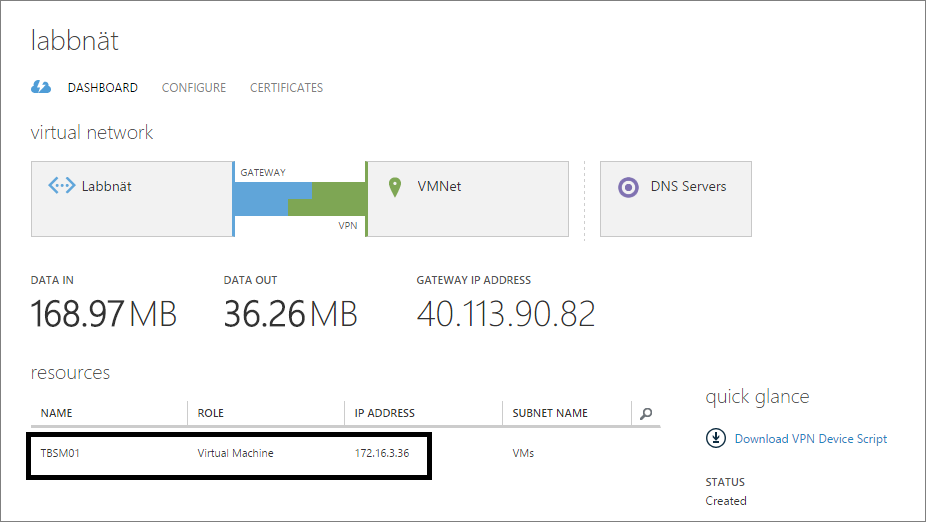

Note that the Azure VM TBSM01 seen above has the IP 172.16.3.36 and remember the 172.16.0.60 internal IP of the gateway server. As you can see, the communication works prefectly J.

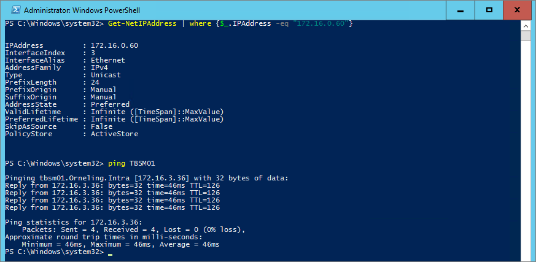

And lastly to show you that I can connect from another server on-prem cross-subnets, below you can see me initiaing a remote desktop connection from my SCOM server TBOM01 to the "soon-to-be" Service Manager server.

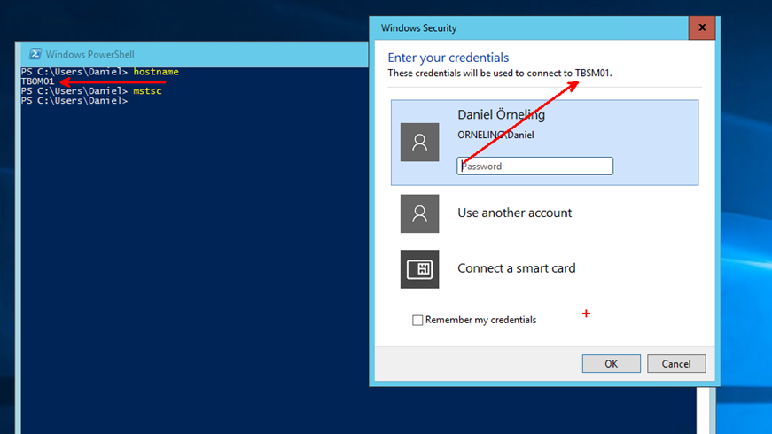

**Information on the different gateway types and levels**

When dealing with these kind of things as VPN tunnels in Azure, there are some limitations to be aware of. The tunnel I´ve created in this post is a Basic tunnel, the others need to be created through Powershell. As I mentioned in the beginning of the post, I´m on a 100/100 Mbit/s internet connection, which means that I can practically (I get around 95 Mbit/s upwards) almost maximize both the Basic and Standard gateways in that matter. What you can also see is that Basic can´t coexist with Express route.

<table style="border-collapse: collapse; background: white;" border="0"><colgroup><col style="width: 121px;"> <col style="width: 243px;"> <col style="width: 225px;"> <col style="width: 176px;"> <col style="width: 195px;"></colgroup><tbody valign="top"><tr><td style="border-top: solid #c9c9c9 1.5pt; padding: 10px;">SKU</td><td style="border-top: solid #c9c9c9 1.5pt; padding: 10px;">VPN GATEWAY AND EXPRESSROUTE COEXIST</td><td style="border-top: solid #c9c9c9 1.5pt; padding: 10px;">EXPRESSROUTE GATEWAY THROUGHPUT</td><td style="border-top: solid #c9c9c9 1.5pt; padding: 10px;">VPN GATEWAY THROUGHPUT</td><td style="border-top: solid #c9c9c9 1.5pt; padding: 10px;">VPN GATEWAY MAX IPSEC TUNNELS</td></tr><tr><td style="padding: 10px;">Basic</td><td style="padding: 10px;">No</td><td style="padding: 10px;">500 Mbps</td><td style="padding: 10px;">100 Mbps</td><td style="padding: 10px;">10</td></tr><tr><td style="padding: 10px;">Standard</td><td style="padding: 10px;">Yes</td><td style="padding: 10px;">1000 Mbps</td><td style="padding: 10px;">100 Mbps</td><td style="padding: 10px;">10</td></tr><tr><td style="padding: 10px;">High Performance</td><td style="padding: 10px;">Yes</td><td style="padding: 10px;">2000 Mbps</td><td style="padding: 10px;">200 Mbps</td><td style="padding: 10px;">30</td></tr></tbody></table>

**The difference between Static and Dynamic routing gateways**

A static routing gateway is a policy-based VPN that encrypt and direct packets through IPSec tunnels based on address prefixes between the on-prem network and the Azure virtual network (VNET). The policy is usually an access list inside the VPN configuration.

A dynamic routing gateway relies solely on routing and uses routes when forwarding IP packets into the correct tunnel. The tunnel interface then encrypt the packet on its way in to the tunnel and decrypts it on its way out of the tunnel.

If you want something faster, even more secure and the lowest latency, you should consider the expressroute option instead or as well.

To find out more on the different types including Expressroute, check the [Azure VPN Gateway FAQ](https://azure.microsoft.com/en-us/documentation/articles/vpn-gateway-vpn-faq/).

**Summary**

As I´ve shown here, running on max capacity isn't the same anymore as having to buy additional hardware. With this solution, I´m able to keep expanding my lab environment up in Azure and from now on I can deploy as many VM´s as I want (at least until I run out of money).

If you like what you see and have any questions popping up, leave a comment below.
