Earlier this week while I was busy writing the post about [OMS and Azure Automation](http://blog.orneling.se/2015/11/automatically-create-ad-users-with-azure-automation-and-oms/), Microsoft made the Linux agent for Operations Management Suite (OMS) available through an open preview. Before this, the only possibility of managing Linux servers in OMS was to gather diagnostics data from Linux servers running in Azure. This data was stored in an Azure storage blob from where OMS then read the data and presented as syslog events. Now, with this new agent we get a lot of new possibilities, such as near real time performance monitoring and syslog gathering.

**Installing the agent**

First, make sure that your server is supported to run the new agent. The Linux distributions that are supported at this poing are the following:

- Amazon Linux 2012.09 --> 2015.09 (x86/x64)
- CentOS Linux 5,6, and 7 (x86/x64)
- Oracle Enterprise Linux 5,6, and 7 (x86/x64)
- Red Hat Enterprise Linux Server 5,6 and 7 (x86/x64)
- Debian GNU/Linux 6, 7, and 8 (x86/x64)
- Ubuntu 12.04 LTS, 14.04 LTS, 15.04 (x86/x64)
- SUSE Linux Enteprise Server 11 and 12 (x86/x64)

In this case I´m running an Ubuntu 14.04 server on which I´ve configured SSH to be allowed. This was mainly done so that I would be able to use copy/paste into the session, which I wouldn't have been able to do through the console of my Gen 1 Hyper-V VM.

So let´s get to the installation. In a terminal, start by downloading the agent with the below command. "wget https://github.com/MSFTOSSMgmt/OMS-Agent-for-Linux/releases/download/1.0.0-47/omsagent-1.0.0-47.universal.x64.sh"

If you´d like to download the agents again or if you need the x86 agent, the download links are found below. The x64 agent: [https://github.com/MSFTOSSMgmt/OMS-Agent-for-Linux/releases/download/1.0.0-47/omsagent-1.0.0-47.universal.x64.sh](https://github.com/MSFTOSSMgmt/OMS-Agent-for-Linux/releases/download/1.0.0-47/omsagent-1.0.0-47.universal.x64.sh) The x86 agent: [https://github.com/MSFTOSSMgmt/OMS-Agent-for-Linux/releases/download/1.0.0-47/omsagent-1.0.0-47.universal.x86.sh](https://github.com/MSFTOSSMgmt/OMS-Agent-for-Linux/releases/download/1.0.0-47/omsagent-1.0.0-47.universal.x86.sh)

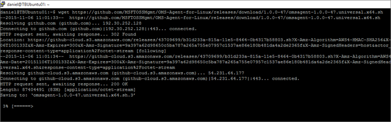

Once you have downloaded the file, verify the file checksum with the command "md5sum ./omsagent-1.0.0-47.universal.x64.sh" and move on to the next step.

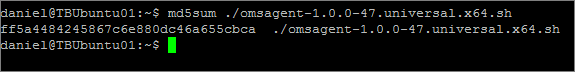

For this part to go through, you´ll need to know your OMS workspace ID and primary key. These values can be found inside OMS, clicking Settings and then using the "Connected Sources" pane. Copy these values and paste them into the command below and run it. This will install the agent and it will start reporting to OMS. In my case it took a while for the agent to show up so don´t be nervous if you don´t see anything immediately. Install the OMS Linux agent using the following command.

The command to run: "sudo sh ./omsagent-1.0.0-47.universal.x64.sh --install -w <YOUR OMS WORKSPACE ID> -s <YOUR OMS WORKSPACE PRIMARY KEY>"

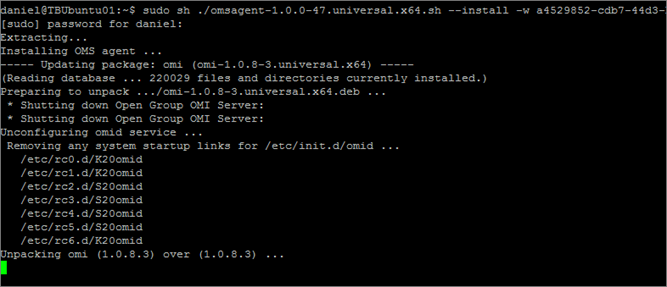

To check that the server is configured correctly and have started reporting to OMS, run the below query to find out what servers are reporting. For me, TBUbuntu01 is the one I would like to see. And as expected, it shows up as a reporting server. The command to run: "MG:"00000000-0000-0000-0000-000000000001" or MG:"00000000-0000-0000-0000-000000000002" | Measure Max(TimeGenerated) as LastData by Computer | Sort Computer"

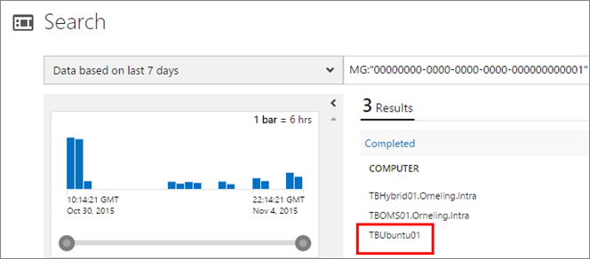 

**Near real time performance monitoring**

Okay, so now that the agent is installed, let´s take a look at our possibilities. The first thing I want to configure is the performance monitoring, not unlike what you´ve seen for Windows Servers since a couple of weeks. Go back into the settings section and then click the Data pane.

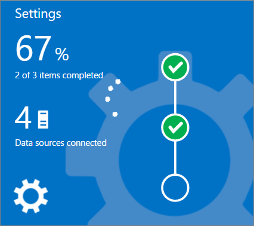

Go to "Linux Performance Counters" and add the counters you want. I´ve gone with the default ones to start with but here you can add MySQL counters if you like for example. Set the sample interval where 10 is the lowest and also default value and will provide you with near real time performance monitoring. That's pretty fine with me but you could just as well set this to 60 for every minute or 600 for every ten minutes. Your choice! J Finish by clicking Save.

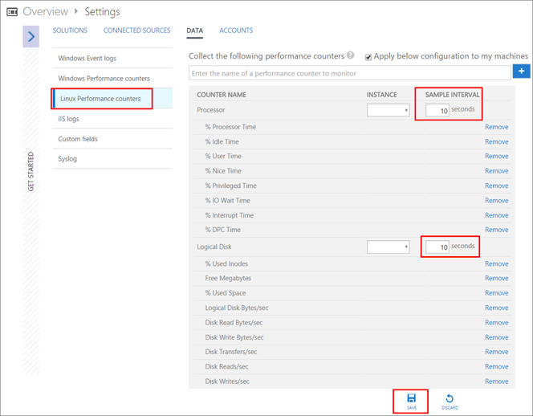

Now, it may take some time before performance data start showing up and for me it took a couple of hours but below are some samples of what data you can pull out. Get information about Disk Write Bytes/sec on a specific server: Type=Perf **Computer="TBUbuntu01"** ObjectName="Logical Disk" CounterName="Disk Write Bytes/sec"

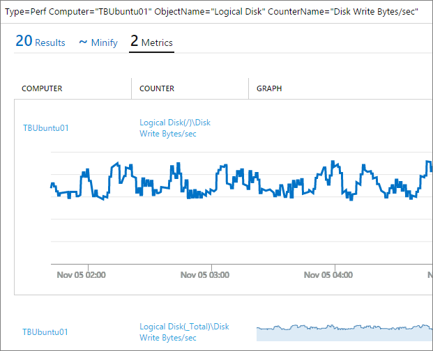

Get information about processor time on a specific server: **Computer="TBUbuntu01"** ObjectName="Processor" CounterName="% Processor Time"

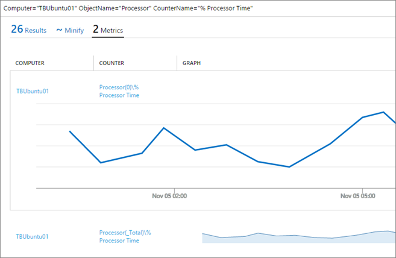

And the last one, get information about the amount of free megabytes on a specific server: **Computer="TBUbuntu01"** ObjectName="Logical Disk" CounterName="Free Megabytes"

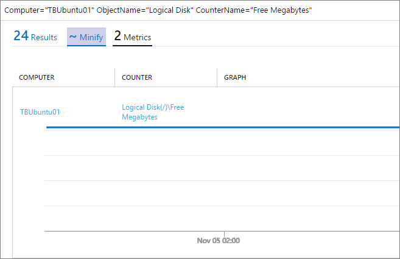

**Syslogs, how do you check those out?**

Now, I did mention syslogs earlier in the post and how it could be done prior to the Linux agent. Check [this post](http://blog.orneling.se/2015/07/analyzing-linux-syslogs-in-oms/) to find out more about this method. This was great for those servers that were placed in Azure but not so great for the onprem servers. But now the time has come, it´s a piece of cake to activate the syslog gathering for onprem servers as well. Go back into the settings of OMS and then back to the Data pane. Now go to the Syslog section and add the logs you want to look at. You can see what logs I have included below and you can also choose what level of information you want to collect. In this case I´m gathering all data (my only Linux server won´t generate much traffic for me anyway). Don't forget to click Save before moving on.

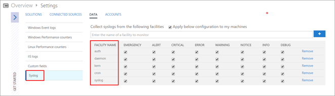

The logs added are auth, daemon, kern, cron and syslog.

To verify that the server have started to generate this kind of traffic you can run a very simple query. The query to execute is simply "Type=Syslog". This query will show you all syslog information there is in OMS and from there you´re able to go deeper into the information gathered.

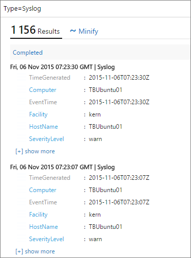

To check out a specific event log, run the query "Type=Syslog Facility=kern" where "kern" is your log name. This could just as well be "daemon" instead of "kern".

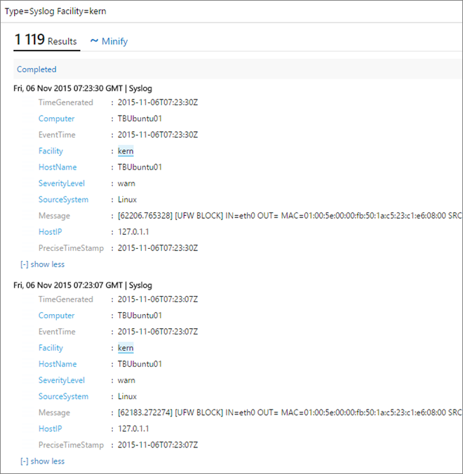

To find out how many warnings and errors you´ve got, run the query "Type=Syslog | measure count() by SeverityLevel". This will give you an overview as seen below and will give you a hint on what you should spend your time on as the next thing.

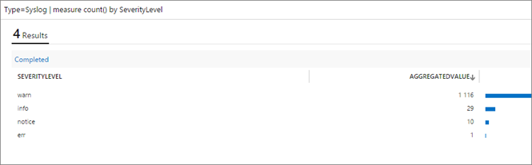

**Summary**

Another thing I haven't mentioned above is the fact that you now can collect alerts from Nagios running on a Linux server as well. This brings the possibility to monitor your monitoring alerts from both SCOM and Nagios in one console. Did anyone say awesome? Now, this Linux agent is still in a public preview so if you run into any difficulties, jump over to [Github](https://github.com/MSFTOSSMgmt/OMS-Agent-for-Linux) to let Microsoft know about it. If you have any questions to what I´ve shown here or if there´s anything you would like to see, let me know by dropping a comment below.
