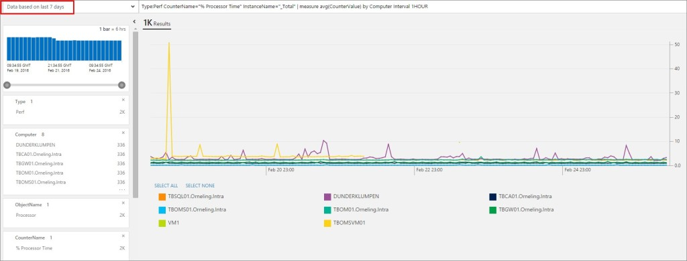
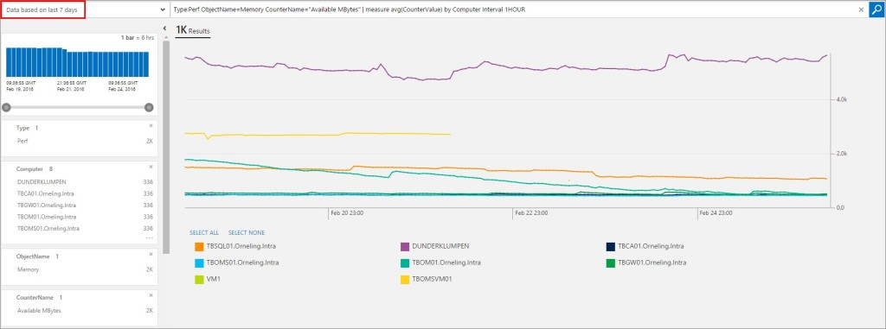
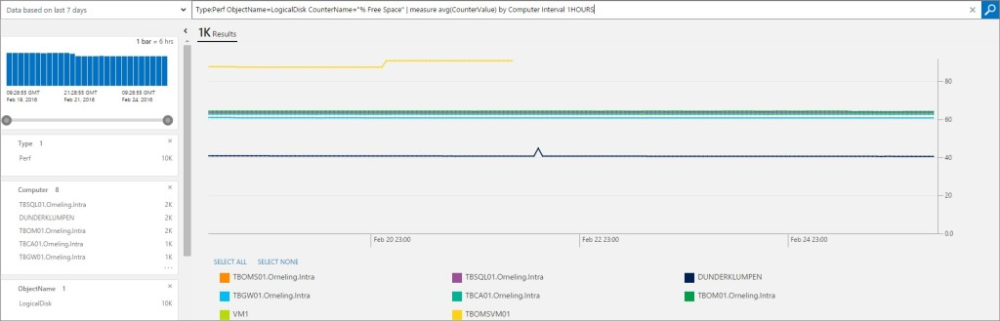
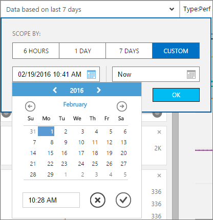
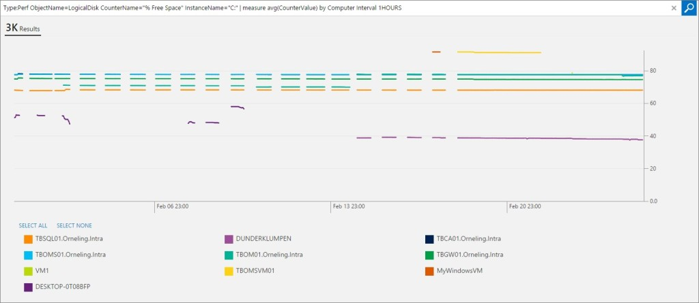

So it´s that wonderful time again. The sun is shining, it´s almost spring here in (the southern parts of) Sweden and I´m getting into a new role in a new company, read the blog post about that [here](http://blog.orneling.se/2016/02/new-year-new-challenges-2/). Wouldn´t this be a great time to write a blog post? Yeah, I thought so to and here we are.

**Near real time performance monitoring and visualization in Operations Management Suite** Earlier, in October last year to be precise I wrote a blog post on how to get started with the Near real time performance monitoring in OMS. I will not show how to set it up in this post, to find out more about that (easy) part check out the blog post about it [here](http://blog.orneling.se/2015/10/near-real-time-performance-monitoring-in-oms/).

A new functionality has been released and is available now as I write this post. With this new functionality you will be able to put multiple instances like computers and disks etc. against each other to help you get an overview of your environment. To demonstrate this, I have put together some queries you can execute to get data about CPU, Memory and Disk on your servers. It´s really easy and all you have to do is to paste the query into the log search field. To start, log in to your OMS workspace and click the log search button on the first page. 

**CPU usage for the last 7 days divided into hourly intervals** The query to paste into the field: _Type:Perf CounterName="% Processor Time" InstanceName="\_Total" | measure avg(CounterValue) by Computer Interval 1HOUR_  Click on the image for a larger version.

**Memory usage the last 7 days divided into hourly intervals** The query to paste into the field: _Type:Perf ObjectName=Memory CounterName="Available MBytes" | measure avg(CounterValue) by Computer Interval 1HOUR_  Click on the image for a larger version.

(If you want to pick just a few servers instead of all servers, you can add ComputerName=”FQDN” or “FQDN” to the query. See below for an example) _Type:Perf ObjectName=Memory CounterName="Available MBytes" Computer="TBOM01.Orneling.Intra" or "DUNDERKLUMPEN" or "TBGW01.Orneling.Intra" | measure avg(CounterValue) by Computer Interval 1HOUR_

**Free disk space the last 7 days divided into hourly intervals** The query to paste into the field: _Type:Perf ObjectName=LogicalDisk CounterName="% Free Space" | measure avg(CounterValue) by Computer Interval 1HOURS_  Click on the image for a larger version.

**Free disk space on a specific instance the last 7 days divided into hourly intervals** This query is almost the same as the above, but here I have added the parameter _InstanceName="C:"_ as well. This can be changed to D:, E: or whatever instead. The query to paste into the field: _Type:Perf ObjectName=LogicalDisk CounterName="% Free Space" InstanceName="C:" | measure avg(CounterValue) by Computer Interval 1HOURS_  Click on the image for a larger version.

 **Custom time range** To set a custom range for your query instead of just 6 Hours, 1 Day or 7 Days, click Custom and pick your date as shown below. 

Here I have run the free disk on C: query again, but this time going back to the first of February. Since I upgraded this workspace to the Standard Tier (30 days of retention) just recently, I will not get any good overview since some servers are no longer alive and some of the others haven´t been reporting for a while. As you can see here, you will get a good overview of your environments performance with this functionality.  Click on the image for a larger version.

**Wrap up** So what you´ve seen here is just another great functionality which has been added to OMS and it´s just getting better and better. Now it´s getting easier to get a good overlook of how our servers are performing and especially when we can compare them to each other as we´ve done here. If you have any comments or questions, let me know by leaving a comment below and I´ll get back to you as soon as possible.
