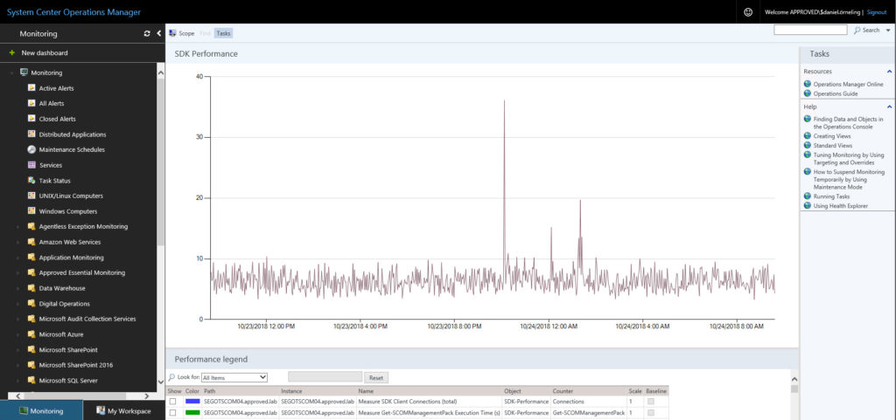
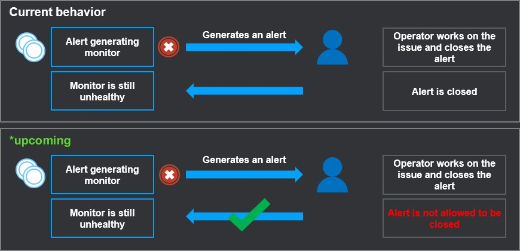
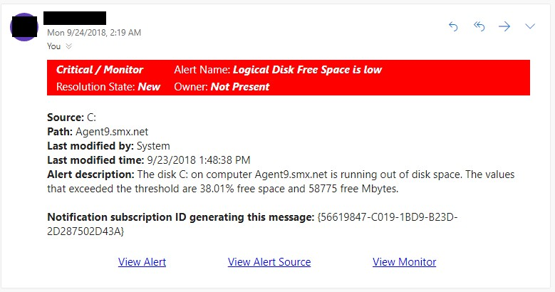

A few weeks ago, we ([Approved](https://www.approved.se/)) held our annual event called SCOM Day in Gothenburg with about 80 attendees. This year we focused on hybrid monitoring using SCOM 2019/1901 and Azure. It was a full day of sessions where we had [Thomas Maurer](https://www.thomasmaurer.ch/) talking about Azure Stack, [Martin Ehrnst](https://adatum.no/) who was talking about API integrations in SCOM. And lastly, we had [Marcel Zehner](https://marcelzehner.ch/) who showed us how he monitors and interacts with his Tesla using Azure.

I also held a session along with my colleague [Jonas Lenntun](https://www.linkedin.com/in/lenntun) about the news in SCOM 2019 and 1901 where we focused on the parts that we think makes most sense and will most likely come to use for most users. The news was announced during Microsoft Ignite that took place in Orlando in September. But to those of you who didn’t attend any of these events, the news is still important to know about.

### Semi-Annual Channel vs. the Long-Term Servicing Channel

One of the first things I would like to point out is the difference between the Semi-Annual Channel and the Long-Term Servicing Channel, where the Long-Term version will receive some love with this release. The last major release was back in 2016 when SCOM 2016 were released, and now its time for SCOM 2019 to be released during the first quarter next year. A lot of the news have already been around for a while with the release of SCOM 1801 and 1807, but now it’s time to include these updates in the Long-Term versions as well.

Find out more on what the different channels mean [here](https://blog.orneling.se/2018/02/scom-1801-has-been-relased/).

### So what´s new then in SCOM 2019 and 1901?

**Improved HTML5 dashboards**

Remember the annoying web console relying on SilverLight that’s been with us for too many years? You can finally forget about that one since the web console in these new versions is purely HTML5 (no SilverLight dependency) and will work in all the mostly used browsers out there. It works really fast and is a completely different experience than the old web console. You can also manage maintenance schedules from within the web console just to mention one of the news with this portal that makes it really useful for the staff working with SCOM.

**Enhanced alert management for monitors**

Up until now we have been able to close alerts generated by a monitor, leaving the health state in a critical state. This has been a problem since as long as the health state is still critical, no new alerts will be generated. In these new versions a new way of working with this have been introduced. Trying to close an alert generated by a monitor that’s still in a critical health state will no longer be possible. This is going to work in the Web Console, Operations Console, PowerShell command lets and the SDK API.

**Improvements to the Azure Management Pack**

This MP isn’t really new as its been around for a while now, but it got more useful just a few weeks ago when Microsoft announced that Global Service Monitoring (GSM) will be shut down in November. The replacement for GSM is Azure Application Insights, a service that is monitored using this Azure Management Pack. Besides from this, you can monitor your VM´s, storage, networks just to mention some of them.

Download the management pack [here](https://www.microsoft.com/en-us/download/details.aspx?id=50013).

**APM agent crashing IIS application pools**

Since SCOM 2016, there´s been an issue with the APM component causing the IIS application pools for SharePoint to crash. This was temporarily fixed in an earlier release in the Semi-Annual Channel where we got to choose whether we wanted to keep APM or not on the agent.

This issue has now been fixed and will be shipped in SCOM 2019/1901 and SCOM 2016 UR6.

**Notification and subscription enhancements**

In SCOM 2019 and 1901, Microsoft have put some effort into the notification area. With these new releases we get the possibility to use “Or” and “Exclude” operations in our notifications. We can also use HTML coding when putting together the notification template.

**Upgrade paths**

So far if we wanted to jump onto the Semi-Annual train and upgrade to 1807 from SCOM 2016, we´ve had to go through 1801 and then upgrade to 1807 from there. When SCOM 2019 and 1901 is released, it will be supported to move to both directly from SCOM 2016. No more jumping from 2016 to 1801 to 1807.

### Summary

This were some of the news that we thought was the most important to show, but there are still plenty to see if you check out the presentation from Ignite, where a lot of news and enhancements are showed. I really recommend you check it out [here](https://youtu.be/-vqr3O-tJ3E) (the SCOM part starts after 37 minutes).

This was some of the news, now all that´s left is to wait for the release to try it out. Until then, leave a comment below if you have any questions and I´ll get back as soon as possible.
